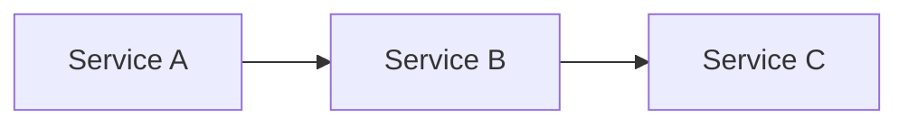

# ADR: Architecture Decision Records

ADRs record architectural decisions and the reasoning behind them. Unlike ephemeral RFCs, ADRs persist even when superseded, preserving the "why" behind decisions and their evolution.

**ADRs are rationale, not implementation plans.** No phase checklists, no task lists, no Go/No-Go gates. Outstanding implementation work is tracked in **GitHub Issues** (the repo's source of truth for what is left to build), with PRs as supporting detail, never in the ADR. An ADR is done when it explains what was decided and why; it does not track whether the work shipped.

**Where a rolled-up architecture document exists, it is the source of truth for current state; ADRs record the rationale behind decisions evident in that architecture.** Currently covered: `docs/decisions/embervm/` is rolled up into `projects/embervm/ARCHITECTURE.md`. Any PR that creates, amends, supersedes, or withdraws an ADR in a covered category must update the architecture document in the same PR (a `PreToolUse` hook, `check-adr-architecture-sync.sh`, reminds on edits). If the ADR is a Draft recording direction rather than built behaviour, reflect it in the document's decided-direction flags rather than its as-built narrative. The architecture document is standalone and cites no ADRs; the ADR map lives beside the ADRs in `docs/decisions/embervm/README.md` and is updated in the same PR.

## Tracking outstanding work (GitHub Issues)

An ADR records a decision; the work it implies is tracked as **GitHub Issues**, the source of truth for outstanding work in this repo. When an ADR (or a validation pass over one) surfaces unimplemented or partial work:

- File one GitHub issue per work item (`gh issue create`), titled `<area>: <summary> — ADR <category>/<NNN> #k`, with a body linking back to the ADR file (`docs/decisions/<category>/<NNN>-<slug>.md`). Label by kind: `bug` (broken), `enhancement` (feature the ADR mandates), `documentation` (todo/chore); add `agent-ready` when it can be picked up autonomously.
- When an ADR decomposes into several items, open a **parent tracking issue** and attach the items as **sub-issues** so the hierarchy mirrors the decision:

  ```bash
  # child_node_id = the issue's GraphQL node id (gh issue view <n> --json id -q .id)
  gh api repos/jomcgi/homelab/issues/<parent>/sub_issues -f sub_issue_id=<child_databaseId>
  ```

- Do NOT put phase checklists or task lists in the ADR itself; the issues carry the tracking. A closed issue, not an edit to the ADR, is how "the work shipped" gets recorded.

## Location

ADRs live in `docs/decisions/<category>/` as numbered Markdown files.

Discover current categories with `ls docs/decisions/` (do not assume; new categories are created as needed and should be broad enough to be useful).

## Usage

```
/adr create <category> <slug>   # Scaffold a new ADR
/adr list                       # List existing ADRs
/adr <category>/<number>        # Read and summarize an ADR
```

## Creating a New ADR

### Step 1: Determine the number

Look at the highest-numbered file in the target category and increment by one. If the category doesn't exist yet, start at 001. Numbers are never reused.

```bash
ls docs/decisions/<category>/
```

### Step 2: Create the file

Create `docs/decisions/<category>/NNN-<slug>.md` using this template:

````markdown
# ADR NNN: <Title>

**Author:** <Name>
**Status:** Draft
**Created:** <YYYY-MM-DD>
**Supersedes:** <link to previous ADR, if applicable>

---

## Problem

What problem does this solve? Why now?

---

## Decision

What was decided, in 2-3 paragraphs. Include a Before/After table if helpful:

| Aspect | Today | Decided |
| ------ | ----- | ------- |
| ...    | ...   | ...     |

---

## Architecture

High-level design. Use mermaid diagrams for data flow:


````

## Alternatives Considered

What else was on the table, and the one-line reason each was rejected.

## Security

Reference `docs/security.md` for baseline. Document any deviations.

## Risks

| Risk | Likelihood | Impact | Mitigation |
| ---- | ---------- | ------ | ---------- |
| ...  | ...        | ...    | ...        |

## Open Questions

1. Unresolved design decisions

## References

| Resource    | Relevance      |
| ----------- | -------------- |
| [Link](url) | Why it matters |

````

### Step 3: Register the ADR

ADRs are repo-only. They do not appear on the public docs site. The public site
publishes `projects/<p>/{README,ARCHITECTURE,STPA}.md` for the
projects listed in `projects/monolith/knowledge/tools/gen_docs_manifest.py`.

1. **Write the heading first.** The repo-docs knowledge manifest derives the
   title from the first-line `# ADR NNN: <Title>` heading, so write it before
   regenerating.

2. **Regenerate the repo-docs knowledge manifest** (public-chat RAG grounding):

   ```bash
   python3 projects/monolith/knowledge/tools/gen_repo_docs_manifest.py
   ```

   This rewrites `projects/monolith/knowledge/repo_docs_manifest.ndjson`.

3. **Add an index row.** Add a row for the new ADR to its category table in
   `docs/decisions/index.md`.

### Step 4: Commit with conventional commit format

Commit the ADR file, the regenerated `repo_docs_manifest.ndjson`, and the
updated `index.md` together.

```bash
git commit -m "docs(adr): <short description>"
````

## ADR Statuses

| Status                | Meaning                                                                      |
| --------------------- | ---------------------------------------------------------------------------- |
| **Draft**             | Under discussion, not yet decided                                            |
| **Accepted**          | The decision is made. Set this when the decision lands, not when work ships. |
| **Superseded by NNN** | Replaced by a newer ADR (link to it). Leave the file in place; a rollup removes it later. |
| **Deprecated**        | Abandoned without replacement                                                |

## Superseding an ADR

When a decision is reversed or evolved:

1. Create the new ADR with a `Supersedes:` field linking to the old one
2. Update the old ADR's status to `Superseded by [NNN-slug](NNN-slug.md)`
3. **Do not delete the old ADR yourself.** Deletion is not an ADR-authoring
   action; it is the last step of a domain rollup, and only once that domain's
   `ARCHITECTURE.md` carries the current state and inbound links are repointed.
   See `docs/runbooks/rollup-architecture-docs.md`.

## ADRs are not permanent, and nothing should link to one

An ADR is a write-and-forget rationale journal entry. Two consequences:

- **Link to `projects/<domain>/ARCHITECTURE.md`, never to an ADR**, from code,
  BUILD files, values files or READMEs. An ADR records what was decided, not
  what shipped, so citing one as current state is how stale decisions get read
  as fact.
- **The file is not the archive; git history is.** A rollup harvests an ADR into
  ARCHITECTURE.md and then deletes it. Write the rationale as fully as it
  deserves, but do not write it on the assumption the file survives forever.

## Conventions

- **File naming**: `docs/decisions/<category>/NNN-<kebab-case-slug>.md`
- **Numbering**: Sequential within each category (001, 002, ...). Numbers are never reused.
- **Commit prefix**: `docs(adr):` for new ADRs and updates
- **Diagrams**: Mermaid for all architecture and flow diagrams (renders natively on GitHub)
- **Sections**: Problem, Decision, Architecture, Alternatives, Security, Risks, References
- **No work tracking**: outstanding work lives in **GitHub Issues** (source of truth), with PRs as supporting detail, not in the ADR
- **Files per ADR**: the new ADR file, the regenerated `repo_docs_manifest.ndjson`, and the `index.md` row.
