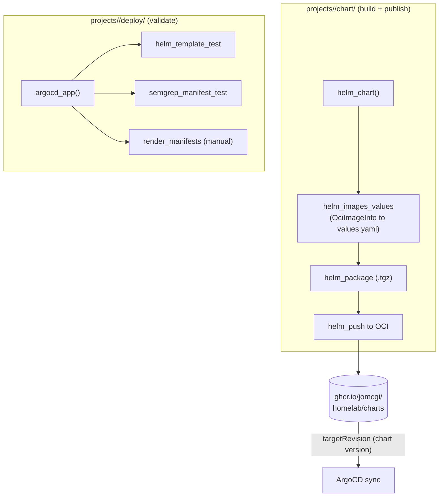

# rules_helm

Bazel rules and macros for building, testing, publishing, and validating Helm
charts and ArgoCD applications.

These rules back the repo's GitOps pipeline (see the root `CLAUDE.md`): charts
are packaged as OCI artifacts in CI, image tags are pinned at build time, and
chart versions are auto-bumped from conventional commits. Nothing here installs
to a cluster; ArgoCD pulls the published chart and syncs.

## Public API

Everything is loaded from a single facade, `//bazel/helm:defs.bzl`. The other
`.bzl` files are implementation details, do not load them directly.

```python
load("//bazel/helm:defs.bzl", "helm_chart", "argocd_app", "helm_images_values",
     "helm_render", "helm_template_test", "helm_lint_test", "helm_annotation_test")
```

| Symbol                 | Kind  | Source       | Use                                                                                     |
| ---------------------- | ----- | ------------ | --------------------------------------------------------------------------------------- |
| `helm_chart`           | macro | `chart.bzl`  | Declare a chart dir: filegroup, lint test, build-time image pinning, OCI package + push |
| `argocd_app`           | macro | `app.bzl`    | Declare a deploy overlay: template test, semgrep scan, pre-rendered manifests           |
| `helm_images_values`   | rule  | `images.bzl` | Generate a values fragment (`repository` + `tag`) from `OciImageInfo` providers         |
| `helm_render`          | rule  | `render.bzl` | Cacheable `helm template` to a declared output file                                     |
| `helm_template_test`   | macro | `test.bzl`   | Assert a chart renders cleanly under a values hierarchy                                 |
| `helm_lint_test`       | macro | `test.bzl`   | `helm lint --strict` a chart                                                            |
| `helm_annotation_test` | macro | `test.bzl`   | Assert specific pod-template annotations are present (e.g. Linkerd)                     |

## How it fits the pipeline



The two macros mirror the repo's directory split: `helm_chart` lives in
`chart/` and owns building/publishing; `argocd_app` lives in `deploy/` and owns
CI validation. The deployed `application.yaml` sources the chart from OCI by
version, the `argocd_app` target only renders the _local_ chart for tests.

## `helm_chart`

Declares a chart directory. Creates a `chart` filegroup, an optional
`helm lint` test, and (with `publish = True`) `<name>.package` / `<name>.push`
targets that package the chart as a `.tgz` and push it to the OCI registry.

```python
# projects/monolith/chart/BUILD
helm_chart(
    name = "chart",
    images = {
        "backend.image":  "//projects/monolith:image.info",
        "frontend.image": "//projects/monolith/frontend:image.info",
    },
    lint = False,
    publish = True,
    visibility = ["//overlays:__subpackages__"],
)
```

`images` maps a dotted Helm values path to a label exposing `OciImageInfo`
(the `{name}.info` target produced by `go_image` / `apko_image` / `py3_image`).
At build time the resolved `repository` + `tag` are deep-merged into the chart's
`values.yaml` via `yq` inside `helm_package`. This is why you never hand-pin
`@sha256:` digests in values files: the pinning is automatic and rebuild-fresh.

`publish` also injects `org.opencontainers.image.url` into `Chart.yaml` so GHCR
deep-links to the chart's source directory rather than the monorepo root, and
auto-bumps the chart version via `chart-version.sh` at push time.

## `argocd_app`

Declares an ArgoCD overlay. Always emits a `template_test` and (by default) a
`semgrep_test`; opt into pre-rendered `render_manifests` and a live `diff`.

```python
# projects/my_app/deploy/BUILD
argocd_app(
    name = "my_app",
    chart = "projects/my_app/chart",
    chart_files = "//projects/my_app/chart:chart",
    namespace = "my_app",
    release_name = "my_app",
    values_files = [
        "//projects/my_app/chart:values.yaml",
        "values.yaml",
    ],
    semgrep_exclude_rules = ["require-readiness-probe"],
)
```

| Arg                     | Default                                  | Purpose                                                             |
| ----------------------- | ---------------------------------------- | ------------------------------------------------------------------- |
| `generate_manifests`    | `True`                                   | Emit `render_manifests` genrule (tagged `manual`)                   |
| `generate_semgrep`      | `True`                                   | Scan rendered manifests with `semgrep_manifest_test`                |
| `generate_diff`         | `False`                                  | Emit a live `argocd app diff` `sh_binary`                           |
| `semgrep_rules`         | `//bazel/semgrep/rules:kubernetes_rules` | Rule set for the manifest scan                                      |
| `semgrep_exclude_rules` | `[]`                                     | Rule IDs to skip (e.g. `require-readiness-probe` for non-HTTP pods) |

Most `argocd_app` targets are generated by the Gazelle extension below. Hand
write them only when you need attributes Gazelle does not manage, such as
`semgrep_exclude_rules` (Gazelle preserves that attr but will not author it).

## Gazelle extension (`gazelle/`)

A Go Gazelle language (`argocd`) that auto-generates `argocd_app` targets from
ArgoCD `Application` manifests in `deploy/` directories. Recognized directives:

| Directive                             | Effect                                      |
| ------------------------------------- | ------------------------------------------- |
| `# gazelle:argocd disabled`           | Skip this directory (hand-maintained BUILD) |
| `# gazelle:argocd_enabled`            | Toggle generation                           |
| `# gazelle:argocd_generate_manifests` | Toggle the `render_manifests` genrule       |
| `# gazelle:argocd_generate_diff`      | Toggle the live `diff` target               |
| `# gazelle:kubectl_context`           | kube context for live diffs                 |

## Tests

`helm_template_test`, `helm_lint_test`, and `helm_annotation_test` are
`sh_test`-backed and cached by Bazel on input hashes. Run remotely in
BuildBuddy CI, never locally (see `CLAUDE.md`: no local test loop). The
annotation test is the regression guard for required pod annotations:

```python
helm_annotation_test(
    name = "linkerd_annotation_test",
    chart = "projects/cluster_agents/deploy",
    chart_files = ":chart",
    release_name = "cluster-agents",
    namespace = "cluster-agents",
    annotations = ["linkerd.io/inject:enabled"],
    set = ["priorityClassName=system-cluster-critical"],
)
```

## Scripts

| Script                                            | Role                                                                          |
| ------------------------------------------------- | ----------------------------------------------------------------------------- |
| `chart-version.sh`                                | Next semver from conventional commits scoped to the chart's Bazel dep closure |
| `push.sh.tpl`                                     | Template for the `helm_push` runner (`{{HELM}}`, `{{CHART_TGZ}}`, ...)        |
| `helm-template-test.sh`                           | `helm template` under the full values hierarchy; fails on render errors       |
| `helm-assert-annotations.sh`                      | Render then assert `KEY:VALUE` annotations are present                        |
| `ci-validate-manifests.sh`                        | CI gate: validate all rendered manifests                                      |
| `ci-diff-manifests.sh`                            | CI gate: diff rendered manifests against the live cluster                     |
| `render-manifests.sh` / `render-all-manifests.sh` | Pre-render manifests for inspection                                           |
| `pre-commit-render-manifests.sh`                  | Local pre-commit manifest render                                              |

## Conventions

- Load only from `//bazel/helm:defs.bzl`.
- The Helm binary is the vendored `@multitool//tools/helm`; rules never assume a
  system `helm`.
- Bump `Chart.yaml` version and `deploy/application.yaml` `targetRevision`
  together (the `chart-version-bot` automates this; manual bumps must keep both
  in sync, or ArgoCD keeps deploying the old version).
