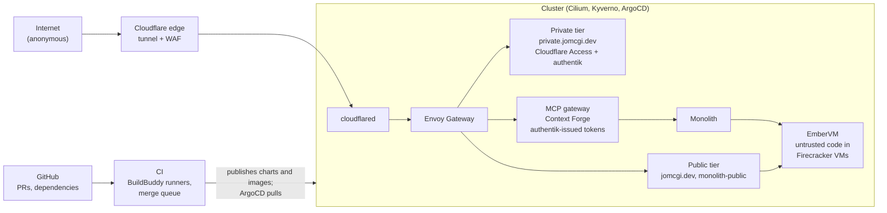

# Homelab Threat Model

_Reviewed against commit 1a61e7d5d._

Open security findings across everything the cluster hosts, ranked.
The live list is the
[`security-finding` label](https://github.com/jomcgi-org/homelab/issues?q=label%3Asecurity-finding+is%3Aopen);
ADR [security/007](decisions/security/007-aggregate-threat-model-index.md)
records why this page exists, and the
[maintenance runbook](runbooks/threat-model-maintenance.md) is the
procedure for updating it. A project's deep model is the security lens in
that project's STPA.md.

## Assets

| Asset | Where it lives |
| --- | --- |
| Credentials held for workloads | 1Password Operator; the EmberVM egress sidecar holds the model-provider and git tokens it injects |
| Personal data: knowledge graph, notes, calendar, chat history | Postgres, behind the monolith (the personal API and agent platform) |
| Tenant state: a memory snapshot is the full process state of a workload | EmberVM's object store |
| Compute and the host: every node, `/dev/kvm` | The cluster |
| Public-site integrity: jomcgi.dev says what Joe published | The public tier |

## Trust boundaries

| Surface | Untrusted input | Deep model |
| --- | --- | --- |
| Public tier | Anyone on the internet | [monolith STPA, security lens](../projects/monolith/STPA.md); [public-tier checklist](runbooks/public-tier-checklist.md) |
| Private tier | Signed-in humans, service tokens, GitHub webhooks (HMAC-gated) | [monolith STPA, security lens](../projects/monolith/STPA.md) |
| MCP gateway | Agents, including prompt-injected ones | [monolith STPA, security lens](../projects/monolith/STPA.md) |
| EmberVM | Untrusted code, by design | [embervm STPA, security lens](../projects/embervm/STPA.md) |
| Supply chain and CI | PRs, dependencies, base images | None yet |
| Cluster baseline | Everything above sits on it | [security.md](security.md) |

## Open findings

Ranked by what an attacker gets. Each issue holds the detail.

1. **The custom Semgrep rules enforce nothing**
   ([#4777](https://github.com/jomcgi-org/homelab/issues/4777)).
   Every rule target exits 0 without scanning.
2. **A Firecracker escape is not contained**
   ([#5255](https://github.com/jomcgi-org/homelab/issues/5255)).
   The VM monitor runs as root in a privileged pod without the jailer.
   An escape hands over the node and the fleet's storage credential.
3. **Any valid token reaches every MCP tool**
   ([#4569](https://github.com/jomcgi-org/homelab/issues/4569)).
   The monolith verifies who is calling; no tool then checks whether
   that caller should reach it. Finding 1 of the
   [monolith STPA security lens](../projects/monolith/STPA.md).
4. **A compromised public-tier pod can reach every in-cluster endpoint**
   ([#5276](https://github.com/jomcgi-org/homelab/issues/5276)).
   Its egress policy allows the whole cluster, while its own comment
   documents four intended destinations.
5. **The private monolith pod has no egress policy at all**
   ([#5277](https://github.com/jomcgi-org/homelab/issues/5277)).
   The pod holding every backend secret can send anywhere the node
   can reach.
6. **One storage credential can delete any tenant's artifacts**
   ([#4691](https://github.com/jomcgi-org/homelab/issues/4691)).
   Encryption stops reads of tenant state; shared base images stay
   plaintext, and deletes and overwrites are open to every holder of
   the shared credential.
7. **The public docs site publishes committed docs verbatim**
   ([#5275](https://github.com/jomcgi-org/homelab/issues/5275)).
   A path allowlist with no redaction; an internal service hostname
   is published today.
8. **Production promotion has no functional check**
   ([#4745](https://github.com/jomcgi-org/homelab/issues/4745)).
   Promotion waits for rollout health and a short soak, and only
   EmberVM runs a conformance test first. A change that deploys
   cleanly but misbehaves promotes.
9. **`run_code` can silently return a stale result for different inputs**
   ([#5304](https://github.com/jomcgi-org/homelab/issues/5304)).
   The dedupe key hashes language and code but not input files, so a
   resubmission within the result-cache TTL returns output computed
   against someone else's files.
10. **Swarm run budgets are never enforced**
   ([#4784](https://github.com/jomcgi-org/homelab/issues/4784)).
   Recorded and reported only.
