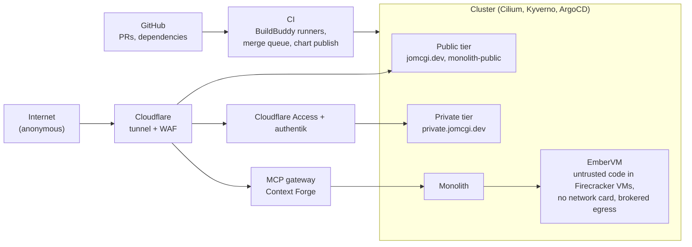

# Homelab Threat Model

_@ 2d37099f9_

Open security findings across everything the cluster hosts, ranked.
The live list is the
[`security-finding` label](https://github.com/jomcgi-org/homelab/issues?q=label%3Asecurity-finding+is%3Aopen);
ADR [security/007](decisions/security/007-aggregate-threat-model-index.md)
records how this page is maintained.

## Assets

| Asset | Where it lives |
| --- | --- |
| Credentials held for workloads: model-provider keys, git tokens, Cloudflare service tokens | 1Password Operator, the EmberVM egress sidecar |
| Personal data: knowledge graph, notes, calendar, chat history | The monolith's Postgres |
| Tenant state: a memory snapshot is the full process state of a workload | EmberVM's object store |
| Compute and the host: every node, `/dev/kvm` | The cluster |
| Public-site integrity: jomcgi.dev says what Joe published | The public tier |

## Trust boundaries

| Surface | Who reaches it | Deep model |
| --- | --- | --- |
| Public tier | Anyone on the internet | None yet; [public-tier checklist](runbooks/public-tier-checklist.md), ADRs security/004 and 005 |
| Private tier | Signed-in humans, service tokens | None yet |
| MCP gateway | Agents, including prompt-injected ones | None yet; #4569 and #4940 are the open work |
| EmberVM | Untrusted code, by design | [projects/embervm/THREAT-MODEL.md](../projects/embervm/THREAT-MODEL.md) |
| Supply chain and CI | PRs, dependencies, base images | None yet |
| Cluster baseline | Everything above sits on it | [security.md](security.md) |

## Open findings

Ranked by what an attacker gets. Each issue holds the detail.

1. **93 Semgrep rules enforce nothing**
   ([#4777](https://github.com/jomcgi-org/homelab/issues/4777)).
   Every rule target exits 0 without scanning.
2. **A Firecracker escape is not contained**
   ([#5255](https://github.com/jomcgi-org/homelab/issues/5255)).
   The VM monitor runs as root in a privileged pod without the jailer.
   An escape hands over the node and the fleet's storage credential.
3. **The monolith trusts whatever the MCP gateway forwards**
   ([#4569](https://github.com/jomcgi-org/homelab/issues/4569),
   [#4940](https://github.com/jomcgi-org/homelab/issues/4940)).
   It never validates the caller's token, so any caller the gateway
   admits gets full authority.
4. **One storage credential can delete any tenant's artifacts**
   ([#4691](https://github.com/jomcgi-org/homelab/issues/4691)).
   Encryption stops reads; deletes and overwrites are still open to
   every holder of the shared credential.
5. **Kargo promotes to production without a verification gate**
   ([#4745](https://github.com/jomcgi-org/homelab/issues/4745)).
   Whatever reaches the dev chart repo promotes on stage order alone.
6. **Agent spend has no enforced ceiling**
   ([#4784](https://github.com/jomcgi-org/homelab/issues/4784)).
   Budgets are recorded and reported, never enforced.
