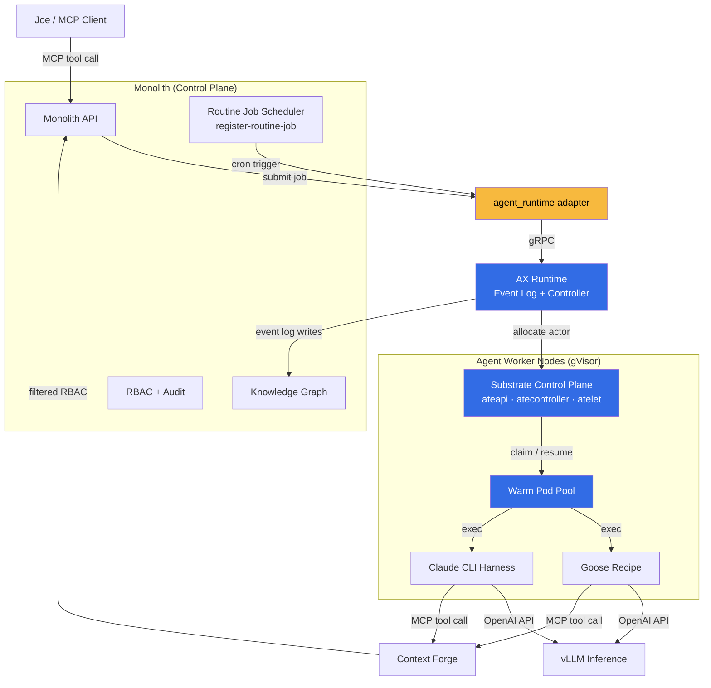

# ADR 014: AX + Substrate as the Agent Runtime Substrate

**Author:** jomcgi
**Status:** Deprecated (AX+Substrate not adopted)
**Created:** 2026-05-22
**Supersedes:** None (retires the dispatch plumbing of 007-agent-orchestrator and the autonomous-loop plumbing of 008-cluster-patrol-loop-resilience)
**Depends on:** [security/003 — gVisor RuntimeClass](../security/003-gvisor-runtime-class.md)

---

## Problem

Two things are happening at once:

1. **Monolith consolidation is in flight** (per `platform/001-obsidian-vault-monolith-migration` and the shipped `monolith-agent-*` MCP surface from 2026-05-08). Standalone services are folding into the monolith one by one.
2. **The agent platform we built before that decision is now dead-weight to maintain.** `projects/agent_platform/orchestrator/` is a Go service for NATS JetStream job dispatch (ADR 007). `projects/agent_platform/cluster_agents/` is a second Go service running five autonomous improvement loops — patrol, TestCoverage, ReadmeFreshness, Rules, PRFix — with its own resilience scaffolding (ADR 008). Both are ours to operate, in service of a topology we're consolidating away from.

We want to replace the **plumbing** (Go dispatch service, NATS JetStream wiring, custom retry logic, hand-rolled supervisor loops) without losing the **behaviour** (durable job records, warm pools, resilient autonomous loops, sub-30s sandbox dispatch).

Two upstream projects published this month materially overlap with that plumbing:

- **[google/ax](https://github.com/google/ax)** — "Google's open source distributed agent runtime." Single-writer controller, event-log durability, automatic recovery, resumable streaming, gRPC for remote actors. v0.1.0, May 2026.
- **[agent-substrate/substrate](https://github.com/agent-substrate/substrate)** — K8s control plane that multiplexes many "actors" onto a small pool of warm worker pods. Sub-second suspend/resume with memory + filesystem snapshots, gVisor-backed isolation, framework-agnostic (Goose, Claude Code, MCP all supported). v0.0.0.

They are complementary — AX is the runtime, Substrate is the K8s multiplexer it's designed to run on. The homelab is on-prem and capacity-constrained: every warm pod costs watts and contends with vLLM for physical RAM. Substrate's 30× oversubscription is not a hyperscale curiosity here — it's a direct watts-per-node win. Adopting two pre-1.0 Go projects is on-pattern with the homelab's cutting-edge stance (vLLM Qwen3.5 hybrid pre-mainline, BuildBuddy RBE, custom MCP gateway, apko-not-Dockerfile).

---

## Proposal

Adopt AX and Substrate in a **split-roles architecture** — not as a wholesale replacement of the agent platform, but as the two missing layers between the consolidated monolith and the actual workload pods.

| Layer            | Today                                                                | After                                                                          |
| ---------------- | -------------------------------------------------------------------- | ------------------------------------------------------------------------------ |
| Control plane    | `agent-orchestrator` (Go) + `cluster_agents` (Go) + monolith MCP     | **Monolith only** (knowledge graph, RBAC, scheduler, MCP surface, UI)          |
| Dispatch / queue | NATS JetStream + custom Go consumer                                  | **AX event log** (gRPC, durable, resumable)                                    |
| Agentic loop     | Per-recipe Go shell-out inside orchestrator                          | **AX runtime** (single-writer controller, automatic recovery)                  |
| Pod lifecycle    | `kubernetes-sigs/agent-sandbox` (`SandboxClaim` / `SandboxWarmPool`) | **Substrate** (`ateapi`, `atelet`, `atecontroller`, `ateom-gvisor`)            |
| Sandbox kernel   | Host kernel (runc)                                                   | **gVisor (runsc)** per [security/003](../security/003-gvisor-runtime-class.md) |
| Inference        | vLLM                                                                 | vLLM (unchanged)                                                               |
| Harnesses        | Goose recipes, Claude CLI subprocess                                 | Goose recipes, Claude CLI subprocess (unchanged)                               |
| Tool gateway     | Context Forge                                                        | Context Forge (unchanged)                                                      |

The seam is deliberate and load-bearing: **the monolith never imports AX domain types, and AX/Substrate never read the knowledge graph.** They communicate over a small, well-defined interface (AX's gRPC submit / event-stream API, wrapped by a thin `monolith.agent_runtime` adapter). If either project is abandoned upstream, the blast radius of a fork or replacement is one adapter file, not the whole agent flow.

---

## Architecture

### What gets deleted

This is the value proposition. Every row is Go code we stop maintaining.

| Today                                                      | After                                                                                                                     |
| ---------------------------------------------------------- | ------------------------------------------------------------------------------------------------------------------------- |
| `agent_platform/orchestrator/` Go service                  | **Deleted.** Job records move into the monolith (postgres); dispatch becomes a thin gRPC call into AX                     |
| `agent_platform/cluster_agents/` Go service                | **Deleted.** Each of the five loops becomes a `register-routine-job` entry in the monolith; the handler creates an AX job |
| `cluster_agents/patrol`                                    | Monolith routine: poll SigNoz → on firing alert, AX job with the payload                                                  |
| `cluster_agents/PRFixAgent`                                | Monolith routine: poll GitHub for failing CI → AX job with the PR number                                                  |
| `cluster_agents/ReadmeFreshnessAgent`                      | Monolith routine: walk repo on cadence → AX job per stale README                                                          |
| `cluster_agents/RulesAgent`, `TestCoverageAgent`           | Monolith routines on the same pattern                                                                                     |
| `chart/agent-sandbox/` (`SandboxClaim`, `SandboxWarmPool`) | Retained during transition, deleted once Substrate's actor multiplexing covers it                                         |
| NATS JetStream `agent.jobs` stream + `job-records` KV      | **Deleted for agent dispatch.** AX's event log is the durable record. NATS stays for Discord-bot fan-out                  |
| Custom retry / cancel logic in orchestrator                | **Deleted.** AX's single-writer controller is the canonical retry/cancel point                                            |

### What does NOT change

- **Goose recipes** in `projects/agent_platform/goose_agent/image/recipes/` — these are agent _behaviour_, not infrastructure. Substrate explicitly supports Goose harnesses.
- **Claude CLI subprocess pattern** (ToS-compliant under Claude Max subscription). AX runs the same `claude` CLI; AX adds event-log durability around it, not a replacement.
- **Context Forge** as the MCP gateway (ADR 003).
- **vLLM + Qwen3.5 hybrid.** Inference is a separate, trusted plane and never moves to Substrate.
- **MCP surface** (`monolith-agent-*` tools) — this _is_ the new control plane interface.

### Rollout sequencing

`security/003` lands first (gVisor on the agent-worker node class is a hard prerequisite — Substrate's actor multiplexing magnifies the blast radius of any compromised actor, so the host kernel boundary must be re-established at runsc). Substrate and AX deploy next, in their own namespaces. The first migrated routine is `PRFixAgent` because it has the clearest input/output contract. The orchestrator and `cluster_agents` services are deleted last, after every consumer is migrated.

Detailed task tracking lives in GitHub Issues if needed, this ADR records the decision, not the work.

---

## Security

- **gVisor isolation** per [security/003](../security/003-gvisor-runtime-class.md) is a hard prerequisite. Substrate's actor multiplexing shares a warm pool across N actors, so the host kernel boundary must hold at runsc.
- **Event log durability** lives in the monolith's postgres via the AX adapter. The knowledge graph is the durable source of truth for "what agents did"; AX's in-process event log is allowed to be ephemeral and replayable.
- **Substrate's `atelet`** runs privileged-ish on agent-worker nodes (it coordinates with gVisor and CRI). Privilege is scoped to agent-worker nodes only via taint + Kyverno service-account allowlist.
- **No new ingress.** AX and Substrate's `ateapi` are internal-only. External access continues through monolith → Cloudflare → CF Tunnel.
- **Snapshot safety.** Substrate pod snapshots include process memory. Treat them as ephemeral, never load-bearing; durable state always lives in monolith Postgres + the knowledge graph. Never snapshot a pod whose in-memory state we wouldn't want persisted to disk.

See `docs/security.md` for baseline. The only deviation introduced here — `atelet` privilege on agent-worker nodes — is documented in [security/003](../security/003-gvisor-runtime-class.md).

---

## Risks

| Risk                                                                       | Likelihood | Impact | Mitigation                                                                                                                                          |
| -------------------------------------------------------------------------- | ---------- | ------ | --------------------------------------------------------------------------------------------------------------------------------------------------- |
| AX or Substrate breaking API changes pre-1.0                               | High       | Medium | SHA-pin to commits not tags; the adapter layer keeps the blast radius small; budget ~half-day/month for upstream churn                              |
| One or both projects is abandoned upstream                                 | Medium     | High   | Each is small enough to fork in ~2 weeks (AX ~430KB Go, Substrate control plane comparable). The adapter is the single migration point.             |
| Substrate snapshot/resume corrupts an in-flight job                        | Medium     | Low    | All durable state lives in the monolith; snapshots are opportunistic, never load-bearing for correctness                                            |
| MCP streaming semantics don't map cleanly onto AX's resumable streams      | Medium     | Medium | The adapter wraps the mismatch; we do not change the MCP protocol                                                                                   |
| Substrate's `atelet` daemon conflicts with Linkerd's proxy on agent-worker | Low        | Medium | Opt the Substrate daemonset out of Linkerd injection (documented pattern)                                                                           |
| Operational complexity: 3 layers (monolith + AX + Substrate) vs 2 today    | High       | Low    | Net code: less. We delete `orchestrator` + `cluster_agents` + NATS dispatch logic; the split-roles seam is deliberately simpler than today's tangle |
| Loss of NATS JetStream's at-least-once + replay semantics for dispatch     | Low        | Low    | AX provides its own event-log replay; NATS retention for notifications is unchanged                                                                 |
| Goose recipe count exceeds Substrate's stable actor limit                  | Low        | Low    | Recipe count is ~19 today; Substrate demos 250 actors. Headroom is enormous.                                                                        |

---

## Open Questions

These are questions to answer during execution, not gates that block the decision.

1. Does AX's `SubmitJob` stream events back synchronously, or do we need a separate `SubscribeEvents(jobID)` call? Affects whether the monolith MCP layer streams or polls.
2. Does Substrate's snapshot format work for pods holding an open TCP connection to vLLM mid-completion? Fallback: suspend only at "between agent turns" boundaries.
3. Does Substrate's `ateom-gvisor` pin a specific gVisor version, or accept whatever runsc we ship in security/003?
4. How do AX and Substrate emit telemetry? If not OTel-native, write a SigNoz translator early.
5. What's the behaviour of in-flight jobs during an `atecontroller` restart? Document, then exercise.
6. Is there value in retaining `agent-sandbox` warm pools alongside Substrate permanently for workloads that don't benefit from actor multiplexing (e.g., long-running PR-review agents bound by LLM latency, not pod startup)?

---

## References

| Resource                                                                                                                                                                                | Relevance                                    |
| --------------------------------------------------------------------------------------------------------------------------------------------------------------------------------------- | -------------------------------------------- |
| [google/ax](https://github.com/google/ax)                                                                                                                                               | Distributed agent runtime; v0.1.0 May 2026   |
| [agent-substrate/substrate](https://github.com/agent-substrate/substrate)                                                                                                               | K8s actor multiplexer; v0.0.0                |
| [security/003 — gVisor RuntimeClass](../security/003-gvisor-runtime-class.md)                                                                                                           | Hard prerequisite                            |
| 007 — Agent Run Orchestration Service                                                                                                                      | Dispatch plumbing retired by this ADR        |
| 008 — Cluster Patrol Loop Resilience                                                                                                           | Autonomous-loop plumbing retired by this ADR |
| [003 — Context Forge](003-context-forge.md)                                                                                                                                             | MCP gateway, unchanged                       |
| platform/001 — Monolith Migration                                                                                               | Strategic direction this ADR rides           |
| [projects/agent_platform/README.md](../../../projects/agent_platform/README.md)                                                                                                         | Current topology being replaced              |
| [Unleashing Autonomous AI Agents (Google blog)](https://opensource.googleblog.com/2025/11/unleashing-autonomous-ai-agents-why-kubernetes-needs-a-new-standard-for-agent-execution.html) | Background on the bet AX/Substrate represent |
