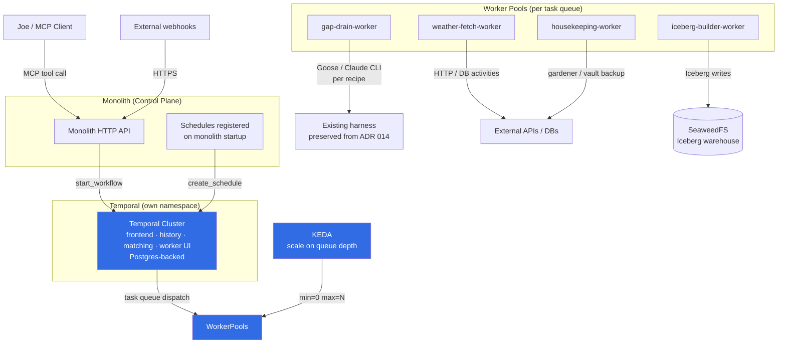
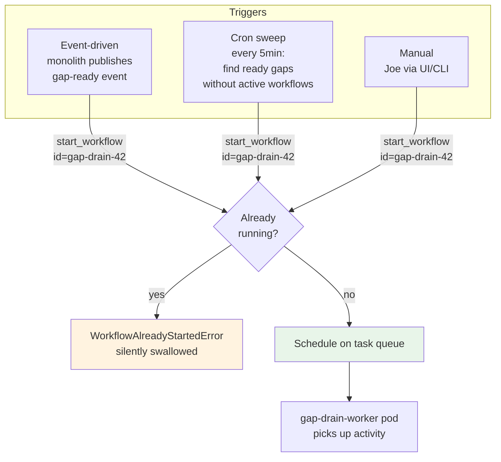
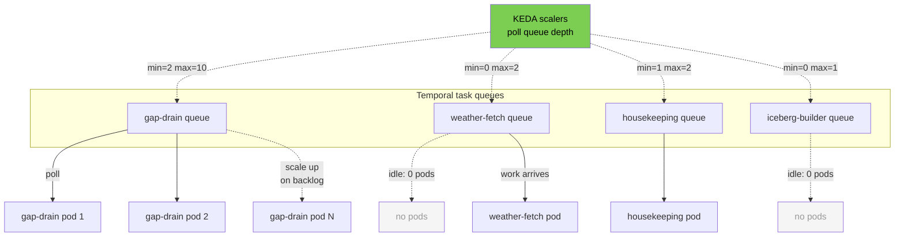
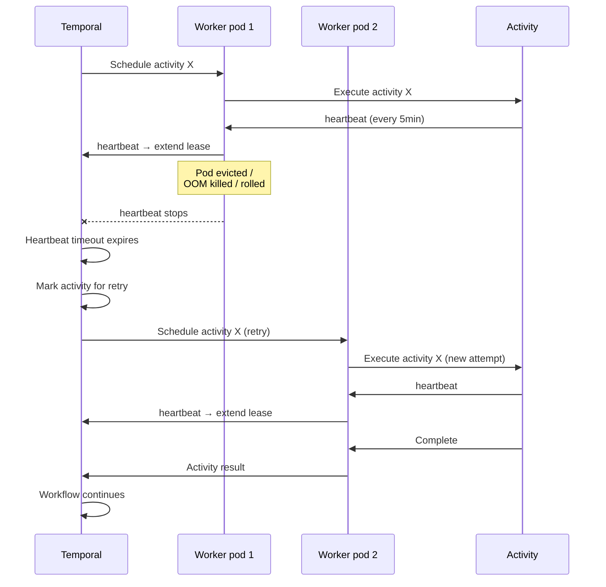

# ADR 015: Temporal as the Orchestration Substrate

**Author:** jomcgi
**Status:** Deprecated (Temporal removed 2026-06-14)
**Created:** 2026-05-30
**Supersedes:** [014 — AX + Substrate Agent Runtime](014-ax-substrate-agent-runtime.md)
**Depends on:** [016 — NATS as Canonical Event Stream](016-nats-canonical-event-stream.md), [017 — Domain Event Schema](017-domain-event-schema.md)

---

## Problem

[ADR 014](014-ax-substrate-agent-runtime.md) committed to AX + Substrate as the agent runtime stack. Two weeks of design work since then surfaced concerns that don't justify continuing on that path:

1. **Maturity.** AX is v0.1.0 (2026-05-20, "pausing external PRs while we stabilize core architecture") and Substrate is v0.0.0 (2026-05-19, literal initial commit, "APIs almost guaranteed to change"). Both projects are explicitly pre-stability; the homelab would be the production validation surface. ADR 014 accepted this risk with the mitigation of pin-to-SHA and budget half-day/month for churn — workable, but the actual blast radius is wider than that estimate when both projects are evolving simultaneously.

2. **Multiplexing isn't load-bearing for current workloads.** Substrate's headline feature is 30× actor oversubscription via pod multiplexing + sub-second snapshot/resume. This earns its keep when workloads are many long-lived idle actors (chat sessions, per-user agents). The current homelab workload is bounded-concurrency, actively-running gap-drain and cron jobs — none of which sit idle waiting for events. The multiplexing complexity buys nothing today.

3. **The substrate abstraction we needed turns out to be smaller than two upstream projects.** What we actually need is: (a) durable workflow execution with retries/heartbeats/replay; (b) cron scheduling unified with workflow execution; (c) horizontal worker scaling driven by queue depth; (d) workflow identity that survives pod rollover. Temporal provides all four out of the box, with eight years of production maturity, native Postgres backing, and a thoroughly debugged failure model.

4. **The ADR 014 "delete a Go service, adopt two upstream projects" trade has the right instinct (less code we own) but the wrong substitution.** We can delete the orchestrator + cluster_agents Go services without adopting pre-1.0 upstream projects, by leaning on a mature workflow engine.

---

## Proposal

Adopt **Temporal** as the orchestration substrate for all agent workflows, cron-scheduled jobs, and long-running async work in the homelab. Deploy in-cluster via the official `temporalio/helm-charts`, backed by the existing CNPG Postgres cluster (separate database, same instance).

| Layer            | ADR 014 (AX + Substrate)                                           | This ADR                                                                                                    |
| ---------------- | ------------------------------------------------------------------ | ----------------------------------------------------------------------------------------------------------- |
| Workflow engine  | AX (v0.1.0, pre-stability)                                         | **Temporal** (Apache 2.0, production-mature, 2017→)                                                         |
| Dispatch         | AX event log (gRPC, durable, resumable)                            | **Temporal task queues** (gRPC, durable, replayable)                                                        |
| Cron scheduling  | Monolith `register-routine-job` → AX submit                        | **Temporal `ScheduleClient`** — first-class workflow with cron spec                                         |
| Pod multiplexing | Substrate (`ateapi` / `atelet` / `atecontroller` / `ateom-gvisor`) | **Plain k8s Deployments + KEDA** — scale workers per task queue                                             |
| Snapshotting     | Substrate gVisor checkpoint/restore                                | **Not implemented** (workflow durability via Temporal event history)                                        |
| Sandbox kernel   | gVisor via Substrate                                               | gVisor still available via [security/003](../../../projects/platform/ARCHITECTURE.md) RuntimeClass when needed |
| Persistence      | AX event log in postgres + Substrate worker pool state             | **Single Postgres DB** (Temporal's state) — no separate event log                                           |
| Harnesses        | Goose recipes, Claude CLI subprocess                               | Goose recipes, Claude CLI subprocess (unchanged)                                                            |
| Tool gateway     | Context Forge                                                      | Context Forge (unchanged)                                                                                   |

The seam between domain code and orchestration shrinks too: workflows are first-class Python code in `projects/monolith/monolith/orchestrator/`, not a separate Go service with a gRPC adapter.

---

## Architecture

### Workflow identity = work identity

Workflows are keyed to the **thing being done**, not to the cron firing that scheduled them. Per-entity workflow IDs (e.g., `gap-drain-{gap_id}`) give native deduplication via Temporal's `WorkflowAlreadyStartedError` semantics. The same entity can be retriggered (manually, event-driven, or via cron sweep) without risk of double-execution.

Three independent trigger paths converge on the same deterministic workflow ID. Whichever fires first wins; subsequent attempts are silent no-ops. No coordination between triggers needed.

### Worker pools, not "the orchestrator"

There is no single "agent orchestrator" pod. Each task queue gets its own Deployment of long-lived worker pods that poll Temporal for activities to execute. KEDA scales each pool to queue depth (including scale-to-zero for bursty queues).

Bursty queues (weather-fetch, iceberg-builder) scale to zero when idle and back up on demand. Persistent queues (gap-drain) keep a minimum of replicas always warm. Each pool is tuned independently — KEDA's per-ScaledObject configuration means we don't pay for warm capacity we don't need.

This replaces ADR 014's split-roles plan (monolith → AX → Substrate → warm pool). The seam is one layer (workflow code in monolith's Python package → Temporal task queue → worker pods running activities) instead of three.

### Scheduling unified with execution

Cron-style schedules (gardener, calendar poll, vault backup, weather fetch, Iceberg batch commit, Iceberg builder) become Temporal `Schedule`s, registered idempotently from monolith startup. Same Postgres persistence, same retry policy, same UI as event-triggered workflows. The monolith's per-domain scheduler module shrinks to "register Temporal Schedules from a `SCHEDULES` list at boot."

### What gets deleted

| Today / per ADR 014 plan                                                         | After                                                                     |
| -------------------------------------------------------------------------------- | ------------------------------------------------------------------------- |
| `projects/agent_platform/orchestrator/` Go service                               | Deleted (was already slated for deletion by ADR 014)                      |
| `projects/agent_platform/cluster_agents/` Go service + five autonomous loops     | Deleted; each loop becomes a Temporal Schedule + workflow                 |
| Custom claim / heartbeat / reaper / DLQ machinery in monolith                    | Deleted — Temporal's native primitives replace                            |
| Per-domain advisory lock dance for any work coordination                         | Deleted — Temporal task queues handle worker coordination                 |
| AX deployment manifests + gRPC adapter (not yet shipped, planned by ADR 014)     | Not built                                                                 |
| Substrate deployment + `atecontroller` + `atelet` daemonset (planned by ADR 014) | Not built                                                                 |
| `agent-sandbox` warm-pool chart (per ADR 014's transition plan)                  | Stays for now; revisit if Temporal-based worker pools cover all use cases |

### What does NOT change

- **Goose recipes** in `projects/agent_platform/goose_agent/image/recipes/` — preserved as agent behaviour per [ADR 010](010-recipe-driven-agent-registry.md)
- **Claude CLI subprocess pattern** — preserved per `feedback_claude_cli_subprocess_for_tos.md`; ToS-compliant under Claude Max subscription
- **Context Forge** as the MCP gateway per [ADR 003](003-context-forge.md)
- **vLLM + Qwen3.5 hybrid** — inference plane unchanged; orchestration is orthogonal to inference choice
- **MCP surface** (`monolith-agent-*` tools) — external interface preserved; internal implementation migrates to Temporal SDK calls
- **gVisor availability** — security/003 RuntimeClass remains available for any workload that needs strong isolation; Temporal worker pods can be tagged with it per Deployment

### Worker pod lifecycle (the property that matters)

Temporal handles workflow lifecycle so completely that pod lifecycle becomes a separate, simpler concern:

- **Workflow durability**: workflow state survives any worker pod crash (event history is the source of truth, replayed on recovery)
- **Activity heartbeats**: detect dead workers; reassign in-flight work to live workers
- **Worker pool**: managed by k8s Deployment + KEDA; rolls happen on chart updates, scaling happens on queue depth
- **Result**: kill any worker pod at any time, workflows keep working

This eliminates the entire class of "what happens if the orchestrator pod restarts mid-job?" concerns that ADR 008 was bug-fixing. Those resilience patterns are now Temporal's responsibility, not ours.

---

## Security

- **Temporal is internal-only.** The frontend gRPC API is reachable only from monolith pods and worker pods within the cluster. No Cloudflare exposure for the Temporal API. UI is exposed via the existing internal-only ingress for admin use.
- **Worker pod identity** uses dedicated ServiceAccounts per task queue, with RBAC scoped to that workload's needs (e.g., gap-drain worker needs Postgres read access for KG; iceberg-builder worker needs SeaweedFS write).
- **Authentication into Temporal** uses internal mTLS (Linkerd-managed) plus Temporal's namespace authorization. No external clients.
- **Credentials** (Anthropic API key, NIM API key, S3 credentials) injected via 1Password Operator into worker pods at deploy time.
- **No new ingress** introduced by this ADR. All external clients continue through monolith → Cloudflare → CF Tunnel.
- **gVisor isolation** remains available via [security/003](../../../projects/platform/ARCHITECTURE.md) RuntimeClass for workloads that need it (e.g., agents executing LLM-generated code). Temporal worker pods can be selectively tagged with the runsc runtime class via Deployment spec — no platform-wide change required.
- **Workflow history visibility**: per-namespace authorization in Temporal allows scoping who can query/replay/cancel workflows. For homelab single-user, namespace=`default` is sufficient.

See `docs/security.md` for baseline. No deviations introduced.

---

## Risks

| Risk                                                                            | Likelihood | Impact | Mitigation                                                                                                                                                    |
| ------------------------------------------------------------------------------- | ---------- | ------ | ------------------------------------------------------------------------------------------------------------------------------------------------------------- |
| Temporal becomes critical-path infrastructure                                   | Certain    | High   | Production-mature project; Helm chart well-tested; Postgres backing reuses existing CNPG cluster. Operational burden lower than AX+Substrate would have been. |
| Workflow code determinism violations (non-deterministic constructs in workflow) | Medium     | Medium | Temporal SDK enforces; documented patterns ("I/O in activities, computation in workflows"); CI lint can catch common cases                                    |
| Per-entity workflow ID collisions on retry                                      | Low        | Low    | `WorkflowIDReusePolicy.ALLOW_DUPLICATE_FAILED_ONLY` semantics handle natively; cron sweep is idempotent via `WorkflowAlreadyStartedError`                     |
| Activity retry storms on external dependency outages                            | Medium     | Medium | Exponential backoff with high `maximum_interval` (1h+); `next_retry_delay` from `Retry-After` headers; circuit-breaker fallback patterns                      |
| Temporal version upgrades require schema migrations                             | Low        | Medium | Helm chart handles automatically; `pg_dump` before major version bumps as belt-and-suspenders                                                                 |
| Worker pool resource sizing miscalibrated                                       | Medium     | Low    | KEDA scales to demand; per-task-queue Deployments allow per-workload tuning; in-place vertical scaling available for long-lived workers                       |
| Cron schedule drift if monolith fails to register schedules on startup          | Low        | Low    | Schedule registration is idempotent; missed run causes one delayed execution, not silent loss                                                                 |
| Loss of Substrate's snapshot/resume capability for future workloads             | Medium     | Low    | If/when a workload genuinely needs multiplexing, can integrate Substrate (or Modal/E2B/Daytona) as a substrate adapter at that point                          |

---

## Open Questions

These are questions to answer during execution, not gates that block the decision.

1. Should Temporal's `temporal` and `temporal_visibility` databases share the existing CNPG cluster (same instance, different DBs) or get their own instance? For homelab scale, shared is fine; revisit if Temporal throughput pressures the existing cluster.
2. Does Temporal's standard visibility (Postgres-backed) suffice, or do we need Elasticsearch-backed advanced visibility? Default to standard; revisit if cross-workflow search queries become important.
3. What retention policy for completed workflow histories? Default 7-14 days for most workflows; longer for audit-relevant ones (e.g., KG mutations).
4. Goose recipe ergonomics inside Temporal activities — does the existing `goose run` invocation pattern fit cleanly inside an activity, or do we need a small adapter? Probably fine; verify with first migrated workflow.
5. Per-workflow OTel trace correlation through Temporal SDK — does the Python SDK auto-propagate trace context to activities? If not, manual propagation pattern needed early.
6. KEDA's Temporal scaler queue-depth metric — does it work cleanly with very low absolute volumes (single-digit messages)? Probably yes; verify before relying on scale-to-zero behavior.

---

## References

| Resource                                                                                                   | Relevance                                                              |
| ---------------------------------------------------------------------------------------------------------- | ---------------------------------------------------------------------- |
| [Temporal](https://temporal.io/)                                                                           | The workflow engine being adopted                                      |
| [temporalio/helm-charts](https://github.com/temporalio/helm-charts)                                        | Deployment mechanism                                                   |
| [KEDA Temporal scaler](https://keda.sh/docs/latest/scalers/temporal/)                                      | Queue-depth-driven worker pool scaling                                 |
| [014 — AX + Substrate Agent Runtime](014-ax-substrate-agent-runtime.md)                                    | Superseded by this ADR                                                 |
| [007 — Agent Run Orchestration Service](007-agent-orchestrator.md)                                         | Dispatch plumbing already retired by ADR 014; this ADR confirms        |
| [008 — Cluster Patrol Loop Resilience](008-cluster-patrol-loop-resilience.md)                              | Autonomous-loop plumbing already retired by ADR 014; this ADR confirms |
| [010 — Recipe-Driven Agent Registry](010-recipe-driven-agent-registry.md)                                  | Goose recipes preserved as agent behaviour                             |
| [003 — Context Forge](003-context-forge.md)                                                                | MCP gateway, unchanged                                                 |
| [016 — NATS as Canonical Event Stream](016-nats-canonical-event-stream.md)                                 | Companion: events between system components                            |
| [017 — Domain Event Schema](017-domain-event-schema.md)                                                    | Companion: shape of events flowing through NATS                        |
| [platform/004 — Iceberg Lakehouse + Hot-Swap Quack Serving](../../../projects/platform/ARCHITECTURE.md) | Companion: storage architecture                                        |
