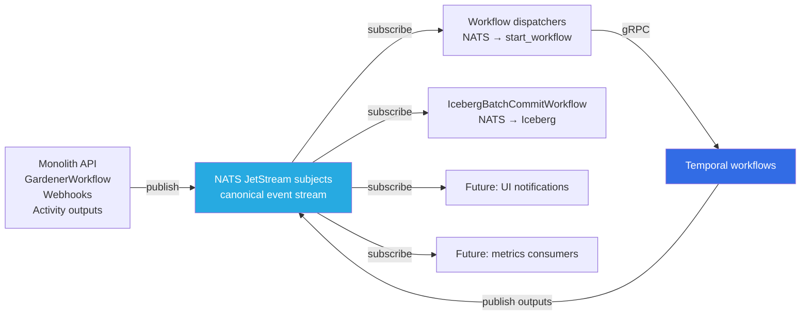
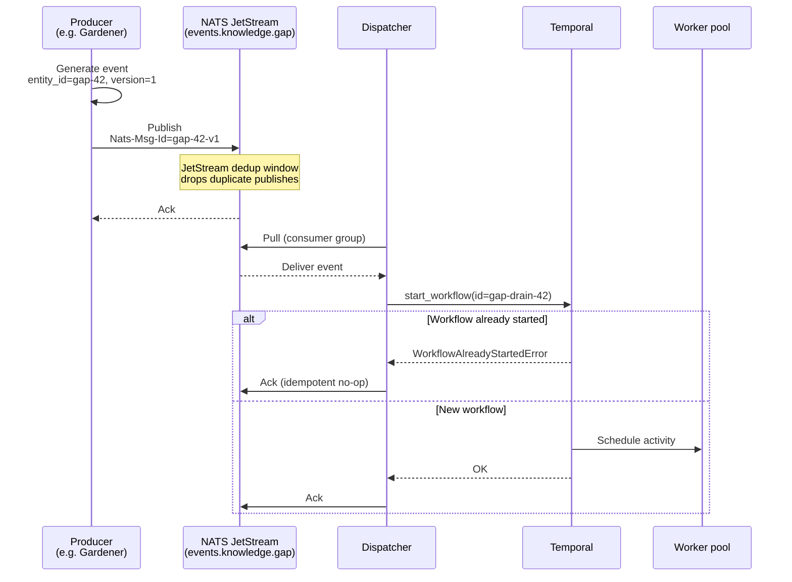
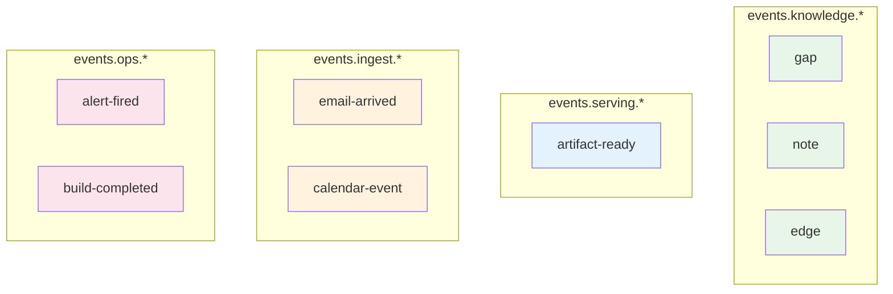
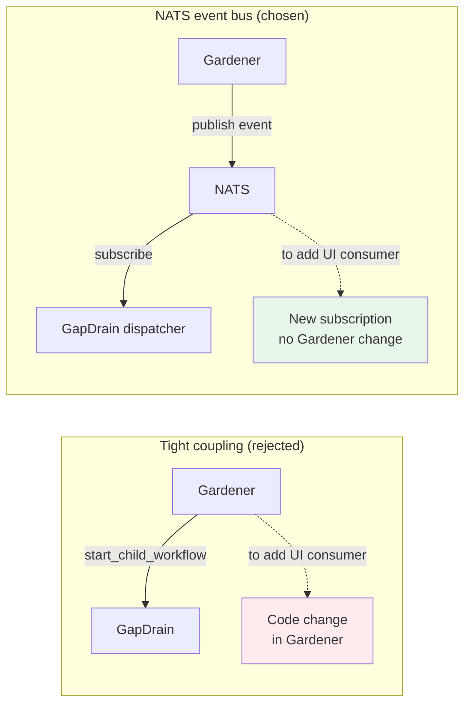

# ADR 016: NATS as the Canonical Event Stream

**Author:** jomcgi
**Status:** Superseded
**Created:** 2026-05-30
**Superseded:** 2026-06-21 (NATS removed from the homelab; the bus only ever served the decommissioned lakehouse and had no remaining homelab publishers or consumers. Event-sourced data-platform work continues under `loom`.)
**Depends on:** [015 — Temporal as Orchestration Substrate](015-temporal-orchestration-substrate.md), [017 — Domain Event Schema](017-domain-event-schema.md)

---

## Superseded (2026-06-21)

NATS is no longer deployed in the homelab. This ADR chose NATS as the canonical event stream on the premise that Temporal ([ADR 015](015-temporal-orchestration-substrate.md)) would own orchestration and every cross-component state change would flow through events. That stack was decommissioned on 2026-06-14 (lakehouse + Temporal, PR #2596) and its successor, the event-sourced data platform, moved to `loom`. The NATS deployment (`nack`, `nats`, `nats-streams` under `projects/platform`) had no remaining homelab publishers or consumers, so it was removed. Homelab state is authoritative in Postgres, and components communicate via direct calls and MCP: see [ADR 018](018-event-driven-gardener-trigger.md), where the gardener explicitly chose an in-process trigger over this bus. If an event bus is needed again, it will be designed in `loom`.

---

## Problem

With [ADR 015](015-temporal-orchestration-substrate.md) adopting Temporal as the orchestration substrate, we have an opportunity (and a need) to choose how system components communicate.

The default pattern would be "monolith calls `temporal_client.start_workflow()` directly when something needs to happen, and workflows call `start_child_workflow()` to chain work." This works, but tightly couples producers to a specific consumer (the named workflow). If we later want a UI to react to "new gap discovered" or a metrics service to count gap-discovery rate, every producer needs code changes to publish to additional consumers.

The homelab already operates NATS JetStream in-cluster. Pre-ADR-015 it was used by `agent-orchestrator` for job dispatch (`agent.jobs` stream + `job-records` KV); that role disappears with Temporal owning workflow dispatch. NATS is then either deprecated or repurposed.

We need to decide whether system-wide event flow goes through Temporal directly (tight coupling, simple) or through NATS as an event bus (extra hop, loose coupling, flexible).

---

## Proposal

**NATS JetStream is the canonical event substrate** for the homelab. Every state change that crosses a component boundary becomes a NATS event. Temporal workflows are one consumer-type among potentially many; the producer never references Temporal directly.

The shape:

- **Producers publish to subjects** — no knowledge of consumers
- **Consumers subscribe to subjects** — no knowledge of producers
- **Workflow dispatchers** are small adapters (~30 lines each) that translate NATS events into `start_workflow` calls with deterministic IDs
- **Workflow outputs** publish back to NATS, closing the loop so downstream consumers can react

---

## Architecture

### Event flow with idempotency

Three layers of idempotency stack:

- **NATS `Nats-Msg-Id`** drops duplicate publishes in JetStream's dedup window
- **Workflow ID uniqueness** (`gap-drain-{entity_id}`) prevents duplicate workflow execution
- **Activity idempotency keys** (entity_id + workflow_execution_uuid) prevent duplicate side effects

Net effect: at-least-once delivery at every layer + idempotent application = exactly-once effect.

### Per-subject topology

Subjects are namespaced by domain. Each domain owns its event taxonomy; consumers subscribe to the subjects relevant to their work. Domain ownership of event types means schema evolution is local — a new event type in `knowledge` doesn't require changes to `ingest` consumers.

### Why not direct workflow chaining

A reasonable alternative: gardener workflow calls `start_child_workflow(GapDrainWorkflow, gap_id)` directly. Cheaper (no NATS hop) but couples producer to consumer.

The right framing: **Temporal is for invoking a specific workflow with known input; NATS is for moving events between independently-owned components.** Workflow chaining within a single codebase doesn't need NATS; cross-component events do.

### Replacing ADR 014's dispatch substrate

ADR 014 specified AX's event log as the durable dispatch record and explicitly removed NATS from the agent-dispatch path ("AX's event log is the durable record"). This ADR brings NATS back, but in a different role:

| Role                   | ADR 014                                 | This ADR                                                  |
| ---------------------- | --------------------------------------- | --------------------------------------------------------- |
| Workflow dispatch      | AX gRPC submit                          | Temporal task queues (per ADR 015) — internal to Temporal |
| Durable event log      | AX event log (workflow-scoped)          | Temporal event history (workflow-scoped)                  |
| Inter-component events | NATS for Discord-bot fan-out (residual) | **NATS as canonical event bus (this ADR)**                |
| Job records / replay   | AX event log                            | Temporal workflow history                                 |

The distinction matters: ADR 014's NATS removal was about _workflow internals_. This ADR adopts NATS for _cross-component coordination_. They occupy different layers.

### What gets simplified

| Today / per ADR 014                                               | After                                                         |
| ----------------------------------------------------------------- | ------------------------------------------------------------- |
| Monolith imports Temporal SDK to start workflows on state changes | Monolith publishes events; dispatchers translate to workflows |
| Workflow A → `start_child_workflow(B)` for cross-domain triggers  | Workflow A publishes event; Workflow B's dispatcher reacts    |
| Adding a UI notification consumer requires producer changes       | Adding a UI consumer = new subscription, zero producer change |
| `agent.jobs` NATS stream + `job-records` KV (ADR 007)             | Deleted (ADR 015 replaces with Temporal task queues)          |

### What stays out of NATS

NATS is for **inter-component events**, not for everything that moves data:

- **Within a workflow**, activity outputs are accessed via workflow state, not republished to NATS
- **Within an activity**, sub-calls use direct function calls or SDK calls, not NATS
- **Database transactions** stay within Postgres; we don't NATS-ify state updates that happen in a single transaction
- **Request/response APIs** (web app reading the KG) hit HTTP endpoints, not NATS

The rule: NATS is for events that _should_ fan out to multiple potential consumers, even if the second consumer doesn't exist yet.

---

## Security

- **NATS is internal-only.** No external clients publish or subscribe; the NATS server is reachable only from cluster pods.
- **Per-subject authorization** via NATS user/account model — producers and consumers get accounts scoped to the subjects they need. Monolith publishes broadly; gap-drain-dispatcher subscribes only to `events.knowledge.gap`.
- **Credentials** for NATS clients injected via 1Password Operator at deploy time.
- **No new ingress** introduced. NATS stays internal-mesh-only.
- **Linkerd-meshed** like all internal traffic — mTLS automatic. Per `feedback_linkerd_networkpolicy.md`, no NetworkPolicies in the NATS namespace.
- **Event payload sensitivity**: events may contain KG content references (note IDs, gap topics). Treat NATS stream as same sensitivity tier as the KG itself — internal-only, no external replication unless explicitly designed.

---

## Risks

| Risk                                                                    | Likelihood | Impact | Mitigation                                                                                                               |
| ----------------------------------------------------------------------- | ---------- | ------ | ------------------------------------------------------------------------------------------------------------------------ |
| NATS becomes critical-path for system coordination                      | Certain    | High   | NATS JetStream HA with 3 replicas + replication; existing infrastructure, well-understood operational profile            |
| Extra hop adds latency on dispatch paths                                | Certain    | Low    | Sub-100ms typical; gap-dispatch isn't latency-bound                                                                      |
| Dispatcher service failure blocks workflow starts                       | Medium     | Medium | Multiple dispatcher replicas; NATS retains events until acked; Temporal cron-sweep workflow catches missed events        |
| Event schema drift between producers and consumers                      | Medium     | Medium | [ADR 017](017-domain-event-schema.md) specifies envelope schema with version field; consumers ignore unknown event types |
| NATS retention policy too short, events expire before consumed          | Low        | High   | Long retention on JetStream (configurable in days/months); consumer-group lag monitoring via SigNoz                      |
| Tight coupling sneaks in via "just call start_workflow directly here"   | Medium     | Low    | Code review discipline; documented anti-pattern; harm is bounded (mostly inelegance, not correctness)                    |
| Dispatcher dedup race (NATS message acked but workflow not visible yet) | Low        | Low    | Workflow ID uniqueness handles natively; second attempt at start_workflow returns WorkflowAlreadyStartedError            |

---

## Open Questions

1. **NATS retention policy** — infinite (with file backend) so any consumer can replay from history? Or bounded (90 days) with Iceberg as the archive? For homelab scale, infinite is probably simpler; revisit if storage becomes meaningful.
2. **Dispatcher deployment** — one dispatcher pod per subject, or one dispatcher service handling many subscriptions? Probably the latter for operational simplicity.
3. **Subject naming convention** — `events.{domain}.{type}` proposed; consider sub-domain hierarchies if a domain grows many event types.
4. **Cross-subject ordering** — NATS preserves order within a subject. If a workflow needs to react to events across subjects in causal order, design pattern needed (sequence numbers, or single subject with type field).
5. **NATS consumer-group lag alerting threshold** — what's "behind" vs "broken"? Default suggestion: alert if consumer lag > 5 minutes worth of events.

---

## References

| Resource                                                                             | Relevance                                                              |
| ------------------------------------------------------------------------------------ | ---------------------------------------------------------------------- |
| [NATS JetStream](https://docs.nats.io/nats-concepts/jetstream)                       | Underlying messaging substrate                                         |
| [015 — Temporal as Orchestration Substrate](015-temporal-orchestration-substrate.md) | Companion: workflow execution                                          |
| [017 — Domain Event Schema](017-domain-event-schema.md)                              | Companion: shape of events flowing through NATS                        |
| [007 — Agent Run Orchestration Service](007-agent-orchestrator.md)                   | Original NATS-for-dispatch pattern, retired by ADR 015                 |
| [014 — AX + Substrate Agent Runtime](014-ax-substrate-agent-runtime.md)              | Superseded by ADR 015; NATS removal in that ADR was scoped to dispatch |
