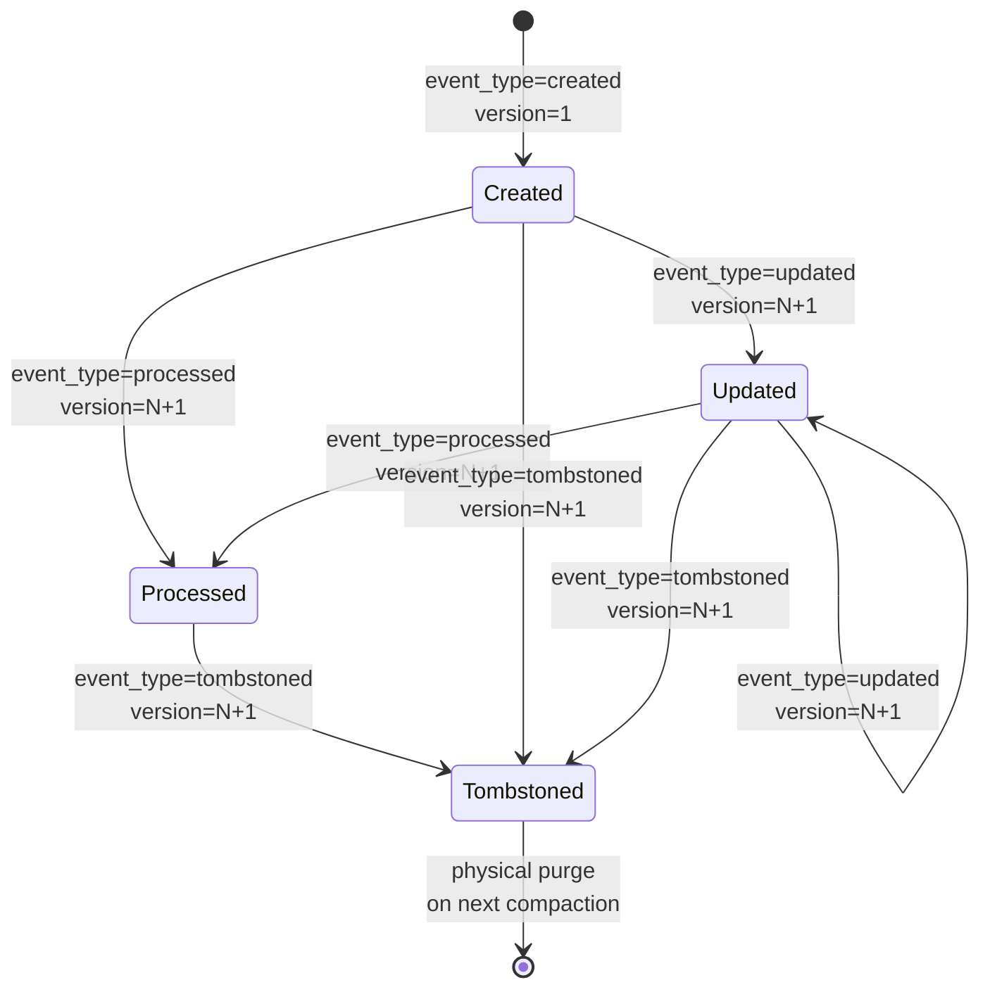
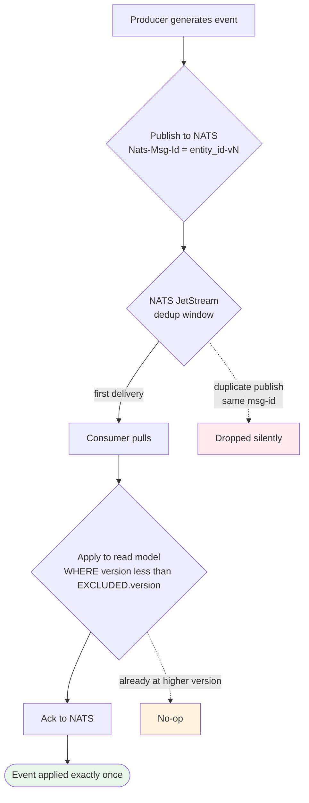
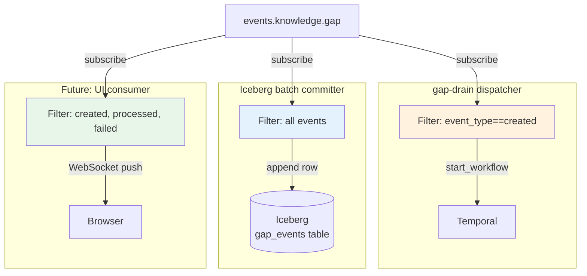

# ADR 017: Domain Event Schema and Tombstone Semantics

**Author:** jomcgi
**Status:** Accepted
**Created:** 2026-05-30
**Depends on:** [016 — NATS as Canonical Event Stream](016-nats-canonical-event-stream.md)

---

## Problem

With NATS as the canonical event stream ([ADR 016](016-nats-canonical-event-stream.md)) and Temporal as the orchestration substrate ([ADR 015](015-temporal-orchestration-substrate.md)), every cross-component state change flows through events. Without a system-wide schema, every event type would invent its own envelope, deletion protocol, and idempotency story — leading to inconsistent consumer code and projection drift.

Specifically, we need to answer:

1. **What does an event look like?** Envelope fields, versioning, identity.
2. **How are state changes expressed?** Supersession (new event with same entity_id) vs implicit mutation.
3. **How are deletions expressed?** Tombstones vs out-of-band delete protocols.
4. **How is idempotency guaranteed?** At publish time, at consume time.
5. **How does schema evolve?** Adding new fields, new event types, without breaking consumers.

These can't be left as per-domain decisions because consumers (Iceberg writers, UI projections, future analytics) need to apply uniform interpretation across all event types.

---

## Proposal

Adopt a **single domain event envelope schema** with **tombstones as first-class event types**. Every state change — including deletion — is a versioned event published to a NATS subject. Consumers interpret events by `event_type`; producers never mutate state implicitly.

```json
{
    "schema_version": 1,
    "entity_type": "gap",
    "entity_id": "gap-42",
    "event_type": "created",
    "event_version": 1,
    "event_id": "evt-7f3a...",
    "occurred_at": "2026-05-30T12:00:00Z",
    "producer": "monolith.gardener",
    "payload": { "topic": "...", "context": {...} }
}
```

Published with `Nats-Msg-Id` header set to `{entity_id}-v{event_version}` for JetStream deduplication.

---

## Architecture

### Entity event lifecycle



The state machine is the same for all entity types. New event types can be added per entity type (e.g., gap-specific `escalated`) but `created`, `updated`, `tombstoned` are universal.

### Idempotency across the stack



Three idempotency layers protect against double-application:

- **NATS-level** dedup via `Nats-Msg-Id`
- **Consumer-level** dedup via `WHERE version < EXCLUDED.version` predicate
- **Workflow-level** dedup via deterministic workflow IDs (per [ADR 015](015-temporal-orchestration-substrate.md))

A single event can be published twice, delivered twice, and applied twice — only one effect lands.

### Per-consumer interpretation



Same event, different interpretations. Adding a new consumer is "subscribe to subject, filter by event_type, apply per-domain logic" — zero producer changes.

### Tombstone propagation

```mermaid
sequenceDiagram
    participant A as Admin / RTBF<br/>request
    participant M as Monolith API
    participant N as NATS<br/>events.knowledge.gap
    participant IB as Iceberg writer
    participant Ice as Iceberg
    participant UI as UI consumer

    A->>M: Delete gap-42
    M->>M: Generate event<br/>type=tombstoned, v=N+1
    M->>N: Publish (Nats-Msg-Id=gap-42-vN+1)
    N-->>M: Ack

    par
        N->>IB: Deliver tombstone event
        IB->>Ice: Append tombstone row
        Note over Ice: Logically gone now;<br/>physically purged<br/>at next monthly compaction
        IB->>N: Ack
    and
        N->>UI: Deliver tombstone event
        UI->>UI: Remove from display
        UI->>N: Ack
    end
```

Tombstones don't require a separate deletion protocol or coordination between consumers. Each consumer applies tombstone semantics per its domain.

### Event envelope fields

| Field            | Type      | Required | Purpose                                                                                   |
| ---------------- | --------- | -------- | ----------------------------------------------------------------------------------------- |
| `schema_version` | int       | yes      | Envelope schema version (this ADR = `1`); supports future evolution                       |
| `entity_type`    | string    | yes      | Domain entity class (`gap`, `note`, `edge`, etc.)                                         |
| `entity_id`      | string    | yes      | Stable identifier for the entity instance                                                 |
| `event_type`     | string    | yes      | `created` \| `updated` \| `processed` \| `failed` \| `tombstoned` \| domain-specific      |
| `event_version`  | int       | yes      | Monotonic per `entity_id`; producer's responsibility (from Postgres sequence or computed) |
| `event_id`       | string    | yes      | Globally unique (UUIDv7 or ULID) for trace correlation                                    |
| `occurred_at`    | timestamp | yes      | Producer's wall clock; informational, not used for ordering                               |
| `producer`       | string    | yes      | Identifier of publishing component (e.g., `monolith.gardener`)                            |
| `payload`        | object    | yes      | Event-type-specific data; schema depends on `entity_type` + `event_type`                  |
| `correlation_id` | string    | no       | OTel trace ID for span continuation across event boundaries                               |
| `caused_by`      | string    | no       | `event_id` of upstream event that triggered this one (for causal lineage)                 |

### Schema evolution rules

- **Additive only**: new event types can be added freely; consumers ignore unknown types
- **Payload fields can be added** without bumping `schema_version`; consumers tolerate extra fields
- **Field removal** requires a new `schema_version` and a migration plan
- **Field semantics changes** (e.g., new units) require a new `schema_version`
- **Entity types are namespaced** per domain; collision risk low

Versioning the envelope rather than per-event-type means schema changes are coarse-grained but predictable. Consumers check `schema_version` and apply their version-specific decoder.

### Versioning per entity (separate from envelope versioning)

`event_version` is **per-entity, monotonic** — `gap-42` has events v1, v2, v3, ... in publish order. This is distinct from `schema_version` which applies to the envelope shape.

Producers derive `event_version` from a Postgres sequence keyed by `entity_id`, OR from the entity's current "version" column incremented at event-generation time. Either approach gives strict monotonic ordering per entity, which is what consumers need for idempotency.

### Why tombstones, not "delete operations"

Implicit deletion ("after processing, delete from queue") leaks producer concerns into consumer logic and breaks audit/replay. Specifically:

| Implicit deletion                                                          | Tombstone events                                         |
| -------------------------------------------------------------------------- | -------------------------------------------------------- |
| Producer must know all consumers + their deletion protocols                | Producer publishes one event; consumers handle           |
| Replay impossible — historical events show the entity but not its deletion | Replay reconstructs full history including deletion      |
| Audit requires separate "deletion log"                                     | Audit is inherent — events are the log                   |
| Adding a new consumer requires updating producer's deletion protocol       | Adding consumer = new subscription, zero producer change |

The cost: physical disk space (tombstones aren't free). Mitigated by Iceberg's compaction (per [platform/004](../../../projects/platform/ARCHITECTURE.md) §LSM compaction): monthly rewrite physically removes tombstoned entities from the base layer.

For urgent purges (right-to-be-forgotten with hard deadline), ad-hoc compaction can run on demand.

---

## Security

- **Event payloads may contain sensitive KG content** (note text, gap topics, embeddings). Same sensitivity tier as the KG itself.
- **NATS subject ACLs** scope publish/subscribe permissions per producer/consumer per [ADR 016](016-nats-canonical-event-stream.md).
- **PII in events**: producers responsible for not embedding PII that doesn't belong in the audit log. Reference-by-ID pattern preferred over inlining sensitive content where possible.
- **Tombstone events for RTBF**: tombstone events themselves should not contain the data being forgotten — they reference the entity_id and a redacted reason. The original `created`/`updated` events for the tombstoned entity are physically purged at next Iceberg compaction.
- **No deviation from baseline `docs/security.md`.**

---

## Risks

| Risk                                                                    | Likelihood | Impact | Mitigation                                                                                                               |
| ----------------------------------------------------------------------- | ---------- | ------ | ------------------------------------------------------------------------------------------------------------------------ |
| Producers forget to publish tombstone on logical delete                 | Medium     | Medium | Code review discipline; lint rule searching for direct DB deletes without event publish; audit trail surfaces gaps       |
| Consumers diverge in tombstone interpretation                           | Low        | Medium | This ADR is the canonical spec; consumer tests verify tombstone handling                                                 |
| `event_version` monotonicity broken (producer publishes out of order)   | Medium     | Medium | Postgres sequence + transactional event generation guarantees order; consumers reject events with non-monotonic versions |
| Schema evolution breaks consumers (field removal, semantics change)     | Low        | High   | Envelope versioning forces explicit migration; CI lint can block schema-incompatible changes                             |
| Tombstone events accumulate to the point of impacting query performance | Low        | Low    | Iceberg monthly compaction physically purges; ad-hoc compaction available; bounded by entity churn rate                  |
| Event_id collisions (UUID collision in practice)                        | Negligible | Low    | UUIDv7/ULID birthday collision astronomically unlikely at homelab volume                                                 |
| Payload bloat from embedded large objects                               | Medium     | Medium | Reference-by-ID convention for large content (e.g., raw note body → S3 URL + ID; event carries reference, not bytes)     |

---

## Open Questions

1. **Required envelope fields vs optional** — `correlation_id` and `caused_by` are optional but valuable. Should they become required for new event types after some adoption period?
2. **Cross-entity event types** — what about events that involve two entities (e.g., "edge created between gap-42 and note-7")? Envelope assumes single `entity_id`. Two options: pick one as primary, or add `related_entities` array. Defer until first concrete use case.
3. **Event size limit** — NATS has a 1MiB default max message size. Reference-by-ID for large payloads stays under this; what's the soft limit before we should start optimizing?
4. **`occurred_at` clock skew** — producer clocks may drift. Is consumer ordering based on `event_version` (always monotonic per entity) sufficient, or do we ever need cross-entity time ordering?
5. **Schema registry** — at what scale of event types does a formal schema registry (Avro/Protobuf/JSON Schema) become worth operating? Probably ~20+ event types; today we have ~5.

---

## References

| Resource                                                                                                   | Relevance                                                         |
| ---------------------------------------------------------------------------------------------------------- | ----------------------------------------------------------------- |
| [015 — Temporal as Orchestration Substrate](015-temporal-orchestration-substrate.md)                       | Companion: workflow execution that consumes/produces these events |
| [016 — NATS as Canonical Event Stream](016-nats-canonical-event-stream.md)                                 | Transport for these events                                        |
| [platform/004 — Iceberg Lakehouse + Hot-Swap Quack Serving](../../../projects/platform/ARCHITECTURE.md) | Tombstone application at the storage layer                        |
| [NATS JetStream Nats-Msg-Id](https://docs.nats.io/nats-concepts/jetstream/streams#message-deduplication)   | Dedup mechanism                                                   |
| [UUIDv7 spec (RFC 9562)](https://datatracker.ietf.org/doc/rfc9562/)                                        | Recommended `event_id` format                                     |
