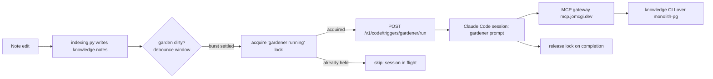

# ADR 018: Event-Driven Gardener Triggering via Remote-Trigger Runs

**Author:** Joe McGinley
**Status:** Deprecated (gardener runs as claude.ai routines)
**Created:** 2026-06-14

---

## Problem

The knowledge gardener runs as a claude.ai scheduled routine: a cron-fired Claude
Code session that, on each tick, polls the monolith over MCP for work and gardens
whatever it finds. With the knowledge graph now authoritative in Postgres and edits
indexed synchronously on write (ADR platform/006, Phases 1-3), this triggering model
has become the wrong shape for two reasons.

First, it is **double indirection**. A fixed-interval cron decides _when to look_,
and a passive `claude_agent.routine_jobs` Postgres queue (register to claim to
complete, `SELECT FOR UPDATE SKIP LOCKED` with a TTL lock) decides _what to do_. The
Claude session is a generic claimant stitching the two together. For the gardener,
that is a lot of machinery to answer a question the monolith can already answer
directly: "have any notes changed since the last gardening pass?"

Second, it is **poll-timed, not event-timed**. The cron wakes on a schedule whether
or not work exists, so it pays for empty wake-ups, and gardening latency is bounded
by the poll interval (hours) rather than by when an edit actually lands. Since note
edits already index synchronously into `knowledge.notes`, the monolith holds a clean,
precise event source that the poll-based design throws away.

The claude.ai remote-trigger API exposes `POST /v1/code/triggers/{id}/run`, an
on-demand start that is not bound to the trigger's cron schedule. That primitive lets
the monolith _push_ a gardening session the moment there is real work, which is what
this ADR adopts.

---

## Decision

Garden on events, not on a timer. The monolith owns a single claude.ai trigger
("gardener") carrying the gardener prompt and the `homelab` MCP connector. When note
edits land, the monolith coalesces them and calls the trigger's `run` endpoint to
start a Claude Code session that does the same gardening work it does today. The
`routine_jobs` queue is removed from the gardener's path.

Triggering stays in the **private monolith tier**: the same process that already
holds cluster secrets, owns `monolith-pg`, and runs the synchronous note indexer is
the one that detects dirtiness and calls `run`. The session reaches private knowledge
data only back through the authenticated MCP gateway (`mcp.jomcgi.dev`, Cloudflare
Access OIDC, ADR agents/006), so the data boundary is unchanged: only the clock moves
from claude.ai's cron into the monolith's edit stream.

This decision is about _triggering only_. It does not change what the gardener does
once running (the tool-based `knowledge` CLI over Postgres, ADR platform/006 Phase 4)
or which model it uses. It evolves the trigger mechanism that ADR agents/004 and the
routine-job pattern established.

| Aspect            | Today (cron + queue)                           | Decided (event-driven run)                          |
| ----------------- | ---------------------------------------------- | --------------------------------------------------- |
| Clock             | claude.ai cron, fixed interval                 | Monolith note-edit stream (debounced)               |
| Work discovery    | `routine_jobs` pull: list to claim to complete | None: the triggering edit _is_ the work signal      |
| Latency to garden | Up to one poll interval (hours)                | Seconds after a burst settles                       |
| Empty wake-ups    | Every tick with no work still starts a session | No session unless an edit happened                  |
| Session start     | claude.ai cron starts it                       | Monolith `POST /v1/code/triggers/{id}/run`          |
| Concurrency guard | Per-job TTL lock in `routine_jobs`             | Single "gardener running" TTL lock (same primitive) |

---

## Architecture

Two controls keep this from melting the inference budget, both reusing patterns the
codebase already has:

- **Coalescing.** A `garden_dirty_since` marker plus a debounce window (idle timeout
  or minimum interval) collapses a burst of edits into one session, rather than one
  session per edit.
- **Overlap guard.** A single TTL lock ("gardener running"), the same primitive that
  `routine_jobs` uses per row, prevents starting a second session while one is in
  flight. A crashed session's lock expires on its TTL and the next dirty edit can
  start a fresh pass.

A slow fallback cron on the trigger (for example daily) remains available as a
backstop so a missed `run` call never strands pending gardening indefinitely.

---

## Alternatives Considered

- **Keep cron, drop the queue (Option A).** Have the cron-fired gardener query
  `knowledge.notes` directly for "changed since last run" and garden inline, deleting
  the `routine_jobs` dance but keeping poll timing. Simpler (no new credential) but
  still pays empty wake-ups and hours of latency; kept as the fallback if the
  credential path below proves impractical.
- **Generalize to a queue-replacing dispatcher (Option C).** Build a generic
  `dirty to webhook to session` dispatcher for every routine kind and retire
  `routine_jobs` wholesale. Premature: the gardener is the only case with a clean
  event source today, so prove the pattern on it before generalizing.
- **NATS / event-stream fan-out (ADR agents/016, 017).** Route note-change events
  through the canonical event bus to a consumer that triggers the session. The bus
  is broader infrastructure than one gardener needs, and the Temporal/lakehouse stack
  that motivated much of it was decommissioned 2026-06-14; a direct in-process call
  from the indexer is the simplest thing that works.

---

## Security

Baseline per `docs/security.md`. The gardening session reaches private knowledge data
only through the authenticated MCP gateway (Cloudflare Access OIDC, ADR agents/006);
this ADR does not widen that boundary. The one new capability is outbound: the
monolith gains the ability to start a claude.ai session on demand, which requires it
to hold a credential for the remote-trigger API (see Open Questions). That credential
is a write-scoped capability to start one named trigger, stored as a `OnePasswordItem`
secret like every other cluster credential, never hardcoded.

---

## Risks

| Risk                                             | Likelihood | Impact | Mitigation                                                                                 |
| ------------------------------------------------ | ---------- | ------ | ------------------------------------------------------------------------------------------ |
| Edit storm fans out into many sessions           | Medium     | High   | Debounce + single "gardener running" TTL lock; at most one session at a time               |
| `run` call fails silently, gardening stalls      | Medium     | Medium | Slow fallback cron on the trigger as a backstop                                            |
| Monolith holds a long-lived claude.ai credential | Low        | Medium | 1Password-managed, single-trigger scope, rotatable; revisit if API allows narrower scoping |
| Lock leaks on session crash, blocks future runs  | Low        | Medium | TTL expiry releases the lock; next dirty edit reclaims                                     |

---

## Open Questions

1. **Credential / auth path.** The `RemoteTrigger` tool injects an OAuth token
   in-process for interactive sessions. Whether the `run` endpoint accepts a
   long-lived token the monolith can hold (and at what scope) is unverified. If it
   does not, fall back to Option A (cron + direct Postgres query, no credential).
2. **Debounce tuning.** The right idle window / minimum interval is empirical; start
   conservative (tens of minutes) and tighten once real edit cadence is observed.
3. **Whether `routine_jobs` survives elsewhere.** This ADR removes the gardener from
   the queue's path; other routine kinds may still use it. Retiring the table
   entirely is out of scope here (that would be Option C).

---

## References

| Resource                                                                      | Relevance                                                        |
| ----------------------------------------------------------------------------- | ---------------------------------------------------------------- |
| [ADR platform/006](../platform/006-obsidian-decommission-postgres-interim.md) | Postgres-authoritative notes + tool-based gardener this triggers |
| [ADR agents/004](004-autonomous-agents.md)                                    | Autonomous-agent triggering pattern this evolves                 |
| [ADR agents/006](006-oidc-auth-mcp-gateway.md)                                | Authenticated MCP gateway the session connects back through      |
| [ADR agents/012](012-knowledge-gardener-model-pipeline.md)                    | Prior gardener pipeline context                                  |
| claude.ai remote-trigger API `POST /v1/code/triggers/{id}/run`                | The on-demand run primitive this decision depends on             |
