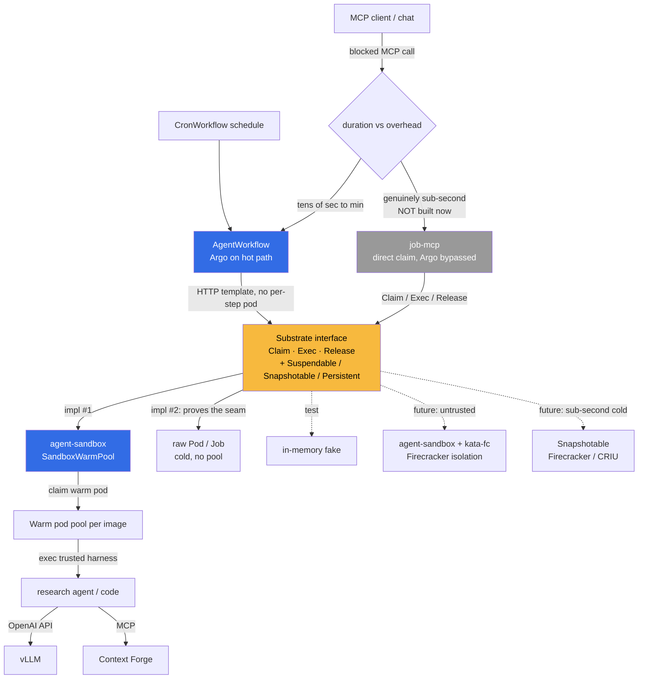

# ADR 019: Substrate Executor Interface and AgentWorkflow over Argo

**Author:** jomcgi
**Status:** Accepted
**Created:** 2026-06-21
**Revisits:** [015 - Temporal as Orchestration Substrate](015-temporal-orchestration-substrate.md) (its dismissal of warm pools as "not load-bearing")
**Builds on:** [014 - AX + Substrate Agent Runtime](014-ax-substrate-agent-runtime.md) (the executor abstraction, not its rejected implementations), [security/003 - gVisor RuntimeClass](../security/003-gvisor-runtime-class.md)

---

## Problem

Agent dispatch has a lineage of reversals:

- [ADR 014](014-ax-substrate-agent-runtime.md) adopted **google/ax** (runtime) + **agent-substrate/substrate** (warm-pool actor multiplexer). Both were pre-1.0; the homelab would have been their production validation surface.
- [ADR 015](015-temporal-orchestration-substrate.md) superseded 014 and chose **Temporal**, on three grounds: the upstreams were too immature, "the substrate abstraction we needed turns out to be smaller than two upstream projects", and (the conclusion this ADR revisits) **"multiplexing isn't load-bearing for current workloads"** because they were bounded-concurrency batch jobs, never idle actors waiting on events.
- Temporal was subsequently decommissioned (2026-06-14) and the live agent-job substrate landed on **Argo Workflows** (`monolith-workflows`, monolith as control plane via Hera + the K8s API), running batch CronWorkflows (worldcup sim, knowledge-graph jobs).

A new workload now exists that 015's batch-only premise did not anticipate: **synchronous, caller-blocked MCP dispatch.** A chat or agent issues an MCP call that runs a research agent or executes trusted code, and **blocks** on the response. The work itself is tens of seconds to a couple of minutes. The pain is not the work; it is the **cold pod schedule** in front of it: scheduling a pod (and, on a full node, waiting for the cluster autoscaler) adds a large, highly variable latency that a blocked caller feels directly.

Two things have changed since 015 dismissed warm pools, and together they reopen the question:

1. **A qualifying workload exists.** Caller-blocked dispatch is exactly the latency-sensitive, bursty class a warm pool serves. 015's "nothing sits idle waiting" no longer holds.
2. **A mature warm-pool primitive exists.** `kubernetes-sigs/agent-sandbox` (SIG-standard `Sandbox` / `SandboxTemplate` / `SandboxClaim` / `SandboxWarmPool`) is the production-grade successor to what `agent-substrate/substrate` was at v0.0.0. A `SandboxClaim` binds a pre-warmed pod in milliseconds, with destroy-and-replenish on release giving clean isolation by construction.

So the task is to capture the warm pool's value without re-adopting the twice-superseded AX/Substrate code, and without coupling our design to a single executor.

---

## Decision

Three decisions, one rule.

**1. Keep Argo Workflows as the durable orchestration plane.** It won over Temporal in practice, it is mature, and its CronWorkflow / Workflow semantics are familiar. For tens-of-seconds-to-minutes jobs, Argo's reconcile-loop overhead (roughly 1 to 5 seconds) is noise against the job duration, even when a caller is blocked. We do **not** route synchronous dispatch around Argo by default.

**2. Define our own thin `Substrate` executor interface.** This reclaims the abstraction ADR 015 correctly identified as small and then threw away with the implementations. A minimal core plus optional capability interfaces:

```go
// Core: every executor satisfies this.
type Substrate interface {
    Claim(ctx, ClaimSpec) (Handle, error) // acquire an isolated env (warm or cold)
    Exec(ctx, Handle, Request) (Stream, error) // run work, stream output
    Release(ctx, Handle) error // return/destroy; pool replenishes
}

// Optional capabilities an executor advertises; consumers type-assert.
type Suspendable interface{ Suspend(Handle) error; Resume(Handle) error }
type Snapshotable interface{ Snapshot(Handle) (SnapshotRef, error); Restore(SnapshotRef) (Handle, error) }
type Persistent interface{ /* durable volumes survive Release */ }
```

The capability seam is what keeps the interface from being a leaky rename of agent-sandbox: Substrate-style memory multiplexing becomes a `Snapshotable` capability the core never requires, so agent-sandbox is not forced to fake it and a future Firecracker backend is not forced to hide it.

**3. agent-sandbox is `Substrate` impl #1, and the seam is proven by a second impl on day one.** A trivial raw-`Pod`/`Job` executor (cold, no pool) plus an in-memory test fake ship alongside it. If the core interface expresses agent-sandbox **and** raw-Pod cleanly, it is a real abstraction; if it only expresses agent-sandbox, we have renamed agent-sandbox and we find out immediately. The test fake also lets the consumers be tested with no cluster, which matters given this repo has no local test loop.

**The rule that picks the topology: job duration divided by orchestration overhead.**

| Aspect                       | Today (Argo, cold pods)      | Decided                                                                                                     |
| ---------------------------- | ---------------------------- | ----------------------------------------------------------------------------------------------------------- |
| Orchestration                | Argo Workflows               | Argo Workflows (unchanged)                                                                                  |
| Executor coupling            | Direct pod-per-step          | `Substrate` interface (core + capabilities)                                                                 |
| Warm dispatch                | None (cold schedule per run) | agent-sandbox `SandboxWarmPool`, claimed per run                                                            |
| Durable plane                | CronWorkflow / Workflow      | `AgentWorkflow`: Argo on the hot path, steps are HTTP templates into the claimed warm pod                   |
| Interactive sub-second plane | n/a                          | `job-mcp`: direct `SandboxClaim`, Argo bypassed. Reserved for genuinely sub-second needs; **not built now** |
| Isolation                    | host kernel (runc)           | trusted today; `runtimeClassName: kata-fc` (Firecracker microVM) when untrusted arrives                     |
| Sub-second cold start        | n/a                          | future `Snapshotable` executor (Firecracker / CRIU), additive                                               |

`AgentWorkflow` and `job-mcp` are two consumers of the **same** `Substrate`. `AgentWorkflow` is the common case; `job-mcp` is the exception reserved for when a job is short enough that Argo's 1-to-5-second floor would dominate.

---

## Architecture



### Tuned low-latency Argo dispatch

The largest lever is **not scheduling a step pod at all**: when a step is an HTTP (or Plugin) template that calls the pre-warmed sandbox, Argo's per-workflow agent pod makes the call and no per-step pod is created. Combined with a warm pool, dispatch becomes `Workflow CR create -> reconcile -> agent pod -> HTTP into warm pod`. Supporting knobs: `--workflow-workers` and client `--qps`/`--burst` for queue throughput, and submitting the Workflow CR directly to the K8s API rather than through the Argo Server to drop a hop. The residual floor is the per-workflow agent-pod spin-up (a second or two cold); the upstream direction toward a global agent pod ([argo-workflows#7891](https://github.com/argoproj/argo-workflows/issues/7891)) would remove even that. None of this tunes Argo below an irreducible control-plane round-trip of roughly 1 to 2 seconds, which is why the sub-second `job-mcp` path exists as a separate option rather than a tuning target.

### Trust axis

Workloads are **trusted today** (no external jobs), so the warm pod pool needs no VM isolation and tuned-Argo-plus-warm-pool is sufficient. When untrusted/external work arrives, isolation flips from optional to mandatory and the seam absorbs it additively: `runtimeClassName: kata-fc` on the agent-sandbox `SandboxTemplate` gives Firecracker microVM isolation with no executor change, and a `Snapshotable` Firecracker/CRIU executor can be added if sub-second cold start without standing warm RAM becomes necessary. Neither touches the `AgentWorkflow` or `job-mcp` consumers.

---

## Alternatives Considered

- **Re-adopt google/ax + agent-substrate/substrate (ADR 014).** Rejected: twice-superseded, and at the time of writing still pre-stability. We keep the abstraction, not the code.
- **Temporal worker pools (ADR 015).** Rejected: decommissioned; Argo is the live, familiar substrate and we are not reintroducing a second workflow engine.
- **Bypass Argo for all caller-blocked dispatch.** Rejected: for tens-of-seconds jobs the orchestration overhead is noise, and Argo's durability, observability, and retries are worth keeping. Bypass is reserved for genuinely sub-second work.
- **Warm worker pool with in-process isolation (the fastest trusted option).** Held in reserve: sub-millisecond routing, but isolation is in-process, so it is unsafe the moment work becomes untrusted. Not chosen as the default because it does not survive the trust transition.
- **WebAssembly / WASI.** Rejected for general use: near-instant start but a restricted runtime that cannot run an arbitrary CLI or a full agent harness.
- **Managed sandboxes (E2B / Modal / Daytona).** Rejected as the primary path: they are the Firecracker-snapshot approach as a service, but the goal is in-cluster on our hardware. They remain a candidate `Substrate` adapter if ever wanted.
- **Hardwire agent-sandbox with no interface.** Rejected: yields a leaky single-impl design with no test fake and no room for Kata/Firecracker; the interface costs little and is proven by a second impl.

---

## Security

Baseline in `docs/security.md`. Deviations and notes:

- **Trusted-only today.** The warm pod pool runs our own harnesses; no VM boundary is required yet. This is a standing assumption, not a permanent one.
- **Isolation path for untrusted work** is pre-designed: gVisor (`runsc`) per [security/003](../security/003-gvisor-runtime-class.md) and/or Kata Firecracker via `runtimeClassName`, applied to the agent-sandbox `SandboxTemplate`. Adopting untrusted execution is gated on this boundary being in place.
- **Clean isolation by construction.** A `SandboxClaim` adopts a fresh pod and, on release, that pod is destroyed (not handed to the next claimant) while the pool replenishes a clean one. No reset logic to get wrong.
- **Snapshots are never load-bearing.** If a `Snapshotable` executor is added later, snapshots include process memory and must be treated as ephemeral; durable state always lives in monolith Postgres, echoing the snapshot-safety note in ADR 014.
- **Memory is the binding cluster resource.** Warm pods spend standing RAM per image; pool sizing is a real cost knob, and snapshot/restore (trading RAM for disk) is the lever if image variety makes warm pools too expensive.
- **No new ingress.** Dispatch stays internal: monolith / Argo to the warm pool; external access continues through monolith and Cloudflare.

---

## Risks

| Risk                                                                   | Likelihood | Impact | Mitigation                                                                                                    |
| ---------------------------------------------------------------------- | ---------- | ------ | ------------------------------------------------------------------------------------------------------------- |
| `Substrate` interface becomes a single-impl rename of agent-sandbox    | Medium     | Medium | Ship a raw-Pod impl and a test fake on day one; the interface must express all three or it is wrong           |
| Warm pools cost standing RAM on a memory-bound cluster                 | High       | Medium | Size pools per image conservatively; reserve `Snapshotable` (RAM-for-disk) for when variety bites             |
| Argo control-loop floor (1 to 2s) disappoints a sub-second expectation | Low        | Low    | Documented as irreducible; the `job-mcp` bypass exists precisely for that case                                |
| Trust assumption silently outlives "trusted only"                      | Medium     | High   | Untrusted adoption is explicitly gated on Kata/gVisor isolation being applied first                           |
| Reviving a conclusion ADR 015 rejected reads as churn                  | Low        | Low    | The premise changed (a qualifying workload now exists); this ADR records why, not a reversal for its own sake |
| agent-sandbox is pre-1.0 and APIs may shift                            | Medium     | Low    | It is impl #1 behind the interface; the blast radius of an upstream change is one adapter                     |

---

## Open Questions

1. Does the interactive `job-mcp` workload ever actually need sub-second response, or does tuned `AgentWorkflow` cover all of it? Build the bypass only when a real call demands it.
2. What is the right warm-pool size per image given the memory ceiling, and at what image-variety count does `Snapshotable` become cheaper than warm RAM?
3. Does the agent-sandbox `SandboxClaim` controller destroy-and-replenish on release exactly as assumed, or recycle a used pod? Verify before relying on clean-by-construction isolation.
4. For untrusted work later, is Kata Firecracker via RuntimeClass sufficient, or is a dedicated `Snapshotable` Firecracker executor warranted for the sub-second case?
5. Where does the per-workflow agent-pod spin-up land in practice, and is the global-agent-pod direction worth tracking upstream?

---

## References

| Resource                                                                                              | Relevance                                                                               |
| ----------------------------------------------------------------------------------------------------- | --------------------------------------------------------------------------------------- |
| [014 - AX + Substrate Agent Runtime](014-ax-substrate-agent-runtime.md)                               | Origin of the executor abstraction; its implementations rejected                        |
| [015 - Temporal as Orchestration Substrate](015-temporal-orchestration-substrate.md)                  | Dismissed warm pools as "not load-bearing"; this ADR revisits that under a new workload |
| [007 - Agent Run Orchestration Service](007-agent-orchestrator.md)                                    | Earlier dispatch plumbing, retired                                                      |
| [security/003 - gVisor RuntimeClass](../security/003-gvisor-runtime-class.md)                         | Isolation boundary for the untrusted future                                             |
| [kubernetes-sigs/agent-sandbox](https://github.com/kubernetes-sigs/agent-sandbox)                     | `Substrate` impl #1: Sandbox / SandboxClaim / SandboxWarmPool                           |
| [Argo Workflows: Executor Plugins](https://argo-workflows.readthedocs.io/en/latest/executor_plugins/) | HTTP/Plugin templates avoid per-step pods on the hot path                               |
| [argo-workflows#7891](https://github.com/argoproj/argo-workflows/issues/7891)                         | Global agent pod direction; removes the per-workflow agent-pod floor                    |
| [Kata Containers](https://katacontainers.io/)                                                         | Firecracker microVM as a K8s RuntimeClass; isolation without a new executor             |
| [Firecracker](https://firecracker-microvm.github.io/)                                                 | Sub-second microVM snapshot/restore; the `Snapshotable` future backend                  |

</content>
</invoke>
