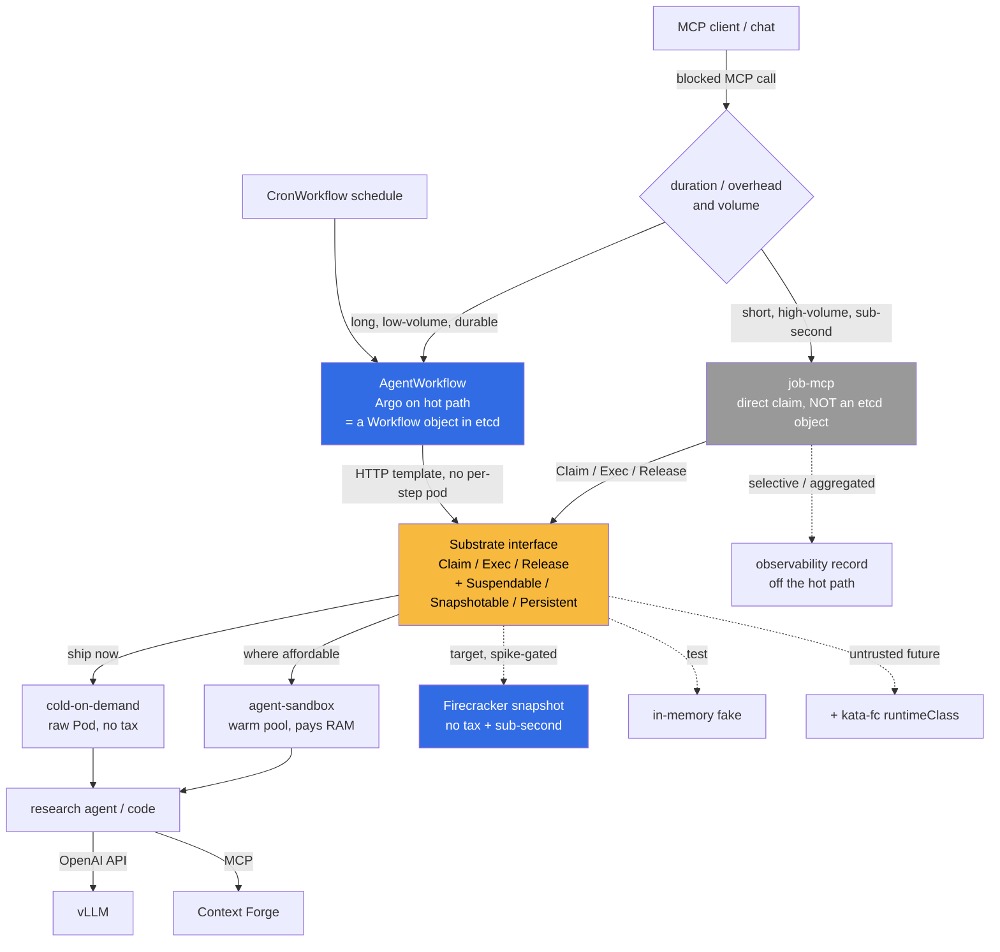

# ADR 019: Substrate Executor Interface and AgentWorkflow over Argo

**Author:** jomcgi
**Status:** Accepted
**Created:** 2026-06-21
**Revisits:** 015 - Temporal as Orchestration Substrate (its dismissal of warm pools as "not load-bearing")
**Superseded in part:** [022 - Firecracker Snapshot/Restore Controller](022-firecracker-snapshot-restore-controller.md) decision 6 drops the `AgentWorkflow` (Argo Workflows) hot-path framing for the snapshot-managed agent-thread tier, in favour of the Postgres-reconcile controller (the `job-mcp` branch). Argo Workflows is retained only for batch CronWorkflows and optional future multi-agent DAG fan-out above the controller.
**Builds on:** [014 - AX + Substrate Agent Runtime](014-ax-substrate-agent-runtime.md) (the executor abstraction, not its rejected implementations), [security/003 - gVisor RuntimeClass](../security/003-gvisor-runtime-class.md)

---

## Problem

Agent dispatch has a lineage of reversals:

- [ADR 014](014-ax-substrate-agent-runtime.md) adopted **google/ax** (runtime) + **agent-substrate/substrate** (warm-pool actor multiplexer). Both were pre-1.0; the homelab would have been their production validation surface.
- ADR 015 superseded 014 and chose **Temporal**, on three grounds: the upstreams were too immature, "the substrate abstraction we needed turns out to be smaller than two upstream projects", and (the conclusion this ADR revisits) **"multiplexing isn't load-bearing for current workloads"** because they were bounded-concurrency batch jobs, never idle actors waiting on events.
- Temporal was subsequently decommissioned (2026-06-14) and the live agent-job substrate landed on **Argo Workflows** (`monolith-workflows`, monolith as control plane via Hera + the K8s API), running batch CronWorkflows (worldcup sim, knowledge-graph jobs).

A new workload now exists that 015's batch-only premise did not anticipate: **synchronous, caller-blocked MCP dispatch.** A chat or agent issues an MCP call that runs a research agent or executes trusted code, and **blocks** on the response. The work itself is tens of seconds to a couple of minutes. The pain is not the work; it is the **cold pod schedule** in front of it: scheduling a pod (and, on a full node, waiting for the cluster autoscaler) adds a large, highly variable latency that a blocked caller feels directly.

Beyond that concrete workload there is an ambition: if dispatch could be made **sub-second**, it would unlock a much wider class of uses (every chat turn or tool call cheaply spinning isolated compute). That ambition is what forces the hard questions this ADR has to answer honestly, because sub-second collides with two properties of the Argo model: its control-loop latency and, at volume, its etcd write rate.

So the task is to capture the warm-dispatch value without re-adopting the twice-superseded AX/Substrate code, without coupling to a single executor, and without pretending Argo scales to sub-second-at-volume when its storage model says otherwise.

---

## Decision

Three structural decisions, then the two axes that route a job.

**1. Keep Argo Workflows as the orchestration plane for the durable, manageable tier.** It won over Temporal in practice (partly by attrition: Temporal was decommissioned), it is mature, and its CronWorkflow / Workflow semantics are familiar. For tens-of-seconds-to-minutes jobs at low volume, Argo's reconcile overhead is noise against the job duration even when a caller is blocked.

**2. Define our own thin `Substrate` executor interface.** This reclaims the abstraction ADR 015 correctly identified as small and then threw away with the implementations. A minimal core plus optional capability interfaces:

```go
// Core: every executor satisfies this.
type Substrate interface {
    Claim(ctx, ClaimSpec) (Handle, error)     // acquire an isolated env (cold, warm, or restored)
    Exec(ctx, Handle, Request) (Stream, error) // run work, stream output
    Release(ctx, Handle) error                 // return/destroy
}

// Optional capabilities an executor advertises; consumers type-assert.
type Suspendable interface{ Suspend(Handle) error; Resume(Handle) error }
type Snapshotable interface{ Snapshot(Handle) (SnapshotRef, error); Restore(SnapshotRef) (Handle, error) }
type Persistent interface{ /* durable volumes survive Release */ }
```

The capability seam keeps the interface from being a leaky rename of agent-sandbox: snapshot/restore is a `Snapshotable` capability the core never requires, so agent-sandbox is not forced to fake it and a Firecracker backend is not forced to hide it. The interface is proven by shipping a second implementation (a raw-`Pod`/`Job` executor) plus an in-memory test fake alongside impl #1, so we learn immediately if the interface only expresses agent-sandbox. The fake also lets the consumers be tested with no cluster, which matters given this repo has no local test loop.

The **harness** that runs inside the executor is a separate seam and is out of scope here: `Exec` runs an opaque process and streams its output, so the harness (Goose recipes today, the Claude CLI subprocess elsewhere) is a property of the workload image, not the platform. Goose stays for now; whether to keep it versus a thinner runner is a distinct decision governed by ADR 010, and nothing in this ADR is coupled to it. The crux for that future evaluation is single-provider versus genuinely multi-provider use, and the recipe format you value is separable from Goose-the-runtime.

**3. The executor is a sequence, not a single choice, and the `Substrate` seam makes the sequence throwaway-free for consumers.**

| Executor                                            | Memory tax                 | Latency                       | Status                                                                             |
| --------------------------------------------------- | -------------------------- | ----------------------------- | ---------------------------------------------------------------------------------- |
| **Cold-on-demand** (raw Pod, no pool)               | none                       | cold start per call (seconds) | **Ship now.** Zero idle RAM; tolerable for the tens-of-seconds workload            |
| **Warm pod pool** (agent-sandbox `SandboxWarmPool`) | standing RAM per image     | sub-second claim              | Middle option where affordable and sub-second is needed before snapshots land      |
| **Firecracker snapshot** (`Snapshotable`)           | disk + RAM only while live | sub-second restore            | **Target end state.** No-tax and sub-second together; gated on a feasibility spike |

The key realization on "ideal": no-memory-tax and sub-second come from different places. Avoiding the tax means **not keeping things warm** (cold-on-demand, free today). Sub-second means **not cold-starting** (warm pool, paid in RAM; or snapshot, paid in integration effort). Firecracker is the only executor that delivers both at once, which is exactly why it is the target _and_ the most ambitious. We get the no-tax property immediately by not pooling, and pursue the conjunction (no-tax + sub-second) via snapshots as the end state.

**The two axes that route a job:**

- **Duration / orchestration-overhead** decides whether Argo can sit on the hot path. Long job: yes, overhead is noise. Short job: Argo's overhead is a large fraction.
- **Volume** decides whether a job may be a first-class Argo `Workflow` object at all (see the etcd ceiling below). Low volume: yes. High volume: no.

| Aspect                        | Today (Argo, cold pods) | Decided                                                                                                        |
| ----------------------------- | ----------------------- | -------------------------------------------------------------------------------------------------------------- |
| Orchestration (durable tier)  | Argo Workflows          | Argo Workflows (unchanged)                                                                                     |
| Executor coupling             | Direct pod-per-step     | `Substrate` interface (core + capabilities)                                                                    |
| Executor (now)                | cold schedule per run   | cold-on-demand; warm pool / Firecracker snapshot added behind the seam                                         |
| Durable tier                  | CronWorkflow / Workflow | `AgentWorkflow`: Argo on the hot path, steps are HTTP templates into the claimed executor                      |
| High-volume / sub-second tier | n/a                     | `job-mcp`: direct claim, **not** an etcd-backed Workflow object; selective/aggregated mirror for observability |
| Isolation                     | host kernel (runc)      | trusted today; `runtimeClassName: kata-fc` (Firecracker microVM) when untrusted arrives                        |

---

## Architecture



### Sub-second and the etcd ceiling (the load-bearing constraint)

Argo stores every `Workflow` as a Kubernetes CRD, and every CRD lives in the cluster's **shared etcd**. Three intrinsic consequences, confirmed by Argo's own scaling docs:

1. **Write amplification.** Each state transition (node starts, completes, status update) is a Raft-consensus write. Workflow throughput is bounded by etcd write throughput.
2. **Object-size limit.** etcd caps objects near 1MB, which is _why_ Argo added status compression and node-status offload to an external SQL DB. Those features are evidence of the ceiling.
3. **Noisy-neighbor.** Argo does not get its own etcd; it shares the one backing every pod, service, and controller. Argo-at-volume degrades the whole cluster's control plane, not just Argo.

This produces an over-constrained triangle: **sub-second x high-volume x full-Argo-semantics-per-job.** Pick two. Live workflow state _is_ etcd state (archive/offload only help completed or oversized workflows, not the write rate of live small ones), so there is no Argo config that keeps every high-volume job a first-class Workflow object without approaching the etcd ceiling. The sub-second ambition _is_ a high-write-rate regime: lower latency invites more calls, more calls means more etcd writes.

The resolution is to **tier by volume**: durable, multi-step, manageable jobs become Argo `Workflow` objects (low volume, etcd-fine); high-volume sub-second interactive jobs dispatch directly and are _not_ made into etcd objects, mirrored selectively or in aggregate for observability. This converges with the latency analysis from the opposite direction: both the reconcile floor and the etcd write rate say the high-volume sub-second hot path should not traverse Argo's CRD lifecycle.

### Tuned low-latency Argo dispatch (for the durable tier)

The earlier draft asserted an "irreducible 1 to 2 second" Argo floor. That is a **production-scale** figure (loaded etcd, queue contention, cold agent pods), not a fundamental limit. At single-tenant homelab scale, the dispatch path is event-driven (informers, not polling), and the control-plane overhead for a single or few-step workflow is plausibly **100 to 300ms**, pending measurement. The levers that matter:

- **Do not schedule a step pod.** An HTTP (or Plugin) template calls the executor via the per-workflow agent pod; no per-step pod is created. A `container` template always creates a pod.
- **`DEFAULT_REQUEUE_TIME` (default 10s).** If a step waits by polling (for example a `resource` template `successCondition` on a claim), Argo re-checks at this interval, turning a millisecond bind into a 10-second wait. Tune to ~100-250ms or avoid polling waits. This is the single biggest hidden latency.
- **Warm agent pod.** Cold spin-up is ~1-2s one-time; keep one warm or track the global-agent-pod direction ([argo-workflows#7891](https://github.com/argoproj/argo-workflows/issues/7891)).
- **`--workflow-workers`, client `--qps`/`--burst`, fast etcd (local NVMe), submit the CR directly to the API server** (skip the Argo Server hop).

Whether this actually reaches sub-second at our scale is a measurement, not an assertion (see Open Questions). Each state transition is one reconcile cycle, so sub-second is a single/few-step property; deep DAGs add up.

### Firecracker snapshot: the target executor, with honest catches

Snapshot/restore is ideal because it gives no-memory-tax and sub-second together, which is why E2B, Fly Machines, and Modal all use it. Three things are not free:

1. **The tax transforms, it does not vanish.** RAM becomes disk (a snapshot is roughly the VM's memory image, hundreds of MB to GB per image) plus RAM only while a VM is live. The famous ~5ms resume is the snapshot-already-in-page-cache number; a genuinely cold restore reads the image from disk (~100s of ms on NVMe). Still sub-second, not 5ms.
2. **Snapshots must be taken at a quiescent point.** This is ADR 014's open question #2: a snapshot freezes memory, so live TCP connections (vLLM, MCP gateway, Postgres) are dead on restore. You snapshot a "ready, idle, will-reconnect" state and the harness needs reconnect logic; you cannot snapshot mid-completion.
3. **agent-sandbox does not expose snapshots today.** This is a multi-week integration (Kata-fc VM templating, firecracker-containerd with custom snapshot orchestration, or upstreaming), with hardware unknowns. It is the most ambitious path with the least turnkey support.

### Trust axis

Workloads are **trusted today** (no external jobs), so no VM isolation is required and cold-on-demand or a warm pool is sufficient. When untrusted/external work arrives, isolation flips from optional to mandatory and the seam absorbs it additively: `runtimeClassName: kata-fc` gives Firecracker microVM isolation with no executor change, and a `Snapshotable` executor can be added for the no-tax sub-second case. Neither touches the `AgentWorkflow` or `job-mcp` consumers.

---

## Execution shape

Latency is not critical today, so the work splits into two independent tracks. The `Substrate` seam is what lets them run separately: the MVP ships the cold-on-demand executor, the PoC swaps in a different executor, and the `AgentWorkflow` consumer is unchanged across both. (The `AgentWorkflow` name overlaps with Argo's internal "agent" pod; the overlap is accepted as low-risk.)

**MVP (ship): consolidate the durable tier onto Argo Workflows.** Move remaining batch and scheduled jobs onto `AgentWorkflow` with the cold-on-demand executor and Argo on the hot path. No streaming is required for the current use case, which keeps the MVP small. The payoff is deprecating a large amount of older dispatch and scheduling tooling, so this track earns its keep on simplification alone, independent of any sub-second ambition.

**PoC (explore): Firecracker executor under `AgentWorkflow` semantics.** Prove hot / warm / instant scheduling: a `Snapshotable` Firecracker executor behind the same `Substrate` interface, validating sub-second restore, snapshot disk cost, and the quiescent-snapshot / reconnect pattern (Open Questions 1 and 2). Gated and non-blocking; it informs whether the instant-scheduling end state is viable without holding up the MVP.

---

## Alternatives Considered

- **Re-adopt google/ax + agent-substrate/substrate (ADR 014).** Rejected: twice-superseded, pre-stability. We keep the abstraction, not the code.
- **Port the Argo _interface_ onto a faster/non-etcd backend.** There is no drop-in: the Argo interface _is_ Kubernetes CRDs, so live state is etcd state. The honest levers are narrow: (a) a **dedicated-etcd vcluster** isolates Argo's writes off the host etcd, containing the noisy-neighbor blast radius but _not_ raising etcd's write ceiling (the bottleneck is moved, not lifted); (b) Argo **node-status offload** to Postgres relieves object-size and churn, not write rate; (c) Argo's own at-scale story is **horizontal partitioning** (multiple controllers sharded by namespace, or multiple clusters), not a bigger single backend. **KINE (etcd-on-SQL) is explicitly rejected**: its poll-based watch and k3s/edge orientation make it slower than etcd under high churn, not a sustainable way to run a control plane at scale. The takeaway sharpens the core decision: you cannot keep Argo's CRD interface and raise its throughput ceiling, so raising the ceiling means leaving the CRD model (Flyte / Temporal / custom), which is exactly the tiering conclusion.
- **Flyte.** A workflow orchestrator that is Postgres-native by design (metadata in its own DB, k8s for execution), built to scale past CRD-per-workflow systems. Rejected for now: a different interface and a second engine to operate; revisit only if the durable tier itself outgrows Argo.
- **Temporal (own DB).** The decommissioned ADR 015 choice, and genuinely stronger on the one axis this ADR flags (workflow state in sharded Postgres, decoupled from etcd). Not reintroduced; noted honestly as the dimension where going back to Argo was a regression.
- **Bypass Argo for all caller-blocked dispatch.** Rejected as a blanket rule: for long, low-volume jobs Argo's durability and observability are worth keeping. Bypass is scoped to the high-volume sub-second tier, justified by both latency and etcd write rate.
- **Warm worker pool with in-process isolation.** Held in reserve: sub-millisecond routing, but isolation is in-process, so it is unsafe the moment work becomes untrusted.
- **WebAssembly / WASI.** Rejected for general use: near-instant start but a restricted runtime that cannot run an arbitrary CLI or a full agent harness.
- **Managed sandboxes (E2B / Modal / Daytona).** Rejected as the primary path (in-cluster on our hardware is the goal); they remain a candidate `Substrate` adapter.
- **Hardwire agent-sandbox with no interface.** Rejected: a leaky single-impl design with no test fake and no room for cold-on-demand / Kata / Firecracker.

---

## Security

Baseline in `docs/security.md`. Deviations and notes:

- **Trusted-only today.** Harnesses are our own; no VM boundary required yet. A standing assumption, not permanent.
- **Isolation path for untrusted work** is pre-designed: gVisor (`runsc`) per [security/003](../security/003-gvisor-runtime-class.md) and/or Kata Firecracker via `runtimeClassName`. Adopting untrusted execution is gated on this boundary being in place first.
- **Clean isolation by construction** (warm pool): a `SandboxClaim` adopts a fresh pod and destroys it on release while the pool replenishes a clean one. Verify the controller destroys rather than recycles (Open Questions).
- **Snapshots are never load-bearing.** Snapshot memory is ephemeral; durable state always lives in monolith Postgres, echoing ADR 014.
- **Memory is the binding cluster resource.** Cold-on-demand spends none; warm pools spend standing RAM per image; snapshots trade RAM for disk. The executor sequence is partly a memory-budget decision.
- **No new ingress.** Dispatch stays internal; external access continues through monolith and Cloudflare.

---

## Risks

| Risk                                                                                       | Likelihood | Impact | Mitigation                                                                                                                                                                                                                                                                  |
| ------------------------------------------------------------------------------------------ | ---------- | ------ | --------------------------------------------------------------------------------------------------------------------------------------------------------------------------------------------------------------------------------------------------------------------------- |
| etcd write rate from high-volume sub-second jobs degrades the shared cluster control plane | Medium     | High   | Tier by volume: high-volume jobs are not Workflow objects. If the durable tier itself grows, a dedicated-etcd vcluster contains the blast radius (not the ceiling); raising the ceiling means Flyte/Temporal. Invisible in dashboards until cluster-wide, so watch it early |
| `Substrate` interface becomes a single-impl rename of agent-sandbox                        | Medium     | Medium | Ship cold-on-demand + a test fake alongside impl #1; the interface must express all of them                                                                                                                                                                                 |
| Firecracker snapshot integration is multi-week and may not mature on our hardware          | Medium     | Medium | Gate it behind a feasibility spike; cold-on-demand ships value meanwhile; warm pool is the fallback for sub-second-where-affordable                                                                                                                                         |
| Warm pools cost standing RAM on a memory-bound cluster                                     | High       | Medium | Prefer cold-on-demand for long jobs; reserve warm/snapshot for where sub-second is genuinely needed                                                                                                                                                                         |
| Tuned Argo still misses sub-second at our scale                                            | Medium     | Low    | It is a measurement, not an assertion; if it misses, the high-volume tier already bypasses Argo                                                                                                                                                                             |
| Trust assumption silently outlives "trusted only"                                          | Medium     | High   | Untrusted adoption gated on Kata/gVisor isolation first                                                                                                                                                                                                                     |
| agent-sandbox is pre-1.0 and APIs may shift                                                | Medium     | Low    | One impl behind the interface; blast radius is one adapter                                                                                                                                                                                                                  |

---

## Open Questions

These are answered during execution, not gates on the decision.

1. **Argo-tuning spike (cheap, first).** Measure p50/p99 submit-to-first-byte at homelab scale with a tuned controller (low `DEFAULT_REQUEUE_TIME`, warm agent pod, HTTP template into a stub). Does the orchestrator half reach sub-second? This gates whether Argo can stay on the hot path for short jobs.
2. **Firecracker feasibility spike (multi-week, second).** Sub-second restore of an initialized harness on bare-metal KVM? Snapshot disk cost per image? The quiescent-snapshot + reconnect pattern? Copy-on-write fan-out for concurrent restores?
3. At what job volume does the etcd write rate become a concern at our scale, and is a dedicated-etcd vcluster (noisy-neighbor isolation only) worth pre-empting it before the durable tier itself would need Flyte/Temporal?
4. What fraction of jobs genuinely need to be first-class Workflow objects versus direct-dispatch with aggregated observability?
5. Does the agent-sandbox `SandboxClaim` controller destroy-and-replenish on release, or recycle a used pod?
6. For untrusted work later, is Kata Firecracker via RuntimeClass sufficient, or is a dedicated `Snapshotable` executor warranted?

---

## References

| Resource                                                                                                        | Relevance                                                                                                                                                     |
| --------------------------------------------------------------------------------------------------------------- | ------------------------------------------------------------------------------------------------------------------------------------------------------------- |
| [014 - AX + Substrate Agent Runtime](014-ax-substrate-agent-runtime.md)                                         | Origin of the executor abstraction; implementations rejected                                                                                                  |
| 015 - Temporal as Orchestration Substrate                            | Dismissed warm pools; stronger on etcd decoupling; this ADR revisits both                                                                                     |
| 007 - Agent Run Orchestration Service                                              | Earlier dispatch plumbing, retired                                                                                                                            |
| [security/003 - gVisor RuntimeClass](../security/003-gvisor-runtime-class.md)                                   | Isolation boundary for the untrusted future                                                                                                                   |
| [kubernetes-sigs/agent-sandbox](https://github.com/kubernetes-sigs/agent-sandbox)                               | `Substrate` impl: Sandbox / SandboxClaim / SandboxWarmPool                                                                                                    |
| [Argo: Running at Massive Scale](https://argo-workflows.readthedocs.io/en/latest/running-at-massive-scale/)     | Argo's own acknowledgement of the etcd ceiling                                                                                                                |
| [Argo: Offloading Large Workflows](https://argo-workflows.readthedocs.io/en/latest/offloading-large-workflows/) | node-status offload to Postgres/MySQL; evidence of the object-size limit                                                                                      |
| [argo-workflows#7891](https://github.com/argoproj/argo-workflows/issues/7891)                                   | Global agent pod direction; removes the per-workflow agent-pod floor                                                                                          |
| [vCluster (dedicated control plane)](https://www.vcluster.com/docs/)                                            | A dedicated-etcd vcluster isolates Argo's noisy-neighbor blast radius; it does not raise the write ceiling, and KINE-on-SQL is not a sustainable scale answer |
| [Flyte](https://flyte.org/)                                                                                     | Postgres-native workflow orchestrator; the alternative if the durable tier outgrows Argo                                                                      |
| [Kata Containers](https://katacontainers.io/)                                                                   | Firecracker microVM as a K8s RuntimeClass; isolation without a new executor                                                                                   |
| [Firecracker](https://firecracker-microvm.github.io/)                                                           | Sub-second microVM snapshot/restore; the `Snapshotable` target backend                                                                                        |
