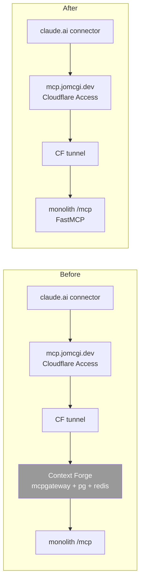

# ADR 020: Deprecate Context Forge, Serve MCP Directly from the Monolith

**Author:** jomcgi
**Status:** Superseded by [059 - Authentik Federates MCP Identity; the Monolith Serves MCP Directly](059-authentik-federates-monolith-serves-mcp.md)
**Created:** 2026-06-23
**Supersedes:** [003 - Context Forge](003-context-forge.md)
**Relates to:** [006 - OIDC Auth MCP Gateway](006-oidc-auth-mcp-gateway.md) (auth has since moved to the Cloudflare Access edge), [019 - Substrate Executor + AgentWorkflow](019-substrate-executor-agentworkflow.md) (the agent-platform deprecation that removed the other MCP consumers)

---

## Problem

[ADR 003](003-context-forge.md) adopted Context Forge (IBM `mcpgateway`) as a federating MCP gateway: many MCP servers behind one endpoint, RBAC-scoped toolsets per agent team, tool-registration validation, and an OAuth flow. That made sense when the agent platform had several MCP consumers and the gateway was the natural seam for auth and federation.

That world is gone. After the agent-platform deprecation (the teardown following [ADR 019](019-substrate-executor-agentworkflow.md)), three things are now true:

1. **Auth is at the edge, not in the gateway.** `mcp.jomcgi.dev` is gated by Cloudflare Access (Zero Trust); Context Forge trusts the Cloudflare-authenticated request and adds no auth of its own.
2. **There is exactly one backend.** The monolith is the only connected MCP server. The federation that justified a gateway has nothing left to federate.
3. **The monolith already serves MCP itself.** `app/main.py` mounts `FastMCP("Monolith")` at `/mcp`. A direct port-forward probe returns `HTTP 200`, `content-type: text/event-stream`, and a valid MCP SSE handshake. No gateway is required for the protocol to work.

So Context Forge is now single-backend pass-through middleware: no federation value, no auth value, and a standing operational cost, it caches tool catalogs and does not auto-refresh them, so new or edited monolith tools stay invisible until a manual gateway refresh (see the Context Forge tool-refresh reference). It earns its removal the same way the agent platform did, except it is live infrastructure, so this is a migration, not a delete.

---

## Decision

**Deprecate Context Forge. Serve the monolith's MCP directly.** The path becomes `claude.ai connector` to `mcp.jomcgi.dev` (Cloudflare Access, unchanged) to the Cloudflare tunnel to the monolith's `/mcp` endpoint, with Context Forge removed from the path entirely. Then delete Context Forge (`mcpgateway` + its Postgres + Redis), the orphaned `mcp-oauth-proxy` service, and the `mcp` namespace.

**Execution is deferred.** This ADR records the decision and a validated migration plan. The live `mcp.jomcgi.dev` route is not touched by this ADR.

| Aspect               | Today (via Context Forge)                                                 | Decided (direct)                                            |
| -------------------- | ------------------------------------------------------------------------- | ----------------------------------------------------------- |
| Auth                 | Cloudflare Access at the edge                                             | Cloudflare Access at the edge (unchanged)                   |
| Gateway              | Context Forge federates one backend                                       | None; the monolith is the endpoint                          |
| Tool names           | `monolith-<fn-with-hyphens>` (CF prefixes `monolith-` and swaps `_`->`-`) | native FastMCP names (the function names, with underscores) |
| Tool-catalog refresh | manual POST after every tool change                                       | not applicable; the monolith is the source of truth         |
| Services to run      | mcpgateway + Postgres + Redis (+ a dead oauth-proxy)                      | none                                                        |

### Validated facts (probed from the cluster)

- The monolith `/mcp` SSE endpoint is alive and speaks the protocol (`200`, `text/event-stream`, `event: endpoint` handshake) with Context Forge out of the path.
- There are **41** MCP tools, all registered with `@mcp.tool` (no explicit `name=`), so their MCP names are the function names.
- Context Forge's only transform is name-mangling: native `search_knowledge` is exposed as `monolith-search-knowledge`; native `monolith_agent_notify` becomes the double-prefixed `monolith-monolith-agent-notify`. So the rename is **deterministic**: strip the `monolith-` gateway prefix and convert `-` back to `_`. No per-tool judgment is needed; the full map can be generated mechanically and applied to the claude.ai connector config and the routine YAMLs.

---

## Architecture

### Migration plan (deferred execution)

1. **Resolve transport.** The monolith mounts FastMCP over **SSE**; switch it to **streamable-HTTP** (`http_app(transport="http", ...)`, a one-line change and the transport modern claude.ai connectors prefer), or validate the SSE endpoint via a throwaway parallel test connector. The curl probe confirms the server side; only the claude.ai client handshake is unverified, and streamable-HTTP removes that risk.
2. **Repoint the route.** Change the `mcp.jomcgi.dev` Cloudflare tunnel backend from the Context Forge service to the monolith service `/mcp`. Cloudflare Access on the hostname is untouched.
3. **Rename the 41 tools** in the claude.ai connector and every routine YAML in `projects/monolith/claude_routines/` (and the CLAUDE.md references), using the deterministic CF-to-native map.
4. **Validate end to end** by firing a routine against the direct endpoint.
5. **Delete Context Forge:** the `mcpgateway` chart (gateway + Postgres + Redis), the dead `mcp-oauth-proxy` service, and the `mcp` namespace, with the same finalizer-first / cascade discipline used in the agent-platform teardown.

---

## Alternatives Considered

- **Keep Context Forge.** Rejected: single-backend pass-through with no auth or federation value, plus the standing manual tool-refresh cost.
- **Build a name-compatibility shim** (make the monolith emit the CF-mangled names so nothing renames). Rejected: it preserves cruft to avoid a one-time deterministic rename; the native names are cleaner and the rename is mechanical.
- **Weighted traffic split (Envoy `HTTPRoute`) as a canary.** Rejected: the two backends are **not interchangeable**, they expose different tool names (and possibly different transports), so a 50/50 split would make routines fail on whichever half lacked the expected tool. MCP sessions are sticky (long-lived SSE), so it is per-session roulette, not a clean validation. A parallel test connector gives the same safety without the equivalence problem, and a single-user audience does not need production traffic splitting.

---

## Security

Baseline in `docs/security.md`. No new exposure:

- **Auth is unchanged.** Cloudflare Access remains on `mcp.jomcgi.dev` at the edge, gating every request before it reaches the cluster. This is already where auth lives; Context Forge only trusted it.
- **The monolith `/mcp` stays internal.** It is reachable only through the Cloudflare-gated tunnel, exactly as Context Forge was; removing the gateway does not put it on the public internet.
- ADR 006's gateway-level OIDC is superseded by edge auth, which is already the operative reality.

---

## Risks

| Risk                                                                             | Likelihood | Impact | Mitigation                                                                                                                             |
| -------------------------------------------------------------------------------- | ---------- | ------ | -------------------------------------------------------------------------------------------------------------------------------------- |
| claude.ai connector cannot use the monolith's SSE transport directly             | Medium     | Medium | Switch the monolith to streamable-HTTP (one line) or validate SSE with a parallel test connector before repointing                     |
| Routine breakage from the tool rename                                            | Medium     | Medium | The CF-to-native map is deterministic; apply it to all routines + the connector, then validate a routine before deleting Context Forge |
| Cutover leaves `mcp.jomcgi.dev` pointing at a missing backend mid-flight         | Low        | High   | Repoint and rename atomically; keep Context Forge running until a routine fires against the direct endpoint                            |
| A second gateway (e.g. a GitHub MCP server) turns out to depend on Context Forge | Low        | Low    | The monolith is the only connected backend today; confirm before deletion                                                              |

---

## Open Questions

1. Streamable-HTTP versus SSE as the final monolith MCP transport. Lean: streamable-HTTP, for connector compatibility.
2. Is any non-monolith gateway (the GitHub gateway noted in CLAUDE.md) actually in use? If not, it goes with Context Forge; if so, it needs a home first.
3. Does the claude.ai connector need re-registration (new URL/transport) or only a settings edit, when the backend changes?

---

## References

| Resource                                                                            | Relevance                                                           |
| ----------------------------------------------------------------------------------- | ------------------------------------------------------------------- |
| [003 - Context Forge](003-context-forge.md)                                         | The gateway being deprecated                                        |
| [006 - OIDC Auth MCP Gateway](006-oidc-auth-mcp-gateway.md)                         | Gateway-level auth, superseded by Cloudflare Access at the edge     |
| [019 - Substrate Executor + AgentWorkflow](019-substrate-executor-agentworkflow.md) | The agent-platform deprecation that removed the other MCP consumers |
| `projects/monolith/app/main.py`                                                     | Mounts `FastMCP("Monolith")` at `/mcp` (the direct endpoint)        |
| `projects/monolith/claude_routines/`                                                | The routine YAMLs whose tool references the rename touches          |
