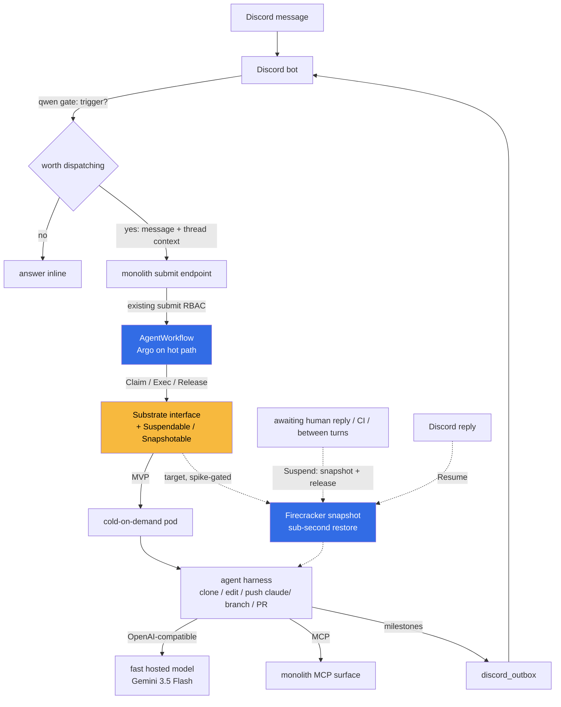

# ADR 021: Discord-Triggered AgentWorkflow with a Fast Hosted Model and Snapshot/Resume for Smooth Multi-Thread Work

**Author:** jomcgi
**Status:** Draft
**Created:** 2026-06-26
**Superseded in part:** [022 - Firecracker Snapshot/Restore Controller](022-firecracker-snapshot-restore-controller.md) decision 6 drops the `AgentWorkflow` (Argo Workflows) hot-path framing for the snapshot-managed agent-thread tier, in favour of the Postgres-reconcile controller (the `job-mcp` branch). Argo Workflows is retained only for batch CronWorkflows and optional future multi-agent DAG fan-out above the controller.
**Builds on:** [019 - Substrate Executor + AgentWorkflow over Argo](019-substrate-executor-agentworkflow.md) (consumes its `AgentWorkflow` tier and `Snapshotable` executor), [003 - Context Forge](003-context-forge.md) / [020 - Deprecate Context Forge](020-deprecate-context-forge-mcp-gateway.md) (MCP surface), [security/003 - gVisor RuntimeClass](../../../projects/platform/ARCHITECTURE.md) (isolation prerequisite)
**Relates to:** [services/002 - Discord Chat Automation](../services/002-discord-chat-automation.md) (the bot this rides on)

---

## Problem

We want the Discord bot to act as a thin front door for coding work: a message arrives, a cheap local gate decides "is this a task worth dispatching", and if so the full context is handed to an agent that does the work (clone, edit, push a `claude/` branch, open a PR) and narrates progress back to the channel. The appeal is a pass-through: the bot makes one small decision, the agent decides what to actually do.

Two paths were evaluated for the agent half.

**claude.ai routines (the `/fire` API).** A routine's API trigger does accept run context (a freeform `text` field, up to 65,536 chars, passed alongside the saved prompt), so the trigger-with-context shape works. But the routines surface is fire-and-narrate only: `/fire` returns once the session is created, there is no status endpoint, no output stream, and no way to inject a follow-up into a running session. Each `/fire` is a fresh session. Steering a live run, or watching many runs progress, is not available on that surface. (The Claude Platform "managed agents" API does offer an SSE event stream, status webhooks, and mid-run steering, but it is a different product with workspace-key billing and is not packaged around the clone/branch/PR coding loop.)

**Self-hosted on our own substrate.** [ADR 019](019-substrate-executor-agentworkflow.md) already defines the machinery: an `AgentWorkflow` tier (Argo on the hot path, steps as HTTP templates into a claimed executor) behind a thin `Substrate` interface, with a `Snapshotable` Firecracker executor as the target end state. The monolith already holds Argo submit RBAC (`monolith-submit-rbac.yaml`, the `monolith-workflows` namespace, Kyverno secret cloning). So self-hosting the agent half is mostly wiring a new consumer onto seams that exist.

The deciding factor is the experience we want: **many concurrent agent threads that feel smooth and interactive.** A Discord-fronted coding agent is inherently multi-threaded and bursty: several tasks in flight, most of them idle most of the time (waiting on CI, waiting on a human reply, between agent turns). claude.ai gives us no control over that lifecycle. Our own substrate, specifically 019's snapshot/resume executor, lets an idle thread cost almost nothing and resume in sub-second time when it wakes. That is the property that makes "working on many threads" feel smooth rather than like managing a queue of cold-starting pods. This ADR records the decision to build the Discord pass-through as a consumer of 019's substrate, and the two choices that fall out of it: the driver model, and the lifecycle that snapshot/resume enables.

---

## Decision

Three decisions.

**1. The Discord bot becomes a new `AgentWorkflow` consumer.** A qwen gate in the bot (the local llama.cpp model already used for vision, per `chat/vision.py`) makes the binary trigger / do-not-trigger call. On trigger, the bot posts the message plus thread context to a monolith endpoint, which submits an `AgentWorkflow` through the existing monolith to Argo submit path. The agent runs, and narrates milestones back through the existing `discord_outbox` (the same path `monolith-agent-notify` uses). The bot is a new caller of an existing tier, not new orchestration. qwen is the gate only; it does not drive the coding.

**2. The coding driver is a fast hosted model (Gemini 3.5 Flash), not self-hosted vLLM.** The harness inside the executor calls an OpenAI-compatible endpoint, and the model is a config knob, not a hardcode. We start with a fast, cheap, capable hosted model for the actual coding loop. This is a deliberate divergence from the self-hosted-vLLM assumption baked into [ADR 014](014-ax-substrate-agent-runtime.md) and 019, taken because a Discord-interactive agent is latency-sensitive in a way the batch jobs were not, and because a hosted model avoids standing RAM for weights on a memory-bound cluster. The model identity is not load-bearing: the OpenAI-compatible seam lets us route per task (qwen for the gate, a fast hosted model for coding, a self-hosted model later if economics or privacy demand it).

**3. Smoothness across many threads is delivered by 019's `Snapshotable` Firecracker executor, not by keeping threads warm.** An idle thread (awaiting a human reply, awaiting CI, between turns) is snapshotted and its live compute released; when it resumes, the microVM is restored in sub-second time. This is the conjunction 019 calls the target end state: no standing memory tax and sub-second resume together. It is the mechanism that lets a dozen half-finished Discord threads coexist cheaply and each wake instantly. Per 019, Firecracker is gated on a feasibility spike, so the **MVP ships on the cold-on-demand executor** and the multi-thread smoothness is the end state this consumer is designed for, not a day-one property.

| Aspect             | Today (claude.ai `/fire` option)   | Decided (this ADR)                                            |
| ------------------ | ---------------------------------- | ------------------------------------------------------------- |
| Trigger            | bot to `/fire` with `text` context | bot (qwen gate) to monolith to `AgentWorkflow` submit         |
| Orchestration      | Anthropic-managed, opaque          | Argo `AgentWorkflow` (ADR 019), in-cluster                    |
| Coding model       | Claude (subscription)              | fast hosted model via OpenAI-compatible seam (config knob)    |
| Status / stream    | none                               | Argo Workflow phase (CRD) + harness self-narration to Discord |
| Live steering      | no (new `/fire` only)              | suspend node + Discord reply resumes the thread               |
| Idle thread cost   | n/a (managed)                      | near-zero via snapshot; live RAM only when running            |
| Resume latency     | n/a                                | sub-second (Firecracker restore, end state); cold pod (MVP)   |
| Inference location | Anthropic                          | hosted Google API (new egress)                                |

---

## Architecture

### Why snapshot/resume is the load-bearing piece for multi-thread feel

A Discord-fronted agent spends most wall-clock time idle, not computing: waiting on CI, waiting for the human to answer a clarifying question, paused between turns. Three ways to hold that idle state, and only one gives both cheap-idle and instant-wake:

- **Cold-on-demand (MVP):** zero idle cost, but every resume is a cold pod schedule (seconds). Fine for a few threads, feels sluggish when juggling many.
- **Warm pool:** sub-second wake, but pays standing RAM per idle thread on a memory-bound cluster. Does not scale to many idle threads.
- **Firecracker snapshot (target):** the idle thread is a disk image, near-zero live cost, restored sub-second. This is the only option where many idle threads stay cheap and each wakes instantly. That is exactly the "smooth across many threads" property we are after.

The suspend points map cleanly onto the human-in-the-loop waits, which also resolves 019's quiescent-snapshot catch (below): the natural moment to snapshot is precisely the idle "awaiting reply / between turns" boundary, never mid-completion.

### The quiescent-snapshot and reconnect catch

Carried forward from [ADR 019](019-substrate-executor-agentworkflow.md) (and 014 before it): a snapshot freezes memory, so any live connection (to the model API, the MCP surface, git remotes) is dead on restore. The harness must snapshot only at a "ready, idle, will-reconnect" boundary and re-establish its connections on resume; it must never snapshot mid-completion. For this consumer the constraint is benign rather than onerous, because the boundaries where we want to suspend (awaiting a human reply, awaiting CI) are already quiescent. The harness needs reconnect logic for the model client and MCP client, and must treat any in-flight model turn as a no-snapshot zone.

### Hosted model vs self-hosted inference

Choosing a hosted model for the coding driver is the most consequential divergence from the surrounding ADRs, which assume in-cluster vLLM. The trade is real in both directions:

| Dimension            | Hosted (Gemini 3.5 Flash)                 | Self-hosted (vLLM)                                   |
| -------------------- | ----------------------------------------- | ---------------------------------------------------- |
| Memory tax           | none (no weights on cluster)              | standing GPU RAM per model, contends with everything |
| Latency / capability | fast, sonnet-class, no warmup             | depends on what we can fit and keep hot              |
| Marginal cost        | per-token to Google                       | sunk hardware, near-zero marginal                    |
| Dependency           | external API, subject to outage and ToS   | fully in our control                                 |
| Network posture      | new egress from the harness pod to Google | trusted internal plane, no new egress                |
| Data exposure        | prompts (repo context) leave the cluster  | stays in-cluster                                     |

The memory-tax avoidance is the strongest pull: 019 frames the executor sequence partly as a memory-budget decision, and a hosted model removes the largest line item entirely while still delivering the speed the snapshot work is meant to exploit. The egress and data-exposure cost is the strongest push back, and is the reason this remains a config knob: nothing in the harness or the `AgentWorkflow` consumer is coupled to Google, so a future move back to self-hosted inference for sensitive repos is an environment change, not a redesign.

---

## Alternatives Considered

- **Stay on claude.ai routines `/fire`.** Rejected as the primary path: no status, no stream, no live steering, and no control over the idle-thread lifecycle that makes multi-thread work smooth. Retained as a fallback for one-shot, fire-and-narrate tasks where a capable managed harness is worth more than control.
- **Claude Platform managed-agents API (SSE stream + status webhooks + steering).** Rejected for now: it provides the stream and steering, but on workspace-key billing and as a general agent runtime not packaged around the clone/branch/PR coding loop; it does not give us the in-cluster snapshot lifecycle that is the point of this decision.
- **Self-hosted vLLM as the coding driver.** Held in reserve, not chosen first: pays standing RAM on a memory-bound cluster and ties the smoothness work to whatever we can keep hot. The OpenAI-compatible seam keeps this a later swap, including a per-repo policy (sensitive repos on self-hosted, the rest on hosted).
- **qwen (the gate model) as the coding driver too.** Rejected: the local vision-tier model is right for the binary trigger decision and wrong for autonomous multi-file coding. Gate and driver are deliberately different models.
- **Warm pool instead of snapshot for idle threads.** Rejected as the end state (standing RAM does not scale to many idle threads), acceptable as an interim where sub-second is needed before Firecracker lands, exactly the sequence 019 sets out.
- **A bespoke non-Argo dispatcher for the bot.** Rejected: 019 already decided Argo is the durable tier and the bot's tasks (minutes-long, low-volume, durable, worth observing) sit squarely in it. A second orchestrator would duplicate the submit path the monolith already owns.

---

## Security

Baseline in `docs/security.md`. Deviations and notes specific to this consumer:

- **New egress to a hosted model API.** This is the material change from the surrounding ADRs' trusted-internal-plane posture. The harness pod needs egress to the Google endpoint; it must be scoped to that host (network policy / allowlist), not opened broadly. The Gemini API key is a `OnePasswordItem`-sourced secret, never hardcoded, scoped to the workflow namespace.
- **Repo context leaves the cluster.** Prompts carry repository content to an external provider. Acceptable for the repos this is enabled on; the model-as-config-knob exists so sensitive repos can be pinned to self-hosted inference instead. Record per-repo enablement explicitly.
- **Trust axis unchanged from 019.** Harnesses are ours today, so cold-on-demand / warm pool suffice and no VM boundary is required. When untrusted input or external callers arrive, isolation flips to mandatory: gVisor (`runsc`, [security/003](../../../projects/platform/ARCHITECTURE.md)) and/or `runtimeClassName: kata-fc` (Firecracker microVM), absorbed additively behind the `Substrate` seam without touching this consumer.
- **Git identity is least-privilege.** The harness pushes only `claude/`-prefixed branches and opens PRs; it does not push to protected branches. This mirrors the constraint claude.ai routines enforce by default.
- **Snapshots are never load-bearing.** Snapshot memory is ephemeral; all durable state (task records, run history) lives in monolith Postgres, echoing 014 and 019. A lost or discarded snapshot loses an in-flight thread's working memory, never committed work.
- **No new ingress.** Dispatch stays internal (Discord to monolith to Argo); external reach continues through the monolith and Cloudflare.

---

## Risks

| Risk                                                                                             | Likelihood | Impact | Mitigation                                                                                                                                                                  |
| ------------------------------------------------------------------------------------------------ | ---------- | ------ | --------------------------------------------------------------------------------------------------------------------------------------------------------------------------- |
| Firecracker snapshot does not mature on our hardware, so the multi-thread smoothness never lands | Medium     | Medium | MVP ships on cold-on-demand and is useful without it; warm pool is the interim for sub-second-where-needed; the smoothness is an end state, not a gate on shipping          |
| A flash-tier model is too weak to drive autonomous multi-file coding reliably                    | Medium     | Medium | Model is a config knob: route harder tasks to a stronger model, keep flash for the gate and simple edits; measure PR success rate per model before committing               |
| Egress of repo context to a hosted provider is unacceptable for some repos                       | Medium     | Medium | Per-repo enablement; self-hosted vLLM remains a drop-in via the OpenAI-compatible seam                                                                                      |
| Reconnect-after-restore bugs corrupt an in-flight thread                                         | Medium     | Low    | Snapshot only at quiescent (between-turns / awaiting-reply) boundaries; durable state in Postgres so a bad restore loses working memory only; never snapshot mid-completion |
| Hosted API outage or ToS change breaks the coding path                                           | Low        | Medium | Fallback to self-hosted inference is an environment change, not a redesign; gate decisions still run locally on qwen                                                        |
| New egress widens the cluster's external surface                                                 | Low        | Medium | Scope egress to the single model host via network policy; key is 1Password-sourced and namespace-scoped                                                                     |
| Bot becomes a high-volume submitter and pressures Argo etcd                                      | Low        | Medium | 019's volume tiering applies: if the bot's rate climbs, route to the `job-mcp` direct-dispatch tier rather than first-class Workflow objects                                |

---

## Open Questions

Answered during execution, not gates on the decision.

1. Which fast hosted model, at what measured PR-success rate versus cost, and where is the capability floor below which a task must escalate to a stronger model?
2. Where does the qwen gate live: a deterministic classifier in the bot, or a short qwen prompt, and how much thread context does it scoop into the `AgentWorkflow` submission?
3. Does the Firecracker feasibility spike from 019 deliver sub-second restore of an initialized harness on our hardware, and what is the per-thread snapshot disk cost when many threads are suspended at once?
4. What is the suspend policy: snapshot after how long idle, evict to disk after how long, and hard-stop a thread after what wall-clock age?
5. How does a resumed thread re-attach to its Discord thread and its git working state (re-clone vs persistent volume) after a restore?
6. Does this consumer need the per-repo self-hosted-inference policy from day one, or can hosted-only ship first with the seam in place for later?

---

## References

| Resource                                                                                                        | Relevance                                                                                      |
| --------------------------------------------------------------------------------------------------------------- | ---------------------------------------------------------------------------------------------- |
| [019 - Substrate Executor + AgentWorkflow over Argo](019-substrate-executor-agentworkflow.md)                   | The tier and `Snapshotable` executor this consumer rides                                       |
| [014 - AX + Substrate Agent Runtime](014-ax-substrate-agent-runtime.md)                                         | Origin of the executor abstraction and the self-hosted-inference assumption this diverges from |
| [security/003 - gVisor RuntimeClass](../../../projects/platform/ARCHITECTURE.md)                                   | Isolation boundary for the untrusted/external future                                           |
| [020 - Deprecate Context Forge](020-deprecate-context-forge-mcp-gateway.md)                                     | The MCP surface the harness calls                                                              |
| [services/002 - Discord Chat Automation](../services/002-discord-chat-automation.md)                            | The bot and outbox this rides on                                                               |
| [Firecracker](https://firecracker-microvm.github.io/)                                                           | Sub-second microVM snapshot/restore, the smoothness mechanism                                  |
| [Kata Containers](https://katacontainers.io/)                                                                   | Firecracker microVM as a RuntimeClass for the untrusted future                                 |
| [Trigger a routine via API](https://platform.claude.com/docs/en/api/claude-code/routines-fire)                  | The claude.ai `/fire` path evaluated and set aside as primary                                  |
| [Managed Agents: session event stream](https://platform.claude.com/docs/en/managed-agents/events-and-streaming) | The managed-agents streaming/steering surface, considered and deferred                         |
