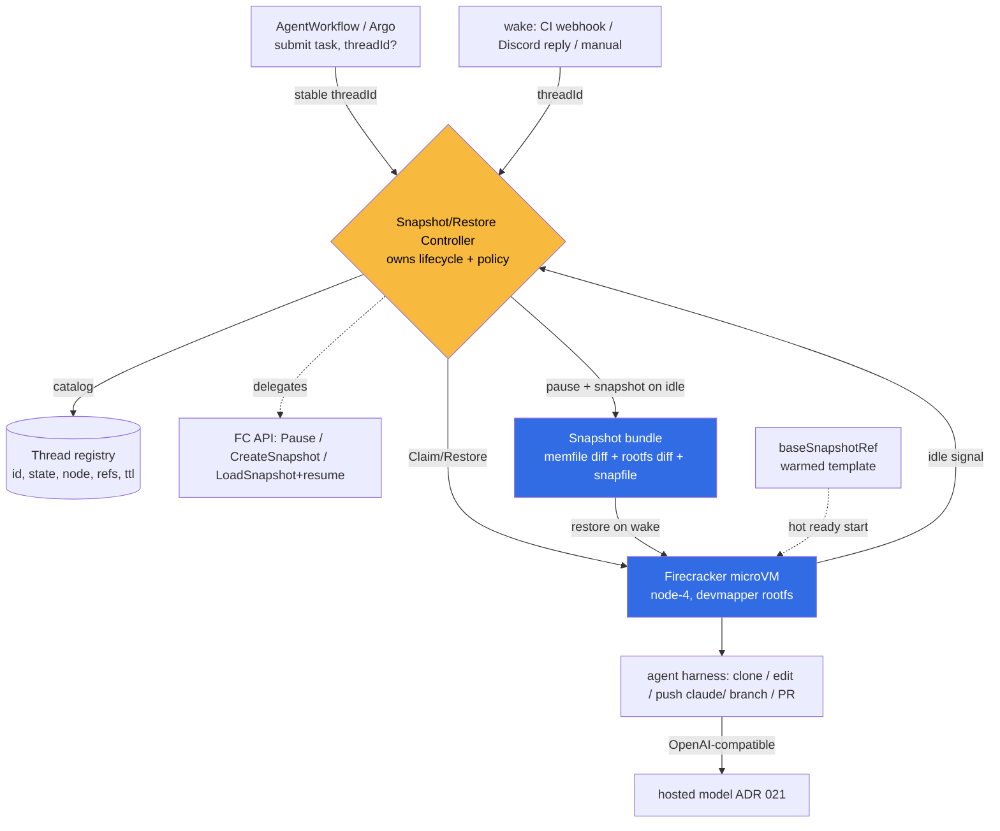

# ADR 022: Firecracker Snapshot/Restore Controller for AgentWorkflow (FC-Direct)

**Author:** jomcgi
**Status:** Accepted
**Created:** 2026-06-27
**Builds on:** [019 - Substrate Executor + AgentWorkflow over Argo](019-substrate-executor-agentworkflow.md) (the `Snapshotable` executor it gated on a spike), [021 - Discord-Triggered AgentWorkflow](021-discord-triggered-agentworkflow-fast-model.md) (the consumer whose "smooth many-thread" property this delivers), [010 - Memory Oversubscription](../platform/010-memory-oversubscription-burstable-priorityclass.md) (the node-4 headroom + disposable-victim tier these microVMs live in)

---

## Problem

ADRs 019 and 021 both name the same end state and both gate it on the same unproven thing: a `Snapshotable` Firecracker executor that makes an idle agent thread cost almost nothing and wake in sub-second time, so that "working on many Discord-fronted agent threads" feels smooth instead of like managing a queue of cold-starting pods. 019 marked it "target end state, gated on a feasibility spike"; 021 shipped its MVP on cold-on-demand and called snapshot/resume the designed-for end state.

Two questions had to be answered before committing: (1) does Firecracker snapshot/restore actually deliver sub-second resume on our hardware, and (2) is there a reusable, self-hostable component that already does this on Kubernetes, or do we build it.

Both are now answered.

**Feasibility: proven.** A raw Firecracker snapshot/restore spike on node-4 (the live kata-fc substrate: FC v1.12.1, Kata kernel + Ubuntu rootfs, 1 GB guest) measured: boot-to-ready 273 ms, snapshot create 822 ms (16 KB state + 1 GB memory image), restore **28 ms cold / 6 ms warm**, with continuity verified (a guest heartbeat counter resumed past its pre-snapshot value: it continued, did not reboot). The File backend mmaps the memory image and faults pages in lazily, so restore is sub-second regardless of VM size without even needing UFFD yet.

**Build-vs-buy: build.** A verified deep-research survey (24 of 25 claims confirmed across 16 primary sources) found no turnkey, self-hostable, open-source Kubernetes controller for per-workload microVM memory snapshot + restore. The VMM primitive is mature OSS (Firecracker, Cloud Hypervisor), and E2B has open-sourced a complete working reference of exactly our semantics (Apache-2.0), but nobody has packaged it as a k8s controller. The one k8s controller that does in-memory pod snapshots (GKE Agent Sandbox) is gVisor-based and proprietary; the one self-hostable k8s agent-sandbox (`kubernetes-sigs/agent-sandbox`) is PVC-disk-only, which is the model we already rejected (a Longhorn filesystem PVC mounts as tmpfs inside a kata-fc microVM, so nothing persists, and it never preserved in-memory state anyway).

So the task is to build a thin controller on the Firecracker primitive we already run, owning the lifecycle and policy that no upstream gives us, while delegating the snapshot mechanics to Firecracker and learning the hard parts from E2B.

---

## Decision

Six decisions.

**1. Build a thin Kubernetes controller for the snapshot/restore lifecycle.** No reusable component exists. The controller is the `Snapshotable` executor behind ADR 019's `Substrate` interface and the engine behind 021's idle-thread smoothness. It is keyed by a **stable thread ID** that outlives every microVM and correlates the Discord thread, the Postgres task state, and the snapshot refs.

**2. FC-direct for the first iteration.** The controller drives Firecracker processes and their snapshot API directly (as the spike did, and as E2B does), not through the kata-fc shim. Reason: Kata exposes no snapshot/restore API (its own docs list it as "discussion" only), so "snapshot a kata-fc pod" would require patching the shim or upstreaming. The kata-fc RuntimeClass work (ADR 019 follow-through) proved the Firecracker + devmapper substrate on node-4; this controller reuses that substrate but manages the microVMs itself. The trade is explicit: we give up clean kubelet-managed pod semantics for the snapshot-managed agents, accepting that the controller (in-cluster, node-affine) is the microVM manager. Revisiting via firecracker-containerd or a patched shim is a later option, not iteration 1.

**3. Firecracker, not gVisor.** GKE's self-hostable-shaped reference uses gVisor checkpoint/restore, which is lighter, but gVisor is userspace-kernel isolation (weaker than a hardware microVM boundary) and slower in practice for this workload. For untrusted/agentic code the microVM boundary is the right bar, and the substrate is already live. gVisor is rejected.

**4. Port E2B's open-source architecture rather than invent.** E2B's `e2b-dev/infra` (Apache-2.0 Go) implements our exact semantic: a snapshot bundle of a memory diff + a rootfs disk diff + the Firecracker snapfile, an explicit pause/resume lifecycle with idle auto-pause (an evictor and an autoresume path that returns the target node for routing), and UFFD lazy-paging resume (5 to 30 ms). It is coupled to Nomad/Consul, so we port the architecture, not import a library; the hard parts (diff bundle format, UFFD wiring, resume-then-resnapshot) are reference-able rather than guessed.

**5. Control plane and registry in Postgres, not a Kubernetes CRD.** Thread state (id, lifecycle state, node, snapshot refs, TTL) lives in a Postgres table in the monolith, and the controller is a **Postgres-reconcile loop** (a node-4 daemon reads desired state, drives Firecracker, writes actual state back), not a CRD-watch operator. Reason: a CRD puts high-churn agent-thread state in the shared etcd, the exact ceiling ADR 019 raised as the reason to tier by volume. Postgres keeps the many-idle-threads churn off the cluster control plane entirely and matches the homelab's existing monolith-centric registries (scheduler, routine jobs); the catalog (list/view/resume) reads the same table via the monolith MCP and UI.

**6. Drop AgentWorkflow (Argo Workflows) from the agent-thread dispatch path; the controller is the control plane.** ADRs 019/021 framed the durable tier as `AgentWorkflow`: Argo Workflows on the hot path, with steps as HTTP templates into a claimed executor. Decision 5 makes that redundant for this tier, and keeping it would be actively wrong. A snapshot-managed thread is the opposite of a run-to-completion workflow: it idles indefinitely and wakes on an event. Expressing a thread that is "waiting for a Discord reply" as a suspended Argo `Workflow` puts a Raft-replicated etcd object in the cluster control plane generating status churn for doing nothing, which is the precise etcd ceiling decision 5 moved to Postgres to avoid, and it adds Argo's controller-reconcile latency in front of a 28 ms restore. The `dispatch.submit -> claude_agent.agent_threads -> reconcile loop` path _is_ the `job-mcp` branch of ADR 019 ("direct claim, NOT an etcd-backed Workflow object"), and the controller already re-provides what Argo offered: lifecycle (PENDING/RUNNING/IDLE/COMPLETED), durable state with idempotent retry (the loop survives daemon restarts via Postgres), the catalog (MCP tools), and observability (SigNoz traces from `fc-agentd`). So for the snapshot/idle-wake agent-thread lifecycle, AgentWorkflow is dropped. This supersedes the "AgentWorkflow on Argo on the hot path" framing in ADRs 019/021 for agent threads only.

Two scopes are explicitly **not** affected. **ArgoCD** (GitOps continuous delivery) is unchanged: it deployed `fc-agentd` and keeps it reconciled, and is a different system from Argo Workflows. **Argo Workflows itself stays** for the existing batch CronWorkflows (worldcup sim, knowledge-graph jobs, etc.) and remains available as an optional future layer for genuine multi-agent DAG fan-out/join (spawn N agents, join, synthesize). Even there it would sit _above_ the controller (each DAG node calls `submit(threadId)` and joins on registry state), never in front of single-thread dispatch.

| Aspect            | Today (019/021 MVP)                        | Decided (this ADR)                             |
| ----------------- | ------------------------------------------ | ---------------------------------------------- |
| Idle agent thread | cold-on-demand pod, re-scheduled each turn | snapshotted microVM, compute released, ~0 cost |
| Wake latency      | cold pod schedule (seconds)                | restore-resume (sub-second; 28 ms measured)    |
| Substrate path    | kata-fc pod (kubelet-managed)              | FC-direct, controller-managed microVM          |
| State on resume   | re-init from Postgres + re-clone           | exact in-memory + disk state (continues)       |
| Snapshot engine   | n/a                                        | Firecracker (delegated), E2B architecture      |

---

## Architecture

The controller is the `Snapshotable` implementation of ADR 019's `Substrate` interface. AgentWorkflow (Argo) submits/resumes by stable thread ID; the controller maps that to a microVM and a snapshot bundle.



### AgentThread identity and lifecycle

The durable unit is the **AgentThread**, keyed by a stable ID assigned at create and never changed across snapshot/restore. The ID is the contract; node, snapshot file, Postgres task, and Discord thread are lookups off it.

```
PENDING --restore(baseSnapshot)--> RUNNING --idle signal--> pause+snapshot --> IDLE
                                      ^                                          |
                                      +--------restore(threadSnapshot)<---wake---+
RUNNING --task done--> COMPLETED --> reclaim (delete snapshot + volume)
```

Snapshot create (~822 ms) happens off the user-facing hot path (the thread is idle anyway); restore (~28 ms) is the wake hot path and is effectively instant. This places the slow operation where latency does not matter and the fast one where it does.

### Two snapshot roles

- **`baseSnapshotRef`** (one per env-image version): a microVM booted and warmed (agent harness initialized), snapshotted once. New threads restore from it for an instant "ready" start, skipping boot + init.
- **`threadSnapshotRef`** (one per idle thread): the specific thread's state at its idle boundary. A thread record carries both (provenance + current idle snapshot). Restore from either is the same ~28 ms operation.

### Delegate vs own

**Delegated** (not built): Firecracker `Pause`/`CreateSnapshot`/`LoadSnapshot`+resume and full memory/device/vCPU capture; the memfile + rootfs-diff bundle format and UFFD lazy-paging fast resume (ported/learned from E2B); the microVM + devmapper rootfs substrate (kata-fc work, containerd).

**Owned, split across two components.** An in-microVM **wrapper** (the VM's supervisor, launching the agent) owns what only something inside the guest can observe: idle detection (no activity AND quiescent, meaning no in-flight model/MCP call), signalling the controller when it is safe to snapshot, and re-establishing connections on resume. The out-of-VM **controller** (the Postgres-reconcile daemon on node-4) owns: the snapshot-on-idle and restore mechanics (driving Firecracker), snapshot storage + garbage collection (TTL/idle eviction), restore routing / wake-on-request, node and CPU-arch affinity pinning (FC snapshots are non-portable), the Postgres registry + catalog (list/view/resume), and Argo AgentWorkflow dispatch via the thin Substrate interface. A periodic **backstop** (a scheduled Goose routine over the registry) parks or alerts threads the wrapper missed and drives the per-repo warm-base refresh.

---

## Alternatives Considered

- **Snapshot through the kata-fc shim (keep kubelet pod semantics).** Rejected for iteration 1: Kata exposes no snapshot API; would require patching the shim or upstreaming. Revisit later via firecracker-containerd or a patched shim.
- **gVisor checkpoint/restore (GKE Agent Sandbox model).** Rejected: weaker (userspace-kernel) isolation than a microVM and slow for this workload; the FC substrate is already live.
- **`kubernetes-sigs/agent-sandbox` (PVC suspend/resume).** Rejected: disk-only, no in-memory state, and a Longhorn filesystem PVC mounts as tmpfs inside a kata-fc microVM (Firecracker has no virtio-fs), so it does not even persist. Does not meet resume-exactly.
- **CRIU `ContainerCheckpoint` / checkpoint-restore-operator / crik.** Rejected: alpha, CRI-O-only or runc-only, operates on host processes so it structurally cannot capture in-VM state; the k8s WG only formed Jan 2026.
- **Cloud Hypervisor.** A VMM snapshot primitive of the same shape as Firecracker, but no advantage here and it reaches k8s only via kata-clh. Held in reserve as an alternate VMM.
- **Buy a managed service (E2B Cloud, Modal, Fly).** Rejected as the primary path: in-cluster on our hardware is the goal (the whole point of the node-4 substrate). E2B's open-source infra is the architecture reference, not a hosted dependency.
- **Adopt E2B infra wholesale.** Rejected: it is Nomad/Consul/Terraform, not Kubernetes, and tightly coupled to its orchestrator. We port the design, not the deployment.

---

## Security

Baseline in `docs/security.md`. Notes specific to this controller:

- **MicroVM isolation is the boundary.** Firecracker per thread; this is the reason gVisor was rejected. When external/untrusted input arrives the boundary is already hardware-level.
- **Snapshots are never load-bearing.** Durable state is monolith Postgres (task/conversation) plus the snapshot's own disk; the memory image is convenience. A lost or discarded snapshot loses an in-flight thread's working memory, never committed work (it re-inits from Postgres, degraded not lost). Echoes 014/019/021.
- **Non-portability is a security-relevant invariant, not just an operational one.** FC validates CPU vendor/model on restore; a snapshot must restore on a hardware-identical node. The controller pins node/arch affinity (node-4 AMD today); a mismatched restore fails closed.
- **Guest networking is re-established, not resumed.** FC drops TCP/vsock on resume; the controller (and harness) re-open connections, so no stale privileged channel survives a restore.
- **Git identity stays least-privilege** (claude/-prefixed branches, PRs only) per ADR 021. **Egress** to the hosted model stays scoped per ADR 021.

---

## Risks

| Risk                                                                      | Likelihood | Impact | Mitigation                                                                                                                                      |
| ------------------------------------------------------------------------- | ---------- | ------ | ----------------------------------------------------------------------------------------------------------------------------------------------- |
| Snapshot disk cost grows with many idle threads (~guest-RAM per snapshot) | Medium     | Medium | Right-size guest RAM; FC diff snapshots (dirty pages only); thin-pool + TTL/idle eviction; node-4 has 1.6 TB NVMe                               |
| FC-direct bypasses kubelet pod semantics (observability, scheduling)      | Medium     | Medium | Controller is in-cluster + emits to SigNoz; the registry is the control plane; revisit firecracker-containerd if pod semantics become necessary |
| Reconnect-after-restore bugs corrupt an in-flight thread                  | Medium     | Low    | Snapshot only at quiescent (between-turns) boundaries; durable state in Postgres; never snapshot mid-model-call                                 |
| Non-portable snapshots restored on a wrong node fail                      | Low        | Medium | Node/arch affinity pinning in the controller; FC fails closed on mismatch                                                                       |
| Building the controller is multi-week effort                              | Medium     | Medium | Port E2B's proven architecture rather than invent; FC-direct reuses the already-derisked primitive; ship a thin first iteration                 |
| E2B architecture is Nomad-coupled; porting friction                       | Medium     | Low    | Reuse the bundle format + UFFD design as reference, not the orchestration; the k8s control loop is ours regardless                              |

---

## Open Questions

The execution-level questions are settled and recorded in the implementation work: full snapshots first with diffs as a fast follow; the registry in Postgres (decision 5); idle detection via the in-VM wrapper with a Goose-routine timeout backstop; two repo-specific warm bases rebuilt every 15 to 30 minutes when `main` advances. What remains genuinely open:

1. Scale characteristics (deferred, homelab-fine for now; revisit before any open-sourcing): diff sizes per idle thread, GC budget, restore p50/p99 under contention, arch-affine bin-packing across a future multi-node same-ISA pool.
2. When to revisit FC-direct vs firecracker-containerd / a patched kata-fc shim, if kubelet-managed pod semantics become worth the integration.

---

## References

| Resource                                                                                                                                                              | Relevance                                                                                        |
| --------------------------------------------------------------------------------------------------------------------------------------------------------------------- | ------------------------------------------------------------------------------------------------ |
| [019 - Substrate Executor + AgentWorkflow](019-substrate-executor-agentworkflow.md)                                                                                   | The `Substrate`/`Snapshotable` seam and AgentWorkflow tier this implements                       |
| [021 - Discord-Triggered AgentWorkflow](021-discord-triggered-agentworkflow-fast-model.md)                                                                            | The consumer whose smooth-many-threads property this delivers                                    |
| [010 - Memory Oversubscription](../platform/010-memory-oversubscription-burstable-priorityclass.md)                                                                   | The node-4 headroom + disposable-victim tier the microVMs run in                                 |
| [Firecracker snapshot support](https://github.com/firecracker-microvm/firecracker/blob/main/docs/snapshotting/snapshot-support.md)                                    | The delegated primitive; non-portability + network-loss constraints                              |
| [Firecracker page faults on resume (UFFD)](https://github.com/firecracker-microvm/firecracker/blob/main/docs/snapshotting/handling-page-faults-on-snapshot-resume.md) | Lazy-paging fast resume path                                                                     |
| [e2b-dev/infra](https://github.com/e2b-dev/infra)                                                                                                                     | Apache-2.0 reference: snapshot bundle, UFFD resume, idle auto-pause, evictor, autoresume routing |
| [GKE Agent Sandbox Pod Snapshots](https://docs.cloud.google.com/kubernetes-engine/docs/how-to/agent-sandbox-pod-snapshots)                                            | The CRD+controller shape; gVisor-based, proprietary, not self-hostable (reference only)          |
| [kubernetes-sigs/agent-sandbox](https://github.com/kubernetes-sigs/agent-sandbox)                                                                                     | Self-hostable but PVC-disk-only; the model rejected here                                         |
