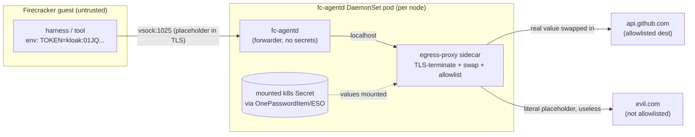

# ADR 023: Egress Secret Proxy for Agent Sandboxes (Placeholder Substitution)

**Author:** jomcgi
**Status:** Draft
**Created:** 2026-06-27
**Builds on:** [022 - Firecracker Snapshot/Restore Controller](022-firecracker-snapshot-restore-controller.md) (the microVM substrate whose snapshot bundle is exactly what we must keep secrets out of, and whose vsock contract already reserves the egress port this uses), [021 - Discord-Triggered AgentWorkflow](021-discord-triggered-agentworkflow-fast-model.md) (the hosted-model egress whose "repo context and API key leave the cluster" caveat this tightens), [004 - Autonomous Agents](004-autonomous-agents.md) (the 1Password injection pattern this reuses for the values)

---

## Problem

Agent threads run untrusted, model-driven code inside Firecracker microVMs (ADR 022). To do real work they need credentials: a GitHub token to push branches, a model API key, and a long tail of arbitrary tool/API keys we cannot enumerate in advance. The current pattern (ADR 004) injects those as environment variables into the workload.

For a snapshot-managed microVM that is the wrong shape, for two compounding reasons:

1. **Anything in the guest is in the snapshot.** ADR 022's whole value is that an idle thread is a memory + disk snapshot bundle. A secret injected into guest env, written to disk, or held in process memory is captured verbatim in that bundle and persists at rest for the life of the thread. The blast radius of one leaked snapshot is every credential the thread held.
2. **The code holding the secret is untrusted.** This is agentic code subject to prompt injection. A thread that holds a real token can be talked into exfiltrating it (POST it to an attacker host, print it into a PR, paste it into a log). Defense has to assume the workload is hostile.

The goal, stated by the owner: **a clean way to declare which secrets a thread may use, with a hard guarantee the real value never exists anywhere the guest can reach.** The inspiration is [Kloak](https://getkloak.io/): applications reference placeholders, the real secret is swapped in on egress, so "your application code never sees real credentials." A compromised process cannot leak what it never held.

Kloak's _mechanism_, however, does not fit our substrate. It attaches eBPF uprobes to OpenSSL's `SSL_write` in the host kernel and rewrites the placeholder just before encryption. That assumes the workload is a host-kernel-visible pod linked against OpenSSL. Our workload is a Firecracker guest with its **own kernel**, so a host eBPF uprobe cannot see the guest's userspace at all (that opacity is the point of the microVM boundary). It also assumes a single TLS library: our harness and tooling are polyglot, and the Go harness uses `crypto/tls` (no OpenSSL to probe). So we keep Kloak's _idea_ and reject its _implementation_.

We already have the right interception point. ADR 022's vsock contract reserves `EgressPort = 1025` for tunnelled guest egress (`projects/agent_platform/vsockproto/proto.go`). That hop, outside the guest, is where substitution belongs.

---

## Decision

Six decisions.

**1. Header injection at the egress hop is the deployed primitive.** The guest sends a non-secret login-gate value in the configured header, and the sidecar deletes every guest value before attaching the real credential for the allowlisted host. The real value never enters the guest's kernel, memory, disk, or snapshot. It lives only in a separate process on a different side of the Firecracker boundary.

**2. Intercept at the vsock 1025 egress hop, not eBPF.** The microVM has its own kernel (host eBPF cannot uprobe guest userspace), and the tooling is polyglot (Go `crypto/tls` does not link OpenSSL, so an `SSL_write` uprobe silently misses it). ADR 022 already routes guest egress through vsock 1025 for exactly this kind of mediation. eBPF/Kloak is the right idea on the wrong substrate.

**3. Header injection is scoped by a per-secret destination allowlist.** The sidecar recognizes the configured header and host, removes all guest-supplied values, and attaches the real credential only for that host. This bounds credential EXFILTRATION, not credential ABUSE: any request the guest can make to a covered host gets the credential attached, including a request induced by prompt injection. This is deliberately narrower than a general egress firewall and does not claim to authorize individual API operations.

**4. The proxy terminates TLS.** To swap a placeholder that sits inside an HTTPS body or header, the proxy must see plaintext, so it terminates TLS using a CA baked into the guest image trust store, then re-originates TLS to the real destination. This is unavoidable given the goal: the only alternative is the guest holding the real value in order to encrypt it itself, which is precisely what we are ruling out. We own the guest image, so a guest-scoped trusted CA (never a cluster-wide one) is clean.

**5. v1 data plane is a sidecar in the per-node `fc-agentd` DaemonSet.** `fc-agentd` stays a secret-free forwarder: it takes the guest's vsock 1025 stream and forwards it over localhost to a co-located `egress-proxy` sidecar that holds the mounted secrets and does terminate + swap + allowlist. A sidecar, not in-process, because `fc-agentd` parses guest-originated control frames (an attack surface from a hostile guest); keeping the secret-holding process off that surface preserves the blast-radius separation even though both run in the same pod. The per-node DaemonSet is the correct scaling unit, since egress volume scales with the number of guests, which scales with nodes; a separately-scaled proxy Deployment would add a cross-node hop to buy independence we do not need yet.

**6. Values via the existing ESO / 1Password GitOps path; catalog as config shaped like the future CRD.** Secret _values_ are provisioned exactly as everything else in the repo (`OnePasswordItem` syncing a k8s Secret), mounted into the sidecar container. The sidecar never talks to 1Password. A **catalog** (mounted ConfigMap / values) maps `env -> secret key -> egressTo`, deliberately shaped like the `spec.secrets` of the future `SecretProxy` CRD (see Future Work) so v2 is a lift, not a rewrite. GitOps is the source of truth for the security-critical question "what credentials can an agent ever touch," and the answer is reviewable in a PR.

A note on the threat model, because decision 5 reverses an earlier instinct to keep `fc-agentd` entirely secret-free. Holding secrets in a node-daemon sidecar is acceptable because the Firecracker hardware boundary stops a guest from reading host memory. The threat we defend is "guest exfiltrates a value it holds," and the design ensures the guest never holds one. Secret-free `fc-agentd` was defense-in-depth, and we retain it at the container level via the sidecar split rather than as a property of the whole node.

| Aspect                            | Today (ADR 004 injection)    | Decided (this ADR)                   |
| --------------------------------- | ---------------------------- | ------------------------------------ |
| Secret in guest env/disk/RAM      | yes (real value)             | no (placeholder only)                |
| Secret in ADR 022 snapshot bundle | yes (real value, at rest)    | no (placeholder only)                |
| Exfiltration to arbitrary host    | possible (agent holds value) | real credential is not attached    |
| Per-tool integration work         | env var per tool             | configured header and host catalog  |
| Where the value lives             | the workload                 | egress-proxy sidecar, off the guest  |
| Destination control               | none                         | per-secret allowlist                 |

---

## Architecture

The guest's only egress path is vsock 1025. The guest runs no proxy config: it is a transparent funnel. `fc-agent-init` answers every DNS query with `127.0.0.1` (a wildcard responder) and listens on the egress ports on loopback, tunnelling each accepted connection over vsock 1025 to `fc-agentd`, which forwards it to the local sidecar. The sidecar is a transparent proxy: it reads each connection's real destination host from the TLS SNI (a cleartext ClientHello) or the HTTP Host header, applies policy, and dials the real name (the pod resolves cluster and public DNS). It is the only process that ever materialises a real secret value, and only toward that secret's allowlisted destination.

This transparent model exists because the model client (goose) ignores `HTTP_PROXY` (a known upstream gap) and the guest is vsock-only. Capturing all egress generically and routing it by SNI/Host in the sidecar means the harness is configured with real URLs and no per-destination routing config exists. Connection capture is per-port loopback listeners today (the harness uses 80/443/8080); generic any-port capture via an `iptables` REDIRECT + `SO_ORIGINAL_DST` is a localized follow-up (it needs the guest kernel built with netfilter).

**Egress posture.** A policy knob governs the open path: `allow` (default) routes to any destination in or out of cluster, so the agent can read arbitrary docs. This is consistent with decision 3: the allowlist is a _per-secret exfiltration_ control (the real value only materialises at its `egressTo`; everywhere else the inert placeholder leaves), not a global egress firewall. `allowlist` is the dormant lockdown knob that additionally confines all egress to the named hosts plus `secrets[*].egressTo`, fail closed, flippable without a rebuild.



Assignment-time flow: at `KindAssign` (ADR 022's vsock control channel) the guest env is populated with **placeholders**, not values. The catalog maps each placeholder to its real key (resolved in the sidecar from the mounted Secret) and its `egressTo` allowlist. Placeholders are not sensitive, so they may cross vsock freely; how a placeholder is derived or delivered is an open question below.

---

## Alternatives Considered

- **Literal Kloak / host eBPF uprobe on `SSL_write`.** Rejected: the microVM has its own kernel so a host uprobe cannot see guest userspace, and the Go harness uses `crypto/tls` (no OpenSSL symbol to probe). Right idea, wrong substrate.
- **Literal placeholder substitution in arbitrary request fields.** Rejected for the deployed claude lane: it could expose the real value in a URL, body, or unrelated header, while header injection has a clear credential boundary. Transformed credentials remain a follow-up for integrations that need them.
- **Standalone horizontally-scaled proxy Deployment + `SecretProxy` CRD + operator, now.** Deferred to Future Work: it buys per-thread proxy selection and independent scaling we do not need at a single agent trust tier, at the cost of a new operator and a cross-node hop. The per-node DaemonSet is the natural scaling unit today.
- **Per-thread secret table with `source_ref`, resolved at runtime by `fc-agentd` via a 1Password client.** Rejected: puts `fc-agentd` in the secret-fetching business (new creds, new attack surface, new code) and duplicates rotation/audit that the existing `OnePasswordItem`/ESO path already gives us. Reference k8s Secrets instead.
- **Per-integration capability broker (in-cluster service holds the credential; guest calls the broker).** Rejected as the general mechanism (does not cover arbitrary `curl`/`git`-style calls the agent invents); retained as a possible complement for the transformed-credential cases below.

---

## Security

Baseline: `docs/security.md`. Deviations and security-relevant properties:

- **TLS interception via a guest-trusted CA.** The proxy MITMs the guest's outbound TLS. The trusted CA is scoped to the agent guest image only, never added to any cluster-wide or host trust store, and the private key lives only in the sidecar. This is the deliberate cost of keeping the value out of the guest.
- **Allowlist is the exfiltration boundary, not an abuse boundary.** Each secret carries an `egressTo` host allowlist; injection fires only on a match, so the real value is not attached to an arbitrary destination. Any request to a covered host can still receive the credential, so the design bounds exfiltration but does not bound abuse of the covered service.
- **Placeholders are non-sensitive** by construction (high-entropy, no relation to the value), so their presence in guest memory, snapshots, logs, or PRs leaks nothing.
- **Reduced standing exposure**: the value exists only in the sidecar process and its mounted Secret, on the host side of the Firecracker boundary, and never at rest inside a thread snapshot.

---

## Risks

| Risk                                                                                                                                                             | Likelihood | Impact | Mitigation                                                                                                                                                                |
| ---------------------------------------------------------------------------------------------------------------------------------------------------------------- | ---------- | ------ | ------------------------------------------------------------------------------------------------------------------------------------------------------------------------- |
| Transformed credentials (HTTP Basic `base64(user:token)`, AWS SigV4 / webhook HMAC signing) never appear literally on the wire, so literal swap cannot find them | Medium     | Medium | Documented limitation: these inherently need the secret inside the VM to compute. Out of scope for v1 (rare in agent tooling); handle later via a per-integration broker. |
| Guest-trusted CA private key compromise lets a node-local attacker MITM agent egress                                                                             | Low        | High   | Key only in the sidecar, never mounted into `fc-agentd` or the guest; rotate via the image + Secret pipeline; same host-trust assumption as the rest of node-4.           |
| Placeholder collides with real content in a request body                                                                                                         | Very low   | Medium | Fixed-prefix high-entropy ULID; literal byte-string match on the full token.                                                                                              |
| Placeholder spans TLS record / chunk boundaries and is missed                                                                                                    | Low        | Medium | Sidecar buffers/scans across record boundaries before forwarding.                                                                                                         |
| Per-node shared catalog: every thread on a node can reach every secret in that node's catalog (no per-thread subsetting in v1)                                   | Medium     | Medium | Acceptable at a single agent trust tier; per-secret allowlist still bounds each secret's destinations; per-thread/per-proxy subsetting is the Future Work CRD.            |
| Non-HTTP egress (raw TCP, git-over-SSH) bypasses an HTTP-aware swap                                                                                              | Medium     | Low    | v1 scope is HTTP(S); document that SSH-based git uses a different credential path. Revisit if needed.                                                                     |

---

## Open Questions

1. **Placeholder derivation and delivery.** Deterministic `HMAC(proxy_key, thread_id + env)` (no storage, survives restore), catalog-static per (node, env), or minted and carried in an extended `vsockproto.Message`? Leaning deterministic so nothing extra is persisted and restore is trivially consistent.
2. **Guest CA rotation.** How the trusted CA is rolled without rebuilding every warm base (ADR 022) and invalidating in-flight snapshots.
3. **Non-HTTP egress.** Whether git-over-SSH / raw TCP need any handling in v1 or are explicitly out of scope.
4. **Streaming bodies.** Buffering strategy for the swap when a placeholder could straddle chunk boundaries without adding meaningful latency.

---

## Future Work

The catalog is shaped to become a `SecretProxy` CRD without reworking the data plane. The operator flavor (deferred, not v1):

```yaml
apiVersion: agents.jomcgi.dev/v1alpha1
kind: SecretProxy
metadata: { name: github-and-model, namespace: agent-platform }
spec:
  replicas: 3
  secrets:
    - env: GITHUB_TOKEN
      secretRef: { name: agent-github-bot, key: token }
      egressTo: ["api.github.com", "github.com"]
```

An operator reconciles the CRD into independently-scaled proxy Deployments + Services; threads reference a proxy by name (a `proxy` field on `agent_threads`, recipe default + `submit(proxy=...)` override), giving per-thread proxy selection and per-proxy trust tiers. The v1 sidecar data plane (terminate + swap + allowlist) is identical code, extracted from the DaemonSet into the proxy Deployment when that granularity is actually needed.

---

## References

| Resource                                                                                            | Relevance                                                                             |
| --------------------------------------------------------------------------------------------------- | ------------------------------------------------------------------------------------- |
| [Kloak (getkloak.io)](https://getkloak.io/)                                                         | The placeholder-on-egress idea; the eBPF mechanism we adapt away from                 |
| [ADR 022 - Firecracker Snapshot/Restore Controller](022-firecracker-snapshot-restore-controller.md) | The substrate, the snapshot bundle we keep secrets out of, the vsock 1025 egress port |
| [ADR 004 - Autonomous Agents](004-autonomous-agents.md)                                             | The 1Password injection pattern reused for provisioning values                        |
| `projects/agent_platform/vsockproto/proto.go`                                                       | The vsock contract (`EgressPort = 1025`, `KindAssign`) this builds on                 |
| `docs/security.md`                                                                                  | Security baseline                                                                     |

## Update (2026-07-01): generic egress shipped + split-horizon guardrail

The deferred generic any-port capture (Architecture) shipped, but via a
netfilter-free mechanism rather than the `iptables` REDIRECT + `SO_ORIGINAL_DST`
originally sketched. The guest gives every DNS name a unique synthetic
127.0.0.0/8 address and binds each per-port funnel listener to 0.0.0.0, so a
connection to a synthetic address lands on the listener whose LocalAddr is that
address, reverse-mapped to the name. No privileged netfilter, pure Go. The
trade-off is a fixed port set (80/443/8000/8080/4318/9418, EGRESS_PORTS override)
with any host, not truly arbitrary ports; iptables any-port remains a future
option. The guest sends "host:port" in the vsock preamble, so the sidecar no
longer sniffs SNI/Host for routing (only a one-byte TLS check for the swap path).

The egress posture is now split-horizon, superseding the flat `allow`/`allowlist`
knob: external (public) destinations are allowed by default so an agent can read
the open internet, while internal (cluster, private, loopback, link-local)
destinations are deny-by-default and confined to an explicit `internal.allowlist`.
Classification is on the resolved IP the sidecar will dial (not the guest-claimed
name), with resolve-once-and-pin, defeating SSRF-by-name and DNS rebinding. This
is a strict hardening: it closes the cluster-pivot vector the old `allow` default
left open. Decision 3 (per-secret egressTo as the exfiltration control) is
unchanged and now orthogonal to the zone policy. Shipped in PR #3010, deployed at
fc-invoke chart 0.4.2, verified live (a default-tier agent reached inference:8080
under internal-deny).

## Update (2026-07-27): the vsock hop carries no TLS, so most swaps need no CA

Decision 4 said the proxy must terminate TLS "using a CA baked into the guest
image trust store". Implementing that for the EmberVM claude runtime (issue
#4055) showed the CA is not load-bearing for the property we actually want, and
that the guest-image half of it has no good home.

The reasoning that produced decision 4 is still right as far as it goes: to swap
a placeholder the proxy must see plaintext, and the alternative is the guest
holding the real value in order to encrypt it, which is exactly what this ADR
rules out. What it skipped is that the guest does not have to speak TLS to the
proxy in the first place. A guest reaches the sidecar over a host-local vsock.
There is no network segment on that hop, so guest-side TLS defends against an
attacker who would already need code execution on the host to be positioned
there, at which point they can read the sidecar's memory anyway. The sidecar
still originates real, verified TLS to the destination, so nothing crosses a
network unencrypted, and the credential still never enters the guest.

So a guest that is configured to speak cleartext to the sidecar (for claude,
`ANTHROPIC_BASE_URL=http://api.anthropic.com`) gets the swap with no CA, no
forged leaves, and no trust store to manage. The sidecar tells the two apart by
peeking one byte: 0x16 is a TLS ClientHello, anything else is a plaintext
request.

The forcing consideration was where a CA could enter the guest. The rootfs is
built by the `rootfs-builder` initContainer from an image CI built earlier, which
leaves two options, both with a real cost:

- **Image build.** Commit the public cert as an apko input. Rotation then means a
  CI image rebuild, and the cert in git plus the key in the cluster are two
  copies that can drift.
- **Base build.** Mount a cert-manager CA secret and write the PEM into the
  rootfs before snapshotting. Single source of truth, but the base stops being a
  pure function of the image digest, so a rotation silently leaves every node
  serving a base that trusts the old CA unless the CA fingerprint is folded into
  the base cache key.

Neither is worth paying for a hop that needs no encryption. The TLS-MITM lane
stays implemented and is still the answer for a guest that must speak https:// to
the sidecar (an off-the-shelf client with no base-URL override), but it is now
opt-in behind `egress.ca.enabled` rather than implied by having secrets, because
turning it on means owning one of those two costs.

This narrows open question 2 (guest CA rotation) rather than answering it. If the
CA lane is ever turned on, the least-bad delivery is the kernel cmdline
`ember.env.<KEY>` channel `guest-init` already parses: rotation then costs a base
rebuild instead of a CI image rebuild. Two constraints come with it. It is
per-base, not per-session, since Prime restores every session from one shared
pristine snapshot, so the value is consumed once at base-build time. And
`CONFIG_COMMAND_LINE_SIZE` is 2048 or 4096 bytes shared with every other boot
arg, which fits a P-256 CA (~600 bytes of PEM) but not the 4096-bit RSA one.
Rotation would still invalidate banked sessions holding the old trust.

Verified end to end before merge, off-cluster: the real CLI, holding only the
inert placeholder, reached the live API through the real sidecar binary and
returned a correct answer. Two facts that the design depends on and that were
confirmed rather than assumed: the CLI does send `Authorization: Bearer` to an
`http://` base URL (no downgrade guard), and it does no local format validation
of the token, so the placeholder need not resemble a credential. `ANTHROPIC_BASE_URL`
redirects the CLI's API client only; it still reaches api.anthropic.com over
https:// for telemetry and profile calls, which blind-tunnel past the swap
carrying the inert placeholder and are refused at the destination without
affecting a turn.

## Amendment (2026-07-27)

**Decision 6's credential provisioning is amended by [ADR 047](047-per-principal-egress-credential-broker.md)**: the one shared credential moves to one credential per principal, the catalog's selection key becomes (principal, host) instead of host alone, and the sidecar gains an unforgeable caller identity (an envelope noded frames onto the connection before the guest's own bytes). Injection itself, decision 4's guest-CA question, and the split-horizon posture are unchanged; ADR 047 is triggered by exactly the deferred item PR #4100 named ("per-user credentials being minted").
