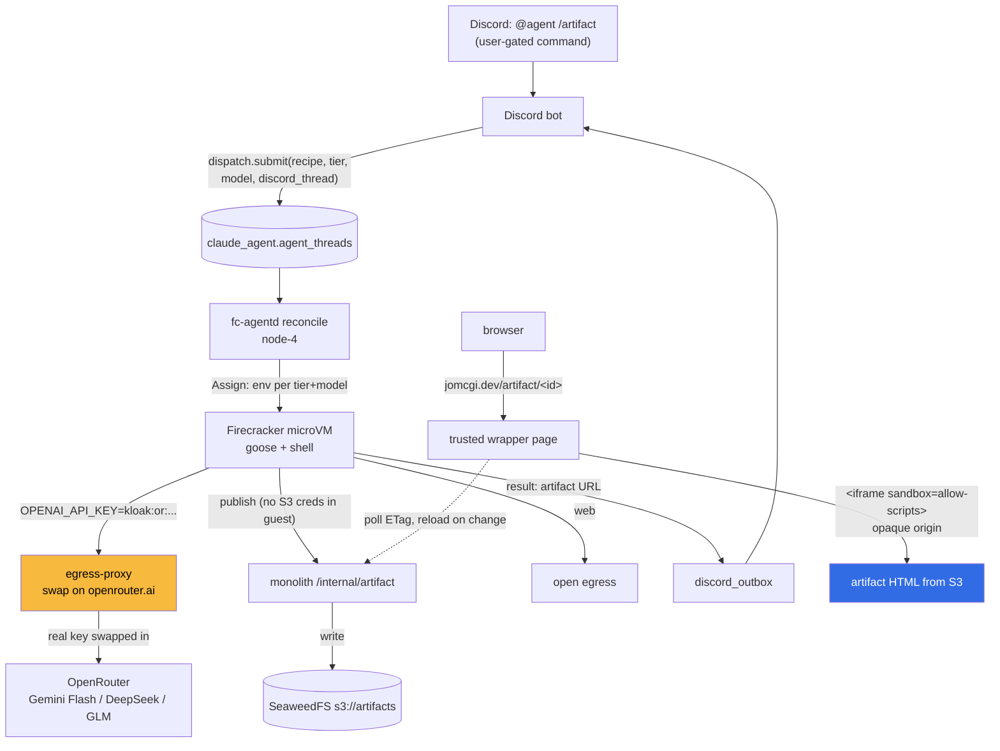

# ADR 024: Productive Discord Agent, Hosted-Model Tiers, and Isolated Live Artifacts

**Author:** jomcgi
**Status:** Draft
**Created:** 2026-06-27
**Builds on:** [022 - Firecracker Snapshot/Restore Controller](022-firecracker-snapshot-restore-controller.md) (the `fc-agentd` substrate that runs the agent), [023 - Egress Secret Proxy](023-egress-secret-proxy.md) (the placeholder-swap that injects the model + tool credentials at the egress hop), [021 - Discord-Triggered AgentWorkflow](021-discord-triggered-agentworkflow-fast-model.md) (the Discord-front-door consumer)
**Supersedes in part:** [021](021-discord-triggered-agentworkflow-fast-model.md) decisions 1 and 3: the consumer is no longer an Argo `AgentWorkflow`, it is a `dispatch.submit` consumer of the 022 Postgres-reconcile controller, and the smoothness mechanism is 022's snapshot/resume directly. 021's decision 2 (hosted model as a config knob) is realized and made concrete here.

---

## Problem

The agent substrate works end to end (022 + 023): a Discord-triggerable controller boots a Firecracker microVM, runs goose with a shell, reaches the model and the open web through a transparent egress proxy, and uses a GitHub token it never actually holds (placeholder swapped at the egress hop). What is missing is the productive loop on top of it, and two real constraints surfaced once the substrate ran:

1. **Context window.** The in-cluster model (`qwen3.6-27b` on vLLM) is served at `--max-model-len 32768`. A coding or artifact agent that reads files and accumulates tool output fills 32k in a handful of turns. goose's auto-compaction (summarize at 80%) then kicks in and lossily discards earlier tool output and reasoning, which degrades exactly the long, iterative work we want. A bigger self-hosted model means standing GPU RAM on a memory-bound cluster, which 010/021 already argue against.

2. **What the agent is for.** "Autonomous coding agent" is one use, but the more compelling and lower-risk use is **make me a thing**: a visualization, a small interactive page, a report, a dashboard, returned as a live URL. That tier touches no repo and no long-lived credential, so its blast radius is just the conversation itself.

We want: trigger an agent from Discord (gated to one user), give it a large-context capable model without a memory tax, let it produce a live artifact at a URL, and keep the credential and data exposure honest per use.

---

## Decision

Four decisions.

**1. The coding driver is a hosted model via OpenRouter, selected per thread, with the API key injected by the 023 egress swap.** The harness reaches an OpenAI-compatible endpoint; the endpoint, model id, and key are per-thread injected env, not a hardcode. We route through OpenRouter (one OpenAI-compatible endpoint, one key, access to GLM / Gemini Flash / DeepSeek) so the model is a `GOOSE_MODEL` string. This realizes 021 decision 2 concretely and removes the 32k ceiling: the candidate models ship ~1M context, so goose's lossy compaction effectively never fires. The model identity is deliberately not load-bearing; the OpenAI-compatible seam keeps in-cluster Qwen as a fallback tier and a future self-hosted model a config change.

The OpenRouter key is **not a new mechanism**: it is one `egress.secrets` entry (`egressTo: [openrouter.ai]`) in the 023 catalog. The guest holds `OPENAI_API_KEY=kloak:or:<...>` (a placeholder); the sidecar swaps the real key on the `openrouter.ai` connection. The key never enters the microVM or its snapshot.

**Per-user routing falls out of per-thread injection.** The placeholder is the capability: inject the OpenRouter `OPENAI_HOST` + placeholder only into the authorized user's threads; every other thread gets in-cluster Qwen and `sk-noauth`. A non-authorized thread, even a prompt-injected one, cannot use the paid key, it does not hold the high-entropy placeholder, the swap only fires on `openrouter.ai`, and the key lives only in the sidecar. "I pay, others get Qwen" is therefore an injection-time decision, not a separate access-control system.

**2. Two tiers, separated by what the guest is granted.** A thread runs in one of two tiers, and the tier is exactly the set of secrets and access the guest receives:

| Tier         | Guest gets                                               | Can do                                           | Blast radius                                              |
| ------------ | -------------------------------------------------------- | ------------------------------------------------ | --------------------------------------------------------- |
| **coding**   | repo clone + `gh` token (placeholder, swapped at egress) | clone, edit, push `claude/` branches, open PRs   | code + a scoped credential (still never held in-guest)    |
| **artifact** | model + web + a publish path; NO repo, NO `gh` token     | build and publish a web artifact, browse, reason | the conversation/intent only (zero real secrets in-guest) |

The artifact tier is the safer one and the better showcase, and it is the one to lead with. Even the model key is a placeholder, so an artifact-tier guest holds **no real secret at all**; the worst a fully compromised artifact thread can leak is the chat it was given.

**3. Artifacts are published by the agent through the monolith to object storage, and served from an isolated origin with hot reload.** The agent builds HTML and publishes it by calling a monolith endpoint (over the in-cluster egress), which writes it to SeaweedFS (`s3://artifacts/<id>/index.html`) and returns a URL. **The guest never holds S3 credentials**, the monolith performs the write, so the artifact tier stays zero-secret in the guest. The monolith serves the artifact at `jomcgi.dev/artifact/<id>` and the agent posts the URL back to the Discord thread (via the existing `discord_outbox`).

Hot reload is an ETag poll: the served wrapper polls a version endpoint and reloads when the S3 object changes, so when the agent re-publishes the same `id` every open browser updates. The monolith mutating S3 is what users see refresh.

**4. Agent-generated HTML is served in a sandboxed iframe (opaque origin), never on the bare `jomcgi.dev` origin.** Agent-generated markup is untrusted JavaScript: a model that fetched a poisoned page could emit malicious script. Served directly on `jomcgi.dev/artifact/*` it would run in the `jomcgi.dev` origin with access to its cookies and `localStorage`, the same shared-origin hazard that collided a generic `theme` key and crashed the embedded ArgoCD UI (see `project_path_ingress_shared_origin`). Instead, `jomcgi.dev/artifact/<id>` serves a thin trusted **wrapper** that embeds the artifact in `<iframe sandbox="allow-scripts">` **without** `allow-same-origin`. That gives the framed document a unique opaque origin regardless of the URL it loads, so it cannot read `jomcgi.dev` storage/cookies/DOM and has no persistent storage of its own. The wrapper (real origin) runs the hot-reload poller; the artifact stays sealed inside. A strict CSP on the artifact response (`connect-src` limited, no `allow-top-navigation`/`allow-forms`/`allow-popups`) blocks top-window phishing and narrows beaconing. This isolates on the same domain, so no new subdomain, DNS, or certificate. A real subdomain origin is the later move only if an artifact needs its own persistent storage.

---

## Architecture

Tier is injected, not coded into the harness: `fc-agentd` reads the thread's `tier`/`model` and assembles the `Assign` env (`OPENAI_HOST`, `GOOSE_MODEL`, the model-key placeholder, and for the coding tier the repo + `gh` placeholder). The harness binary is identical across tiers.

---

## Alternatives Considered

- **Keep the in-cluster 32k Qwen as the only driver.** Rejected as the primary path: the window is too small for iterative coding/artifact work and forces early lossy compaction. Retained as the free fallback tier for non-authorized users and for when prompt content must stay in-cluster.
- **A single hardcoded hosted model (021's Gemini Flash).** Subsumed: OpenRouter behind the OpenAI-compatible seam makes the model a per-thread string, which is what per-user routing and per-task escalation need anyway.
- **Serve artifacts on `jomcgi.dev/artifact/*` directly.** Rejected: agent HTML on the bare origin can touch the site's cookies/localStorage (shared-origin hazard). The sandboxed-iframe wrapper isolates on the same domain.
- **Serve artifacts from a dedicated `artifact.jomcgi.dev` subdomain.** Held in reserve: a real separate origin is stronger and lets artifacts keep their own storage, at the cost of DNS/cert/Cloudflare setup. Adopt it only when an artifact genuinely needs persistent storage; the sandbox iframe covers the common case with zero new infra.
- **Give the artifact guest S3 credentials to write directly.** Rejected: it would put a credential in the zero-secret tier. Routing the write through the monolith keeps the guest secret-free and gives one place to enforce size/quota and the artifact id space.
- **Argo `AgentWorkflow` as the dispatch tier (021/019).** Superseded by 022: the Postgres-reconcile controller is the substrate; a second orchestrator would duplicate it.

---

## Security

Baseline `docs/security.md`. Tier-specific posture:

- **The tier is the trust boundary.** Coding-tier threads hold a (placeholder) `gh` token and a repo; artifact-tier threads hold neither. An artifact thread that is fully prompt-injected can leak only the conversation it was handed, no credential (even the model key is a placeholder swapped at egress), no repo, no S3 key.
- **Per-user paid-model routing is capability-by-placeholder.** The OpenRouter key sits only in the node sidecar; only threads injected with the high-entropy placeholder can cause the swap, and only toward `openrouter.ai`. Unauthorized or injected threads cannot reach it.
- **Agent HTML is untrusted and origin-isolated.** Sandboxed iframe (opaque origin) + strict CSP; the artifact cannot read `jomcgi.dev` storage, navigate the top window, or (within CSP) beacon freely. The publish path is monolith-mediated, so artifact ids and sizes are controlled server-side.
- **Data egress to OpenRouter.** Prompts (task + intent, and for the coding tier repo context) leave the cluster to OpenRouter. Accepted for the authorized user's own use; the in-cluster Qwen tier remains for content that must not leave. This is 021's per-repo enablement, applied per tier/user.
- **No new ingress.** Triggers stay Discord to monolith; artifacts are served by the existing public monolith tier through Cloudflare.

---

## Risks

| Risk                                                                        | Likelihood | Impact | Mitigation                                                                                                                                                                                                                                                                   |
| --------------------------------------------------------------------------- | ---------- | ------ | ---------------------------------------------------------------------------------------------------------------------------------------------------------------------------------------------------------------------------------------------------------------------------- |
| Sandboxed artifact still exfiltrates the conversation to an attacker host   | Medium     | Low    | Accepted per the 2026-06-29 amendment (CSP `connect-src` opened to https): only the chat/intent is exposed (no secrets), creation is owner-gated, the opaque origin denies our origin regardless. Tighten to a per-thread allowlist if `/artifact` ever opens past the owner |
| A coding-tier prompt injection abuses the `gh` token within its `egressTo`  | Low        | Medium | Token is `claude/`-branch + PR scoped (021); swap only fires toward GitHub; never held in-guest                                                                                                                                                                              |
| OpenRouter outage or price change breaks the paid tier                      | Low        | Low    | Qwen fallback tier; model is a config knob; per-user so blast radius is one user                                                                                                                                                                                             |
| Artifact storage grows unbounded in SeaweedFS                               | Medium     | Low    | Monolith-mediated writes enforce a TTL/lifecycle on `s3://artifacts` (COSI/lifecycle per the SeaweedFS notes); ids are server-assigned                                                                                                                                       |
| iframe sandbox misconfigured with `allow-same-origin` re-exposes the origin | Low        | High   | One reviewed wrapper template, never templated from agent input; test asserts the sandbox attributes                                                                                                                                                                         |
| Hosted prompts leak intent that should have stayed private                  | Medium     | Low    | Tier/user routing; Qwen tier for in-cluster-only content                                                                                                                                                                                                                     |

---

## Amendment (2026-06-29): open the artifact CSP to the https web

Decision 4 originally served artifacts under a strict CSP (`default-src 'none'; connect-src 'none'`, inline-only scripts/styles), which made artifacts fully self-contained but also blocked the common reflexes a model reaches for: a CDN framework (`<script src=...>`), web fonts, and live API data. In practice that produced broken artifacts: a model that built a perfectly reasonable Tailwind-CDN page got it CSP-nuked and rendered as unstyled black-on-black text, because only the inline `<style>` survived while every utility class stayed inert.

The CSP is relaxed so an artifact behaves like a normal web page: `script-src`/`style-src`/`img-src`/`font-src`/`connect-src` are all opened to `https:` (any host), `http:` withheld. This lets artifacts load CDN libraries and fonts and, the original motivation, **fetch live data and refresh from public https APIs** so an artifact can be a real app, not just a static snapshot.

Why this is safe to do here:

- **The boundary that protects our origin is unchanged.** It was never the CSP: it is the `<iframe sandbox="allow-scripts">` (no `allow-same-origin`) opaque origin from decision 4. An artifact still cannot read `jomcgi.dev` cookies/storage/DOM. That invariant stays non-negotiable (and is the High-impact risk row above).
- **Arbitrary JS execution was already granted.** The CSP already allowed `'unsafe-inline'` scripts, so the artifact already ran arbitrary JS. Allowing remote `<script src>` does not open a new capability class; it only changes code provenance (a supply-chain/durability tradeoff, not an origin-security one).
- **Creation is owner-gated.** `/artifact` is owner-only, so the residual risk, a viewer's browser fetching/beaconing to third-party hosts, is no worse than the owner sending that viewer a link to any untrusted page.

This re-accepts the "exfiltrates to an attacker host" risk row deliberately (mitigation updated above). If `/artifact` creation is ever opened beyond the owner, revisit by narrowing `connect-src`/`script-src` to a per-thread allowlist rather than `https:`. The single source of truth for the CSP string is `_ARTIFACT_CSP` in `projects/monolith/artifact/router.py`; the SSR proxy fallback (`raw/+server.js`) must stay byte-identical.

---

## Open Questions

1. ~~Which model is the artifact-tier default?~~ **Decided: Gemini 3.5 Flash** (speed + ~1M context) for the v1 artifact tier; DeepSeek V4 Flash (cost) and GLM-5.2 (hardest tool-chaining) remain routed alternatives via the same OpenRouter knob.
2. ~~session == thread: snapshot-resume or re-run?~~ **Decided: re-run with a curated transcript (Model B)** for v1. Each gated reply re-runs goose with the server-side goose-conversation (the user's directed messages + goose's own outputs only, never the ambient Discord thread); the artifact persists in S3 so re-running is cheap, and Gemini's ~1M window holds the transcript. This needs no `Wake`-payload or goose session-resume work. Snapshot-resume (Model A) stays available for true mid-session steering later.
3. **Trigger and gate (v1).** `/goosecracker <prompt>` slash command starts a thread session; replies/@s in that thread continue it. The gate is server-side allowlist only (`OWNER_DISCORD_USER_ID` from the `discord-bot` Secret), no Discord-level command permissions; a denied caller gets a qwen-generated roast reply.
4. Does the artifact tier need python in the harness image (an apko-lock change that must run on linux/CI), or can Gemini/DeepSeek emit self-contained HTML+JS with no server-side runtime?
5. Hot reload via ETag poll first, or go straight to SSE push from the monolith?
6. Artifact retention: TTL on `s3://artifacts`, and whether a "pin this artifact" affordance is worth it.

---

## References

| Resource                                                                                        | Relevance                                                                    |
| ----------------------------------------------------------------------------------------------- | ---------------------------------------------------------------------------- |
| [022 - Firecracker Snapshot/Restore Controller](022-firecracker-snapshot-restore-controller.md) | The `fc-agentd` substrate and `dispatch.submit` path                         |
| [023 - Egress Secret Proxy](023-egress-secret-proxy.md)                                         | The placeholder-swap that injects the OpenRouter key and the `gh` token      |
| [021 - Discord-Triggered AgentWorkflow](021-discord-triggered-agentworkflow-fast-model.md)      | The Discord front-door consumer; hosted-model-as-knob decision realized here |
| `project_path_ingress_shared_origin` (ops note)                                                 | The shared-origin localStorage hazard the iframe isolation avoids            |
| [OpenRouter](https://openrouter.ai/)                                                            | One OpenAI-compatible endpoint + key for GLM / Gemini Flash / DeepSeek       |
| `docs/security.md`                                                                              | Security baseline                                                            |
