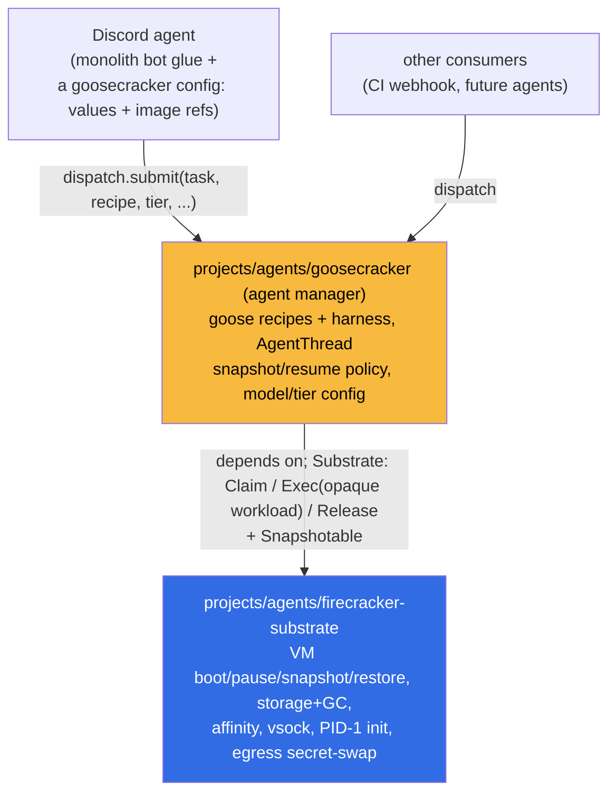

# ADR 025: Three-Layer Agent Stack (firecracker-substrate, goosecracker, discord-agent)

**Author:** jomcgi
**Status:** Draft
**Created:** 2026-06-28
**Builds on:** [019 - Substrate Executor + AgentWorkflow](019-substrate-executor-agentworkflow.md) (the `Substrate` seam and its "harness is a separate seam, `Exec` runs an opaque process" principle), [022 - Firecracker Snapshot/Restore Controller](022-firecracker-snapshot-restore-controller.md) (the `fc-agentd` controller this ADR re-bins), [024 - Discord Agent, Hosted-Model Tiers, and Live Artifacts](024-discord-agent-hosted-model-tiers-and-artifacts.md) (the consumer this ADR renames off the `goosecracker` label)

---

## Problem

The agent stack works end to end (022 + 023 + 024), but two naming-and-boundary issues have crept in as it grew, and they will get more expensive to fix the longer the Task 1 tiering work in 024 bakes in.

1. **The name `goosecracker` is overloaded onto the wrong layer.** Today `goosecracker` tags one specific consumer: the Discord-triggered artifact agent (the 024 build plan, `onepassworditem-goosecracker.yaml`). But the genuinely reusable, "off-the-shelf" thing in this stack is not that one Discord app, it is the generic agent manager (goose + snapshot/resume + per-thread config) sitting on the Firecracker primitives. The reusable layer has no name; a leaf consumer took the good one.

2. **Goose has leaked down into the Firecracker layer.** ADR 019 was explicit that the harness is a separate seam: "`Exec` runs an opaque process and streams its output, so the harness (Goose recipes today...) is a property of the workload image, not the platform." In practice `fc-agentd` and `projects/agent_platform/` now know about goose directly: `fc-agentd` "cold-boots a microVM, **runs goose**," the goose recipes live in `agent_platform/harness/recipes/`, and 024's Task 1 adds `GOOSE_MODEL` / per-tier env injection into `fc-agentd` itself. The bare-Firecracker work is useful on its own (microVM lifecycle, snapshot/restore, secret-swap egress, vsock), and it should be usable by a non-goose workload, but the current binding makes "Firecracker substrate" and "goose agent manager" the same artifact.

We want three separable layers with one clear name each, so that the Firecracker substrate is a thing you could run a non-goose workload on, `goosecracker` is the reusable agent manager you point new agents at, and a specific app like the Discord agent is visibly just a consumer.

---

## Decision

Adopt an explicit three-layer stack and name each layer. This is a boundary and naming decision; it re-bins existing components, it does not change the 022/023/024 mechanisms (snapshot/restore, egress secret-swap, tiers, artifacts) themselves.

**1. `firecracker-substrate` is the lowest layer: bare Firecracker primitives, goose-agnostic.** It owns microVM boot/pause/snapshot/restore, storage + GC, node/arch affinity, restore routing, the vsock transport, PID-1 init, and the egress secret-swap proxy. It satisfies ADR 019's `Substrate` core plus `Snapshotable`, and its `Exec` carries an **opaque** workload: it knows it is booting a VM and running a process, not that the process is goose. No `GOOSE_*`, no recipe knowledge, no model/tier vocabulary crosses into this layer.

**2. `goosecracker` is the generic agent manager on the substrate.** It is the reusable, off-the-shelf layer: it owns goose (recipes, the harness image), the AgentThread lifecycle as _agent_ concepts (snapshot/resume of a conversation, idle/quiescence policy), and per-thread **config** (model, tier, the injected env that selects a model endpoint). It consumes the substrate through the `Substrate`/`Snapshotable` seam and is the thing new agents are built against. "Generic agent on Firecracker that handles agent snapshot/resume/config" is exactly this layer.

**3. The Discord agent is a _configuration_ of goosecracker, not its own component.** It is not a third sibling directory. goosecracker is the deployable agent manager, and the Discord agent is one instance of it expressed in goosecracker's own Helm `values` plus its image build targets / refs (which recipe, which tier, which harness image). The genuinely Discord-specific glue (the `/goosecracker` slash trigger, the owner gate, the curated-transcript session per 024's Model B, result-out to `discord_outbox`) already lives in the monolith bot (`projects/monolith/chat/`, per 024) and stays there; it calls goosecracker's dispatch surface. So "discord-agent" is the name of a goosecracker configuration, and the `goosecracker` label comes off the bare app (the slash verb can stay `/goosecracker` as user-facing).

**4. Physical layout: `projects/agents/{firecracker-substrate,goosecracker}`, with goosecracker depending on firecracker-substrate.** Today's `projects/agent_platform/` moves to a new `projects/agents/` home holding the two layers as sibling directories. `firecracker-substrate/` is the bare-VM layer (decision 1); `goosecracker/` is the agent manager (decision 2) and declares a build/deploy dependency on `firecracker-substrate` (it consumes the substrate, never the reverse). The Discord agent's goosecracker-side footprint is values + image-build config inside `goosecracker/` (decision 3), so the directory tree has exactly two agent-platform projects, not three.

| Aspect                                           | Today                                                                | Decided                                                                                               |
| ------------------------------------------------ | -------------------------------------------------------------------- | ----------------------------------------------------------------------------------------------------- |
| Name `goosecracker` denotes                      | the one Discord artifact app (a leaf consumer)                       | the reusable agent-manager layer                                                                      |
| Firecracker layer's knowledge of goose           | `fc-agentd` runs goose; recipes + `GOOSE_MODEL` injection live in it | none; `Exec` runs an opaque workload (019's principle)                                                |
| Per-thread model/tier env injection (024 Task 1) | added to `fc-agentd` (substrate)                                     | owned by `goosecracker` (manager); substrate just injects an opaque env map                           |
| Discord app                                      | named `goosecracker`, its own thing                                  | a `goosecracker` configuration (values + image refs); glue stays in the monolith bot                  |
| Reusable "agent manager"                         | unnamed, fused with the substrate                                    | `goosecracker`, a distinct layer                                                                      |
| Directory layout                                 | `projects/agent_platform/` (one fused project)                       | `projects/agents/{firecracker-substrate,goosecracker}`, goosecracker depends on firecracker-substrate |

The litmus test for which layer a piece of code belongs to: **if it would have to change to run a non-goose workload, it is not `firecracker-substrate`.** Recipe handling, `GOOSE_MODEL`, tier-to-model mapping all fail that test and belong in `goosecracker`; VM boot, snapshot files, vsock, and the egress swap pass it and stay in `firecracker-substrate`.

---

## Architecture

The seam between `goosecracker` and `firecracker-substrate` is ADR 019's `Substrate` interface, used as 019 intended: `goosecracker` assembles the goose-specific workload (image, recipe, injected env including `GOOSE_MODEL` per tier) and hands it to the substrate as an opaque `Exec` payload. The substrate restores a VM and runs it without parsing what is inside. The control plane stays Postgres (`claude_agent.agent_threads`): `goosecracker` owns the agent-meaningful columns (recipe, tier, model, discord_thread), the substrate owns the placement-meaningful columns (node, snapshot file, state). On disk, today's `projects/agent_platform/` moves to `projects/agents/` and splits into two sibling projects: the goose-aware parts (`harness/recipes`, the tier/model env templates) become `projects/agents/goosecracker`, the VM/vsock/egress parts become `projects/agents/firecracker-substrate`. `goosecracker` declares the build/deploy dependency on `firecracker-substrate` and the dependency only ever points that way. The Discord agent adds no third directory: its goosecracker-side config (recipe, tier, harness image ref) is values + image-build targets inside `goosecracker`, and its trigger/gate/session glue stays in the monolith bot.

This is a re-bin, not a rewrite: `fc-agentd`'s reconcile loop stays where it is, but the `GOOSE_MODEL` / tier-to-env mapping that 024 Task 1 would add to it is instead computed by `goosecracker` and passed down as an already-opaque env map, so the substrate keeps a single `InjectedEnv` it does not interpret.

---

## Alternatives Considered

- **Leave it as two layers (substrate + everything else), keep `goosecracker` on the Discord app.** Rejected: it leaves the reusable manager unnamed and fused to the substrate, so "the Firecracker work is useful by itself" stays aspirational. The split is the whole point.
- **Make `goosecracker` the whole stack (substrate included) and name the Discord app separately.** Rejected: it keeps goose welded to the Firecracker primitives, so a non-goose workload could not reuse the substrate. The substrate's value is being harness-agnostic (019).
- **Fold goose lifecycle into `firecracker-substrate` and skip a middle layer.** Rejected: that is the current leak, made permanent. It violates 019's opaque-`Exec` principle and means every model/recipe change touches the VM controller.
- **Rename only, no code move.** Rejected as insufficient on its own: renaming without moving the `GOOSE_MODEL`/recipe code out of `fc-agentd` leaves the boundary fictional. The rename and the goose-leak cleanup are the same decision.

---

## Security

Baseline `docs/security.md`. This ADR moves no trust boundary; it clarifies where existing ones live.

- **The tier boundary (024) is a `goosecracker` concern, and that is correct.** Tier = the set of secrets/access a thread is granted (coding vs zero-secret artifact). It is an agent-manager policy, so it belongs in `goosecracker`, computed there and handed down. The substrate still only ever sees placeholders (023): it injects an opaque env and swaps secrets at the egress hop, never deciding tiers.
- **No new secret surface.** The OnePassword item, the egress `secrets` catalog, and the placeholder-swap all stay exactly as 023/024 defined them; only the label on the consuming app changes.
- **Opaque `Exec` is a mild security positive.** A substrate that does not parse its workload has less reason to grow workload-specific privilege; the goose-aware logic stays in the layer that already needs it.

---

## Risks

| Risk                                                                                        | Likelihood | Impact | Mitigation                                                                                                                                                                                                                                                                                                    |
| ------------------------------------------------------------------------------------------- | ---------- | ------ | ------------------------------------------------------------------------------------------------------------------------------------------------------------------------------------------------------------------------------------------------------------------------------------------------------------- |
| Rename churn breaks references (1Password item name, chart names, slash command) mid-flight | Medium     | Low    | Keep the user-facing `/goosecracker` verb; rename the component/dirs in one focused PR with `format` regenerating manifests; the 1Password item path can stay if renaming it is not worth the secret re-sync                                                                                                  |
| The seam is drawn but goose still leaks back into the substrate over time                   | Medium     | Medium | The litmus test (would it change for a non-goose workload?) is the review gate; a non-goose smoke workload through `Exec` would prove the seam, but is not required up front                                                                                                                                  |
| Two layers over-engineer a one-consumer reality                                             | Low        | Low    | The split already exists physically (`agent_platform/` is goose-aware and VM code fused); this is two sibling dirs under `projects/agents/`, not new machinery, and the Discord agent adds no directory (it is goosecracker config). If a second consumer never appears, the cost is one extra directory name |
| 024 Task 1 lands the tier env in `fc-agentd` before this re-bin                             | Medium     | Low    | Sequence this ADR ahead of (or fold into) Task 1 so the tier-to-env mapping is written in `goosecracker` from the start, not moved later                                                                                                                                                                      |

---

## Open Questions

These are settled during execution, not gates on the decision.

1. ~~Where do the two layers live on disk?~~ **Decided (decision 4): `projects/agents/{firecracker-substrate,goosecracker}`**, two sibling projects under a new `projects/agents/` home (moving today's `projects/agent_platform/`), with `goosecracker` depending on `firecracker-substrate`. The Discord agent is a goosecracker configuration, not a third directory.
2. Is the `goosecracker` 1Password item / Secret renamed to track the layer, or left as-is to avoid a secret re-sync? (Leaning: leave the secret, rename the app.)
3. Does the `Substrate` `Exec` payload need a richer typed shape to carry the goose workload cleanly (image + env + recipe ref), or is the existing opaque env map enough?
4. Is a single non-goose smoke workload worth running through `Exec` to prove the substrate is genuinely harness-agnostic, or is the litmus-test review gate sufficient?

---

## References

| Resource                                                                                                             | Relevance                                                                                               |
| -------------------------------------------------------------------------------------------------------------------- | ------------------------------------------------------------------------------------------------------- |
| [019 - Substrate Executor + AgentWorkflow](019-substrate-executor-agentworkflow.md)                                  | The `Substrate` seam and the "harness is a separate seam, `Exec` is opaque" principle this ADR enforces |
| [022 - Firecracker Snapshot/Restore Controller](022-firecracker-snapshot-restore-controller.md)                      | The `fc-agentd` controller that becomes `firecracker-substrate`                                         |
| [024 - Discord Agent, Hosted-Model Tiers, and Live Artifacts](024-discord-agent-hosted-model-tiers-and-artifacts.md) | The consumer renamed to `discord-agent`; its Task 1 tier env is re-homed into `goosecracker`            |
| [010 - Recipe-Driven Agent Registry](010-recipe-driven-agent-registry.md)                                            | Goose recipes as agent definitions; a `goosecracker`-layer concern                                      |
| `projects/agent_platform/README.md`                                                                                  | The current (fused) layout this ADR splits                                                              |
