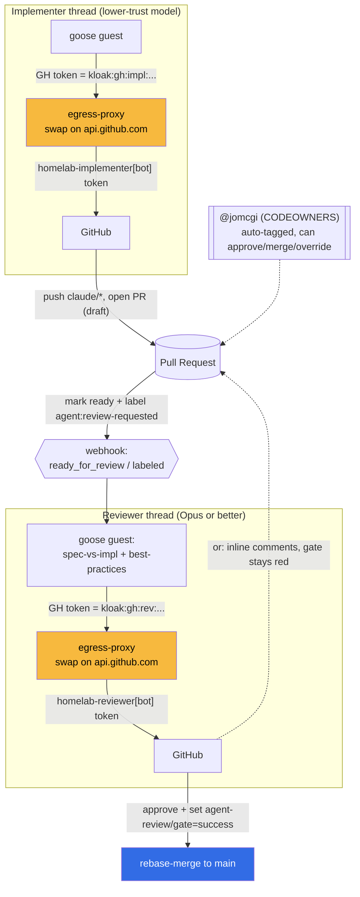

# ADR 027: Agent GitHub App Roles: Implementer and Reviewer

**Author:** jomcgi
**Status:** Draft
**Created:** 2026-06-29
**Builds on:** [023 - Egress Secret Proxy](023-egress-secret-proxy.md) (the placeholder-swap that injects a credential at the egress hop, never in-guest), [024 - Discord Agent, Hosted-Model Tiers, and Artifacts](024-discord-agent-hosted-model-tiers-and-artifacts.md) (the coding tier that today receives a single `gh` token placeholder), [025 - Three-Layer Agent Stack](025-three-layer-agent-stack-goosecracker.md) (goosecracker as the per-thread config surface that decides what a guest is granted)

---

## Problem

The coding tier (024) gives an agent guest one `gh` token (a placeholder swapped to the real credential at the 023 egress hop). That single identity does everything: it clones, pushes `claude/*` branches, opens PRs, and could, with the right token scopes, approve and merge them. One identity for write-the-code and approve-the-code collapses the separation of duties we would never accept from a human, and it does it precisely where we are *least* sure of the actor, an agent that may be prompt-injected by the very repo content it is reading.

We also want to run the implementer on a cheaper, less-trusted model (not necessarily Opus level) while keeping the gate that lets work reach `main` on a high-trust adversarial reviewer (Opus or better). Today nothing in the GitHub identity model reflects that trust split: both halves act as the same bot, so the diff record cannot even tell you which model wrote a line and which one cleared it.

We want two distinct GitHub identities, mapped to two roles, with capabilities that match each role's trust level:

- **implementer**: writes code, pushes branches, opens PRs, requests review. Lower-trust model. Cannot approve or merge.
- **reviewer**: adversarial analysis (implementation versus spec, correctness, best practices), Opus or better. Can approve and merge, or leave comments and hold the gate.

And `@jomcgi` stays the human owner who is always tagged and can always step in.

---

## Decision

Five decisions.

**1. Two GitHub Apps, one per role: `homelab-implementer` and `homelab-reviewer`.** Each is installed on `jomcgi/homelab` and acts under its own `[bot]` identity (`homelab-implementer[bot]`, `homelab-reviewer[bot]`), so every commit, PR, review, and merge is attributed to the role that performed it. GitHub Apps (not machine-user PATs) are the identity mechanism: installation tokens are short-lived, scoped per-installation, occupy no seat, and the app private key never has to live in a guest (see decision 4). The trust split becomes a *capability* split, enforced by GitHub, not a convention we hope the model honors.

**2. Capabilities are scoped so the implementer structurally cannot merge.** The two apps get deliberately asymmetric permissions:

| Capability                     | `homelab-implementer`            | `homelab-reviewer`        |
| ------------------------------ | -------------------------------- | ------------------------- |
| Contents (push `claude/*`)     | write                            | read                      |
| Pull requests (open, comment)  | write                            | write                     |
| Submit a review / approve      | no                               | yes                       |
| Merge a PR                     | no                               | yes                       |
| Checks (set the review gate)   | no                               | write                     |
| Branch targets                 | `claude/*` only (pattern-scoped) | n/a                       |

The implementer's installation token cannot approve, cannot merge, and cannot clear the review gate. Even a fully prompt-injected implementer thread therefore cannot land code on `main`: the worst it can do is push to a `claude/*` branch and open a PR, which is exactly the reviewable surface we want it confined to. This is the same "the tier is the set of secrets the guest receives" principle as 024, extended to GitHub capability: the role *is* its token's permission set.

**3. The merge gate is a required status check the reviewer controls, not a CODEOWNERS entry for the reviewer.** GitHub's `CODEOWNERS` only accepts users, teams, and emails; a GitHub App's `app[bot]` identity is none of those and **cannot be listed as a code owner**. So "reviewer is a code owner" is realized functionally, not literally:

- `CODEOWNERS` keeps `* @jomcgi` (the human owner, auto-requested on every PR, able to approve or merge at will).
- Branch protection on `main` requires a status check, `agent-review/gate`, to be green before merge.
- The reviewer app sets `agent-review/gate` to `success` when, and only when, it approves; it leaves it `failure`/`pending` when it requests changes.

The functional set of "who can let code into `main`" is therefore `{ homelab-reviewer (via the gate), @jomcgi (human owner/admin override) }`, which is exactly the intended code-owner set. The reviewer is a code owner in capability even though GitHub will not let a bot be one in `CODEOWNERS` text.

**4. The role credential is injected per-thread via the 023 egress swap, exactly like 024's tier env.** goosecracker (025) already decides per thread what a guest is granted. The role is one more dimension of that decision: an implementer thread gets the `homelab-implementer` installation token as a placeholder; a reviewer thread gets the `homelab-reviewer` placeholder. The real installation token is minted from the app private key and swapped in at the `api.github.com` egress hop; the guest holds only `kloak:gh:<role>:<...>`, never a usable token, and nothing real enters the microVM or its snapshot. This splits 024's single `gh` token into two role-scoped GitHub App tokens with no new mechanism: it is two `egress.secrets` entries instead of one, keyed by role.

**5. The reviewer triggers on "ready for review" plus an explicit hand-off from the implementer, and ends in approve-and-merge or comment-and-hold.** The implementer signals completion by marking the PR ready for review and applying the `agent:review-requested` label (a label, not a GitHub "request review from app", which is not a dependable path for App identities). The reviewer app listens for `pull_request.ready_for_review` and `pull_request.labeled` on that label, then runs an adversarial pass:

- **implementation versus spec**: does the diff do what the linked plan / ADR / issue said, no more and no less.
- **correctness and best practices**: the same lens as the `code-review` skill, plus repo conventions (CLAUDE.md, security baseline).

It then either **approves, sets `agent-review/gate` green, and rebase-merges**, or **submits inline review comments (request changes), leaving the gate red** for the implementer to address in a new round. Either way `@jomcgi` is auto-tagged and can override.

---

## Architecture

Branch protection on `main`: require a pull request, require the `agent-review/gate` check to pass, restrict who may push (no direct pushes), `CODEOWNERS = * @jomcgi`. The implementer's `claude/*`-scoped, no-merge token plus the reviewer-controlled gate are what make the autonomous loop safe without a human in the inner loop, while leaving the human owner a one-click override.

---

## Alternatives Considered

- **One GitHub App, one identity (status quo from 024).** Rejected: write-the-code and approve-the-code under one bot is the separation-of-duties failure this ADR exists to fix, and it is worst exactly where the actor is least trusted.
- **Machine-user accounts (real GitHub users) for the bots.** This is the only way to put a bot literally in `CODEOWNERS` and satisfy "require review from code owners". Rejected as the primary path: a machine user needs a long-lived PAT (the credential 023 is designed to avoid holding), consumes a seat, and is a standing high-value secret. The required-status-check gate gives the same merge control with short-lived installation tokens. Held in reserve only if a future rule genuinely needs literal code-owner-required review from the reviewer.
- **`CODEOWNERS` with a `@jomcgi/reviewers` team containing the bot.** Does not work: teams contain users, not GitHub App identities, so the app still is not an eligible owner. No path around the platform limitation.
- **GitHub "request a review from the App" as the trigger.** Rejected as the dependable trigger: requesting review from an App identity is not a reliable, generally-available flow. A label plus `ready_for_review` is robust and explicit, and the implementer applies it itself as the hand-off signal.
- **Require code-owner review (`@jomcgi`) on every PR.** Rejected for the autonomous loop: it would put the human in the inner loop on every change, defeating the point. `@jomcgi` stays an owner who *can* act, gated by the reviewer check for the automated path. A path-scoped second `CODEOWNERS` rule could still force human review on genuinely sensitive directories later (see Open Questions).
- **Implementer pushes straight to `main` behind the gate.** Rejected: the gate is a PR-merge gate; the value is the reviewable PR surface and the `claude/*`-only push scope that boxes in a compromised implementer.

---

## Security

Baseline `docs/security.md`. Role-specific posture:

- **Least privilege by role.** The implementer token is `claude/*`-scoped, no-approve, no-merge, no-checks. Compromise (including prompt injection from repo content) is bounded to opening a PR, never landing one. The high-trust capability (merge, gate) lives only with the reviewer.
- **No token in the guest.** Both role tokens are 023 placeholders swapped at the `api.github.com` egress hop; the app private keys live with the egress proxy, never in a microVM or snapshot. Revocation is per-app (rotate one app's key without touching the other).
- **Attribution.** Every action is attributed to `homelab-implementer[bot]` or `homelab-reviewer[bot]`, so the audit trail shows which role (and thus which trust tier) did what, including in the merge commit.
- **The reviewer cannot approve the implementer's lapse into its own role.** Because the apps are distinct installations with distinct tokens, the implementer literally cannot mint a reviewer token from inside its thread; the role boundary is a credential boundary, not a code path the model could talk its way across.
- **Self-approval is doubly blocked.** GitHub already forbids an actor approving its own PR; here the implementer additionally lacks the approve and gate capabilities entirely.

---

## Risks

| Risk                                                                                              | Likelihood | Impact | Mitigation                                                                                                                                  |
| ------------------------------------------------------------------------------------------------- | ---------- | ------ | ------------------------------------------------------------------------------------------------------------------------------------------- |
| Reviewer rubber-stamps (approves weak diffs), eroding the gate's value                             | Medium     | High   | Reviewer is Opus-or-better and adversarial by prompt (spec-vs-impl, refute-first); `@jomcgi` spot-checks merged agent PRs; tune the rubric. |
| `agent-review/gate` can be set green by something other than the reviewer's genuine approval       | Low        | High   | Only the reviewer app holds `checks:write`; the implementer token cannot set it; branch protection requires the check by name.              |
| GitHub changes App/CODEOWNERS behavior (e.g. apps become eligible owners)                          | Low        | Low    | The gate is independent of CODEOWNERS; if apps become owners we can simplify, not unblock.                                                  |
| Label-based trigger is spoofable by anyone who can label PRs                                       | Low        | Medium | Repo is single-owner; only `@jomcgi` and the two apps can label; reviewer re-derives the spec from the linked plan, not from the label.     |
| Implementer opens a flood of PRs                                                                   | Low        | Low    | `claude/*`-scoped, no-merge; reviewer (and human) are the throttle; rate concerns are a goosecracker dispatch concern (025), not GitHub.    |

---

## Open Questions

1. **Per-path human gate.** Should a second `CODEOWNERS` rule force `@jomcgi` review on sensitive directories (e.g. `bazel/`, `projects/platform/`, `.github/`) even when the reviewer approves? Leaning yes for a small allow-list.
2. **Reviewer-merge versus reviewer-approve-only.** Does the reviewer auto-rebase-merge on green, or approve-and-leave-merge to `@jomcgi`/auto-merge? Default proposed: reviewer merges, but a "high-risk" label downgrades it to approve-only.
3. **Where the reviewer gets the spec.** The reviewer needs the canonical spec to compare against (linked ADR/plan/issue). Convention for how the implementer links it in the PR body needs nailing down so the reviewer is not guessing intent.
4. **One app with two installations versus two apps.** Two apps is cleaner for per-role keys and revocation; revisit only if app-registration overhead bites.

---

## References

| Resource                                                                                   | Relevance                                                                  |
| ------------------------------------------------------------------------------------------ | -------------------------------------------------------------------------- |
| [ADR 023 - Egress Secret Proxy](023-egress-secret-proxy.md)                                 | The placeholder-swap mechanism that injects each role token at egress.     |
| [ADR 024 - Discord Agent, Hosted-Model Tiers, Artifacts](024-discord-agent-hosted-model-tiers-and-artifacts.md) | The single `gh` token coding tier this ADR splits into two role tokens.    |
| [ADR 025 - Three-Layer Agent Stack](025-three-layer-agent-stack-goosecracker.md)            | goosecracker as the per-thread config surface that selects the role.       |
| [GitHub: About code owners](https://docs.github.com/articles/about-code-owners)             | Confirms only users/teams/emails are eligible owners (not App bots).       |
| [GitHub: About protected branches](https://docs.github.com/articles/about-protected-branches) | Required status checks as the merge gate the reviewer controls.            |
| [GitHub Apps: installation access tokens](https://docs.github.com/apps/creating-github-apps) | Short-lived, per-installation scoped tokens as the role identity.          |
