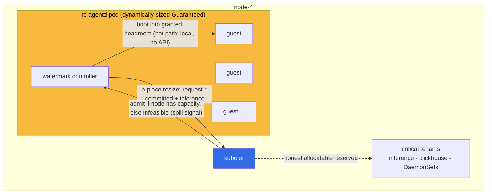
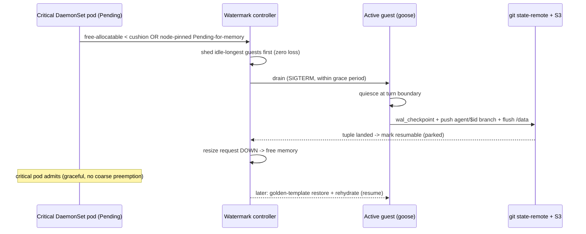
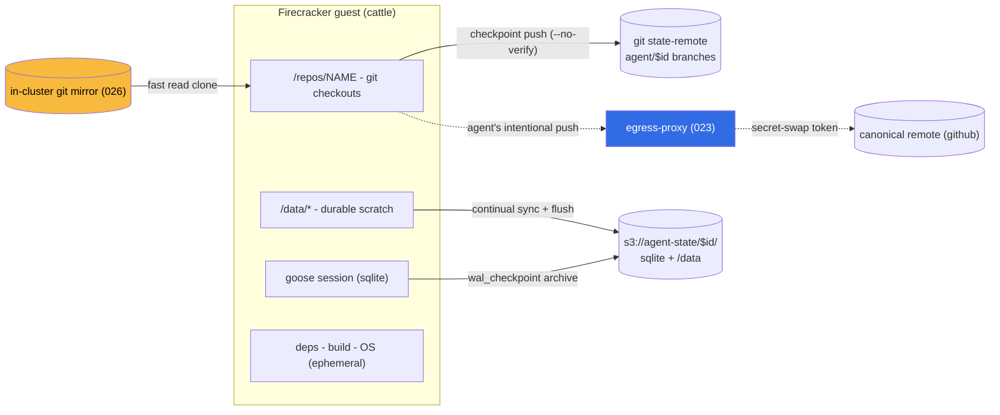

# ADR 028: Elastic Agent-MicroVM Capacity and State-Preserving Reclaim

**Author:** jomcgi
**Status:** Draft
**Created:** 2026-06-29
**Builds on:** [022 - Firecracker Snapshot/Restore Controller](022-firecracker-snapshot-restore-controller.md) (the `fc-agentd` FC-direct substrate, Postgres registry, and the pod-vs-FC-direct question it flagged as revisit-able), [023 - Egress Secret Proxy](023-egress-secret-proxy.md) (vsock-only egress + per-tier secret-swap), [024 - Discord Agent, Hosted-Model Tiers, and Artifacts](024-discord-agent-hosted-model-tiers-and-artifacts.md) (the tier model), [025 - Three-Layer Agent Stack](025-three-layer-agent-stack-goosecracker.md) (substrate vs goosecracker layering), [026 - Fast MicroVM Cold Starts and Stateful Artifact Iteration](026-fast-microvm-starts-and-stateful-artifact-iteration.md) (CoW rootfs + event-driven dispatch + goose-session persistence, which this generalizes), [041 - Hot Git Mirror](041-hot-git-mirror-agent-workspaces.md) (the fast workspace read path), [platform/010 - Memory Oversubscription](../../../projects/platform/ARCHITECTURE.md) (the disposable-victim tier these microVMs live in)

---

## Problem

The disposable agent-microVM tier (`fc-agentd`, ADR 022) shares node-4 with memory-critical tenants: inference, ClickHouse, embeddings, and node-pinned observability DaemonSets. We want to run **many mostly-idle agents that burst into the node's real free memory** at Lambda-class wake latency, while never losing the critical tenants' memory and never losing an agent's in-flight work. Three things are unresolved, and two have already caused incidents:

1. **Honest accounting vs burst.** `fc-agentd`'s guests are child processes inside its container cgroup (`launcher.go`), not pods. A static low-request/high-limit pod therefore either caps burst at the static limit (no burst into real free memory) or lies to the scheduler about how much memory is free (other pods get placed → node OOM). PR #2889 already hit the failure where a second guest breached the cgroup limit and could OOM-kill the daemon.

2. **Critical-tenant coexistence.** When a node-critical tenant's request grows (e.g. an observability DaemonSet doubles its request), the agent tier must give memory back. The only native mechanism, scheduler preemption, operates on whole pods, so it would drop a _node's worth_ of agents at once, including **active** ones. That is not a free latency bounce: it loses uncommitted work, wastes inference tokens, and can duplicate non-idempotent side effects.

3. **Partial state externalization.** ADR 026 persists the goose **session** for artifact iteration, but an agent's full working state, multi-repo working trees and scratch data, is not externalized. Reclaiming an active agent therefore still loses work.

A fourth, prerequisite question re-opened during design: externalizing all state (3) makes **pod-shaped kata-fc** tempting again (it would hand admission, OOM-victim ordering, and lifecycle to the kubelet for free), so the FC-direct choice from ADR 022 needs an explicit re-decision rather than inertia.

---

## Decision

Four decisions. The first sets the substrate; the rest are how we safely own the capacity and reclaim machinery that the substrate choice means k8s will not do for us.

### 1. Reaffirm FC-direct; per-thread VM snapshots are dropped, the golden template stays

We reconsidered collapsing this tier onto pod-shaped kata-fc and **reaffirm the FC-direct controller** (ADR 022). The target is Lambda-class sub-100 ms warm starts via **golden-template restore (~28 ms, measured in 022) + dynamic vsock task assign**, and kata-fc exposes no snapshot/restore at the pod/CRI layer. gVisor/kata-on-k8s is a _solved problem with a known latency floor_ (sandbox-create + CNI, hundreds of ms to ~1 s) that cannot be driven below through the kubelet path. So we keep the bespoke controller and own admission/OOM/reclaim ourselves: decisions 2-4 are how we own them safely.

Because all durable state moves out of the VM (decisions 3-4, extending ADR 026's session move), **per-thread VM memory snapshots are dropped**: they add per-thread storage + lifecycle and are node/ISA-bound. The only surviving snapshot is the single, shared, task-agnostic **golden template** used as a boot accelerator for every fresh VM.

### 2. Dynamically-sized Guaranteed capacity (honest burst, k8s off the hot path)

"Burstable **and** honest accounting" is only contradictory for a _static_ request. Resolve it with a request that tracks live usage:

- `fc-agentd` resizes **its own pod request** via in-place pod resize (GA in k8s 1.33; the cluster is 1.35) up as it admits guests and down as they exit. The request always ≈ committed guest memory, so the scheduler sees the truth.
- This is **dynamically-sized Guaranteed**, not classic burstable. Boots are gated on _request_ headroom and limit moves with request, so committed can never exceed request, honest by construction. The burst lives in the **time dimension** (request grows fast on demand), not in a static request↔limit gap.
- A **headroom watermark controller** keeps k8s off the hot path: it maintains `request = (committed + tolerance)` with hysteresis on the down-move. Boots consume pre-granted tolerance via a local, instant check (no API call); the controller refills the buffer asynchronously. Only burst _beyond_ tolerance touches the API and briefly queues, which is correct backpressure at the node's edge.
- The **kubelet's resize admission is the "admit on actual free overhead" gate** (it runs the authoritative node-capacity math, including kube/system-reserved and every other pod). An `Infeasible` resize is the spill signal.

Guests stay in the daemon cgroup: resizing the pod grows exactly the cgroup the guests live in, so the `launcher.go` fact that was a liability under a static limit becomes the asset that makes the resize honest.

### 3. State-preserving graceful reclaim (idle-first ladder, drain → checkpoint → park → rehydrate)

Reclaim must never lose active work. The controller has two inputs feeding one actuator (shed guests, then resize request down):

- **Proactive (cushion clamp).** Keep `node_free_allocatable ≥ critical_reserve`. Routine critical-tenant growth lands in the cushion with zero reaction.
- **Reactive (node-pinned Pending watch).** Watch higher-priority **DaemonSet / node-pinned** pods that are Pending-for-memory on node-4. These are unambiguous (a DaemonSet pod is bound to the node), so shedding here is always the right fix, which keeps the controller a _capacity yielder_, not a reimplemented scheduler.

Victim selection is a ladder: **idle-longest → idle** (zero loss; state is externalized) **→ active** (graceful drain, last resort). Because accounting is honest, the node stays within allocatable, so reclaim happens via **scheduler preemption** (which honors `terminationGracePeriodSeconds`) rather than instant kernel OOM-kill. That grace window lets an active victim: quiesce goose at a turn boundary → `wal_checkpoint` → archive its consistent checkpoint tuple → mark resumable. The disposable PriorityClass + guest-first `oom_score_adj` (PR #2889) is the last-resort backstop. A drained agent becomes a **parked** thread (state in git + S3, ~free) and resumes (golden-template fast boot + rehydrate) when capacity returns or, later, on another node. Parking-then-resuming is a feature (a lossless backpressure valve), not a degraded fallback.

### 4. Filesystem-as-durability-contract (two pets + `/data`, consistent tuple, `agent/$id`)

The golden-template VM is **cattle**; a file's **path declares its durability class**:

| Zone                              | Durability    | Mechanism                                                                                                                                                                     |
| --------------------------------- | ------------- | ----------------------------------------------------------------------------------------------------------------------------------------------------------------------------- |
| `/repos/<name>`                   | git-versioned | WIP branch `agent/$id` force-pushed to an in-cluster **state remote** (not the canonical upstream), `git commit --no-verify` to bypass the conventional-commit + format hooks |
| `/data/*`                         | latest-only   | continual incremental sync to `s3://agent-state/$id/data/` + a final turn-boundary flush                                                                                      |
| everything else (deps, build, OS) | ephemeral     | recomputed from the two zones on resume                                                                                                                                       |

The checkpoint is a **consistent tuple**, `(session sqlite ref, [(repo, SHA)…], /data ref)` captured at one turn boundary, marked resumable only after **all** parts land, with the exact refs pinned in the `agent_threads` row (the naming convention _locates_, the row _determines_, since the branch is force-pushed). Three byte-flows out of the VM stay separate: **fast mirror reads** (026), **automatic invisible durability** (this ADR), and the agent's **intentional upstream push** (023 egress secret-swap, on the agent's judgment). The agent never saves defensively; it pushes upstream only when it means to. Any external side effect (PR creation, Discord post) must be idempotent so drain/replay cannot duplicate it.

---

## Architecture

### Capacity control loop

### Critical-tenant reclaim and state-preserving drain

### State model: path = durability class, three byte-flows

---

## Alternatives Considered

- **Pod-shaped kata-fc for this tier.** Native admission/OOM/lifecycle, but no snapshot/restore at the CRI layer and a hundreds-of-ms-to-second cold-start floor; cannot meet the sub-100 ms target. Rejected (decision 1).
- **Classic burstable QoS (request < limit).** Over-promises the node by the request↔limit gap, the dishonest model that risks node OOM. Rejected in favor of dynamically-sized Guaranteed.
- **Static `MaxConcurrent` cap.** Bounds burst to a fixed N regardless of real free memory. Replaced by free-aware in-place resize.
- **Warm pool of pre-booted VMs.** Pays idle RAM on a memory-bound node and absorbs burst only up to pool size. Rejected (ADR 026 also rejected it); golden-template restore-on-demand gives the latency without the standing memory.
- **Per-thread VM memory snapshots.** Per-thread storage + lifecycle, node/ISA-bound. Replaced by golden-template + rehydrate (continuing ADR 026's session move).
- **Ballast pods, 1:1 per guest.** Makes node-accounting honest by making _per-pod_ accounting dishonest (kubelet metrics lie) and creates a dual-source-of-truth sync problem between scheduler and daemon, an antipattern. In-place resize is the truthful mechanism because the guests genuinely live in the daemon cgroup. The **coarse-pool** form is retained only as a possible future cross-node-placement upgrade (Open Questions).
- **Sharding `fc-agentd` into M pods.** Shrinks coarse-preemption blast radius, but pays M× tolerance buffers + bin fragmentation on the scarce resource (memory), plus StatefulSet identity for devmapper ID bands and intra-node placement. Deferred as YAGNI with a tripwire (Open Questions); idle-first shedding + graceful drain address the same worry without the standing cost.

---

## Security

Baseline: `docs/security.md`. Untrusted agent code stays behind the **Firecracker hardware-VM boundary** (unchanged from 022). Egress remains **vsock-only through the ADR 023 secret-swap proxy** (no guest NIC): `/data` S3 sync and the agent's intentional upstream pushes both route through it, so the guest never holds raw S3 or GitHub credentials. Ephemeral per-thread **checkpoint branches go to an internal state remote**, never the canonical upstream (no CI/webhook triggering, no junk branches on real repos). External side effects require an **idempotency contract** (idempotency keys / create-if-not-exists) so drain-and-replay cannot duplicate a PR or a Discord post.

---

## Risks

| Risk                                                            | Likelihood | Impact | Mitigation                                                                                                                                                        |
| --------------------------------------------------------------- | ---------- | ------ | ----------------------------------------------------------------------------------------------------------------------------------------------------------------- |
| Watermark controller stalls                                     | Low        | Low    | Fails safe as **over-reservation** (wasted memory, no OOM); kubelet eviction is the backstop                                                                      |
| Burst exceeds tolerance faster than resize lands                | Medium     | Low    | Size tolerance to (arrival rate × resize-actuation interval); excess queues = correct backpressure                                                                |
| Drain exceeds grace period (many active guests / large `/data`) | Low        | Medium | Continual `/data` sync (final flush is a small delta); per-turn sqlite checkpoint; idle-first so active guests rarely drain; size `terminationGracePeriodSeconds` |
| Non-idempotent side effect replayed on resume                   | Medium     | Medium | Harness idempotency contract for all external actions                                                                                                             |
| Checkpoint-pair desync (session vs files)                       | Low        | High   | Consistent tuple; mark resumable only after **all** parts land; pin exact refs in the row                                                                         |
| In-place resize memory-limit-_decrease_ semantics on k3s 1.35   | Medium     | Low    | Kill-then-shrink order (limit shrinks only after pages free); validate in implementation                                                                          |
| Resize churn / API load                                         | Low        | Low    | Hysteresis band + buffered step sizing                                                                                                                            |

---

## Open Questions

1. **Cross-node spill** once a second agent host exists: a fleet placement layer (Lambda Worker-Manager / E2B-orchestrator shape, tracking per-node free capacity) vs the coarse-pool ballast form. Snapshots are node/ISA-bound, so each target node needs its own golden template. Until then, the registry's node assignment is made placement-writable but the `Infeasible` resize is only a signal.
2. **UFFD page-sharing** across guests restored from one golden template, the density unlock on a memory-bound node; deferred optimization (ADR 022 noted restore works without UFFD today).
3. **Tolerance + critical-reserve cushion sizing**, derive from observed arrival rate and critical-tenant request volatility, not guessed.
4. **Single pool vs sharding**, keep `fc-agentd` a single pool until observed coarse-preemption frequency × rehydrate-bounce cost crosses a tripwire; only then shard (small M, StatefulSet).

---

## References

| Resource                                                                                                               | Relevance                                                                                       |
| ---------------------------------------------------------------------------------------------------------------------- | ----------------------------------------------------------------------------------------------- |
| [ADR 022](022-firecracker-snapshot-restore-controller.md)                                                              | The FC-direct controller, Postgres registry, and golden-template restore latency this builds on |
| [ADR 026 (fast starts)](026-fast-microvm-starts-and-stateful-artifact-iteration.md)                                    | CoW rootfs, event-driven dispatch, and the session-persistence move this generalizes            |
| [ADR 041 (hot git mirror)](041-hot-git-mirror-agent-workspaces.md)                                                     | The fast workspace read path the durability flows sit beside                                    |
| [ADR 023](023-egress-secret-proxy.md)                                                                                  | vsock-only egress + secret-swap that `/data` sync and intentional pushes ride                   |
| [platform/010](../../../projects/platform/ARCHITECTURE.md)                                     | Disposable-victim PriorityClass + burstable oversubscription this extends                       |
| [e2b-dev/infra](https://github.com/e2b-dev/infra)                                                                      | Apache-2.0 reference for pool/placement, diff bundles, UFFD resume                              |
| [Kubernetes in-place pod resize](https://kubernetes.io/docs/tasks/configure-pod-container/resize-container-resources/) | GA in 1.33; the mechanism behind dynamically-sized Guaranteed                                   |
