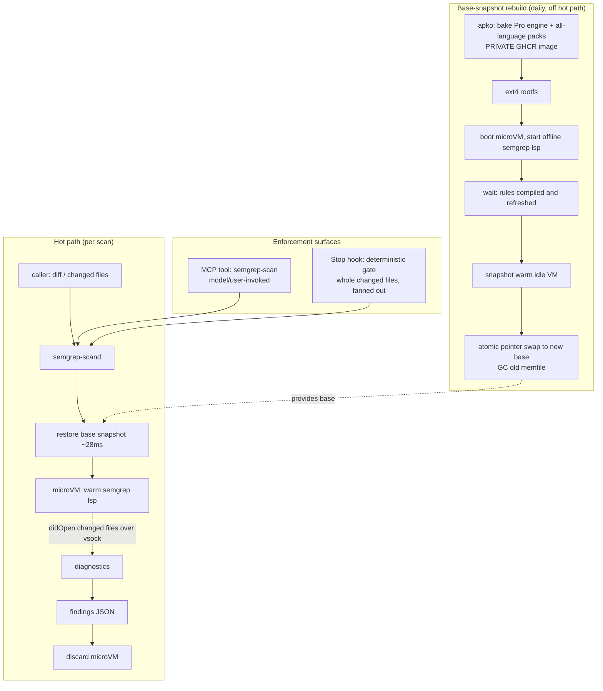

# ADR 029: Firecracker-Isolated, Snapshot-Warm Semgrep Scan Service

**Author:** Joe McGinley
**Status:** Accepted
**Created:** 2026-06-29

---

## Problem

We want a fast, isolated way to run our full Semgrep ruleset (the local rules in
`bazel/semgrep/rules/` plus the licensed Pro packs) against a diff on demand, so
that Claude and other tooling can get a security verdict on changed code in well
under a second, without waiting for the slow BuildBuddy CI cycle.

Two constraints shape the design:

1. **Isolation is required.** Scans may run over diffs from less-trusted sources
   (external PRs, arbitrary repos surfaced through the agent platform), and even
   for trusted diffs we do not want a malicious file to exploit the parser in a
   shared process. Semgrep statically parses, it does not execute the code, so the
   threat model is a parser bug, but a microVM boundary per scan is cheap defence
   in depth and gives a clean no-state-bleed guarantee between scans.

2. **The Pro rules must not leak.** The Pro engine and rule packs are licensed.
   Any artifact that embeds them (a container image, a memory snapshot) has to be
   treated as private.

The naive approach, invoking `semgrep` per request, is too slow: rule compilation
for the Pro ruleset dominates, and it recurs on every invocation. We need a design
where the expensive, deterministic work (compiling rules) is paid once and
amortized across every scan.

---

## Decision

Build **`semgrep-scand`**, a node-4 daemon that serves scans by restoring a
**snapshot of a microVM running a warm, fully-offline `semgrep lsp`** whose rule
packs are already compiled into memory. Each scan restores the base snapshot
(~28ms), feeds the changed file(s) into the resident language server over vsock,
collects diagnostics, and discards the VM. There is no persistence: the path is
stateless restore-scan-discard.

This sits **alongside** the existing `fc-agentd` agent tier but is a **separate
daemon with its own pod and cgroup**. It reuses the Firecracker launch,
`oom_score_adj`, and concurrency-cap machinery (factored into a shared library)
but deliberately bypasses the agent-thread lifecycle: no Postgres thread registry,
no 5-second reconcile tick, no idle/wake. A scan is a request/response, not a
long-lived actor.

We scan the **whole changed file**, not just the changed hunks. Hunk-only scanning
is faster but gives Semgrep a fragment, losing cross-function taint and dataflow
context. A security gate should not silently trade correctness for latency; the
cost is a slower tail on large changed files, which is acceptable.

| Aspect              | Naive `semgrep` per request | Decided (`semgrep-scand`)                            |
| ------------------- | --------------------------- | ---------------------------------------------------- |
| Rule compile        | Per scan (seconds)          | Once per base-snapshot rebuild (daily, off hot path) |
| Per-scan cost       | Compile + match (seconds)   | Restore ~28ms + match                                |
| Isolation           | Shared process              | Fresh microVM per scan, discarded                    |
| Rule sourcing       | Live, cloud-dependent       | Baked into a private image, fully offline            |
| State between scans | Process-shared              | None (discard after each)                            |
| Lifecycle           | n/a                         | Stateless restore-scan-discard, separate cgroup      |

### Why residency is required (measured)

A spike measured the real Pro engine (`semgrep-core-proprietary` 1.168.0) against
the real Pro packs pulled from GHCR, scanning a single file with no interfile
analysis:

| Language      | Rules | Cold rule-compile (per scan) | Warm match, whole ~200-line file | Peak RSS  |
| ------------- | ----- | ---------------------------- | -------------------------------- | --------- |
| Python        | 1074  | 2.3 to 3.0s                  | ~0.85s (via LSP)                 | ~1.0 GiB  |
| JavaScript/TS | 314   | 0.67s                        | cheaper                          | ~0.32 GiB |
| Go            | 113   | 0.25s                        | cheaper                          | ~0.18 GiB |

The cold compile is flat regardless of diff size (an empty target still costs
2.56s for Python), so recompiling per scan loses by roughly 8x on Python and
cannot meet a sub-second goal. Confirming the snapshot economics: the residency
mechanism keeps the ~3s Python compile in the frozen memory image and pays it once
per daily rebuild, while every scan that day restores past it. A realistic small
diff with multicore matching warm-scans in ~90ms; the ~0.85s figure is the
worst-case whole large Python file.

The residency mechanism itself was proven locally: `semgrep lsp` holds the packs
compiled in memory and returns real findings across repeated scans.

---

## Architecture



The two enforcement surfaces share the same backend. The **MCP tool** is the
polite door, invoked when Claude or a user chooses to scan. The **Stop hook** is
the deterministic gate: on turn end it runs `git diff` filtered to
`.py/.go/.js/.jsx/.ts/.tsx/.rs`, sends the whole changed files (fanned out
concurrently so a multi-file diff does not serialize), and blocks the turn with an
actionable reason if there are ERROR-level findings; the next turn's scan clears
the block once they are fixed. The hook is a shell command, so it calls the
`semgrep-scand` HTTP backend directly. Prompting and CLAUDE.md cannot force the
model to call the MCP tool, only a hook executed by the harness is deterministic.

### Fully-offline operation is mandatory

The microVM has no cloud egress, and `semgrep lsp` will hang on a Semgrep-cloud
"deployment" fetch unless told not to. Counterintuitively, `SEMGREP_APP_TOKEN`
set to the string `offline` is treated as a real login token and triggers that
fetch (a 10 to 60 second hang with no network). The resident server must run with:
an empty `SEMGREP_APP_TOKEN`, an isolated `HOME` and throwaway
`SEMGREP_SETTINGS_FILE` (so no saved login is read), metrics and version-check
disabled, `SEMGREP_CORE_BIN` pointed at the Pro engine, a single local rule
config, and `onlyGitDirty=false`. With those set, cold compile drops from ~60s of
timeouts to a clean ~2s.

### Memory accounting

`semgrep-scand` is a separate daemon with its own cgroup. Because Firecracker
guests are child processes of the daemon, their RAM is charged to that cgroup, and
because Firecracker hard-caps each guest, `K x guestMemMib` is a true ceiling. The
node-4 budget is:

```
real RAM >= inference floor + agent pool ceiling + semgrep pool (K x ~2Gi) + rest
           with margin for inference's coincident KV-cache burst
```

An all-language resident scanner needs ~2 GiB (Python's ~1 GiB dominates). The
semgrep guests carry the same disposable-victim invariant as the agent tier: the
`homelab-disposable` priority class plus `GUEST_OOM_SCORE_ADJ=1000`, so under a
node-wide squeeze the kernel kills idle scanners before inference or the database.
The cgroup is sized to the Firecracker hard ceiling, not a measured typical,
because scans are too short-lived to land on a metrics sample.

### Base snapshot as a derived artifact

The base snapshot is a build output, not state, and is never load-bearing: if a
rebuild produces a bad snapshot, the pool falls back to cold-boot-and-compile
(slow but correct) until a good base lands. A bad refresh degrades latency, it
cannot corrupt or lose a scan. Rebuilds are triggered off the existing
`update-semgrep-pro.yaml` digest bump (the natural daily cadence) plus an
on-demand MCP rebuild, mirroring the agent tier's base-rebuild pattern. Rebuilds
run on node-4 because Firecracker snapshots are CPU-ISA-bound (AMD `svm` on node-4,
not portable to the Intel control-plane nodes).

---

## Alternatives Considered

- **Recompile rules per scan (no residency).** Rejected: Python rule compile is
  2.3 to 3.0s every scan regardless of diff size, ~8x over budget.
- **Warm sidecar pod, no microVM.** Simpler and slightly faster (no restore), but
  gives up the per-scan isolation boundary that is the point for less-trusted
  diffs. Rejected on isolation grounds.
- **Route scans through the `fc-agentd` agent-thread lifecycle.** Rejected: that
  machinery's 5-second reconcile tick and per-thread Postgres rows are built for
  long-lived stateful actors and blow the latency budget by an order of magnitude.
- **Hunk-only scanning.** ~90ms vs ~0.85s, but Semgrep sees a fragment and loses
  cross-function dataflow. Rejected: a security gate should not lose correctness to
  hit a latency number.
- **Force the scan by instructing Claude to call the MCP tool.** Rejected: tool
  choice is the model's; only a harness-executed hook is deterministic.

---

## Security

Baseline per `docs/security.md`. Specific points:

- **Pro rule confidentiality.** The Pro engine and packs are licensed. The apko
  image embedding them stays a private GHCR package (the default), pulled at build
  time with the existing `GHCR_TOKEN`. The snapshot memfile is a RAM dump of a
  process holding the compiled Pro rules, so it is the same confidentiality class
  as the image: it lives only on node-4's local disk and is never pushed off-node.
- **Isolation.** Each scan runs in a fresh microVM that is discarded afterward, so
  a malicious diff that triggers a parser bug is contained and cannot bleed state
  into the next scan.
- **No cloud egress.** The resident server runs fully offline (see the offline
  recipe above); it makes no outbound calls and reports no telemetry.

---

## Risks

| Risk                                                                                                    | Likelihood | Impact                        | Mitigation                                                                                                                     |
| ------------------------------------------------------------------------------------------------------- | ---------- | ----------------------------- | ------------------------------------------------------------------------------------------------------------------------------ |
| Warm `semgrep lsp` does not survive Firecracker freeze/thaw and re-compiles on first scan after restore | Low        | High (collapses the hot path) | Validate at `semgrep-scand` first boot during implementation; fall back to boot-and-warm, which reuses ~90% of the scaffolding |
| Semgrep guests OOM the daemon or starve inference at coincident peak                                    | Medium     | High                          | Separate cgroup sized to the FC hard ceiling; `homelab-disposable` + `GUEST_OOM_SCORE_ADJ=1000` so scanners die first          |
| A bad daily base-snapshot rebuild degrades scan latency                                                 | Medium     | Low                           | Snapshot is non-load-bearing; restore path validates the base and falls back to cold compile                                   |
| Large changed Python files exceed the sub-second target                                                 | Medium     | Low                           | Accepted by design (whole-file correctness over latency); fan out multi-file diffs concurrently                                |
| Pro rules leak via image or snapshot                                                                    | Low        | High                          | Private GHCR image; memfile stays node-local, never pushed                                                                     |
| `.rs` diffs get weaker coverage                                                                         | Certain    | Low                           | No Pro Rust pack exists; `.rs` runs on OSS Rust parsing plus any local rules, documented as a known gap                        |

---

## Open Questions

1. **Does a warm `semgrep lsp` survive Firecracker freeze/thaw and scan fast on
   the first `didOpen` after restore?** This is the linchpin of the hot path. It is
   low-risk (Firecracker restore is transparent to the guest, and an idle offline
   server holds no live sockets or wall-clock state), and it is validated cheaply
   at `semgrep-scand`'s first base-snapshot boot during implementation rather than
   by a standalone spike. Fallback: boot-and-warm.
2. **One all-language resident server, or per-language pools?** A single ~2 GiB
   guest holding every pack lets any diff scan from one base; per-language pools
   are smaller per guest but multiply the base count. Leaning single all-language.
3. **Concurrency cap `K`.** At ~2 GiB per guest, node-4 headroom puts `K` around 4
   to 6; the exact value depends on the final node-4 memory budget after the agent
   pool and inference floor.
4. **Should `semgrep-scand` collapse onto a leaner resident driver** than the
   pysemgrep LSP (which adds Python-layer overhead per scan), for example a thin
   supervisor around the engine? Deferred; the LSP is proven and good enough.

---

## References

| Resource                                                  | Relevance                                                                   |
| --------------------------------------------------------- | --------------------------------------------------------------------------- |
| [ADR 022](022-firecracker-snapshot-restore-controller.md) | Firecracker snapshot/restore primitive (~28ms restore) reused here          |
| [ADR 023](023-egress-secret-proxy.md)                     | vsock IO/egress plumbing reused for feeding diffs and returning findings    |
| [ADR 019](019-substrate-executor-agentworkflow.md)        | Substrate seam; `semgrep-scand` is a sibling executor to `fc-agentd`        |
| `bazel/semgrep/`                                          | Local + Pro rule sourcing and the offline `semgrep-core` invocation pattern |
| `.github/workflows/update-semgrep-pro.yaml`               | Pro digest bumps that trigger base-snapshot rebuilds                        |
