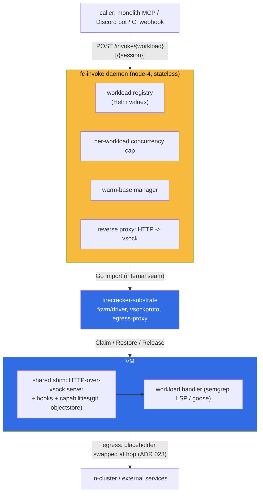

# ADR 030: fc-invoke, a Single Configurable Surface for Running Workloads in Firecracker

**Author:** jomcgi
**Status:** Draft
**Created:** 2026-06-30
**Builds on:** [019 - Substrate Executor + AgentWorkflow](019-substrate-executor-agentworkflow.md) (implements its stubbed `Exec` seam), [022 - Firecracker Snapshot/Restore Controller](022-firecracker-snapshot-restore-controller.md) (the `fcvm/driver` and warm-base mechanics this consumes), [023 - Egress Secret Proxy](023-egress-secret-proxy.md) (the server-side secret model the workload config preserves), [026 - Fast MicroVM Starts](026-fast-microvm-starts-and-stateful-artifact-iteration.md) (the external-state, disposable-VM iteration model this generalizes)
**Supersedes in part:** [025 - Three-Layer Agent Stack](025-three-layer-agent-stack-goosecracker.md): keeps its goose-agnostic-substrate principle, but folds the reusable orchestration into a new `fc-invoke` daemon, renames the home to `projects/firecracker/`, makes `semgrep` a peer workload, and drops the `discord` directory (025 decision 4).
---

## Problem

Two host daemons run workloads in Firecracker microVMs, and each rolls its own orchestration around the shared `fcvm/driver`: `semgrep-scand` (restore a warm-base guest, scan over a vsock side-channel, discard) and `fc-agentd` (restore a guest, run goose, snapshot on idle). The VM lifecycle (Claim/Snapshot/Restore/Release) is already shared in `fcvm/driver`, which implements ADR 019's `substrate.Substrate` + `Snapshotable`. What is not shared, and what is missing, is narrower than it looks:

1. **ADR 019's `Substrate.Exec` is an unimplemented stub.** `Exec(ctx, Handle, Request) (Stream, error)` was specified as "run work, stream output", then never implemented; each consumer rolls its own request transport over vsock. The generic "invoke a function in a VM, get a result" primitive, Lambda 101, was designed and stubbed.
2. **The orchestration around that transport is written twice** (warm-base build/invalidation, the concurrency cap, restore-do-work-release) with different structure in each daemon.

Running an HTTP service in a microVM and calling it is a common pattern beyond the agent use case. ADR 025 named the layers but left the reusable orchestration unbuilt and fused per consumer. We want one configurable surface, not N daemons.

## Decision

Build **fc-invoke**, one host daemon that implements ADR 019's `Exec` seam plus the orchestration around it, configured declaratively per workload, absorbing both existing daemons' VM lifecycle.

**1. One daemon, HTTP ingress, HTTP-over-vsock to the guest.** Callers `POST /invoke/{workload}[/{session}]`; fc-invoke boots/restores the right VM and reverse-proxies the request to an HTTP server in the guest. The guest contract is "be an HTTP server on a vsock port." Streaming is free (chunked response body). Both ends of the transport are generic: a host-side proxy and a guest-side shim.

**2. Workloads are named entries in Helm values, seven generic knobs.** `image, resources, concurrency, egress{enabled,secrets}, warmBase{build,readyPath}, sessioned, requestTimeout`. A caller references a workload by name and never picks the image or secrets, which keeps ADR 023's server-side secret model intact and the trust boundary reviewable in git. Every knob passes ADR 025's litmus test (none would change to run a non-goose workload).

**3. Two orthogonal lifecycle primitives, on opposite sides of the platform line.** _Warm base_ (a VM snapshot taken once after a readiness-gated prime, restored per invoke) is workload-generic env prep and stays in the platform; it serves semgrep's compiled rules / warm LSP and a future bazel analysis cache. _State hydration_ (pre-run pull, post-run push of per-session state) is workload-specific and stays in the guest. The line is who captures the state: a warm base is a platform snapshot gated on a generic readiness probe; hydration is per-session movement to external storage only the guest understands.

**4. All durable state is owned by orchestrators; fc-invoke is stateless (a deliberate 2-way door).** The orchestrator (goosecracker, the monolith) owns the session registry and content (its `claude_agent` tables, the S3 blobs, the git mirror). fc-invoke owns only session _routing_ (the `/{session}` segment as an opaque correlation key) and ephemeral runtime state (the concurrency semaphore, live handles). Statelessness makes the door cheap: substrate-owned snapshots or state can be added later behind the unchanged `/invoke` contract, not via a migration.

**5. An extensible guest-side shim, a shared Go library baked into guest images by Bazel.** It provides the HTTP-over-vsock server, a pre/post hook chain, and workload-agnostic capabilities (git clone/pull, object-store pull/push). It can be rich without leaking into the public interface because the fc-invoke daemon never imports it; only guest images do. The goose-specific composition (pull sessions.db, clone the repo mirror) lives in the agent-guest _handler_, which uses those capabilities. Orchestrators parameterize hooks through the opaque `/invoke` request body, so a new capability needs zero daemon change.

**6. Directory home `projects/firecracker/{substrate, goosecracker, semgrep}`.** `substrate` is the platform (fcvm driver, vsockproto, egress-proxy, shim, the fc-invoke daemon, one chart). `goosecracker` is the thin stateful agent layer with `recipes/` per agent (artifact, code-review). `semgrep` is a peer workload (guest image + handler + warm-base prime), no host daemon of its own. This corrects ADR 025: `firecracker-substrate` absorbs fc-invoke and shortens to `substrate`; `semgrep` is the non-goose proof (025 open question 4), so it is a peer not a sub-item; `discord` drops as a directory (no distinct guest image; a goosecracker values config plus the existing monolith bot glue), superseding 025 decision 4.

| Aspect                 | ADR 025                                                        | This ADR                                                             |
| ---------------------- | -------------------------------------------------------------- | -------------------------------------------------------------------- |
| Reusable orchestration | named (`goosecracker`), unbuilt, per-consumer                  | one `fc-invoke` daemon implementing `Exec` + warm-base + concurrency |
| `Substrate.Exec`       | stub                                                           | implemented as HTTP-over-vsock reverse proxy                         |
| Guest contract         | per-consumer vsock channel                                     | HTTP server on a vsock port; shared shim library                     |
| Workload config        | implicit, per daemon                                           | seven generic Helm-values knobs                                      |
| Session state          | snapshot/resume in the manager                                 | external, orchestrator-owned; fc-invoke stateless                    |
| Home                   | `projects/agents/{firecracker-substrate,goosecracker,discord}` | `projects/firecracker/{substrate,goosecracker,semgrep}`              |

## Architecture

The orchestrators sit above: `goosecracker` (session<->thread map, Discord wake, business state) and the `monolith-semgrep-scan` MCP tool both call `/invoke`. Guest images are not pods; they are apko-built OCI images seeded onto node-4's devmapper and booted by fc-invoke, with digests pinned into values by Bazel `helm_images_values` so a workload auto-rolls when its guest rebuilds.

## Alternatives Considered

- **A shared Go library both daemons link, instead of one daemon.** Rejected: after migration fc-invoke is the _sole_ host-side consumer of `fcvm/driver` (semgrep-scand dissolves, fc-agentd's VM lifecycle moves in), so the "library for multiple daemons" rationale evaporates; one daemon is simpler to operate and gives one place for warm-base and concurrency.
- **Generalize the existing newline-JSON vsock RPC instead of HTTP.** Rejected: HTTP-over-vsock makes the daemon a plain reverse proxy, gives streaming for free, and lets any in-guest HTTP framework serve; the bespoke envelope would need hand-rolled streaming and a custom client in every guest.
- **Per-request workload descriptor (caller supplies image + secrets).** Rejected: breaks ADR 023's server-side secret model and widens the trust surface. Named workloads in git keep which-image-gets-which-secret reviewable.
- **fc-invoke owns per-session VM snapshots (snapshot-on-idle).** Rejected for now per ADR 026's reasoning (once cold starts are fast, a VM snapshot only saves the boot and is not worth its version-binding fragility); state lives external, the VM stays disposable. Kept as the 2-way door.
- **Keep `fc-invoke` separate from the substrate (a distinct layer).** Rejected: fc-invoke passes ADR 025's litmus test (it does not change to run semgrep), so it belongs on the substrate side; ADR 025 separated goose from the substrate, not the substrate from its orchestrator.
- **Rewrite ADR 025 in place.** Rejected: 025's core (goose-agnostic substrate) survives; this is an additive supersede in the repo's established style (022 over 019, 026 over 022).

## Security

Baseline `docs/security.md`. This ADR moves no trust boundary; it concentrates existing ones in one daemon.

- **Server-side secret model preserved (ADR 023).** Secrets are named per workload in git; the guest holds only placeholders, swapped at the egress hop. Callers cannot request arbitrary images or credentials.
- **Egress is a per-workload gate.** `egress.enabled: false` (semgrep) means no outbound path at all; the offline workload stays offline.
- **The opaque `/invoke` body is never parsed by the daemon**, so the daemon grows no workload-specific privilege; hydration and goose logic stay in the guest where they already need to run.
- **Isolation is the existing microVM boundary** (FC-direct on node-4, ADR 022); untrusted-work posture is unchanged from 019/022.

## Risks

| Risk                                                         | Likelihood | Impact | Mitigation                                                                                                                                                                           |
| ------------------------------------------------------------ | ---------- | ------ | ------------------------------------------------------------------------------------------------------------------------------------------------------------------------------------ |
| HTTP-over-vsock adds latency vs the current side-channel     | Low        | Low    | It replaces an equivalent vsock round-trip; warm-base restore (~tens of ms) dominates; measure on node-4                                                                             |
| Two concurrent invokes of one session clobber external state | Medium     | Medium | Per-session serialization is the orchestrator's job (it owns the state); fc-invoke enforces only per-workload resource concurrency; confirm in the orchestrator before agent cutover |
| One daemon is a single point of failure for all workloads    | Medium     | Medium | Stateless and restartable; warm base is rebuildable and never load-bearing; a crash degrades to cold boot, not data loss                                                             |
| The shim library drifts toward goose-specifics               | Medium     | Low    | Litmus test at review: a capability that names a workload belongs in that workload's handler, not the shim                                                                           |
| Migration churn breaks the live semgrep scan path            | Low        | Medium | semgrep first, behind the same MCP tool; cut over by re-pointing `SEMGREP_SCAND_URL` to `/invoke/semgrep`; keep the old daemon until the new path is verified in prod                |

## Open Questions

Settled during execution, not gates.

1. Per-session serialization lives in the orchestrator; confirm it serializes before two writers can race a sessions.db push.
2. The exact `/shim/*` control surface (readiness, capability introspection, metrics); `/shim/ready` is the only one warm-base requires.
3. Hook configuration per-image (baked manifest) vs per-request (body directives); leaning both.
4. The CI webhook consumer (025 trigger wiring) is trivial on `/invoke` but is a follow-on, not part of this migration.

## References

| Resource                                                                                | Relevance                                                              |
| --------------------------------------------------------------------------------------- | ---------------------------------------------------------------------- |
| [019 - Substrate Executor](019-substrate-executor-agentworkflow.md)                     | The `Exec` seam this implements                                        |
| [022 - FC Snapshot/Restore Controller](022-firecracker-snapshot-restore-controller.md)  | `fcvm/driver`, warm-base mechanics, FC-direct on node-4                |
| [023 - Egress Secret Proxy](023-egress-secret-proxy.md)                                 | Server-side secret model the config preserves                          |
| [025 - Three-Layer Agent Stack](025-three-layer-agent-stack-goosecracker.md)            | Partially superseded: principle kept, layout and orchestration revised |
| [026 - Fast MicroVM Starts](026-fast-microvm-starts-and-stateful-artifact-iteration.md) | External-state, disposable-VM model generalized here                   |
| Full design: schema, data flow, error handling, testing, migration                      | Covered in this ADR's implementation work                              |
