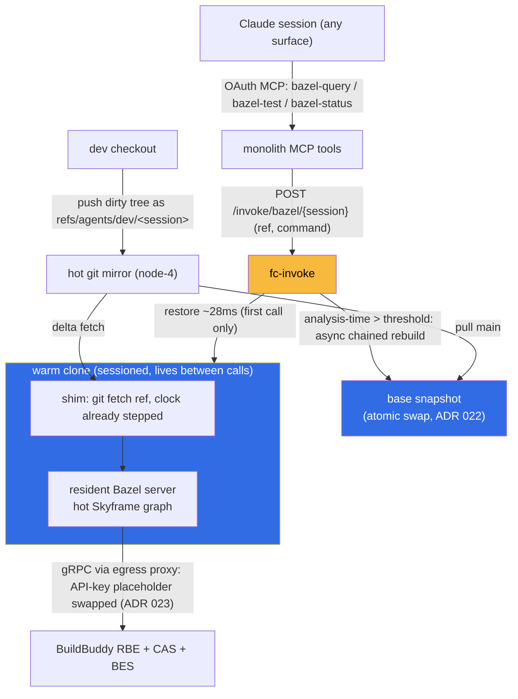

# ADR 032: Warm-Snapshot Bazel Worker as an MCP Tool Surface

**Author:** jomcgi
**Status:** Draft
**Created:** 2026-07-01
**Builds on:** [022 - Firecracker Snapshot/Restore Controller](022-firecracker-snapshot-restore-controller.md) (warm-base snapshot mechanics, atomic base swap), [023 - Egress Secret Proxy](023-egress-secret-proxy.md) (server-side credential model for the BuildBuddy API key), [041 - Hot Git Mirror Agent Workspaces](041-hot-git-mirror-agent-workspaces.md) (mirror hydration and `refs/agents/**` scratch refs), [030 - fc-invoke](030-fc-invoke-configurable-firecracker-surface.md) (the workload registry and `sessioned` invoke surface this adds a workload to)

---

## Problem

Every Bazel invocation against this repo pays the loading + analysis phase before a single action runs: the dependency graph traversal that builds the in-memory Skyframe graph. That state lives only inside the Bazel server JVM and Bazel has no supported way to persist it (remote analysis caching is still experimental), so it is rebuilt from scratch by every fresh runner. BuildBuddy's RBE executors and CAS make _execution_ fast and shared, but their hosted workflow runners schedule slowly for us, and nothing serves the interactive case at all: this repo forbids workstation Bazel (no darwin executors, `bb`-aliased CI-only flow), so an agent session that wants a quick `bazel query`, a targeted build, or `bazel test //...` has no loop tighter than push-and-wait-for-CI.

The pieces to fix this already exist. fc-invoke restores warm microVM snapshots in ~28 ms and semgrep proved the pattern end to end (~0.9 s warm scans). A VM snapshot is one of the very few ways to persist a live JVM heap, which is exactly where the analysis cache lives. What is missing is a workload that puts a primed Bazel server inside the snapshot and a tool surface that lets any Claude session reach it.

## Decision

Add a **`bazel` workload** to fc-invoke whose warm base contains a live Bazel server with the analysis graph for recent `main` already resident, and expose it to any OAuth'd Claude session as **monolith MCP tools**. Analysis runs locally against the hot graph; all action execution and caching stay remote on BuildBuddy. The base is rebuilt asynchronously when a measured analysis-time signal says it has drifted, never saved back from a serving clone.

**1. The warm base is a primed Bazel server, split by state lifecycle.** Base build: boot the guest, clone `main` from the hot git mirror (ADR 041), run an analysis-only pass (`bazel build //... --nobuild`) with the standard RBE + remote-cache flags, snapshot while the server is resident. The two caches have opposite lifecycles and live on opposite sides of the snapshot: the Skyframe graph is invalidated by the repo changing (kept in the memfile, refreshed often), while external repositories and the `--repository_cache` are invalidated by `MODULE.bazel` changing (kept on disk, baked into the rootfs at base build). Separating them is what makes frequent base rebuilds cheap.

**2. Analysis local, execution remote.** Guest invocations run the `bb` CLI with the same `--remote_executor` / `--remote_cache` / BES configuration CI uses, plus `--remote_download_minimal` so outputs stay in BuildBuddy's CAS and the local output base stays small. The VM never does heavy compute: analysis is single-JVM graph work with nothing to ship remotely, actions are embarrassingly parallel and cache-addressable, so a small guest (4 vCPU) serves `//...`. RBE + remote cache are client-side features of any Bazel invocation, so this cuts out only the slow part of hosted CI (workflow-runner scheduling), not the fast part (per-action executor scheduling).

**3. Sessioned clones give the sub-second loop.** The workload sets `sessioned: true`. The first MCP call in a session restores a clone and hydrates it; subsequent calls route to the same live VM, paying only the incremental fetch + invalidation for whatever changed. Restore is the fast _entry_ into a session; liveness between calls does the rest. Idle clones are reaped on a timeout. Because a Bazel server holds an exclusive lock on its output base (one invocation at a time), snapshot-forking is also what turns one warm server into a concurrent warm pool, something a single long-lived runner cannot do; clones share the mmap'd memfile read-only through page cache, so the marginal memory cost of a clone is roughly its dirty pages.

**4. Current contents travel as scratch refs on the hot mirror.** The mirror serves committed refs only, and its pre-receive hook already allows `refs/agents/**` (ADR 041). The client snapshots its dirty tree into a throwaway commit without touching the checkout (`git stash create` or a temp-index commit), pushes it to `refs/agents/dev/<session>`, and passes the ref in the tool call; the guest fetches a tiny delta because the base was cloned from the same mirror minutes earlier.

**5. Rebuilds are chained, triggered by the metric they protect, and never saved back.** Every invocation reports its analysis-phase duration (from the JSON trace profile / BEP). When it crosses a threshold, fc-invoke kicks an async base rebuild: restore the _previous_ base, pull `main`, run the incremental analysis pass, re-snapshot. The existing atomic memfile-then-snapfile rename (ADR 022) makes swapping the base safe under live clones. Chaining means only the first-ever base build pays the full external-dependency fetch; steady-state rebuilds are seconds to a couple of minutes. A quiet `main` never rebuilds. A periodic cold rebuild (nightly) remains as hygiene against JVM heap growth and incremental-state corruption accumulating across generations. Serving clones are never re-snapshotted: dirty state is discarded, the base only ever advances from clean `main`.

**6. The tool surface is monolith MCP over the existing OAuth path.** New tools on the monolith (Context Forge / `claude_ai_homelab` connector): `bazel-query` and short commands return synchronously; `bazel-test` / long builds return the BES invocation URL immediately (BuildBuddy's UI streams live for free) plus a status tool to poll, since MCP tool results do not stream. Callers name a workload and a session, never an image or credential, preserving ADR 030's trust model.

| Aspect                | Today                                          | Decided                                                       |
| --------------------- | ---------------------------------------------- | ------------------------------------------------------------- |
| Analysis cache        | rebuilt from scratch per runner/invocation     | resident in the warm-base memfile, incremental per diff       |
| Interactive bazel     | none (push and wait for CI)                    | MCP tools against a sessioned warm clone, sub-second overhead |
| Execution and caching | BuildBuddy RBE + CAS (CI only)                 | unchanged, reached from the guest via the same `bb` flags     |
| Concurrency           | one hosted runner per invocation, slow to boot | N snapshot-forked clones sharing one memfile                  |
| Freshness             | n/a                                            | analysis-time-triggered async chained rebuild + nightly cold  |

## Architecture

Three substrate gaps become load-bearing and are part of this decision's scope:

- **Writable per-clone disk.** Today every mutable guest path is tmpfs captured in the memfile; a multi-GiB Bazel output base cannot live there. Activate the existing `DevmapperProvisioner` (thin CoW snapshots, millisecond per-clone cost, delta-only disk) so the output base baked into the rootfs at base build is writable per clone.
- **Post-restore clock step.** No clock fixup exists after restore; a snapshot minutes stale breaks TLS to BuildBuddy and skews BES timestamps. Add a shim hook: host passes wall time over vsock, guest steps the clock before anything else runs.
- **Credential via egress proxy.** The BuildBuddy API key follows ADR 023 (guest holds a placeholder, sidecar swaps at the hop). RBE is gRPC over HTTP/2 through the TLS-terminating proxy; if HTTP/2 re-origination proves problematic, v1 falls back to a scoped, revocable key in the guest env (open question 2).

One semantic constraint is cheap but load-bearing: Bazel discards the entire analysis cache when build flags differ between invocations. The workload pins a single bazelrc/config; tool callers pass targets and a small allow-listed flag set, never arbitrary flags.

## Alternatives Considered

- **BuildBuddy hosted workflow runners (their warm-runner recycling).** Rejected as the answer here: it only serves CI-triggered runs, its runner scheduling is the latency we are cutting, and it cannot serve arbitrary per-session invocations from a Claude surface.
- **One persistent warm runner VM, no snapshots.** Rejected: the output-base lock serializes it to one invocation at a time, and a restart loses the cache entirely; it is the degenerate N=1 case of this design with worse failure modes.
- **Bazel remote analysis caching (Skycache).** Rejected for now: experimental, not generally usable; adopt later if it matures, as it would shrink what the snapshot must carry (revisit trigger for this ADR).
- **Save-back of serving clones instead of periodic rebuild.** Rejected: accumulates per-session drift into the shared base and races the atomic swap; rebuilding from clean `main` keeps the base a pure function of the repo.
- **Syncing dirty trees over vsock upload instead of mirror scratch refs.** Rejected: new transport machinery when `refs/agents/**` push + delta fetch already exists and keeps the mirror the single hydration path.
- **Workstation Bazel with remote cache.** Rejected: no darwin executors, cold local analysis every time, and it reopens the local-loop policy this repo deliberately closed.

## Security

Baseline `docs/security.md`. This surface is arbitrary code execution by construction: `bazel` evaluates repository rules and `bazel run` executes targets, and the caller controls the tree via scratch refs. Containment relies on boundaries that already exist:

- **Isolation is the microVM** (FC-direct on node-4, ADR 022), the same untrusted-work posture as agent guests.
- **Credentials never enter the guest** (ADR 023): the BuildBuddy API key is a placeholder swapped at the egress hop; if the HTTP/2 fallback puts a key in the guest, it is scoped to cache/execution and revocable, and the fallback is recorded as a deviation.
- **Egress is allow-listed** to the mirror (read + `refs/agents/**` write) and BuildBuddy endpoints; no cluster credentials, no kubeconfig, no 1Password path in the guest.
- **The OAuth MCP surface authenticates the caller** (existing Context Forge / monolith path); tools accept target patterns and an allow-listed flag set, not raw shell.
- **Blast radius of a hostile invocation** is a poisoned remote-cache namespace under our own API key and a burned clone, both recoverable (revoke key, reap clone, rebuild base).

## Risks

| Risk                                                                   | Likelihood | Impact | Mitigation                                                                                                                                     |
| ---------------------------------------------------------------------- | ---------- | ------ | ---------------------------------------------------------------------------------------------------------------------------------------------- |
| Warm heap larger than estimated (3-8 GiB), squeezing node-4 memory     | Medium     | Medium | Measurement spike before build (`bazel info used-heap-size-after-gc` after `//...` analysis); ADR platform/010 oversubscription math revisited |
| Flag drift silently discards the analysis cache, hot path becomes cold | Medium     | Medium | Pinned bazelrc in the guest; tools expose an allow-listed flag set; alert when analysis time jumps without a corresponding diff                |
| Clock step missed or insufficient, TLS/BES failures post-restore       | Low        | High   | Clock hook runs before the shim reports ready; readiness probe includes a TLS handshake to BuildBuddy                                          |
| Egress proxy cannot cleanly re-originate gRPC/HTTP2                    | Medium     | Low    | v1 fallback: scoped revocable key in guest env; proxy support tracked as follow-on                                                             |
| Chained rebuilds accumulate JVM/incremental-state rot                  | Medium     | Low    | Nightly cold rebuild from scratch; repository cache on disk keeps even cold rebuilds download-free                                             |
| Devmapper provisioner unproven under this workload's write pattern     | Medium     | Medium | It exists and is tested in-tree but undeployed; prove it under the semgrep workload first or as part of the spike                              |
| Memfile disk footprint (~10-12 GiB per base generation) on node-4 NVMe | Low        | Low    | Keep current + previous generation only; base is rebuildable, never load-bearing                                                               |

## Open Questions

1. Real numbers from the measurement spike: warm heap after `//...` analysis, cold base build time, incremental analysis time for a one-package diff. These size `memMib` and validate the sub-second claim.
2. gRPC/HTTP2 through the egress proxy, or scoped-key-in-guest for v1.
3. The analysis-time rebuild threshold and its interaction with the semaphore (does a rebuild borrow a concurrency slot or run outside the cap).
4. Whether `bazel run` is in scope for v1 or the tools stop at build/test/query (it widens what a hostile ref can execute with egress attached).
5. Session-idle reap timeout, and whether reap should push a final scratch ref for post-mortem.

## References

| Resource                                                                                                     | Relevance                                                       |
| ------------------------------------------------------------------------------------------------------------ | --------------------------------------------------------------- |
| [022 - FC Snapshot/Restore Controller](022-firecracker-snapshot-restore-controller.md)                       | Warm-base build/restore, atomic base swap under live readers    |
| [023 - Egress Secret Proxy](023-egress-secret-proxy.md)                                                      | Placeholder-swap credential model for the BuildBuddy API key    |
| [041 - Hot Git Mirror Agent Workspaces](041-hot-git-mirror-agent-workspaces.md)                              | Mirror hydration, `refs/agents/**` scratch-ref write path       |
| [030 - fc-invoke](030-fc-invoke-configurable-firecracker-surface.md)                                         | Workload registry, `sessioned` routing, guest shim capabilities |
| [platform/010 - Memory Oversubscription](../../../projects/platform/ARCHITECTURE.md) | node-4 memory budget this workload must fit                     |
| [BuildBuddy RBE docs](https://www.buildbuddy.io/docs/rbe-setup)                                              | Client-side RBE/cache flags any invocation can use              |
