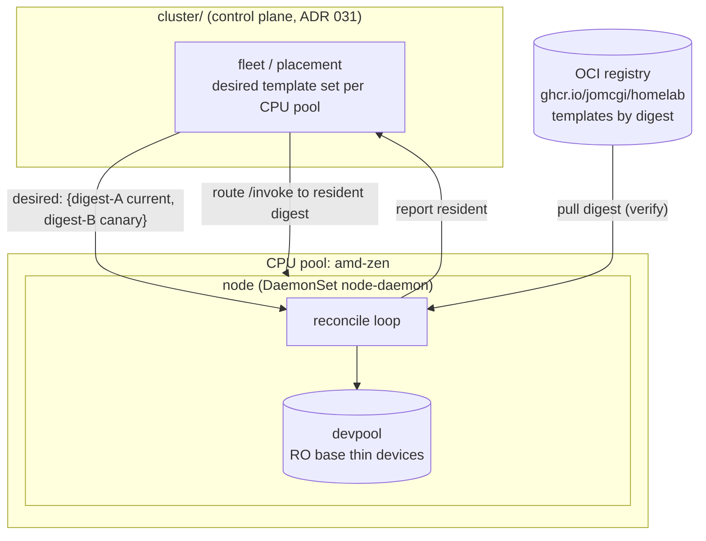

# ADR 033: Golden-Template Distribution via Daemon-Pulled OCI Artifacts

**Author:** jomcgi
**Status:** Accepted
**Created:** 2026-07-02
**Builds on:** [031 - Control-Plane / Data-Plane Split](031-cluster-node-control-data-plane-split.md) (the cluster-agent / node-daemon seam this hangs distribution on), [028 - Elastic Agent-MicroVM Capacity and Reclaim](028-elastic-agent-microvm-capacity-and-reclaim.md) (which dropped per-thread snapshots and left the golden template as the only travelling image), [022 - Firecracker Snapshot/Restore Controller](022-firecracker-snapshot-restore-controller.md) (the golden-template restore path, ~28 ms), [030 - fc-invoke Configurable Firecracker Surface](030-fc-invoke-configurable-firecracker-surface.md) (the workload/warm-base surface this generalizes per node)

---

## Problem

Today the Firecracker substrate runs on a single node (node-4), so the golden template (the shared, task-agnostic boot-accelerator snapshot every fresh microVM restores from, ADR 022) is built and materialized locally, once, by hand-adjacent host setup. There is no story for a second Firecracker node.

ADR 031 already carved the control-plane / data-plane seam for the moment a second node exists: `cluster/` becomes a central agent, `node/` becomes a per-node DaemonSet, and placement routes `/invoke` to the right node executor. But 031 deliberately left one responsibility unassigned: **how the golden template gets onto each node, and how a new template version is rolled out.** Without an answer, adding a KVM node means re-running bespoke host setup to rebuild the template locally, and updating a template means editing something node-by-node. Neither scales past one node, and both couple template lifecycle to node lifecycle.

Two constraints make this non-trivial:

1. **Snapshots are compatibility-bound on two axes.** A Firecracker snapshot restores correctly only on a host whose CPUID surface matches what the guest saw at snapshot time, _and_ under a Firecracker binary whose snapshot version can load the image (the snapshot format is versioned; an image taken by FC vX is not generally loadable by vY). The effective compatibility key is therefore `(CPU-template baseline, FC snapshot version)`, so "any node" is wrong; "any node in a defined compatibility pool running a compatible FC binary" is right.
2. **The rootfs must be a devmapper block device.** Overlayfs cannot back a microVM rootfs (see `projects/platform/firecracker-node/README.md`), so a template can never be "just mounted and booted": its disk layer must be materialized into the local `devpool` thin-pool before it is restorable.

We want to add a node, or publish a new template version, without rolling any node and without hand-editing per-node state, while keeping template provenance verifiable.

---

## Decision

**Node daemons pull golden templates as content-addressed OCI artifacts and reconcile them into local `devpool` against a per-CPU-pool desired set published by the control plane.** Template lifecycle is fully decoupled from node and pod lifecycle: publishing or swapping a template is a change to the desired set, not a node roll or a pod restart.

Three parts:

1. **Templates are content-addressed OCI artifacts.** A golden template (memory file + rootfs disk layer + the Firecracker config and CPU-template metadata needed to restore it) is packaged as an OCI artifact and pushed to the registry the repo already runs (`ghcr.io/jomcgi/homelab/...`), addressed by digest. This reuses the "everything is an OCI artifact" pattern and gives digest verification, dedup, and provenance for free.

2. **The control plane publishes a desired template set, per CPU pool.** `cluster/fleet` (or a sibling under `cluster/`) owns a small desired-state record: for each CPU-compatibility pool (e.g. `firecracker.io/cpu-pool=amd-zen`), which template digests should be resident (current, plus any canary). This is rows in Postgres or a ConfigMap, generalizing the existing per-workload warm-base pin (ADR 030) to a per-node-pool set.

3. **Node daemons reconcile, they do not mount.** Each DaemonSet node-daemon, `nodeSelector`ed to its pool, runs a reconcile loop: pull any missing digest for its pool, verify it, **materialize the rootfs into `devpool` as a read-only base thin device** and stage the memory file, register the template as restorable, and report ready. Placement (ADR 031) routes new `/invoke`s to a digest only once a node reports it resident. Old templates stay resident until no live VM references them, then are GC'd. Swapping a template = add a digest to the desired set; rollback = revert it. Both versions coexist during transition, so it is a canary, not a cutover.

| Aspect                   | Today (single node)                      | Decided                                              |
| ------------------------ | ---------------------------------------- | ---------------------------------------------------- |
| Template origin          | Built/materialized locally by host setup | Content-addressed OCI artifact in the registry       |
| Getting it on a node     | Bespoke per-node host setup              | Daemon pulls + reconciles from the desired set       |
| Publishing a new version | Hand-edit the node                       | Add a digest to the per-pool desired set             |
| Cross-node compatibility | N/A (one node)                           | Per-CPU-pool desired set; placement is pool-aware    |
| Coupling                 | Template tied to node setup              | Template lifecycle independent of node/pod lifecycle |
| Swap cost                | Re-run host setup                        | Reconcile in place, no pod restart, no node roll     |

### Why daemon-pulled OCI and not an OCI image volume

Kubernetes 1.35 supports mounting an OCI artifact as a read-only volume (`volumeSource.image`, KEP-4639), which is the obvious first reach. It is rejected as the distribution mechanism because an image volume is **resolved at pod creation and immutable for the pod's lifetime**: changing the template digest requires editing the pod spec, which restarts the DaemonSet pod and drains that node's warm VMs. That couples template version to pod version, the exact coupling this ADR removes. The coupling is a property of the _mount_, not of OCI. A daemon that _pulls_ by digest keeps OCI's verification and provenance while making version a runtime reconcile decision the long-lived process owns, so a swap never bounces the pod.

### Why OCI and not raw S3

S3 gives the same runtime-swap freedom (the daemon pulls objects on its own schedule), and it has one genuine advantage worth stating plainly: the in-cluster store means a multi-GB memory file never crosses the WAN, whereas templates pulled from `ghcr.io` cost a WAN transfer per node per version. It is still rejected for _templates_, but the decisive reasons are the ones that survive a content-addressing steelman (digest-over-S3 is only ~20 lines of sha256 keying + verify), not the re-implementation cost: templates ride the **registry auth and trust path the repo already operates**, they get **digest-pin-at-chart-build symmetry with the existing `guestImage`** (ADR 030), and they inherit the registry's provenance/signing tooling. The WAN cost is acceptable at the current template cadence (templates change rarely, one shared artifact per pool), and a registry pull-through cache in-cluster is the escape hatch if it ever bites. S3 remains the store for the per-agent state zone (ADR 028), not the shared template.

---

## Architecture

Reconcile loop on each node-daemon:

1. Read the desired digest set for this node's CPU pool.
2. For each missing digest: pre-flight a `devpool` capacity check, then pull the OCI artifact, verify the digest, materialize the rootfs into `devpool` as a read-only base thin device, stage the memory file (mmap-able read-only, restored copy-on-write so concurrent restores share page cache). The step is **staged-then-activate and idempotent**: a digest becomes restorable only after both halves land, and a daemon that dies mid-materialize re-enters cleanly, discarding any orphan thin device or half-staged file on restart. Digest-mismatch or out-of-space fails closed (the digest is never registered, so placement never routes to it).
3. Register newly-resident digests as restorable; report residency to the control plane.
4. GC digests no longer in the desired set in strict order: **unadvertise** (report the digest non-resident so placement stops routing to it) → **wait** for in-flight restores and live VMs referencing it to drain → **remove** the thin device and staged file. Unadvertising before draining closes the window where placement could route an invoke into a digest being torn down.

The memory file half of a template can be served straight from a read-only staging path (copy-on-write restore is how one template fans out to many concurrent VMs). The rootfs half cannot: it must land in `devpool` as a block device first. So "reconcile into devpool" is the irreducible per-node step regardless of transport, which is itself a reason to prefer a pull-and-materialize daemon over any mount-and-go scheme.

**Scope.** This ADR distributes the shared golden template only. Per-workload guest images (today hand-seeded into node-4's devmapper per ADR 030) and per-workload warm bases face the same multi-node question but are out of scope here: the intent is that guest images ride the same per-pool desired-set mechanism once generalized, and warm bases are rebuilt locally per node from a resident template, but this ADR does not decide that. Note that memory-file staging consumes node filesystem space, not `devpool`, so both stores are fleet-monitored capacity.

---

## Alternatives Considered

- **OCI image volume (`volumeSource.image`) mounted into the DaemonSet.** Rejected: immutable per pod, so a template swap restarts the pod and drains the node. Couples template version to pod version.
- **Raw S3 objects pulled by the daemon.** Rejected for templates: no native content-addressing, verification, or dedup, so we would re-implement what the OCI registry gives free. S3 stays the per-agent state store (ADR 028).
- **Node-to-node peer streaming of the template (operator picks a source node).** Rejected as premature: more moving parts, only wins if a single shared template outgrows the registry/pull path, which one task-agnostic template will not.
- **Rebuild the template locally on every node via host setup.** Rejected: the status quo; does not scale past one node and couples template lifecycle to node setup.
- **Propagate per-thread/per-agent memory snapshots across nodes.** Already rejected in ADR 028 (node/ISA-bound, per-thread storage + lifecycle). Cross-node agent resume is solved there by externalized state (git + S3) plus golden-template rehydrate, so only the single shared template needs distributing.

---

## Security

Baseline per `docs/security.md`. Notes specific to this decision:

- **The trust root is the desired-set write path, not digest verification.** Digest verification only proves the node fetched the bytes the desired set named; a malicious digest _written into the desired set_ verifies perfectly and then boots every microVM on the pool, since a template is whole-node boot state. So **who may write the desired set is equivalent in power to who may push a template**, and both are the authorization boundary that matters. Verification-on-pull is the integrity check under that boundary, not a substitute for it. Pulls use the same registry credentials and trust path as existing OCI images; no new external trust is introduced.
- **No new inbound surface on the node.** The daemon pulls (egress to the registry it already uses) and reads desired state from the control plane over the ADR 031 seam. It exposes nothing new externally.
- **Templates are task-agnostic and secret-free.** The golden template is a boot accelerator, not a state carrier; per-agent secrets and state never enter it (they ride the ADR 023 egress swap and the ADR 028 state zones). This must remain true: no secret material may be baked into a template artifact, since artifacts are shared and cached across nodes.

---

## Risks

| Risk                                                                     | Likelihood | Impact | Mitigation                                                                                                                                                                                                                                                            |
| ------------------------------------------------------------------------ | ---------- | ------ | --------------------------------------------------------------------------------------------------------------------------------------------------------------------------------------------------------------------------------------------------------------------- |
| A template restores on the wrong CPU and crashes the guest               | Medium     | High   | Snapshot with a Firecracker CPU template (normalized CPUID baseline); label nodes by pool; placement only routes a digest to its pool. Treat pool membership as a hard constraint, not a hint.                                                                        |
| Template artifact is large; pull + materialize is slow on a cold node    | Medium     | Medium | Reconcile is asynchronous and off the invoke hot path; a node reports resident only after materialization, and placement withholds traffic until then. New-node warmup is a background cost, not a request-path latency.                                              |
| Stale template lingers and consumes devpool                              | Low        | Medium | GC digests absent from the desired set in unadvertise → drain → remove order; `devpool` and memory-file-staging filesystem are both fleet-monitored capacity.                                                                                                         |
| Tampered or wrong-digest artifact materialized                           | Low        | High   | Verify digest before materialize; fail closed (do not register) on mismatch.                                                                                                                                                                                          |
| Desired-set / residency skew (placement routes to a digest a node lacks) | Medium     | Medium | Placement routes only to _reported-resident_ digests, never to merely-desired ones; residency is the daemon's truth, the desired set is intent.                                                                                                                       |
| FC binary/snapshot-version mismatch within a pool (nodes never converge) | Medium     | Medium | Fold FC snapshot version into the pool/artifact compatibility key alongside the CPU-template baseline (see Open Question 2); a version-incompatible node fails the load closed and never reports resident, so it is visible (never-converges) rather than corrupting. |
| Crash mid-materialize or out-of-space mid-reconcile leaves orphan state  | Low        | Medium | Staged-then-activate, idempotent, re-entrant reconcile: register a digest only after both halves land; on restart discard orphan thin devices / half-staged files; pre-flight `devpool` and filesystem capacity before pulling.                                       |

---

## Open Questions

1. **Artifact layout.** One OCI artifact per template carrying memory file + rootfs + config as layers, versus separate artifacts for the memory and disk halves. Layering keeps them atomic; splitting could let the mmap-able memory file stage without touching devpool. Decide when the packaging is built.
2. **Pool taxonomy and labels.** The exact pool label scheme and how the compatibility key `(CPU-template baseline, FC snapshot version)` maps to pool names, including whether an FC-binary upgrade rotates the pool or is a within-pool migration. Only `amd-zen` exists in practice today; the scheme should not over-generalize before a second CPU family is real.
3. **Desired-set store.** Postgres rows (consistent with the substrate registry) versus a ConfigMap (consistent with GitOps). Leaning Postgres to match ADR 022/028, but a GitOps-declared desired set is attractive for auditability.
4. **Template build/publish trigger.** Who builds and pushes a new template artifact (CI on a base change, versus an explicit fleet action), and how its digest is pinned into the desired set (chart-build pin, like guestImage today, versus a runtime fleet write).

---

## References

| Resource                                                                                                                | Relevance                                                                                        |
| ----------------------------------------------------------------------------------------------------------------------- | ------------------------------------------------------------------------------------------------ |
| [ADR 031](031-cluster-node-control-data-plane-split.md)                                                                 | The cluster-agent / node-daemon seam and placement this distribution hangs on                    |
| [ADR 028](028-elastic-agent-microvm-capacity-and-reclaim.md)                                                            | Dropped per-thread snapshots; left the golden template as the only travelling image; state zones |
| [ADR 022](022-firecracker-snapshot-restore-controller.md)                                                               | Golden-template restore path (~28 ms) and FC-direct substrate                                    |
| [ADR 030](030-fc-invoke-configurable-firecracker-surface.md)                                                            | Per-workload warm-base surface this generalizes to a per-node-pool desired set                   |
| [KEP-4639 Image Volumes](https://github.com/kubernetes/enhancements/tree/master/keps/sig-node/4639-image-volume-source) | The mount mechanism considered and rejected as the distribution path                             |
| `projects/platform/firecracker-node/README.md`                                                                          | The devmapper-rootfs constraint that forces materialize-into-devpool                             |
