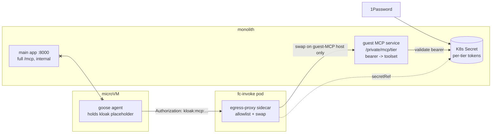

# ADR 034: Per-Tier MCP Tool ACLs for Goosecracker Guests

**Author:** Joe McGinley
**Status:** Draft
**Created:** 2026-07-02

---

## Problem

Goosecracker guests need MCP tools (cluster reads today, web search and more tomorrow), but different Discord servers deserve different tool sets: the homelab's own threads may read cluster state and search the knowledge graph, while a friend's server (ADR 029 per-server grants) should see a minimal or empty set. Tool exposure is a data-leak and action surface, so it must follow the same trust boundary as credentials, which ADR 024/#2890 established as the tier.

Two facts make the current state worse than "no ACL yet":

1. **The monolith MCP surface is reachable unauthenticated from every guest.** The shared FastMCP instance (knowledge graph, agent job triggers, k8s debug tools, semgrep) is mounted at `/mcp` on the main app, and `monolith.monolith.svc.cluster.local:8000` is already in the guest egress allowlist for the progress/artifact sink. Nothing but the model's good behaviour stops a prompt-injected guest from speaking SSE to it.
2. **Recipe extension lists are advisory, not enforcement.** Goose loads only the extensions a recipe declares, which keeps an honest model's tool list tidy, but a compromised guest does not need goose's cooperation to make HTTP requests.

The only enforced boundary in the guest architecture is the egress sidecar (ADR 023): fail-closed `host:port` allowlisting for internal destinations, plus the placeholder-swap credential path. Any real MCP ACL has to anchor there.

---

## Decision

The monolith serves **guest-facing MCP endpoints at `/private/mcp/{tier}/`** on a dedicated guest-facing service/port (separate from the main `:8000` app port), and **each tier authenticates with a bearer token carried by the ADR 023 placeholder-swap mechanism**. The path names the tier; the token proves it.

- **Token as identity.** Each tier's guest env holds only an inert `kloak:` placeholder (exactly like `GITHUB_TOKEN` today). The egress sidecar swaps it for the real token only on the guest-MCP host. Tier B's VM never contains tier A's placeholder, so cross-tier access is not guessable or replayable; the credential never exists inside a VM.
- **One Secret, two consumers.** The per-tier token lives in a Kubernetes Secret (synced from 1Password). The monolith reads it to validate bearers; the substrate egress catalog `secretRef`s the same Secret for the swap. Rotation in 1Password propagates to both enforcement points with no coordination.
- **Tool mapping is config.** The monolith maps token (tier) to an allowed tool subset, declared in deploy values. Adding a tier or adjusting its tools is a values change, no image rebuild.
- **Close the bypass in the same change.** The progress/artifact sink endpoints move to the guest-facing service, blanket `monolith.monolith.svc.cluster.local:8000` comes out of the guest allowlist, and the unauthenticated `/mcp` SSE mount becomes unreachable from guests entirely.

Context Forge is untouched: it keeps serving the claude.ai `homelab` connector and routines. The guest path simply stops being a (theoretical) consumer of it. Recipes reference the tier's endpoint and token via env, so one baked recipe library serves every tier while the visible tool set differs per VM.

| Aspect                    | Today                                                                | Decided                                                                        |
| ------------------------- | -------------------------------------------------------------------- | ------------------------------------------------------------------------------ |
| Guest reach into monolith | All of `:8000`, including unauthenticated `/mcp` (full tool surface) | Guest-facing service/port only; main app port removed from allowlist           |
| MCP tool scoping          | None (recipe extension lists, advisory only)                         | Enforced per tier: bearer token maps to a tool subset                          |
| Identity mechanism        | n/a                                                                  | ADR 023 placeholder swap (existing machinery, one more catalog entry per tier) |
| Rotation                  | n/a                                                                  | Rotate the 1Password item; both validator and swapper follow                   |
| Adding a tier             | n/a                                                                  | Deploy values + Secret entry, no rebuild                                       |

---

## Architecture

The invariant this design leans on: with one sidecar multiplexing many VMs, per-principal identity must travel either in-band (a bearer the endpoint checks) or out-of-band (separate channels per principal). The placeholder swap already provides in-band identity with no per-connection attribution plumbing, which is why the sidecar architecture chose self-identifying placeholders in the first place.

---

## Alternatives Considered

- **Context Forge tiered virtual servers.** Virtual servers organize tool subsets but paths are not boundaries (the sidecar pins `host:port` only, so every tier can reach every `/servers/{id}/mcp` path), so isolation would rest entirely on mcpgateway's token-scoping maturity; it also leaves the unauthenticated `monolith:8000/mcp` bypass open and adds the manual catalog-refresh and description-sanitization quirks to the rollout. Rejected: trust concentrates in third-party auth we cannot unit-test, while the monolith variant is a small middleware we own.
- **Network-only per-tier isolation (no credential).** Requires the sidecar to attribute each funnel connection to a tier (vsock CID to tier mapping plumbed from the launcher) plus path-aware or host-per-tier rules. Rejected: retrofits per-connection attribution onto a design that deliberately avoided it; the bearer approach reuses existing machinery.
- **Workload-per-tier.** Each tier as its own fc-invoke deployment with its own sidecar and allowlist gives credential-free network isolation (ADR 030 makes workloads pure Helm values). Documented as the escape hatch for a few-tiers/high-stakes future; rejected as the default because a warm VM pool and sidecar per Discord-server tier does not scale in resources.
- **Do nothing (recipe-level scoping only).** Rejected: advisory against a compromised guest, and leaves the port-8000 bypass.

## Security

Baseline per `docs/security.md`. This ADR strengthens Layer 5 practice for the agent substrate: guest-reachable MCP moves from unauthenticated to bearer-gated, credentials stay out of VMs (placeholder swap), tokens rotate from 1Password. The guest allowlist shrinks (blanket `monolith:8000` removed). Residual: the guest-facing MCP service itself must expose only tools safe for the lowest-trust tier to _attempt_ (authorization failures must fail closed to an empty set, not the default set).

## Risks

| Risk                                                                  | Likelihood | Impact | Mitigation                                                                                                                   |
| --------------------------------------------------------------------- | ---------- | ------ | ---------------------------------------------------------------------------------------------------------------------------- |
| Bug in the monolith bearer middleware grants cross-tier tools         | Low        | High   | Small code surface, unit-tested token-to-toolset mapping, deny on unknown token                                              |
| Progress-sink relocation breaks live threads during cutover           | Medium     | Medium | Move sink and allowlist entry in one release; keep `:8000` allowlisted until the sink is proven on the new port, then remove |
| Placeholder literal-swap constraints (ADR 023: no base64d Basic auth) | Low        | Low    | Bearer headers pass the literal token, same shape as the proven `gh` path                                                    |
| Tier sprawl makes tool mapping unwieldy                               | Medium     | Low    | Tiers map to trust levels, not to servers; ADR 029 grants bind servers to tiers                                              |

## Open Questions

1. Initial tool sets per tier (proposal: homelab tier gets k8s reads + knowledge search; external-server tiers get nothing until a need is shown).
2. Whether the guest-facing service is a second in-process listener on the monolith pod or a separate lightweight deployment sharing the codebase.
3. Whether artifact publish (currently on the sink path) needs its own scope distinct from MCP.

## References

| Resource                                                              | Relevance                                                              |
| --------------------------------------------------------------------- | ---------------------------------------------------------------------- |
| [ADR 023](023-egress-secret-proxy.md)                                 | Placeholder-swap mechanism and split-horizon egress this design reuses |
| ADR 029                             | Per-server grants that bind Discord servers to tiers                   |
| [ADR 024](024-discord-agent-hosted-model-tiers-and-artifacts.md)      | Tier as the credential trust boundary                                  |
| [ADR 030](030-fc-invoke-configurable-firecracker-surface.md)          | Workloads as Helm values (basis of the workload-per-tier alternative)  |
| [ADR 026](026-fast-microvm-starts-and-stateful-artifact-iteration.md) | Guest funnel and hydration paths the sidecar mediates                  |
