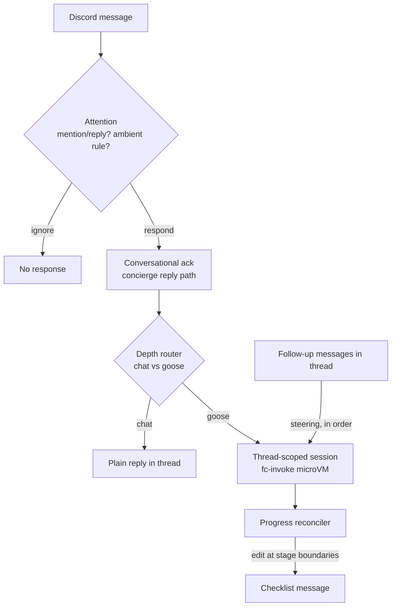

# ADR 035: Discord Multiplayer Agent UX (Ambient Classifier, Thread Sessions, Live Task Checklist)

**Author:** Joe McGinley
**Status:** Draft
**Created:** 2026-07-02

---

## Problem

Anthropic's Claude Tag (Slack-only, Enterprise/Team beta) validates a product shape we want on Discord: an agent that behaves like a shared team member in a channel rather than a per-user command runner. Evaluating Tag against the goosecracker/bosun stack, we are ahead on isolation (Firecracker microVMs, ADR 030), cost (self-hosted Qwen), per-server ACLs (ADR 029), and the recipe self-improvement loop, but behind on three interaction-layer capabilities:

1. **No classifier.** The bot only reacts to explicit invocation (`/agent`, mentions). It cannot decide on its own whether a message deserves a response, nor whether the right response is a conversational reply or a full goose agent session.
2. **Opaque mid-turn state.** A running task shows a static "processing" message plus the reaction lifecycle (⏳→👀→✅, #3085). That is a three-state signal; the user cannot see what stage the agent is on, and other channel members get no visibility at all.
3. **Blocking multi-turn.** Follow-up input while a task runs is queued as a whole new task or lost. There is no way to steer a running session, so the interaction feels synchronous and single-player.

Claude Tag's design shows these are cheap to close: its "classifier" is mention-guaranteed attention plus per-channel standing instructions (not a per-message ML relevance model), and its multiplayer story falls out of one primitive: task state lives visibly in the thread, not in a private exchange with the invoker.

---

## Decision

Make the Discord agent surface **thread-native, legible, and steerable**, in four parts.

**1. Conversational acknowledgment.** Every trigger gets an immediate natural-language reply that acknowledges the request and says what the agent is about to do (reusing the concierge-reply path from #3096). This is the "responsiveness" layer: the user hears back in a second, in prose, before any heavy work starts.

**2. Live task checklist.** For work that escalates into a goose session, the ack is followed by a **separate** checklist message that is **edited in place** as stages start and complete. Two messages, not one: the ack stays immutable so Discord notifications show readable prose (notification content is captured at send time), while the checklist message underneath absorbs the churn. Updates land at stage boundaries only, not per token. The plan comes from the session's staged decomposition (the sub-recipe router already produces stages); the reconciler that today flips the done marker (#2928) becomes the writer that patches the checklist message at stage boundaries. The reaction lifecycle stays as the coarse at-a-glance signal; the checklist is the fine-grained one. The whole exchange is visible to the channel, which is what makes the surface multiplayer.

**3. Thread-scoped shared sessions.** A session is keyed by Discord thread, not by invoker. Any message posted into an active session's thread is injected into the running session as steering input, processed in order, instead of being rejected or queued as a separate task. Anyone in the thread can redirect, add constraints, or cancel.

**4. Two-stage classifier (attention, then depth).** Splitting "should bosun respond, and how" into two cheap decisions instead of one smart one:

- **Attention**: a mention of the bot or a reply to it always gets a response. Unprompted messages are evaluated only in channels that have an ambient standing instruction configured (stored as a new grant kind in the ADR 029 `chat.discord_feature_grant` table); a fast model scores the message against that channel's instruction and responds only above a confidence threshold.
- **Depth**: everything enters as conversation. The first conversational turn decides whether a plain reply suffices or the request should escalate into a goose session, extending the existing query/plan/implement/research router (#3034) with a "just chat" branch. Router-as-first-turn, not router-before-turn.

| Aspect                | Today                            | Decided                                                   |
| --------------------- | -------------------------------- | --------------------------------------------------------- |
| Trigger               | Explicit `/agent` / mention only | Mention always; ambient per-channel standing instructions |
| First response        | Static "processing" message      | Natural-language ack explaining what will happen          |
| Progress              | Reactions ⏳→👀→✅               | Reactions + checklist message edited at stage boundaries  |
| Session scope         | Invoker-scoped, blocking         | Thread-scoped, shared, steerable mid-run                  |
| Chat vs agent routing | Caller picks the command         | First turn classifies and escalates when needed           |

---

## Architecture

Component mapping:

- `projects/monolith/chat/bot.py`: attention gate on `on_message`; today's command handlers become one entry point behind it.
- `projects/monolith/chat/acl.py` + `chat.discord_feature_grant`: new grant kind carrying the per-channel ambient standing instruction (the instruction text is the classifier prompt).
- `projects/monolith/chat/goosecracker.py` / `goosecracker_sessions`: session key becomes the thread id; add an ordered steering queue consumed by the running session.
- `projects/monolith/chat/goosecracker_progress.py`: extend from append-only progress text to structured stage state; the reconciler patches the checklist message via `discord_outbox`.

Discord constraints that shape the design: message edits are rate limited (roughly 5 edits per 5 seconds per channel), so checklist updates are throttled to stage boundaries rather than streamed per token; edits do not trigger notifications, which is desirable for a low-noise progress surface; messages cap at 2000 characters, so long plans truncate to the active window of stages.

---

## Alternatives Considered

- **Per-message ML relevance classifier over all channels.** Rejected: Claude Tag itself does not do this; mention-guaranteed plus opt-in ambient rules gives the same product with near-zero idle cost and no "bot butts in uninvited" failure mode.
- **One message per stage instead of editing a checklist.** Rejected: floods the channel and buries the conversation; edits keep one canonical progress artifact.
- **Single combined ack + checklist message (both edited).** Rejected: Discord notifications capture message content at send time, so editing the ack message makes the notification stale or unreadable; an immutable ack plus a separate edited checklist keeps both surfaces clean.
- **Streaming token output into the thread.** Rejected: Discord edit rate limits make it janky, and stage-level granularity is what humans actually scan for.
- **Keep sessions invoker-scoped and add a handoff command.** Rejected: multiplayer as a bolt-on command never gets used; thread scoping makes sharing the default.
- **Router-before-turn (classify chat vs goose before responding).** Rejected: doubles latency to first response; the ack turn can make the routing decision itself with context in hand.

## Security

Baseline per `docs/security.md`. Ambient mode widens the input surface: the bot now reads and may act on messages from anyone in a granted channel, not just command invokers. Mitigations: ambient rules are per-channel grants under the existing ADR 029 ACL (server admins opt in explicitly); escalation to a goose session still runs inside the fc-invoke Firecracker boundary with per-tier guest MCP ACLs (ADR 034); steering messages injected into a running session carry the author's identity so tier and repo-binding checks apply to the most-privileged action requested, not just the session opener. Prompt-injection risk from channel content is unchanged in kind from today's concierge reply but larger in volume; the ambient classifier must never itself hold tool access (classify-only fast model).

## Risks

| Risk                                                                   | Likelihood | Impact | Mitigation                                                                                             |
| ---------------------------------------------------------------------- | ---------- | ------ | ------------------------------------------------------------------------------------------------------ |
| Ambient mode responds when unwanted (annoying bot)                     | Medium     | Medium | Confidence threshold, per-channel opt-in, easy grant revocation                                        |
| Checklist edits hit Discord rate limits during dense stages            | Medium     | Low    | Throttle to stage boundaries; coalesce edits with a min interval                                       |
| Mid-run steering destabilizes recipes tuned for single prompts         | Medium     | Medium | Steering enters at stage boundaries, not mid-tool-call; /improve-recipes loop watches session outcomes |
| Thread-scoped sessions let a low-trust user steer a high-trust session | Low        | High   | Per-author tier check on each steering message; privileged actions require the acting author's tier    |
| Fast-model classifier cost/latency on busy channels                    | Low        | Low    | Only channels with ambient grants are evaluated; Qwen inference is self-hosted                         |

## Open Questions

1. Where does the ambient standing instruction live in UX terms: grant-table-only (git/SQL managed) or also a `/agent ambient set ...` Discord command?
2. Does a steering message that arrives between stages restart planning, or only append constraints to the next stage?
3. Channel-data tools (thread summarization, decisions/open-questions extraction, metrics and charts into artifacts) are the fourth Claude Tag gap; they layer naturally on thread-scoped sessions but are out of scope here. Separate ADR when we get there.

## References

| Resource                                                                        | Relevance                                                                              |
| ------------------------------------------------------------------------------- | -------------------------------------------------------------------------------------- |
| [Introducing Claude Tag](https://www.anthropic.com/news/introducing-claude-tag) | Product shape being evaluated                                                          |
| [Claude Tag docs overview](https://www.claude.com/docs/claude-tag/overview)     | Interaction model: mention-guaranteed attention, in-thread checklist, async multi-turn |
| [ADR 024](024-discord-agent-hosted-model-tiers-and-artifacts.md)                | Goosecracker Discord agent foundation                                                  |
| [ADR 029](029-discord-bot-feature-acl.md)                                       | Per-server feature ACL: home of the ambient grant kind                                 |
| [ADR 030](030-fc-invoke-configurable-firecracker-surface.md)                    | Execution isolation for escalated sessions                                             |
| [ADR 034](034-per-tier-guest-mcp-acl.md)                                        | Per-tier guest tool ACLs applied to steering authors                                   |
| PR #2928                                                                        | Reconciler done marker: becomes the checklist writer                                   |
| PR #3034                                                                        | Sub-recipe router: gains the "just chat" branch                                        |
| PR #3085 / #3089                                                                | Reaction lifecycle and queue: retained as coarse signal                                |
| PR #3096                                                                        | Concierge reply: becomes the conversational ack                                        |
