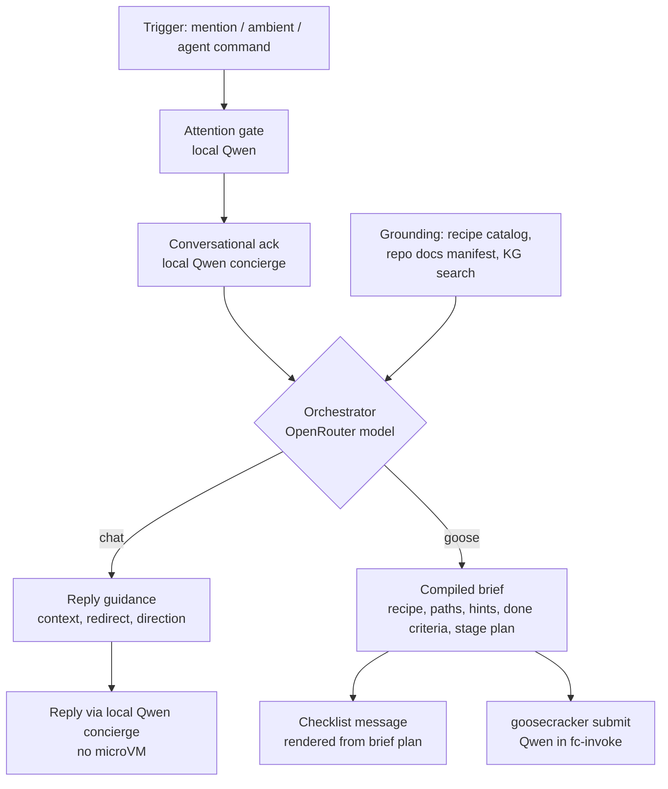

# ADR 036: Orchestrator Brief-Compiler Tier via OpenRouter

**Author:** Joe McGinley
**Status:** Accepted
**Created:** 2026-07-02

---

## Problem

Goose sessions run entirely on local Qwen (ADR 024/030). Qwen's dominant failure mode in sessions is not reasoning capacity but task ambiguity: it spends context and turns discovering what the task is (which recipe fits, which repo paths matter, what structures exist, what done looks like) before doing the work. Sessions that start from a well-specified brief succeed more often and finish faster, and the /improve-recipes evidence (#3037) repeatedly attributes bad sessions to bad task framing rather than bad execution.

At the same time, ADR 035 moves depth routing (chat vs goose) into the interaction path. Its plan currently places the `chat` branch inside the guest recipe router (`agent.yaml`), which means booting a Firecracker microVM to decide that no microVM was needed.

We want higher-quality inputs to the local executor and host-side routing, without putting a paid model on the high-volume paths.

---

## Decision

Add an **orchestrator tier** to the monolith chat harness: a host-side **brief compiler** that runs only on escalations, between the ADR 035 attention/ack turn and `goosecracker.api.submit()`. One call yields one brief whose `route` field selects which local executor consumes it; it does three jobs:

1. **Depth routing, host-side.** Decides chat vs goose before any microVM boots. The guest recipe router's planned `chat` branch (ADR 035 plan Phase 4) is built behind this seam instead of in `agent.yaml`.
2. **Brief compilation (goose route).** For goose-bound work, it produces a structured brief: chosen recipe route, relevant repo paths, structure hints, constraints, explicit done criteria, and an initial stage plan. The brief becomes the session's task input, and the initial stage plan can render the ADR 035 checklist before the guest boots.
3. **Reply enrichment (chat route).** For chat-bound work, the same call returns short **reply guidance**: the context it retrieved, an optional redirect (for example "this is really a repo task, offer to escalate"), and a direction hint. The local Qwen concierge writes the actual reply using that guidance as extra context. The paid model frames the reply; it never generates the user-facing tokens. Because the routing call already runs on every escalation, harvesting its output for the chat reply adds no new paid call: it stops discarding a pass we have already bought.

The orchestrator model is accessed through **OpenRouter** (one API key, model choice is configuration), defaulting to a cheap fast frontier-adjacent model (e.g. DeepSeek V4 Flash class). The key lives in a `OnePasswordItem`-sourced secret injected as an env var via monolith chart values, per the standard secrets pattern. The client is model-agnostic: swapping orchestrator models is a values change, not a code change.

**Cost containment is structural:** the paid model sits only on the escalation path, and only ever frames. It produces briefs and reply guidance, never the user-facing reply tokens, which local Qwen always generates. Attention classification and every non-escalation reply remain local-Qwen-only with no paid call at all. The chat route reuses the routing call's response rather than making a second one, so enrichment is free at the margin. Escalations are the rare event, so marginal cost stays near zero while the spend lands exactly where quality compounds.

| Aspect             | Today                                                 | Decided                                                                          |
| ------------------ | ----------------------------------------------------- | -------------------------------------------------------------------------------- |
| Depth routing      | Inside the guest (`agent.yaml`), costs a microVM boot | Host-side in the orchestrator call, before submit                                |
| Task input to Qwen | Raw prompt + guest-side context gathering             | Compiled brief: recipe, paths, hints, constraints, done criteria                 |
| Stage plan         | First produced by the guest after boot                | Initial plan from the brief; guest confirms/refines via stage markers            |
| Model access       | Local inference only                                  | Local Qwen + OpenRouter for the brief compiler (config-selected model)           |
| Chat replies       | Local Qwen, cold                                      | Local Qwen, seeded with the orchestrator's reply guidance (no paid reply tokens) |

---

## Architecture

Placement and contracts:

- Lives in `projects/monolith/chat/` beside the ADR 035 attention module; called by the shared agent flow before `submit()`.
- **Deterministic prompt assembly, stable prefix first.** Provider-side prompt caching (DeepSeek and most OpenRouter-served models cache by exact prefix match) only pays off if repeat calls share identical leading bytes. The orchestrator prompt is therefore assembled in strict stability order: (1) a **baked context bundle**: base system prompt, the recipe catalog with one-line descriptions, and a repo structure digest, generated deterministically at build time from committed sources (same generate-and-commit pattern as the docs manifests, so the bundle only changes when its inputs change and CI catches staleness); then (2) per-scope stable content (channel directive, pinned by version); then (3) volatile content last (KG retrieval results, channel context window, the request). No timestamps, request ids, or unsorted serialization anywhere in the prefix. Every escalation in a quiet hour then reuses the cached bundle prefix, cutting both cost and time-to-brief on repeat calls.
- **Grounding, not free association:** the orchestrator prompt is assembled from real sources it cannot invent: the recipe catalog (names + one-line descriptions), the committed repo-docs manifest, KG search results for the request, and the channel context window. The orchestrator holds no tools and takes no actions; it is retrieval-in, text-out.
- **Brief is advisory, execution is constrained.** The guest treats hints as hints; recipes, ACLs (ADR 029/034), and the egress boundary (ADR 023/026) constrain what the session can actually do. A wrong brief degrades quality, never privilege. Reply guidance on the chat route is likewise advisory: the local Qwen concierge remains the author of the reply and may ignore a redirect or direction that does not fit; a wrong hint yields a slightly worse reply, never an action.
- **Fail open.** If OpenRouter is down, unconfigured, or the server/channel has not granted external-API use, the flow degrades to today's behaviour: direct submit with the raw prompt, routing done by the guest. The orchestrator is an enhancement layer, never a hard dependency.
- **Briefs are telemetry.** Every brief is logged with (orchestrator model, recipe route, directive version, session outcome linkage) so the improvement loop can attribute failures to brief vs execution, and so frontier reruns can build "good brief" exemplars. The telemetry/feedback-loop design itself is a separate ADR.

## Alternatives Considered

- **Keep routing and context gathering in the guest (status quo).** Rejected: pays a microVM boot to route chat, and leaves task framing to the model least suited to it.
- **Bigger local orchestrator model.** Rejected: VRAM is already committed to the Qwen executor (ADR platform/010 constraints); a second large resident model doesn't fit node-4.
- **Claude CLI subprocess as the orchestrator.** Rejected for the hot path: quota-bound and slower; remains the tool for offline judging/improvement work where latency doesn't matter.
- **Direct DeepSeek API instead of OpenRouter.** Rejected: single-provider lock-in for the same integration effort; OpenRouter makes the model a config value and gives fallback providers.
- **Frontier model for the executor too.** Rejected: cost scales with session tokens, not escalations; the executor is where volume lives and local Qwen is proven there.

## Security

Baseline per `docs/security.md`. New surface: channel content leaves the cluster to a third-party API (OpenRouter and the underlying provider) on escalations. Mitigations: per-server/channel consent grant (ADR 029 grant kind) gates the orchestrator; ungranted scopes silently use the fail-open local path. The API key is 1Password-Operator-managed, never in git, and is not exposed to guests (host-side call only, outside the ADR 023 egress boundary guests traverse). Prompt injection via channel content can shape the brief but not escalate it: the orchestrator has no tools, and the brief cannot name tools, widen ACLs, or select repos outside the invoker's grants; those are enforced at submit time exactly as today.

## Risks

| Risk                                                               | Likelihood | Impact | Mitigation                                                                                                                                                      |
| ------------------------------------------------------------------ | ---------- | ------ | --------------------------------------------------------------------------------------------------------------------------------------------------------------- |
| Hallucinated structure hints poison sessions                       | Medium     | Medium | Ground the prompt in the recipe catalog / docs manifest / KG; hints are advisory; brief-vs-execution attribution in telemetry catches systematic offenders      |
| OpenRouter latency/outage stalls escalations                       | Low        | Low    | Fail open to direct submit; timeout budget on the orchestrator call                                                                                             |
| Cost creep as ambient mode grows escalation volume                 | Low        | Low    | Paid model only on escalations; per-brief spend logged; model choice is a values knob                                                                           |
| Provider variability through OpenRouter (model swapped/deprecated) | Medium     | Low    | Model pinned in values; briefs logged with model id so regressions are attributable                                                                             |
| Brief quality below raw-prompt baseline for simple tasks           | Low        | Medium | Compare outcomes via telemetry; per-scope disable returns any channel to the fail-open path                                                                     |
| Reply guidance biases the concierge into a worse or off-key reply  | Low        | Low    | Guidance is short and advisory, the concierge stays the author; chat-route briefs are logged so bad guidance is attributable; fail open drops guidance entirely |

## Open Questions

1. Brief format: freeform markdown task.md vs a small structured schema the guest shim parses (stage plan probably wants structure; hints can stay prose).
2. Baked bundle size vs cache minimums: how much recipe/structure detail belongs in the always-present prefix vs retrieved on demand (providers have minimum cacheable lengths and per-token prefix cost on true misses).
3. Should the orchestrator see prior session transcripts from the same thread for follow-up turns, or only the compiled channel context?
4. Timeout budget for the orchestrator call before failing open (initial guess: 10s).
5. How much reply guidance is useful on the chat route before it starts to over-steer the concierge (initial guess: a few short fields, redirect optional), and whether a `chat`-route call should skip the goose-only brief fields to save output tokens.

## References

| Resource                                                     | Relevance                                                                                 |
| ------------------------------------------------------------ | ----------------------------------------------------------------------------------------- |
| [ADR 035](035-discord-multiplayer-agent-ux.md)               | The interaction layer this tier slots into; Phase 4 chat branch is built behind this seam |
| [ADR 029](029-discord-bot-feature-acl.md)                    | Grant table gating external-API consent per server/channel                                |
| [ADR 030](030-fc-invoke-configurable-firecracker-surface.md) | Executor substrate the briefs feed                                                        |
| [ADR 023](023-egress-secret-proxy.md)                        | Guest egress boundary; the OpenRouter key stays host-side, outside it                     |
| /improve-recipes (#3037)                                     | Evidence that task framing drives session quality; consumer of brief telemetry            |
| Discord multiplayer agent UX implementation plan              | Whose Phase 4 this ADR redirects host-side                                                |
