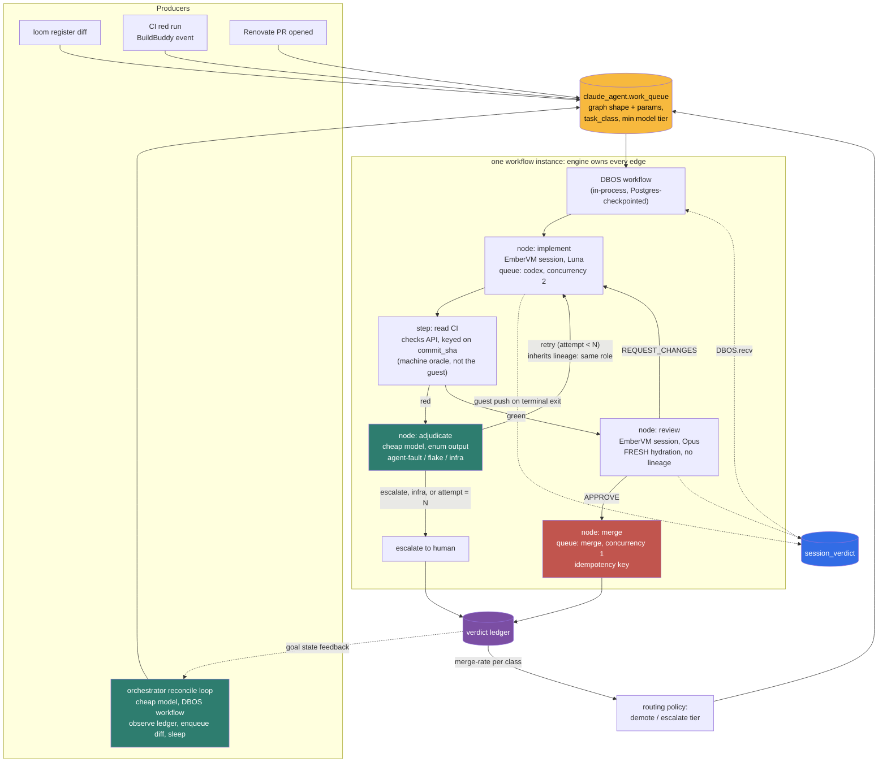

# ADR 038: Autonomous Work Queue with Capability-Tier Routing and Reviewer-Verdict Feedback

**Author:** jomcgi
**Status:** Accepted
**Created:** 2026-07-02
**Revised:** 2026-08-09 (substrate re-targeted from goosecracker to EmberVM + Codex; graph engine and session result contract decided)
**Builds on:** [022 - Firecracker Snapshot/Restore Controller](022-firecracker-snapshot-restore-controller.md) (the session runtime this queue now dispatches into, and the decision that reserved the DAG layer), [051 - Guest-Pushed Mid-Turn Progress](051-guest-pushed-mid-turn-progress.md) (the guest-to-monolith push path the result contract extends), [027 - Agent GitHub App Roles](027-agent-github-app-roles.md) (the implementer/reviewer identity split and merge gate this ADR routes work through), [048 - Codex OAuth Token Broker](048-codex-oauth-token-broker.md) (the subscription-billed implementer lane), [050 - Workspace Hydration from Git Mirror](050-workspace-hydration-from-git-mirror.md) (repo hydration for every dispatched node)
**Supersedes in part:** its own 2026-07-02 decision 1, which dispatched into goosecracker; goosecracker was retired 2026-07-28

---

## Problem

The original 2026-07-02 framing of this ADR was an idle RTX 4090: goosecracker
could run coding agents on in-cluster Qwen essentially for free, roughly 25-35M
output tokens per day sat unused, and nothing turned standing backlogs into
dispatchable work. That framing is dead. **Goosecracker was retired on
2026-07-28**, taking `dispatch.submit` with it, so this ADR's execution seam no
longer exists. The surviving Secret still carries the name, which
`projects/monolith/deploy/values.yaml:189` marks as historical.

The economic argument survived the substrate, in a stronger form. EmberVM plus
the Codex CLI on a flat subscription gives high-throughput agent sessions at a
marginal cost near zero, with warm restore measured at 2.5ms load-to-resume and
a durable workspace handle (`ember_lineage_id`) that survives VM expiry. The
runtime is real and it works.

What is missing is a **composition layer**. Every session today is started by a
human or by a single MCP call and runs exactly one chain of turns. There is no
way to express:

1. **Deterministic retry.** "Run Luna. If CI is red, feed it the failure and run
   again, up to N times, then escalate." Nothing counts attempts or owns the
   decision to stop.
2. **Conditional routing.** "When CI passes, hand the workspace to a reviewer
   session." Nothing evaluates a condition between sessions.
3. **Cross-agent coordination.** "Many implementers may run at once, but merges
   are serialized and concurrent Codex dispatches are capped." Nothing arbitrates
   shared resources across sessions.
4. **Sustained pursuit of a goal.** Every chain above still starts because a
   human started it. Nothing observes standing goals, decides what to work on
   next, and keeps doing so across days without a person in the loop.

Three problems block simply "running more agents", and a fourth now precedes
them all:

0. **No machine-readable session outcome.** `AgentSession.status` is a bare
   string defaulting to `"running"`, written in one place
   (`agent_sessions/store.py:216`). `AgentTurn` carries `terminal_reason`,
   `stop_reason`, `commit_sha` and `cost_usd`, but `terminal_reason` is raw CLI
   text, not a graded verdict. Nothing anywhere states "this run finished, CI is
   red, here is the failing target". Every form of composition is blocked on this
   and on nothing else.
1. **No supply of tasks.** Nothing turns the repos' standing backlogs (loom's
   committed code-health registers, red CI runs, Renovate PRs, stale STPA models)
   into dispatchable work items.
2. **Model capability is uneven across task types.** Luna handles mechanical,
   machine-verifiable edits well; it is not trusted for judgment-heavy authorship
   (STPA analysis, ADR drafting, subtle refactors). A queue that routes
   everything to the cheap lane produces plausible-but-wrong output exactly where
   it is most expensive to catch.
3. **No closed loop on outcomes.** Without recording whether each agent PR was
   approved, sent back, rejected, or requeued, there is no signal to tune specs
   or to demote task classes the cheap lane consistently fails at. High volume
   without feedback is noise generation.

The scarce resource, once implementation is cheap, is reviewer attention (human
and Opus-tier). The design goal is therefore not "maximum runs" but maximum
merged-or-useful output per unit of review attention.

---

## Decision

Eight decisions. The first is a prerequisite for every other one.

**1. A session terminates with a structured, guest-pushed verdict, and the
verdict is a claim, not evidence.** A new `agent_sessions.session_verdict` row
records `outcome` (one of `succeeded`, `needs_fix`, `blocked`, `abandoned`), plus
`pr_number`, `commit_sha`, and a free-text `detail`. The guest pushes it on
terminal exit over the same path ADR 051 established for mid-turn progress
(`agent_sessions/progress_ingest.py`), so this is an extension of a proven
channel, not new transport. Three properties matter:

- **It is emitted by the guest, not inferred by the caller.** Grading a run by
  parsing `result_text` would put an unreliable parser in the measurement path,
  the same objection this ADR already raises against free-form reviewer verdicts.
- **It makes the graph edge non-blocking.** Today a caller waits on a turn
  through an HTTP call with a 1800s read timeout
  (`agent_sessions/transport.py:170`). A graph node holding a 30 minute TCP
  connection is the most fragile possible edge, and a dropped connection has
  already lost a billed turn once (#4229). With a pushed verdict, a node
  submits and then durably waits for an event.
- **It says the session finished; it does not decide whether the work is good.**
  The verdict unblocks the workflow and supplies pointers (`pr_number`,
  `commit_sha`). CI state is then read by a deterministic step from the GitHub
  checks API and BuildBuddy, keyed on that commit. This split is deliberate and
  it is the difference between a design that works and one that is trivially
  gamed: the guest is the least-trusted component in the system, running a model
  on attacker-influenceable input, and it is also the component whose output is
  being graded. A guest that reports `succeeded` when CI is red would skip the
  retry path and spend the one resource this ADR calls scarce. Routing is decided
  by a CI exit code, so a CI exit code is what the engine must read. This repo's
  standing rule, that completion claims are verified rather than trusted, applies
  to agents at least as much as to people.

**2. DBOS Transact is the graph engine; the graph runs in-process in the
monolith.** DBOS is an MIT-licensed library, not a service: it checkpoints
workflow and step state to Postgres and recovers mid-graph after a process
restart. The three requirements map directly onto its primitives:

| Requirement                       | DBOS primitive                                                       |
| --------------------------------- | -------------------------------------------------------------------- |
| retry Luna N times on red CI      | `@DBOS.step(retries_allowed=True, max_attempts=N, backoff_rate=2.0)` |
| route to reviewer when CI passes  | an ordinary Python branch inside `@DBOS.workflow()`                  |
| serialize merges across agents    | a queue with `concurrency=1`                                          |
| cap concurrent Codex dispatches   | a second queue with `concurrency=2`                                  |
| wait for a session verdict        | `DBOS.recv(timeout_seconds=...)`, durable across restarts            |
| wait out a CI run                 | poll step on the checks API, `DBOS.sleep()` between polls            |

It adds one `@pip` dependency and one system database on the existing
`monolith-pg` CNPG cluster (provisioned as a CNPG `Database` CR, not by letting
the library create it). The dependency floors are already satisfied: `dbos`
2.29.0 requires `sqlalchemy[asyncio]>=2.0.43` (repo pins 2.0.48),
`psycopg[binary]>=3.1` (repo pins 3.3.3), and Python `>=3.10` (repo is 3.13), so
adopting it does not move any existing pin.

Three constraints have to be designed for rather than assumed away, because the
naive reading of "it recovers after a restart" is wrong in ways that bite exactly
here:

- **Recovery is scoped to `(executor_id, app_version)`.** `dbos/_recovery.py`
  filters pending workflows by both. A deploy that changes workflow code changes
  the app version, and the new pod will not adopt workflows checkpointed under
  the old one. With graphs spanning hours and multiple deploys a day, version
  stranding is the common case, not the corner case. So `DBOS__APPVERSION` is
  pinned deliberately and rolled only when a graph change is intended to strand,
  and stranded workflows need an explicit adoption path, not silence. The restart
  the library survives for free is the same-code restart (OOM, reschedule), which
  is worth having but is not the chart-bump roll on its own.
- **Cross-executor failover is a Conductor feature.** DBOS Inc's hosted control
  plane detects a dead worker and recovers its workflows. Self-hosted, that is
  our job: a sweeper that reclaims workflows whose executor is gone. Naming this
  now avoids the LangGraph mistake of leaning on a capability that turns out to
  sit behind a commercial boundary.
- **Steps are at-least-once, and a rolling update runs two pods at once.** Every
  externally-visible step (session dispatch, PR open, merge) carries an
  idempotency key via `SetWorkflowID` and asserts remote state before acting.
  Merge is the most expensive to double-fire; session dispatch is the most
  likely.

**3. The work queue becomes the graph's entry point, and nodes dispatch EmberVM
sessions.** The `claude_agent.work_queue` table holds pending work items exactly
as originally specified, but a drained row now starts a DBOS workflow rather
than calling `dispatch.submit`. Each node inside that workflow starts or resumes
an EmberVM session through the existing `agent_sessions` transport and waits on
the decision-1 verdict. The queue remains the single choke point: rate limits,
dedup, kill switch, and audit all live in one place.

Node-to-node handoff passes `ember_lineage_id` rather than a text summary,
**within a trust tier only**. Because a lineage handle survives VM expiry, a
retry node inherits the previous attempt's actual workspace instead of
re-hydrating and reading a description of what happened. That is a real win for
implementer-to-implementer continuity.

**The reviewer does not inherit the implementer's workspace.** It hydrates fresh
from the mirror and reviews the pushed branch. Handing the reviewer the
implementer's environment would let a prompt-injected implementer prepare the
room its own auditor works in: a planted `CLAUDE.md`, `AGENTS.md`, git hook, or
tool config in that workspace is *instructions to the reviewer's CLI* the moment
the lineage is restored. The 027 split still stops the reviewer's credentials
being used for a push, but APPROVE authority is exactly what an injection would
target, and the entire containment story in this ADR terminates in "an
adversarial reviewer". An auditor that inherits the auditee's environment is not
independent. Lineage handoff is therefore a same-role optimization, and the
cross-role boundary is a fresh hydration.

Two consequences follow. EmberVM's 6h `maxLifetime` retires the volume, so a
review backlog longer than that breaks even same-role handoff; the fallback is
fresh hydration plus a branch checkout, and the graph must treat a denied restore
as an ordinary path rather than an error. And because restore can be denied for
reasons unrelated to the work (unknown lineage, live heir, concurrent restore),
denial routes to re-hydration, never to a `needs_fix` verdict.

**4. Feeders produce work items; they are decoupled from execution.** A feeder is
any producer that writes queue rows: scheduled sweeps (loom code-health register
diffs, STPA staleness) or event reactions (BuildBuddy red run on a PR, Renovate
PR opened). Feeders declare a `task_class` per row.

| Feeder             | Trigger                                          | Task class            | Output                                                                   |
| ------------------ | ------------------------------------------------ | --------------------- | ------------------------------------------------------------------------ |
| loom register diff | post-merge register regen                        | `mechanical-refactor` | implement PR per register entry (dedup pair, complexity hotspot)         |
| CI first-responder | BuildBuddy red run                               | `advisory-diagnosis`  | PR comment quoting the failing assertion + first-pass cause              |
| Renovate triage    | Renovate PR opened                               | `advisory-triage`     | changelog-grounded risk comment on the Renovate PR                       |
| STPA refresh       | merge touching a system with an existing STPA.md | `judgment-analysis`   | stpa-skill refresh PR (see decision 5 for who runs it)                   |

**5. Every task class carries a minimum model capability, and judgment work never
routes to the cheap lane.** Task classes map to a verification mode and a floor
on the implementer tier:

| Verification mode    | Definition                                                                                                     | Implementer floor | Gate                                       |
| -------------------- | -------------------------------------------------------------------------------------------------------------- | ----------------- | ------------------------------------------ |
| **machine-verified** | objective done-condition a machine checks (tests green, register entry gone, schema validates)                 | Luna (default)    | Opus-or-better reviewer (027) + CI         |
| **advisory**         | output is a comment or digest; a wrong answer costs a few seconds of reading                                   | Luna              | none (no merge involved)                   |
| **judgment**         | correctness is only assessable by reading and thinking (STPA authorship, ADR drafts, non-mechanical refactors) | Opus or better    | Opus-or-better reviewer + human spot-check |

The general rule is unchanged from the original: **the cheap lane gets the work
whose mistakes a machine catches; anything gated only by reading routes to Opus
or better on both sides.** The lane names moved from Qwen to Luna, the policy did
not.

**6. All merging flows through the ADR 027 gate with strict review semantics.**
No autonomous path merges its own work. Implementer runs act as
`jomcgi-implementer[bot]` (pushes `claude/*`, opens the PR, applies
`agent:review-requested`); the reviewer acts as `jomcgi-reviewer[bot]` (Opus or
better, adversarial) and must end every pass in exactly one of GitHub's native
review states, never a bare comment:

- **APPROVE** (+ `agent-review/gate` green + rebase-merge), or
- **REQUEST_CHANGES** (inline comments, gate stays red).

Terminal non-merge outcomes are machine-readable too: a rejected PR is **closed
with an `agent:rejected` label**, and a "right idea, wrong attempt" is closed
with **`agent:requeue`**, which re-inserts the work item with the review comments
attached as context. These fixed semantics exist because the feedback loop
(decision 7) parses them.

Two clarifications on who emits verdicts and what they can say:

- **Human verdicts are first-class.** `@jomcgi` closing, rejecting, or requesting
  changes on an agent PR feeds the ledger through the same webhook-derived
  lifecycle with the same semantics as the bot reviewer. A human override is the
  strongest quality signal the loop gets and must never be invisible to it.
- **The reviewer can escalate, not just approve or reject.** If a diff labeled as
  a mechanical class turns out non-trivial on reading, the reviewer's correct
  move is REQUEST_CHANGES or close-with-`agent:requeue` carrying an explicit tier
  escalation, so the retry runs on an Opus-or-better implementer. Triviality is
  asserted by the feeder but adjudicated by the reviewer.

**7. A verdict ledger closes the loop and drives routing.** Each queue row records
its full lifecycle: `queued -> dispatched -> pr_opened -> {approved_merged |
changes_requested -> revised -> ... | rejected | requeued}` plus reviewer
verdict, review-round count, and wall time, joinable to the DBOS workflow ID and
to `agent_sessions`. Two consumers:

- **Spec tuning:** reviewer verdicts as ground truth, upgrading the taxonomy from
  "session looked inefficient" to "reviewer rejected this class of diff for
  reason X".
- **Routing policy:** per task class, track first-pass approval rate over a
  rolling window. A class whose merge rate falls below a floor is automatically
  demoted (implement -> advisory, or implementer floor raised to Opus); a class
  with sustained high first-pass approval can widen its scope.

**8. A cheap orchestrator model plans and adjudicates; it never holds control
flow.** Sustained autonomous progress toward goals needs something that decides
*what to work on next*, and paying an Opus-tier model to do that continuously
defeats the economics. A cheap, high-throughput orchestrator model (K3-class)
takes that role, confined to two seams:

- **Planner.** It reads the goal ledger and the verdict ledger, selects a graph
  shape from a registered catalog, parameterizes it, and writes a `work_queue`
  row. It chooses among graphs; it does not invent control flow. **Its parameters
  are schema-validated and clamped**: `task_class` from a fixed enum, repo from an
  allowlist, retry counts capped at the engine's own maximum. Without clamping,
  "parameterize the graph" is control flow by configuration, since a planner that
  can set N or pick the tier floor is steering routing without ever touching an
  edge.
- **Adjudicator.** Specific in-graph decision points are genuinely judgment and
  have no machine oracle: "is this CI failure the agent's fault or a known
  flake?", "is this diff in scope for the task as specified?". These become an
  `adjudicate` node whose output is constrained to an enum, so the deterministic
  graph switches on a *value* the model returned rather than the model
  performing a jump. The enum needs an **infrastructure arm** alongside
  agent-fault and flake: `no_capacity`, broker quota exhaustion, and ENOSPC all
  recur in this cluster, and collapsing them into "agent fault" would burn the
  attempt budget on failures no retry can fix. Synchronous dispatch failures
  (a 429 at submit) are better handled one layer down by DBOS step retries and
  never reach the adjudicator at all.

What the orchestrator model must never own: attempt counters, concurrency
limits, merge authority, or the edges themselves. Those stay in DBOS. Three
reasons, in increasing order of severity:

1. **Reproducibility.** A graph whose edges are model output cannot be replayed,
   which makes both DBOS recovery and post-hoc debugging unsound.
2. **Cost bounding.** "Retry up to 3 times" is a budget only if a counter
   enforces it. A model asked to decide whether to try again will, under
   ambiguity, try again.
3. **Injection containment.** The orchestrator reads CI logs, PR comments, and
   changelogs, all untrusted. A model that both reads attacker-influenced text
   and holds routing authority is a privilege escalation path straight to the
   merge node. Keeping merge authority in the deterministic layer behind the 027
   gate means the worst a fully compromised orchestrator achieves is enqueueing
   bad work, which still faces CI and an adversarial reviewer.

**Constant work toward goals is a reconcile loop, not a long-running agent.** The
orchestrator observes desired state (open goals) against actual state (merged
PRs, ledger verdicts), enqueues the diff, and stops. This is the same control-loop
shape the cluster already runs on, and it buys the properties an unbounded agent
loop cannot: it survives pod rolls mid-tick, it has a per-tick step and token
budget, its context is the ledger rather than an ever-growing transcript, and
pausing it is one row. An agent that "just keeps going" has none of those and
drifts once its context fills.

Each tick is a **separate scheduled workflow**, not one infinite workflow that
sleeps in a loop. A never-terminating workflow accumulates step history that
retention cannot collect and that recovery has to replay past on every restart,
so the loop that is supposed to run forever becomes the one thing that cannot.
Per-tick workflows have identical semantics with bounded history.

| Aspect          | Today                              | Decided                                                                         |
| --------------- | ---------------------------------- | ------------------------------------------------------------------------------- |
| Agent triggers  | human-only (Discord, /agents, MCP) | work queue drained by scheduler + event feeders                                 |
| Goal pursuit    | none (every run human-initiated)   | cheap-model reconcile loop: observe ledger, enqueue diff, sleep, repeat         |
| Who routes      | n/a                                | DBOS owns edges/counters/merges; the model only selects graphs and returns enums |
| Composition     | none (one session, one chain)      | DBOS workflow graph: retry, branch, fan-out, join                               |
| Session outcome | prose in `result_text`             | structured guest-pushed verdict (a claim) + CI read from the checks API         |
| Node handoff    | n/a                                | `ember_lineage_id` within a role; the reviewer always hydrates fresh            |
| Shared resource | uncoordinated                      | DBOS queues: merges at concurrency 1, Codex dispatch capped                     |
| Model routing   | one tier per session               | per-task-class implementer floor; judgment work never below Opus                |
| Merge path      | human merges everything            | 027 gate: reviewer app APPROVE/REQUEST_CHANGES, rebase-merge on green           |
| Outcome capture | none (result text only)            | verdict ledger: merged / changes-requested / rejected / requeued per task class |

---

## Architecture

The two green nodes are the only places a model influences routing, and neither
holds it: the orchestrator picks which graph to run, and `adjudicate` returns an
enum the engine switches on. Every counter, concurrency limit, and merge decision
sits in the deterministic layer.

The queue is deliberately upstream of, and ignorant of, execution details:
feeders know nothing about EmberVM, and the workflow knows nothing about where
work came from. The 027 gate is the only path to `main` for any autonomous run
regardless of implementer tier; the Opus-tier implementer does not get to skip
review just because it is a stronger model (attribution and separation of duties
are per role, not per model).

Note what stays where it is. **Argo Workflows is not displaced.** It keeps the
batch CronWorkflows in `monolith-workflows` and remains available for genuine
multi-agent DAG fan-out later, exactly as
[ADR 022](022-firecracker-snapshot-restore-controller.md) decision 6 reserved:
"each DAG node calls `submit(threadId)` and joins on registry state, never in
front of single-thread dispatch". This ADR builds the layer 022 anticipated; it
chose a library over the CRD for the reasons in Alternatives.

---

## Build order and operational requirements

Four things are prerequisites rather than follow-ups, because the design is
unsound without them.

**ADR 027 is a hard dependency and is still Draft.** Every containment argument
here terminates in the implementer/reviewer split and `agent-review/gate`, and
none of `jomcgi-implementer`, `jomcgi-reviewer`, or that gate exists in code
today. Until 027 ships, an autonomous graph has no merge gate to route through,
so 027 lands first. This ADR is Accepted as a design; it is not buildable ahead
of its floor.

**Cancellation must propagate into the guest.** A `DBOS.recv` timeout unblocks
the workflow but does nothing to the session, which keeps running or parks. In
this cluster parked sessions count against the live capacity cap and deny new
creates with a 429, so a single stuck graph degrades the substrate for
everything else, including human-triggered work. Every timeout, cancel, and
terminal path therefore carries a compensating step that issues a control-plane
session delete, plus a sweeper for lineages whose owning workflow is gone. This
is the failure mode most likely to be discovered the expensive way.

**Quota is an admission decision, not a retry outcome.** The Codex broker can be
exhausted (the exit-42 condition), and a graph that retries into a quota wall
records agent failures that are really infrastructure failures, poisoning the
routing statistics in decision 7. The drain checks quota before dispatch and
holds the row rather than burning attempts against it.

**A stuck graph must be debuggable without a hosted dashboard.** DBOS's
operational UI is Conductor; self-hosted we have the admin API and the system
tables. Minimum bar before this runs unattended: a workflow list-and-cancel
surface in the existing `/agents` console, a SigNoz span per node, and a runbook
entry. Given how much of this repo's operational practice is "read the
dashboard", shipping an autonomous graph with no way to see it stuck would be out
of character and would go wrong quietly.

---

## Alternatives Considered

### Graph engine

- **LangGraph.** Rejected on three counts. Its conditional edges are functions
  over an LLM message/state object, built for graphs whose routing a model
  decides; our routing is decided by a CI exit code, so we would adopt the whole
  state/reducer/channel model to use a sliver of it. Its checkpointers save state
  *between* nodes, not inside them, and our node is a 30 minute session, so the
  unit we most need to survive a crash is exactly the unit it replays from the
  start. And the durable half is not open source: the MIT license covers the
  in-process graph library, while `langgraph-api` (HTTP, persistence, task
  queues, streaming) is Elastic License 2.0 with fully self-hosted deployment on
  the Enterprise tier. Adopting it for the licensed capability would repeat the
  authentik DCR mistake of designing around an enterprise-gated feature.

  Two honesty notes on that rejection. First, decision 1 partly dissolves the
  checkpoint-granularity objection: once a node is submit-plus-durable-wait, no
  engine is holding a 30 minute node, and LangGraph's interrupt/resume covers
  that shape. The objection is therefore about the shape we would have had, not
  the shape we chose, and the licensing and fit objections have to stand on their
  own. They do. Second, decision 8 introduces a model into planning and
  adjudication, which is the case LangGraph is built for, so the fit objection
  deserves re-testing rather than restating. It survives: the model returns a
  graph selection or an enum, both *values* consumed by a deterministic switch,
  and nothing about that needs a graph framework. The point at which LangGraph
  would genuinely earn re-evaluation is if the model needed to interleave with
  most edges and synthesize state between them, which decision 8 deliberately
  forecloses.
- **Temporal.** Rejected. Adopted in [ADR 015](015-temporal-orchestration-substrate.md)
  and removed on 2026-06-14. Re-adoption needs a reason 015 did not have, and the
  server-plus-workers footprint is the opposite of what this repo wants for a
  graph of six node types. (Temporal self-hosts fine on Postgres, so the storage
  engine is not the objection; the deployment surface is.)
- **Restate, Hatchet.** Rejected for now. Both are credible and Postgres-friendly,
  Hatchet especially so, but both are a new service plus workers to deploy,
  image-build, and eventually decommission. That is strictly more infrastructure
  than Argo, which is already installed.
- **Argo Workflows DAG** (v4.0.8, already running in `monolith-workflows`). This
  is the strongest alternative and deserves the honest version of the argument,
  because it costs zero new dependencies, this repo already submits Argo
  workflows from Python via Hera (`hera==7.0.0`, `cluster/kubernetes.py:386`), and
  `retryStrategy` / `when:` / `synchronization` give three of our requirements
  declaratively.

  **The decisive objection is that the substrate underneath got roughly three
  orders of magnitude faster, which moved orchestration overhead from noise to
  dominant.** [ADR 019](019-substrate-executor-agentworkflow.md) decision 1
  justified Argo on precisely this axis: "For tens-of-seconds-to-minutes jobs at
  low volume, Argo's reconcile overhead is noise against the job duration", with
  the routing rule "long job: yes, overhead is noise. Short job: Argo's overhead
  is a large fraction." That premise was sound when dispatching a node meant a
  cold pod, measured in [ADR 026](026-fast-microvm-starts-and-stateful-artifact-iteration.md)
  at 5 to 7 seconds. It does not survive EmberVM: a warm restore is **2.5ms
  load-to-resume** (`projects/embervm/ARCHITECTURE.md:581`).

  An Argo node is a pod. Putting Argo in front of EmberVM pays a pod schedule,
  seconds and highly variable under node pressure, in order to make an HTTP call
  to a runtime whose entire value proposition is that it does not cold start.
  That is not a tuning problem, it is an ordering problem: the orchestrator would
  become the slowest part of a system built to be fast. Argo's `http` template
  avoids the per-node pod, but still pays the controller reconcile floor per
  node, which is the same objection one layer down. DBOS's per-node overhead is a
  Postgres write on a cluster the process is already connected to.

  This is also why Argo keeps the CronWorkflows and loses the agent graph: for a
  nightly batch job measured in minutes, reconcile overhead genuinely is noise,
  and ADR 019's original reasoning still holds there unchanged.

  Two weaker objections are worth naming and discarding, so they are not mistaken
  for load-bearing. The namespace-scoped install (`singleNamespace: true`, Roles
  not ClusterRoles) constrains nothing this graph needs, since nodes speak HTTP to
  the monolith and the EmberVM control plane rather than to the API server. And
  the etcd ceiling ADR 022 named was about indefinitely-idle threads churning
  status; a bounded run-to-completion pipeline at review-limited volume is Argo's
  home case, not its failure case.

- **Hand-rolled Postgres state machine.** Rejected as the default, though it was
  the initial instinct. `graph_runs` / `graph_nodes` tables using the
  `SELECT ... FOR UPDATE SKIP LOCKED` lease pattern this repo already runs in
  four places (`chat/store.py:714`, `agent/routine_jobs.py:100`,
  `knowledge/ingest_queue.py:128`, `scheduler/service.py:39`), plus
  `agent/locks.py` for the merge mutex, is perhaps 400 lines and zero new
  dependencies. DBOS is that code, already written, tested, and MIT.

  The honest exit cost, if DBOS is later abandoned, is **domain tables survive;
  workflow code and in-flight state do not.** That is more than "swap a driver"
  and much less than decommissioning a Temporal cluster, which is the comparison
  that matters given this repo's lineage of orchestration reversals.

### Queue and routing (unchanged from 2026-07-02)

- **No queue: cron-per-use-case.** Rejected: N independent crons cannot see each
  other's load, so they either starve or stampede the slots; rate limiting,
  dedup, kill switch, and outcome tracking would be reimplemented N times.
- **Route everything to the cheap lane and let the reviewer catch it.** Rejected:
  reviewer attention is the scarce resource; judgment work at Luna quality
  converts cheap implementation into expensive review time at a bad exchange
  rate.
- **Route everything to Opus for quality.** Rejected: defeats the purpose, and
  for mechanical machine-verified work Opus adds little over Luna + CI + reviewer.
- **Auto-merge on green CI without the reviewer gate for "mechanical" classes.**
  Rejected for now: CI green proves the tests still pass, not that the diff is the
  intended change (a dedup refactor can delete an assertion and stay green).
- **Reviewer verdicts as free-form comments, parsed by an LLM later.** Rejected:
  fixed GitHub review states plus two labels cost nothing to emit and make the
  ledger exact.
- **Infer session outcome by parsing `result_text`.** Rejected for the same
  reason: it puts an unreliable parser in the measurement path, and
  `terminal_reason` is already known to be raw CLI text rather than a graded
  signal.

### Orchestration by model

- **Let the cheap orchestrator model drive control flow directly (an agent loop
  that calls tools to start sessions, decides when to retry, and merges).**
  Rejected, and this is the load-bearing rejection in decision 8. It is the
  cheapest thing to build and the most expensive thing to operate: control flow
  becomes unreplayable so DBOS recovery is unsound, "retry 3 times" stops being a
  budget, and a model reading CI logs and PR comments while holding merge
  authority is a direct injection path to `main`. The cost argument for a cheap
  model is real and decision 8 takes it; what it does not buy is the right to put
  the model where the guarantees live.
- **A long-running orchestrator agent session instead of a reconcile loop.**
  Rejected: it cannot survive a monolith pod roll mid-tick, its context grows
  without bound so its judgment degrades exactly as the backlog gets interesting,
  and there is no natural place to enforce a per-tick budget. A reconcile loop
  over the ledger has durable state by construction and matches how everything
  else in this cluster is operated.
- **Opus as the orchestrator.** Rejected on economics, which is the whole premise:
  continuous goal pursuit at Opus rates spends the scarce budget on task selection
  rather than on review, where it is worth more. Opus stays on the reviewer side
  of the gate.

---

## Security

Baseline `docs/security.md`; inherits 023 (no credentials in guests), 027
(implementer structurally cannot merge), and 047 (per-principal egress). Posture:

- **The graph widens throughput, not privilege.** Every autonomous run holds
  exactly the same role-scoped capabilities as a human-triggered one; the worst a
  flooded or prompt-injected queue can do is open reviewable `claude/*` PRs and
  comments, all attributed to `jomcgi-implementer[bot]`.
- **Feeder input is untrusted content.** CI logs, changelogs, and repo files fed
  into task context can carry prompt injection; the containment is the 027
  capability split plus the adversarial reviewer, not prompt hygiene.
- **The verdict endpoint is a trust boundary.** A guest-pushed verdict decides
  whether work advances to review and merge, so the ingest path must authenticate
  the session token and bind the verdict to the session that owns it. An
  unauthenticated or spoofable verdict would let one session declare another's
  work mergeable.
- **The orchestrator model is untrusted by construction.** It reads CI logs, PR
  comments, and changelogs, all attacker-influenceable, and it runs continuously.
  It is therefore given exactly two powers: write a `work_queue` row, and return
  an enum from an `adjudicate` node. It holds no credentials, cannot start a
  session directly, and cannot merge. A fully compromised orchestrator enqueues
  bad work, which still faces the implementer's role scoping, CI, and an
  adversarial reviewer. This is the reason decision 8 refuses to give it the
  edges even though doing so would be simpler.
- **Kill switch.** The drain is a single scheduler row; pausing it stops all
  autonomous dispatch without touching human-triggered paths. DBOS queues give a
  second, finer switch: setting the merge queue to concurrency 0 halts landing
  while letting in-flight implementation finish. The orchestrator loop is a third,
  independent of both.
- **Rate and cost bounds.** Per-class and global daily caps on rows dispatched,
  so a runaway feeder cannot bury the review surface.

---

## Risks

| Risk                                                                                 | Likelihood | Impact | Mitigation                                                                                                                          |
| ------------------------------------------------------------------------------------ | ---------- | ------ | ----------------------------------------------------------------------------------------------------------------------------------- |
| A fourth orchestration dependency joins a lineage of reversals (ax, substrate, Temporal) | Medium | Medium | DBOS is a library, not a service: no deployment, no image, no cluster to tear down. Exit cost is swapping a driver, keeping the tables |
| Workflow replay re-merges a PR or re-opens a duplicate                              | Medium     | High   | `SetWorkflowID` idempotency key on every externally-visible step; merge step asserts PR state before acting                          |
| Retry loop burns Codex quota fixing an unfixable failure                              | Medium     | Medium | hard `max_attempts` per node, plus escalate-to-human as an explicit terminal edge, not a fallthrough                                 |
| Orchestrator model pursues goal drift, enqueueing steady low-value work               | High       | Medium | goals are explicit ledger rows, never model-inferred; per-tick enqueue cap; the same demotion policy applies to orchestrator-sourced classes |
| `adjudicate` returns the wrong enum (calls a real failure a flake, or vice versa)     | High       | Low    | the adjudicator chooses only *within* the attempt budget the engine enforces, so a wrong call costs at most one retry, never a loop  |
| Guest never pushes a verdict (crash, OOM, network), workflow waits forever            | Medium     | Medium | `DBOS.recv(timeout_seconds=...)` on every wait; timeout is a `blocked` verdict, not a hang                                           |
| Luna output quality makes reviewer round-trips exceed the value of merged work        | Medium     | Medium | verdict ledger + auto demotion per class; start with the most mechanical class where CI catches most misses                          |
| Review-attention flooding (too many PRs for Opus reviewer or Joe to absorb)           | Medium     | High   | global + per-class dispatch caps; advisory classes preferred where a PR is not needed; requeue instead of endless revision rounds    |
| Judgment work silently degrades on the cheap lane                                     | Medium     | High   | judgment classes floor at Opus by policy, not by hope; demoted on first bad cohort                                                  |
| Feedback loop gamed by its own semantics (reviewer soft-approves to keep throughput)  | Low        | Medium | reviewer prompt is adversarial and verdict-forced; Joe spot-checks merged agent PRs                                                  |
| DBOS system database drifts or bloats on `monolith-pg`                                | Low        | Low    | same CNPG cluster and backup path as application data; workflow retention configured, not unbounded                                 |
| A deploy strands in-flight workflows under the old `app_version` and they never resume | High      | High   | pin `DBOS__APPVERSION` deliberately; stranded-workflow adoption is an explicit operation with an alert, never silent                 |
| A timed-out graph leaves an EmberVM session parked, denying creates cluster-wide      | High       | High   | compensating session-delete step on every terminal path; sweeper for lineages whose owning workflow is gone                          |
| Prompt-injected implementer prepares the workspace its reviewer then restores         | Medium     | High   | reviewer hydrates fresh from the mirror; lineage handoff is same-role only (decision 3)                                             |
| Guest reports `succeeded` when CI is red, skipping retry and spending reviewer time   | Medium     | High   | verdict is a claim; CI state read by a deterministic step from the checks API keyed on `commit_sha` (decision 1)                    |
| Retries burn attempts against a quota wall and get recorded as agent failures         | High       | Medium | quota checked at admission, not discovered by retry; infrastructure arm on the adjudicate enum                                       |

---

## Open Questions

1. **Revision loop bound.** After how many REQUEST_CHANGES rounds does a PR
   auto-close as `agent:requeue` (fresh attempt with review context) versus
   `agent:rejected`? Proposed default: 2 rounds.
2. **Event transport for feeders.** BuildBuddy red runs and Renovate PRs need a
   webhook or poll path into the feeder; polling via the scheduler is simplest,
   webhooks are fresher. Start with polling.
3. **Demotion thresholds.** What first-pass approval rate demotes a class, over
   what window? Needs a few weeks of ledger data before fixing numbers.
4. **Where the graph shape is declared.** Decision 2 puts graphs in Python. If
   several graph shapes appear and they differ only in node parameters, a
   declarative form beside `claude_routines/*.yaml` (which already has a
   `schema.json`) may be worth extracting. Do not pre-build it for one graph.
5. **When Argo earns the DAG layer back.** ADR 022 reserved fan-out/join above
   the controller. If a workflow ever needs to spawn N implementers across N
   repos and join, re-evaluate whether the outer layer should be an Argo DAG
   calling into DBOS workflows rather than DBOS doing both.

---

## References

| Resource                                                                                    | Relevance                                                                                                        |
| ------------------------------------------------------------------------------------------- | ---------------------------------------------------------------------------------------------------------------- |
| [ADR 022 - Firecracker Snapshot/Restore Controller](022-firecracker-snapshot-restore-controller.md) | Decision 6 dropped Argo from single-thread dispatch and reserved the DAG-fan-out layer this ADR builds.  |
| [ADR 027 - Agent GitHub App Roles](027-agent-github-app-roles.md)                           | The implementer/reviewer identities, `agent-review/gate`, and review semantics all merges route through.         |
| [ADR 051 - Guest-Pushed Mid-Turn Progress](051-guest-pushed-mid-turn-progress.md)           | The guest-to-monolith push channel the session verdict extends.                                                  |
| [ADR 050 - Workspace Hydration from Git Mirror](050-workspace-hydration-from-git-mirror.md) | Repo hydration for every dispatched node.                                                                        |
| [ADR 048 - Codex OAuth Token Broker](048-codex-oauth-token-broker.md)                       | The subscription-billed implementer lane the cheap tier runs on.                                                 |
| [ADR 015 - Temporal](015-temporal-orchestration-substrate.md)                               | Deprecated 2026-06-14; the precedent that makes a service-shaped engine a hard sell.                             |
| [DBOS Transact (MIT)](https://github.com/dbos-inc/dbos-transact-py)                          | The graph engine: durable workflows, steps with retry policy, and queues with concurrency limits over Postgres.  |
| [DBOS queues and concurrency](https://docs.dbos.dev/python/tutorials/queue-tutorial)        | The merge serializer and Codex dispatch cap.                                                                     |
| loom docs/code-health/{complexity,duplication}.md                                            | The machine-legible registers behind the highest-volume feeder.                                                  |
