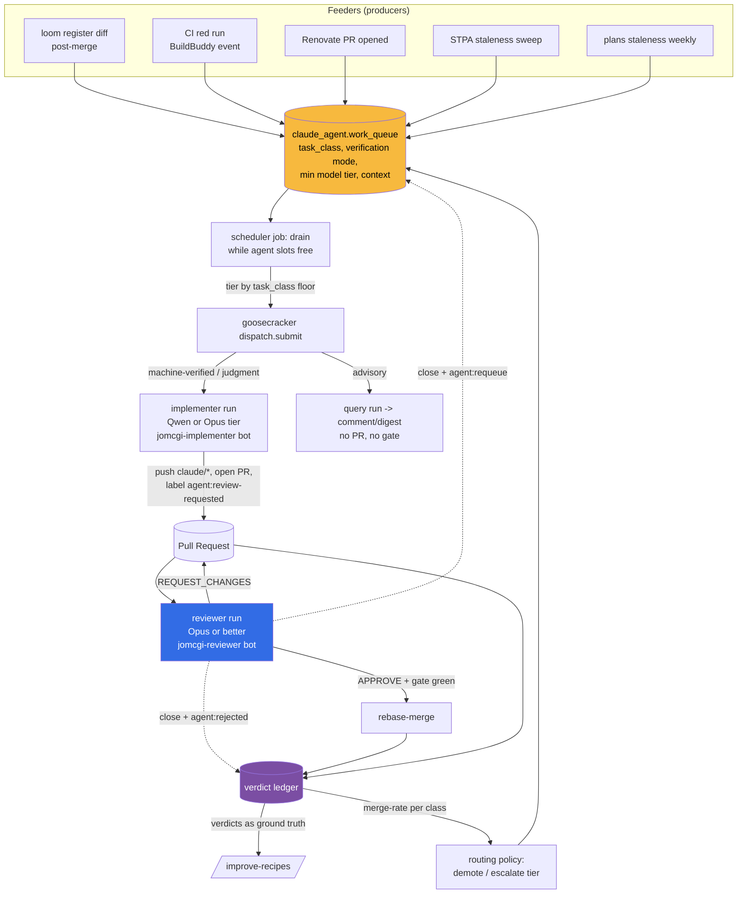

# ADR 038: Autonomous Work Queue with Capability-Tier Routing and Reviewer-Verdict Feedback

**Author:** jomcgi
**Status:** Draft
**Created:** 2026-07-02
**Builds on:** [025 - Three-Layer Agent Stack](025-three-layer-agent-stack-goosecracker.md) (goosecracker dispatch as the execution seam), [041 - Hot Git Mirror Agent Workspaces](041-hot-git-mirror-agent-workspaces.md) (repo hydration for homelab and loom), [027 - Agent GitHub App Roles](027-agent-github-app-roles.md) (the implementer/reviewer identity split and merge gate this ADR routes work through), [030 - fc-invoke](030-fc-invoke-configurable-firecracker-surface.md) (the substrate whose capacity this ADR saturates)

---

## Problem

The goosecracker stack (025/026/030) can run coding agents on in-cluster Qwen essentially for free: the RTX 4090 sustains ~170 tok/s single-stream, ~410 tok/s at batch 3, and SigNoz shows the inference pod non-concurrent 99.9% of the time. Roughly 25-35M output tokens per day of local inference sit idle. Yet every agent run today is human-triggered (Discord `/artifact`, `/agent`, or a manual MCP call). There is no mechanism that keeps the substrate busy, so the marginal cost advantage of local inference is unrealized.

Three problems block simply "running more agents":

1. **No supply of tasks.** Nothing turns the repos' standing backlogs (loom's committed code-health registers, red CI runs, Renovate PRs, stale STPA models, stale plans) into dispatchable work items.
2. **Model capability is uneven across task types.** Qwen3.6-35B-A3B handles small, mechanical, machine-verifiable edits well; it is not trusted for judgment-heavy authorship (STPA analysis, ADR drafting, subtle refactors). A queue that routes everything to the cheap model produces plausible-but-wrong output exactly where it is most expensive to catch.
3. **No closed loop on outcomes.** Without recording whether each agent PR was approved, sent back, rejected, or requeued, there is no signal to tune recipes (the `/improve-recipes` loop) or to demote task classes the cheap model consistently fails at. High volume without feedback is noise generation.

The scarce resource, once inference is free, is reviewer attention (human and Opus-tier). The design goal is therefore not "maximum runs" but maximum merged-or-useful output per unit of review attention, with the GPU saturated by work whose failures are cheap to catch.

---

## Decision

Five decisions.

**1. A Postgres-backed work queue, drained by a scheduler job into goosecracker dispatch.** A new `claude_agent.work_queue` table holds pending work items; a monolith scheduler job (the existing Postgres-backed routine-job registry, no new infra) drains it whenever an fc-invoke `agent` slot is free, calling the existing `dispatch.submit(task, recipe, tier, repo, git_ref, ...)` seam. Target steady-state is 2-3 concurrent guests (matching fc-invoke `concurrency` and vLLM `max-num-seqs=3`). The queue is the single choke point: every autonomous run enters through it, so rate limits, dedup, kill switch, and audit all live in one place.

**2. Feeders produce work items; they are decoupled from execution.** A feeder is any producer that writes queue rows: scheduled sweeps (loom code-health register diffs, STPA staleness, plans triage) or event reactions (BuildBuddy red run on a PR, Renovate PR opened). Feeders declare a `task_class` per row. Initial feeders, chosen for volume and cheap verification:

| Feeder             | Trigger                                          | Task class            | Output                                                                   |
| ------------------ | ------------------------------------------------ | --------------------- | ------------------------------------------------------------------------ |
| loom register diff | post-merge register regen                        | `mechanical-refactor` | implement-recipe PR per register entry (dedup pair, complexity hotspot)  |
| CI first-responder | BuildBuddy red run                               | `advisory-diagnosis`  | query-recipe PR comment quoting the failing assertion + first-pass cause |
| Renovate triage    | Renovate PR opened                               | `advisory-triage`     | changelog-grounded risk comment on the Renovate PR                       |
| STPA refresh       | merge touching a system with an existing STPA.md | `judgment-analysis`   | stpa-skill refresh PR (see decision 3 for who runs it)                   |
| plans staleness    | weekly                                           | `advisory-triage`     | digest classifying plans as merged / in-flight / stale / parked          |

**3. Every task class carries a minimum model capability, and judgment work never routes to the small model.** Task classes map to a verification mode and a floor on the implementer tier:

| Verification mode    | Definition                                                                                                     | Implementer floor   | Gate                                       |
| -------------------- | -------------------------------------------------------------------------------------------------------------- | ------------------- | ------------------------------------------ |
| **machine-verified** | objective done-condition a machine checks (tests green, register entry gone, schema validates)                 | Qwen (default tier) | Opus-or-better reviewer (027) + CI         |
| **advisory**         | output is a comment or digest; a wrong answer costs a few seconds of reading                                   | Qwen                | none (no merge involved)                   |
| **judgment**         | correctness is only assessable by reading and thinking (STPA authorship, ADR drafts, non-mechanical refactors) | Opus or better      | Opus-or-better reviewer + human spot-check |

Concretely for STPA: initial authorship of the ~18 missing per-system STPA.md files is judgment work and runs on an Opus-tier implementer (a hosted-model goosecracker tier per 024, or a Claude Code session); Qwen is limited at most to staleness _refresh_ of an existing model, and even that ships through the reviewer gate. If refresh quality proves poor in the feedback loop (decision 5), the class escalates to Opus and Qwen keeps only the detection half ("this STPA is stale") which is advisory. The general rule: **the cheap model gets the work whose mistakes a machine catches; anything gated only by reading routes to Opus or better on both sides.**

**4. All merging flows through the ADR 027 gate with strict review semantics.** No autonomous path merges its own work. Implementer runs act as `jomcgi-implementer[bot]` (pushes `claude/*`, opens the PR, applies `agent:review-requested`); the reviewer acts as `jomcgi-reviewer[bot]` (Opus or better, adversarial) and must end every pass in exactly one of GitHub's native review states, never a bare comment:

- **APPROVE** (+ `agent-review/gate` green + rebase-merge), or
- **REQUEST_CHANGES** (inline comments, gate stays red).

Terminal non-merge outcomes are made machine-readable too: a rejected PR is **closed with an `agent:rejected` label**, and a "right idea, wrong attempt" is closed with **`agent:requeue`**, which re-inserts the work item with the review comments attached as context. These fixed semantics exist because the feedback loop (decision 5) parses them; free-form outcomes ("LGTM but...", silent closes) would make merge-rate statistics unusable. Advisory task classes bypass all of this because they never open a PR.

Two clarifications on who emits verdicts and what they can say:

- **Human verdicts are first-class.** `@jomcgi` closing, rejecting, or requesting changes on an agent PR feeds the ledger through the same webhook-derived lifecycle with the same semantics as the bot reviewer; the same labels apply. A human override is the strongest quality signal the loop gets and must never be invisible to it.
- **The reviewer can escalate, not just approve or reject.** If a diff labeled as a mechanical class turns out non-trivial on reading (broader blast radius than the task spec, subtle semantics, security-adjacent), the reviewer's correct move is REQUEST_CHANGES or close-with-`agent:requeue` carrying an explicit tier escalation, so the retry runs on an Opus-or-better implementer. Triviality is asserted by the feeder but adjudicated by the reviewer; misclassification is a routing correction, not a merge decision.

**5. A verdict ledger closes the loop and drives routing.** Each queue row records its full lifecycle: `queued -> dispatched -> pr_opened -> {approved_merged | changes_requested -> revised -> ... | rejected | requeued}` plus reviewer verdict, review-round count, and wall time, joinable to `claude_agent.agent_threads` (session ledger) and the recipes' git generation (the `/improve-recipes` cohort key). Two consumers:

- **Recipe tuning:** `/improve-recipes` gains reviewer verdicts as ground truth, upgrading its taxonomy from "session looked inefficient" to "reviewer rejected this class of diff for reason X", with the evidence rule unchanged (every recipe edit cites sessions).
- **Routing policy:** per task class, track first-pass approval rate and rejection rate over a rolling window. A class whose merge rate falls below a floor is automatically demoted (implement -> advisory, or implementer floor raised to Opus); a class with sustained high first-pass approval can widen its scope. Demotion is the safety valve that lets us start optimistic about what Qwen can do without accumulating review-attention debt when it can't.

| Aspect          | Today                                 | Decided                                                                         |
| --------------- | ------------------------------------- | ------------------------------------------------------------------------------- |
| Agent triggers  | human-only (Discord, manual MCP)      | work queue drained by scheduler + event feeders                                 |
| GPU utilization | ~0% (non-concurrent 99.9% of scrapes) | sustained 2-3 concurrent agent streams                                          |
| Model routing   | one default tier per thread           | per-task-class implementer floor; judgment work never below Opus                |
| Merge path      | human merges everything               | 027 gate: reviewer app APPROVE/REQUEST_CHANGES, rebase-merge on green           |
| Outcome capture | none (result text only)               | verdict ledger: merged / changes-requested / rejected / requeued per task class |
| Recipe feedback | on-demand session classification      | reviewer verdicts as ground truth for `/improve-recipes` + auto demotion        |

---

## Architecture

The queue is deliberately upstream of, and ignorant of, execution details: feeders know nothing about fc-invoke, and the drain loop knows nothing about where work came from. The 027 gate is the only path to `main` for any autonomous run regardless of implementer tier; the Opus-tier implementer does not get to skip review just because it is a stronger model (attribution and separation of duties are per role, not per model).

---

## Alternatives Considered

- **No queue: cron-per-use-case (one scheduled routine per feeder that dispatches directly).** Rejected: N independent crons cannot see each other's load, so they either starve or stampede the 2-3 slots; rate limiting, dedup, kill switch, and outcome tracking would be reimplemented N times.
- **Route everything to Qwen and let the reviewer catch it.** Rejected: reviewer attention (Opus tokens and Joe's spot-checks) is the scarce resource; judgment work at Qwen quality converts free GPU time into expensive review time at a bad exchange rate. The capability floor keeps the exchange rate favorable.
- **Route everything to Opus for quality.** Rejected: defeats the purpose (the idle capacity being saturated is the local GPU, not the hosted-model budget), and for mechanical machine-verified work Opus adds little over Qwen + CI + reviewer.
- **Auto-merge on green CI without the reviewer gate for "mechanical" classes.** Rejected for now: CI green proves the tests still pass, not that the diff is the intended change (a dedup refactor can delete an assertion and stay green). The reviewer gate stays universal for merges; if a class shows a long run of trivial approvals, relaxing it is a cheap follow-up decision, whereas un-merging bad code is not.
- **Reviewer verdicts as free-form comments, parsed by LLM later.** Rejected: fixed GitHub review states plus two labels (`agent:rejected`, `agent:requeue`) cost nothing to emit and make the ledger exact; parsing prose verdicts would put an unreliable model in the measurement path.
- **Reuse claude.ai scheduled routines as the drain loop.** Rejected: routines have 1h minimum intervals and jitter, and run outside the cluster; the monolith scheduler already runs in-cluster next to the ledger and dispatch seam with tested lock semantics.

---

## Security

Baseline `docs/security.md`; inherits 023 (no credentials in guests), 026 (mirror push confined to `refs/agents/**`), and 027 (implementer structurally cannot merge). Queue-specific posture:

- **The queue widens throughput, not privilege.** Every autonomous run holds exactly the same role-scoped capabilities as a human-triggered one; the worst a flooded or prompt-injected queue can do is open reviewable `claude/*` PRs and comments, all attributed to `jomcgi-implementer[bot]`.
- **Feeder input is untrusted content.** CI logs, changelogs, and repo files fed into task context can carry prompt injection; the containment is the 027 capability split (the implementer cannot merge) plus the adversarial reviewer, not prompt hygiene.
- **Kill switch.** The drain job is a single scheduler row; pausing it stops all autonomous dispatch without touching human-triggered paths.
- **Rate and cost bounds.** Per-class and global daily caps on queue rows dispatched; Renovate-style hourly PR rate limit so a runaway feeder cannot bury the review surface.

---

## Risks

| Risk                                                                                 | Likelihood | Impact | Mitigation                                                                                                                       |
| ------------------------------------------------------------------------------------ | ---------- | ------ | -------------------------------------------------------------------------------------------------------------------------------- |
| Qwen output quality makes reviewer round-trips exceed the value of merged work       | Medium     | Medium | verdict ledger + auto demotion per class; start with the most mechanical class (loom test dedup) where CI catches most misses    |
| Review-attention flooding (too many PRs for Opus reviewer / Joe to absorb)           | Medium     | High   | global + per-class dispatch caps; advisory classes preferred where a PR isn't needed; requeue instead of endless revision rounds |
| STPA or other judgment work silently degrades on the small model                     | Medium     | High   | judgment classes floor at Opus by policy, not by hope; Qwen limited to detection/refresh and demoted on first bad cohort         |
| Feedback loop gamed by its own semantics (reviewer soft-approves to keep throughput) | Low        | Medium | reviewer prompt is adversarial and verdict-forced; Joe spot-checks merged agent PRs; merge-rate floors are tuned, not targets    |
| Queue and ledger drift from agent_threads (two sources of truth)                     | Medium     | Low    | queue rows reference session_id; ledger derives lifecycle from GitHub webhooks + thread states, no hand-maintained status        |
| loom auto-merge-on-green conflicts with the 027 gate                                 | Low        | Medium | branch protection requires `agent-review/gate` in loom too before any autonomous implementer is pointed at it                    |

---

## Open Questions

1. **Concurrency split between implementer and reviewer runs.** Reviewer runs on a hosted tier (no GPU contention), but if a local Opus-class model ever serves review, slots need partitioning so review is never starved by implementation.
2. **Revision loop bound.** After how many REQUEST_CHANGES rounds does a PR auto-close as `agent:requeue` (fresh attempt with review context) versus `agent:rejected`? Proposed default: 2 rounds.
3. **Event transport for feeders.** BuildBuddy red runs and Renovate PRs need a webhook or poll path into the feeder; polling via the scheduler is simplest, webhooks are fresher. Start with polling.
4. **STPA-refresh recipe shape.** The stpa skill is written for Claude Code; the goose port (or a "run the skill via a hosted-tier session" shim) needs its own design once the queue exists.
5. **Demotion thresholds.** What first-pass approval rate demotes a class, over what window? Needs a few weeks of ledger data before fixing numbers.

---

## References

| Resource                                                                              | Relevance                                                                                                            |
| ------------------------------------------------------------------------------------- | -------------------------------------------------------------------------------------------------------------------- |
| [ADR 027 - Agent GitHub App Roles](027-agent-github-app-roles.md)                     | The implementer/reviewer identities, `agent-review/gate`, and review semantics this queue routes all merges through. |
| [ADR 025 - Three-Layer Agent Stack](025-three-layer-agent-stack-goosecracker.md)      | `dispatch.submit` as the execution seam the drain loop calls.                                                        |
| [ADR 041 - Hot Git Mirror Agent Workspaces](041-hot-git-mirror-agent-workspaces.md)   | Repo hydration (homelab, loom) and `refs/agents/**` recording for every queued run.                                  |
| [ADR 030 - fc-invoke](030-fc-invoke-configurable-firecracker-surface.md)              | The workload config (`concurrency`, timeouts) that defines a "free slot".                                            |
| [ADR 024 - Hosted-Model Tiers](024-discord-agent-hosted-model-tiers-and-artifacts.md) | Tier mechanism used to run judgment classes on Opus-or-better implementers.                                          |
| Improve-recipes feedback loop design                                                  | The eval loop the verdict ledger feeds as ground truth.                                                              |
| loom docs/code-health/{complexity,duplication}.md                                     | The machine-legible registers behind the highest-volume feeder.                                                      |
