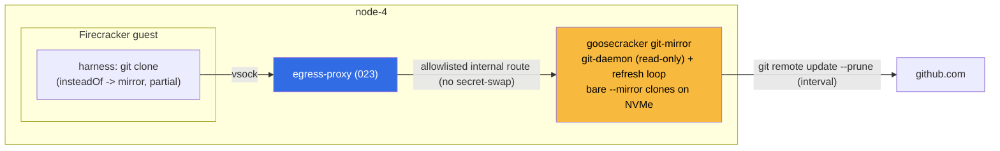

# ADR 041: Hot Git Mirror for goosecracker Agent Workspaces

**Author:** jomcgi
**Status:** Draft
**Created:** 2026-06-28
**Builds on:** [022 - Firecracker Snapshot/Restore Controller](022-firecracker-snapshot-restore-controller.md) (the warm-base and spin-up path this changes), [023 - Egress Secret Proxy](023-egress-secret-proxy.md) (the egress hop guests reach the mirror through), [025 - Three-Layer Agent Stack](025-three-layer-agent-stack-goosecracker.md) (places repo provisioning in the `goosecracker` layer)

---

## Problem

Every agent thread needs a repo checkout in its workspace, and provisioning that checkout sits on the spin-up hot path. Today the warm base is repo-agnostic (the harness image with an empty `/workspace`), so the guest cold-clones the repo from GitHub at startup, on every spin-up. That has three costs:

1. **Latency.** A fresh clone from GitHub per spin-up is the slow step, undermining the sub-second restore the snapshot substrate (022) otherwise gives us.
2. **GitHub on the hot path.** Spin-up now depends on GitHub availability and rate limits, and pays public-internet round-trips through the egress hop.
3. **No good freshness/speed trade with the obvious fix.** Baking the repo into the warm base would remove the per-spin-up clone, but it couples base freshness to repo freshness: every time `main` advances the base is stale, forcing constant rebuilds of ~1 GB base snapshots. That trades one churn for a worse one.

We want fast (sub-second) workspace provisioning, GitHub off the spin-up hot path, and no base-rebuild churn, all at once.

---

## Decision

Stand up a **hot, in-cluster git mirror** colocated on node-4 that keeps bare `--mirror` clones of registered repos continuously fresh. Agent guests provision their workspace with a fast partial fetch from this local mirror instead of cloning GitHub. The warm base stays repo-agnostic.

This is a **`goosecracker`-layer concern** per ADR 025: provisioning a repo into the workspace is workload assembly, which 025 places in the agent manager, not the substrate. The `firecracker-substrate` stays repo- and goose-agnostic; it boots an opaque rootfs and enforces an opaque egress allowlist, never learning there is a git mirror. `goosecracker` owns the mirror, the repo registry, and the egress-allowlist entry it injects.

| Aspect                     | Today                                | Decided                                                            |
| -------------------------- | ------------------------------------ | ------------------------------------------------------------------ |
| Workspace repo source      | guest cold-clones GitHub per spin-up | guest partial-fetches a hot, in-cluster mirror                     |
| Warm base                  | repo-agnostic                        | repo-agnostic (unchanged; no baking)                               |
| Base rebuild trigger       | harness image change                 | harness image change (repo freshness decoupled)                    |
| GitHub on spin-up path     | yes (every thread)                   | no (only the mirror's background refresh touches GitHub)           |
| Credential needed to clone | guest egress to github.com           | none (internal mirror, unauthenticated; token is push-only)        |
| Layer                      | implicit in the guest harness        | explicit `goosecracker` provisioning concern (ADR 025)             |
| Sub-second spin-up         | no (full clone)                      | yes (warm mirror + `--single-branch`/shallow/`--filter=blob:none`) |

Concretely: a read-only `git daemon` serves the bare mirrors over `git://`; a refresh loop keeps each registered repo fresh (`git remote update --prune` on an interval). Registered repos are a static values list (`homelab`, `loom`) to start, with a DB-backed dynamic registry as the follow-on for runtime-created agents. The harness redirects clones to the mirror with `git config url.<mirror>.insteadOf https://github.com/`, so recipes keep referencing github.com unchanged. Sub-second provisioning comes from the fetch shape, not just proximity: `--single-branch`, shallow `--depth`, and partial clone (`--filter=blob:none`) so the guest fetches one ref's tip and lazily pulls only the blobs it opens.

---

## Architecture

The mirror is a `goosecracker`-layer service. Guests reach it through the existing egress path (023): guest to vsock (local, instant), egress-proxy to the mirror Service (node-local via `internalTrafficPolicy: Local`). The allowlist entry is injected by `goosecracker` and enforced opaquely by the substrate, so the ADR 025 seam holds: the substrate does not learn it is routing a git fetch. GitHub is touched only by the mirror's background refresh, never on a guest's spin-up path.

---

## Alternatives Considered

- **Bake the repo into the warm base.** Rejected: couples base freshness to repo freshness, forcing constant ~1 GB base rebuilds as `main` advances. The repo-agnostic base is the property worth keeping.
- **Host-side `file://` provisioning into the base.** Rejected: the clone is a guest-side harness behavior, not host-side, so `file://` from the node's disk is not reachable by the microVM; and it is a variant of baking, with the same freshness coupling.
- **A git CDN / local forge (Gitea, Forgejo) with push/pull.** Rejected as over-spec for a single monorepo: a caching CDN's lazy-population advantage evaporates when the repo is one big tree the bare mirror holds completely, and it does not serve a fully-present repo any faster. A push-capable layer is actively unwanted (see next).
- **Push-through / write-back mirror.** Rejected: GitHub must stay the authoritative write target because pushes trigger BuildBuddy CI, drive PR review, and are what ArgoCD's source tracks. A local write layer either adds a useless transparent proxy or introduces a divergence window that breaks the push-to-test loop.
- **Git objects in S3/SeaweedFS.** Rejected: git over S3 is not native and every fetch is an S3 round-trip; a plain bare mirror on local NVMe is simpler and faster.
- **No mirror, partial-clone GitHub directly.** Rejected: still couples spin-up to GitHub availability and rate limits and pays public-internet latency. The mirror is what makes the fetch node-local and GitHub-independent.

---

## Security

Baseline `docs/security.md`. This adds a read-only, cluster-internal service and one egress-allowlist entry; it moves no existing trust boundary.

- **The clone path carries no credentials.** The mirror serves public-repo content read-only and unauthenticated over an internal ClusterIP (`internalTrafficPolicy: Local`). Cloning needs no GitHub token; the token is only ever needed for push, which still goes direct to GitHub. Keeping the clone path token-free keeps it out of the 023 secret-swap boundary entirely.
- **The egress entry stays substrate-opaque (025).** The allowlist route to the mirror is `goosecracker`-injected and substrate-enforced; it involves no placeholder swap. The substrate routes it without parsing that it is a git fetch.
- **Plaintext `git://` is acceptable here.** Traffic is read-only public-repo content on an internal, node-local hop. If stronger guarantees are wanted later, mesh mTLS or smart-HTTP can wrap it (Linkerd is currently disabled on node-4 for these workloads).

---

## Risks

| Risk                                                                                        | Likelihood | Impact | Mitigation                                                                                                                         |
| ------------------------------------------------------------------------------------------- | ---------- | ------ | ---------------------------------------------------------------------------------------------------------------------------------- |
| Mirror staleness between refresh passes serves a slightly old `main`                        | Medium     | Low    | Short refresh interval; a push webhook can trigger an immediate update later; the delta a guest still pulls is small               |
| Single mirror pod on node-4 is down (`internalTrafficPolicy: Local` has no remote fallback) | Low        | Medium | Make the harness `insteadOf` redirect conditional so a missing mirror falls back to GitHub direct; acceptable degraded path for v1 |
| First fetch of a large repo has an irreducible floor even warm                              | Medium     | Low    | Partial clone (`blob:none`) + shallow keep it tight; cost is constant per spin-up, not a constant base rebuild                     |
| Plaintext `git://` on the internal hop                                                      | Low        | Low    | Read-only public content, internal-only; wrap in mesh mTLS / smart-HTTP if the threat model changes                                |

---

## Open Questions

These are settled during execution, not gates on the decision.

1. `git daemon` (`git://`) versus smart-HTTP for the serving layer (daemon is simpler; HTTP is easier to allowlist and observe). Leaning daemon.
2. When to graduate from the static values repo list to a DB-backed dynamic registry (same reconcile path; the source changes from values to a table).
3. **Context-cache prewarm.** Overlap the guest's git fetch with a host-side prime of the model's context cache (the session record as payload) so time-to-first-token is bounded by `max(fetch, prime)`. This is adjacent to provisioning and a natural follow-on, but its provider-specific mechanism (implicit prefix cache vs explicit cached-content handle vs vLLM prefix KV) is out of scope here.

---

## References

| Resource                                                                                        | Relevance                                                                               |
| ----------------------------------------------------------------------------------------------- | --------------------------------------------------------------------------------------- |
| [022 - Firecracker Snapshot/Restore Controller](022-firecracker-snapshot-restore-controller.md) | The warm-base and spin-up path this changes; the repo-agnostic base is preserved        |
| [023 - Egress Secret Proxy](023-egress-secret-proxy.md)                                         | The egress hop guests reach the mirror through; the mirror route carries no secret swap |
| [025 - Three-Layer Agent Stack](025-three-layer-agent-stack-goosecracker.md)                    | Places repo provisioning in `goosecracker`; the substrate stays opaque                  |
| PR #2900                                                                                        | The implementation of this decision (the `git-mirror` service)                          |

## Update (2026-07-01): shipped, with scratch-ref recording

The hot git mirror shipped as `projects/firecracker/git-mirror/` (PR #3012, with
fixes #3016 image-pull-secret and #3019 git-daemon package): a single-container
supervisor on node-4 serving git:// on :9418 in the monolith namespace,
non-mirror bare clones of `homelab` refreshed by `git fetch --prune`. loom is
deferred: it is private and the mirror clones anonymously, so mirror-side read
auth is a follow-up (a clone failure is non-fatal, so one private repo cannot
crash the mirror). Serving protocol decided = git-daemon (Open Question 1
resolved). Guests hydrate with a shallow partial clone (--single-branch
--depth=1 --filter=blob:none, WS2, PR #3018).

Scratch-ref recording (new). Beyond hydration, an agent records its work: after a
successful run the guest commits the workspace and pushes `HEAD:refs/agents/<session>`
to the mirror, with no credential. The mirror enables receive-pack but a
pre-receive hook rejects any ref outside refs/agents/**, so main and all upstream
refs stay read-only, and the fetch refspec never covers refs/agents/\* (prune
cannot delete scratch refs). This narrows, it does not reverse, the "push-through
mirror rejected" alternative: authoritative writes still go direct to GitHub; only
a non-authoritative refs/agents/** audit and replay namespace is writable, and it
never feeds CI, ArgoCD, or PRs.
