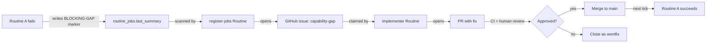
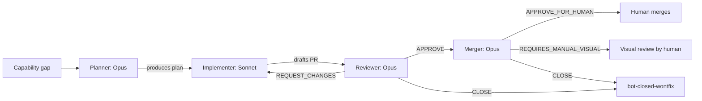

# ADR 042: Agent MCP v1 Follow-ons and Deferred Self-Improvement Loop

**Author:** Joe McGinley (with Claude)
**Status:** Accepted
**Created:** 2026-05-08

---

## Problem

[ADR 004 (Autonomous Agents)](004-autonomous-agents.md) and [ADR 007 (Agent Orchestrator)](007-agent-orchestrator.md) established the in-cluster agent execution surface. Today (2026-05-08) PRs [#2295](https://github.com/jomcgi/homelab/pull/2295), [#2300](https://github.com/jomcgi/homelab/pull/2300), and [#2301](https://github.com/jomcgi/homelab/pull/2301) shipped v1 of the **`monolith-agent-*` MCP surface** — the cluster-side coordination layer that lets cloud Claude Code Routines (the `claude-routine-agent` actor) read internal cluster state, take TTL locks for opportunistic dedup, claim/complete delegated work, and notify via Discord.

The v1 design doc sketched two further phases: **v2** (self-improving loop where Routine failures auto-produce capability-gap PRs) and **v2+** (tiered model pipeline: Opus planner, Sonnet implementer, Opus reviewer, Opus merger). Neither was implemented in v1 by deliberate choice.

This ADR records:

1. **What was deferred** (v2 + v2+ scope) and **why** (need real failure data before we calibrate the consumer machinery — YAGNI per `.claude/CLAUDE.md`).
2. **What v1 already does** to keep v2 cheap to add later (zero-cost forward-compat hooks).
3. **Discovered tech debt** worth fixing independently of the v2 trajectory.
4. **Operational follow-ons** (canary Routine, PR cleanup, first real use case).

The point of capturing this in an ADR rather than scattered issues: the deferral is itself an architectural decision (we explicitly chose not to build the consumer side of self-improvement on day one), and future-us picking up v2 work needs to know what v1 left in place so the pickup is cheap.

---

## Proposal

**Stay at v1 until we have real failure data, then design v2 against that data.**

The shape v2 will take is sketched in the design doc and re-summarized below. The shape v2+ will take is a refinement of v2 and is also sketched. Both stay in the design doc as direction, not as commitments.

| Aspect                         | Today (v1, shipped)                                                                 | v2 (deferred)                                                                                       | v2+ (deferred, refines v2)                                                                                         |
| ------------------------------ | ----------------------------------------------------------------------------------- | --------------------------------------------------------------------------------------------------- | ------------------------------------------------------------------------------------------------------------------ |
| Routine work shape             | Cloud Routines pick + complete delegated work                                       | Routines that fail emit `BLOCKING-GAP[kind=…]` markers; a sweep Routine produces capability-gap PRs | Sandwiched model pipeline (Opus planner → Sonnet implementer → Opus reviewer → Opus merger) drives the gap-PR loop |
| Capability gap recording       | Free-form text in `complete-routine-job` summary; convention `BLOCKING-GAP[kind=…]` | Structured table or column on `routine_jobs`; fan-out priority calc by gap                          | Same as v2                                                                                                         |
| PR review for capability fixes | n/a (no auto-PRs yet)                                                               | Always-human review                                                                                 | Always-human review; visual changes get a hard `requires-manual-visual-review` label                               |
| Calibration source             | n/a                                                                                 | Real production failures from v1                                                                    | Real production failures + v2 review/merger outcomes                                                               |

**Why the staged shape:** v2's value depends entirely on whether the planner/reviewer/merger prompts are well-calibrated. We have zero failure data to calibrate against today. Shipping a poorly-calibrated v2 produces worse-than-nothing results — bot-approved garbage PRs that need to be closed, sycophancy we don't catch, cost runaway. v1 in production for two-plus weeks gives us the failure shape; v2 then has a target to hit.

**One forward-compat concession already in v1:** the `routine_jobs` table has an `attempts INTEGER NOT NULL DEFAULT 0` column that v1 does not read or write. v2 will populate it for fan-out priority calc without an online migration on a populated table.

---

## Architecture

The v2 self-improving loop, when it ships, will look like this:

The v2+ tiered model pipeline refines step E (and adds explicit pre/post stages around it):

State transitions ride on PR labels (`needs-bot-review`, `bot-requested-changes`, `bot-approved-needs-human`, `requires-manual-visual-review`, `bot-closed-wontfix`). No new in-cluster surface needed for v2 — the v1 MCP tools plus the cloud Routine's own `gh` access are sufficient.

For the visual-review carveout: the Merger Routine detects PR file paths matching `projects/agent_platform/sandbox-frontend/`, `projects/websites/`, dashboard manifests, or other visible surfaces. Those PRs get `requires-manual-visual-review` regardless of code-quality verdict — bot review can't substitute for pulling a branch and inspecting rendered output. See the design doc's "Carveout" section for the full rationale.

---

## Implementation

Three categories of follow-on. Each phase ships independently — the v2 design phase only starts once v1 has produced enough failure data to calibrate against, currently estimated at 2-4 weeks of production use.

### Phase 1: Operational hygiene (do soon — within a week of v1 ship)

- [ ] Register a `agent-mcp-heartbeat` Routine via `/schedule` (every 1h or 6h) that calls `monolith-agent-list-locks` and posts an `agent-mcp heartbeat: N active locks` message via `monolith-agent-notify`. This is a passive canary — if the surface ever breaks again, the missing heartbeat is the alarm.
- [ ] Close [PR #2299](https://github.com/jomcgi/homelab/pull/2299) (the integration test) — superseded by [#2301](https://github.com/jomcgi/homelab/pull/2301)'s description-compliance test, which is sharper and lower-friction.
- [ ] Pick one of the original five scenarios from the design doc (notify on stuck jobs, claim PR fixes, etc.) and write the first real Routine prompt. v1 starts paying back when a Routine actually does work, not just registers.

### Phase 2: Latent test-infra bug (independent of v2; do when convenient)

A latent bug in `projects/monolith/shared/tests/conftest.py` was discovered while shipping v1. `app/db.py` captures `DATABASE_URL` at module load time as a global, and `get_engine()` reads that global. The conftest mutates `os.environ["DATABASE_URL"]` and calls `get_engine.cache_clear()` — but the cached `DATABASE_URL` global keeps the original value, so cache-clear doesn't help. The agent tests hit this and fixed it locally by also patching `core.db.DATABASE_URL`.

The shared scheduler test that should have caught this is `async def` without `pytest_asyncio` in deps, so pytest silently skips with `PytestUnhandledCoroutineWarning`. Result: the scheduler concurrency assertions have been not actually running for an unknown amount of time.

- [ ] Fix `shared/tests/conftest.py` so it patches `core.db.DATABASE_URL` (mirror `agent/tests/conftest.py`).
- [ ] Add `@pip//pytest_asyncio` to `shared_testing` deps so async scheduler tests actually run.
- [ ] Audit `bdd_scheduler_test` results post-fix — once the tests aren't skipping, they may surface real concurrency issues that were never tested.

### Phase 3: v2 self-improving loop (deferred until evidence)

**Trigger:** at least 2-4 weeks of v1 in production, with at least 5-10 captured `BLOCKING-GAP` markers in routine_jobs `last_summary` fields. Without that data, the design is guessing.

- [ ] Inventory captured `BLOCKING-GAP[kind=…]` markers in `routine_jobs.last_summary`. What kinds appear? How often does each kind block work? What's the typical complexity of the missing capability?
- [ ] Decide gap registry shape: column on `routine_jobs` vs. sibling `claude_agent.capability_gaps` table. Picks: small set of gaps (column) vs. growing set with relationships (table).
- [ ] Implement gap dedup, count-by-blocked-job priority calc, and gap-aware listing tools.
- [ ] Implement the `register-jobs` Routine that scans recent `BLOCKING-GAP` markers and opens GitHub issues with `capability-gap` label.
- [ ] Implement the `implementer` Routine that picks highest-priority `capability-gap` issues and drafts PRs against the homelab repo. **Hard constraint: never auto-merge.** Always uses normal PR review path.
- [ ] Add `attempts` increment on each gap pickup; deprioritize gaps that consistently fail review.
- [ ] Add depth-limit on transitive gaps (gap A → gap B → gap C; stop after N hops).

### Phase 4: v2+ tiered model pipeline (deferred until v2 produces evidence)

**Trigger:** v2 has been live for 2-4 weeks and has produced enough drafted PRs for us to evaluate Single-Pass Sonnet's failure modes. Specifically, we want to know: what fraction of single-pass PRs get merged unchanged? What fraction get closed as wontfix? Which categories of bug does the single-pass implementer miss?

- [ ] Build the **Planner** Routine (Opus). Reads a capability-gap issue, produces a plan as the issue's body. Calibrated to "list 2-3 approaches, pick the simplest" per CLAUDE.md.
- [ ] Modify the **Implementer** to start from the planner's plan rather than free-form gap description. Same Routine handles revisions across iterations.
- [ ] Build the **Reviewer** Routine (Opus). Calibrated to **minimize complexity** — reject new abstractions without 3 callers, push back on premature optimization, flag scope creep, prefer additive over refactor. Different Routine instance from Planner and Implementer (independent assessment, no self-rationalization).
- [ ] Build the **Merger** Routine (Opus). Terminal coherence check after Reviewer's iterations converge. Different question from Reviewer ("does the whole PR cohere?" vs. "what should change?"). Produces `bot-approved-needs-human` or `requires-manual-visual-review` or `bot-closed-wontfix` labels.
- [ ] Implement PR-label state machine and per-iteration counters. Hard cap at 3 review cycles, then escalate to human or close.
- [ ] Build the visual-review path detector: PRs touching `projects/agent_platform/sandbox-frontend/`, `projects/websites/`, dashboard manifests, etc. get `requires-manual-visual-review`. Document the path list in this ADR section once landed.
- [ ] Per-PR token budget enforcement to prevent cost runaway.

### Phase 5: v3 cautious auto-merge (deferred indefinitely)

**Trigger:** v2+ has produced **N consecutive bot-approved PRs that humans merged unchanged**, where N is large enough that we're confident the loop's quality is consistent. Default N = 50.

- [ ] Allow auto-merge for v2+ PRs that have only `bot-approved-needs-human` (NOT `requires-manual-visual-review`) and have passed all CI gates including the description-compliance test.
- [ ] Add per-day auto-merge cap to bound blast radius if the loop quality regresses.
- [ ] Visual-review PRs **never** become auto-merge candidates regardless of N.

---

## Security

Reference [`docs/security.md`](../../security.md) for baseline. v1 maintains:

- **Discord channel allow-list** (Helm-baked) prevents a compromised Routine from posting to arbitrary channels.
- **GitHub opt-in via `claude` label** — Routines act only on PRs/issues explicitly labeled `claude`, with `manual` as hard-skip override.
- **No auto-merge** on capability-gap PRs (carries through v2 and v2+ — only relaxed in v3).
- **Context Forge sanitizer** strips MCP tool descriptions of injection-shaped patterns (`;`, `&&`, `||`, etc.). PR #2300 fixed v1's two affected tools; PR #2301's regression test prevents future regressions. See [`feedback_context_forge_description_sanitization.md`](https://example.invalid) memory entry for diagnostic procedure.

v2 introduces no new security primitives — it relies on existing GitHub PR review, opt-in labels, and the auto-merge prohibition.

v2+ likewise — the Merger's "approve" verdict is a recommendation to a human, not a merge command.

v3 (auto-merge) is the first relaxation and intentionally gated behind extensive evidence.

---

## Risks

| Risk                                                                                                 | Likelihood                 | Impact                                                     | Mitigation                                                                                                                  |
| ---------------------------------------------------------------------------------------------------- | -------------------------- | ---------------------------------------------------------- | --------------------------------------------------------------------------------------------------------------------------- |
| v2 designed against insufficient failure data and ships a brittle gap classifier                     | Medium                     | High                                                       | Phase 3 trigger explicitly requires 5-10+ captured gap markers before design                                                |
| v2+ Reviewer becomes sycophantic, rubber-stamps Sonnet's work                                        | Medium                     | High                                                       | Reviewer must be different Routine instance; calibration prompt explicitly biases toward pushing back on complexity         |
| Death spiral in v2+ (revise→re-review→revise forever)                                                | Low                        | Medium                                                     | Hard cap at iteration 3, then escalate to human or close                                                                    |
| Cost runaway from Opus×3 + Sonnet×N pipeline                                                         | Medium                     | Medium                                                     | Per-PR token budget enforced in Implementer prompt; per-day total cap                                                       |
| Latent `DATABASE_URL` capture bug (Phase 2) hides real concurrency bugs in scheduler                 | Low (but already realized) | Low currently, could be high if scheduler has hidden races | Phase 2 fixes the conftest and unblocks the async tests                                                                     |
| Visual-review carveout file path detector misses a genuinely visual change                           | Medium                     | Medium                                                     | Default to manual review for any PR touching files outside well-known non-visual paths (allow-list approach, not deny-list) |
| Heartbeat Routine hides the next regression (it works, but the underlying surface broke another way) | Low                        | Low                                                        | Heartbeat is one canary among several; the description-compliance test in CI catches the most likely class of break early   |

---

## Open Questions

1. **`payload` schema per `routine_kind`.** v1 keeps `routine_jobs.payload` as free-form JSONB. Should we version per-kind schemas in v2, or wait until a kind has 3+ concrete payloads to settle on a shape? Lean toward "wait until 3+."
2. **Cost budget mechanism for v2+.** Per-PR token cap, per-day total, or both? How does the Implementer Routine know its own remaining budget without a stateful context store?
3. **Reviewer quality calibration over time.** How do we tell whether Opus is being too lenient or too strict? Need a feedback signal — e.g. % of `bot-approved-needs-human` PRs that humans then close vs. merge unchanged. Build the analytics into v2 or defer to v3?
4. **Cross-gap dependencies.** If gap A and gap B both need to be implemented for a Routine to unblock, does the Implementer batch them into one PR or sequence?
5. **What's the right `N` for v3 auto-merge eligibility?** Default proposal is 50 consecutive merged-unchanged PRs, but real number depends on v2+ quality.

---

## References

| Resource                                                                         | Relevance                                                                                  |
| -------------------------------------------------------------------------------- | ------------------------------------------------------------------------------------------ |
| [Design doc](../../plans/2026-05-07-monolith-agent-mcp-surface-design.md)        | v1 design + v2/v2+ direction (the source material this ADR distills)                       |
| [Implementation plan](../../plans/2026-05-07-monolith-agent-mcp-surface-plan.md) | v1 14-task plan (executed)                                                                 |
| [PR #2295](https://github.com/jomcgi/homelab/pull/2295)                          | v1 ship (24 commits, design + plan + impl + 4 fix-up commits)                              |
| [PR #2300](https://github.com/jomcgi/homelab/pull/2300)                          | Docstring fix to clear Context Forge sanitizer                                             |
| [PR #2301](https://github.com/jomcgi/homelab/pull/2301)                          | Regression test for Context Forge description compliance                                   |
| [ADR 004 — Autonomous Agents](004-autonomous-agents.md)                          | The original autonomous-agent direction this ADR continues                                 |
| [ADR 007 — Agent Orchestrator](007-agent-orchestrator.md)                        | In-cluster job execution surface; complementary to v1's MCP coordination layer             |
| `.claude/CLAUDE.md`                                                              | Engineering philosophy: simplest approach first, YAGNI, no auto-merge for non-trivial work |
