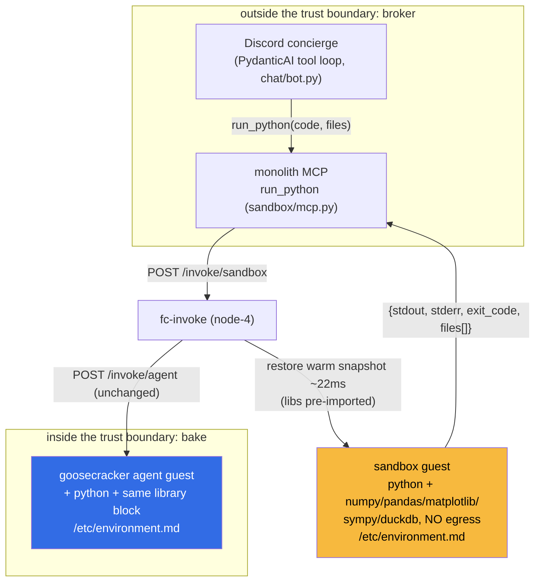

# ADR 044: Code Executor Sandbox Workload and Self-Describing Guest Runtimes

**Author:** jomcgi
**Status:** Accepted
**Created:** 2026-07-05
**Builds on:** [022 - Firecracker Snapshot/Restore Controller](022-firecracker-snapshot-restore-controller.md) (warm-base restore this rides), [030 - fc-invoke Configurable Firecracker Surface](030-fc-invoke-configurable-firecracker-surface.md) (the workload registry and `/invoke` contract this adds an entry to), [023 - Egress Secret Proxy](023-egress-secret-proxy.md) (the secret model that lets this workload run with zero credentials), [040 - Caller-Provided Context Injection](040-caller-provided-context-injection.md) (removed baked recipes from guest images; motivates the env-readme), [034 - Per-Tier Guest MCP ACL](034-per-tier-guest-mcp-acl.md) (the future path for goose guests to call monolith tools), 043 - Ambient Assistant Parity (the concierge tool loop this plugs into)

---

## Problem

Chat surfaces have exactly two ways to answer a computational question ("calc xyz", date math, a Monte Carlo run, "median of this CSV", a quick chart), and both are wrong for it:

1. **Answer from weights.** Fast, and unreliable precisely where these questions live: arithmetic, unit conversion, anything with more than a few significant digits.
2. **Escalate to a full goose agent session.** Correct, but a cold-boot 4 GiB microVM with repo hydration and a 600s budget is a heavyweight answer to "what is 2^512 mod p". Callers visibly avoid it, so they fall back to (1).

The missing tier is deterministic execution with chat-grade latency: run a snippet, return its output, sub-second. Every fc-invoke ingredient for this already exists (ADR 022 restores a warm snapshot in ~22 ms, ADR 030 gives a declarative workload registry with per-workload egress and timeouts, the disposable-tier OOM posture from platform/010 makes guests safely killable). No workload composes them into a code executor.

Two adjacent gaps compound this:

- **Goose guests cannot compute in Python at all.** The agent guest image ships node, pnpm, and go, but no Python interpreter, so the language every model reaches for first is missing from the one environment that is already a jail.
- **Guest environments are no longer self-describing.** ADR 040 moved recipes out of the guest image, which was correct, but it removed the only in-guest text that hinted at what the environment contains. Models (and humans debugging sessions) have no ground truth for "what is installed here", so they guess, fail on missing imports, and burn turns.

## Decision

**1. Add a `sandbox` workload to fc-invoke: one-shot Python execution, warm-base, zero egress.** A new guest image (`projects/firecracker/sandbox/guest`) runs a small handler behind the shared shim: request `{code, files?}`, response `{stdout, stderr, exit_code, files[]}` (files base64, so a matplotlib PNG flows straight to a Discord attachment). Workload knobs: `warmBase: true`, `egress.enabled: false`, `requestTimeout: 30s`, ~2 GiB guest. The warm snapshot is taken after the handler has pre-imported the heavy libraries, so every restore lands with numpy/pandas/matplotlib already resident: baked dependencies cost disk, not latency. The security posture is the absence list: no egress, no secrets, no repo, no session state.

**2. Expose it as a concrete `run_python` tool, not a generic `run_code(language=...)`.** Two registrations, both copying existing patterns verbatim: an `@mcp.tool` in a new `projects/monolith/sandbox/mcp.py` (the `semgrep/mcp.py` broker shape: POST to fc-invoke, never execute locally) for Claude sessions and routines, and a PydanticAI tool in `projects/monolith/chat/agent.py` so the Discord concierge can call it inline during a reply. A concrete name matches the tool shape models were RL-trained on, and a future second language becomes a second tool, which is the right granularity for per-tier ACLs (a tier can hold `run_python` without a hypothetical `run_shell`).

**3. Interpreters follow the trust boundary: inside a microVM, bake; outside, broker.** Goose guests do NOT call `run_python`. Their VM already is the sandbox, so the Python runtime and the same library set are baked into the goosecracker guest image, and goose uses them through the shell extension it already has. Nesting a sandbox call from inside a jail adds indirection for zero isolation gain (and is unreachable until ADR 034 ships regardless). The sandbox workload serves the surfaces that run outside a VM: the concierge, monolith routines, Claude Code sessions, and (only after its own security decision) the public tier.

**4. Guest images bake a generated env-readme.** Each guest image ships a `/etc/environment.md` generated at image build time from the apko lock (resolved package versions) plus the pinned Python library set: runtimes, libraries with versions, and the environment's constraints (network posture, writable paths, timeout). Generated, never hand-written, so it cannot drift from the image it describes; it changes exactly when the image does, which is why it lives in the rootfs and not in the ADR 040 `/injected-context` bundle (the bundle carries per-turn caller state; the environment is a property of the image). The `run_python` tool description enumerates the same library list from the same source, because the description is what shapes the code a model writes before it ever sees an ImportError.

| Aspect | Today | Decided |
| ------ | ----- | ------- |
| "Calc xyz" in chat | model weights or full goose session | `run_python` tool, warm-restore sandbox, sub-second |
| Python for goose guests | absent (node/go only) | baked interpreter + library set, used via shell |
| Sandbox reachability | n/a | concierge + MCP now; goose natively; public tier deferred |
| Guest self-description | none since ADR 040 | generated `/etc/environment.md` per image |
| Library updates | n/a | CI rootfs rebuild + re-snapshot, same cadence as semgrep rules |

## Architecture

The two guest images share one curated runtime package block (duplicated in both apko configs with cross-referencing comments; the curation decision is the shared asset, the yaml is trivia). The env-readme generator runs in both image builds from the same tooling.

## Alternatives Considered

- **Goose guests call `run_python` over guest MCP.** Rejected: the guest is already inside the isolation boundary; a nested microVM hop adds latency and a dependency on ADR 034 (still draft) for zero security gain.
- **Generic `run_code(language=...)` tool.** Rejected: weaker match to trained tool shapes, and language enums make ACL tiers and future per-language limits coarser. A second language is a second tool.
- **Runtime `pip install` via the egress proxy.** Rejected: reintroduces network to a workload whose security posture is "no egress", makes results non-reproducible, and blows the latency budget. Baked-and-frozen with a CI rebuild cadence is the same freshness model the semgrep guest already uses.
- **Sessioned REPL semantics in v1.** Deferred: `sessioned` is an existing knob and the orchestrators own session registries, so upgrading later is cheap. One-shot covers the motivating traffic ("calc for output") and keeps v1 stateless.
- **Node as a second v1 language.** Deferred: Python covers the computational use case strictly better (numpy/matplotlib class libraries), and usage logs will show whether anyone wants JS before we pay for a second toolchain in the sandbox image. (The goose guest keeps its existing node.)
- **One shared guest image for sandbox and agent workloads.** Rejected: the sandbox wants a minimal attack surface and a small warm snapshot; the agent guest wants a fat toolkit and cold-boots anyway. Sharing the package block captures the reuse without coupling the images.
- **Env-readme via `/injected-context`.** Rejected: the injection bundle is caller-owned per-turn state; the environment description is image-owned truth. Injecting it invites drift between what the file claims and what the rootfs contains.
- **Hand-written env-readme.** Rejected: drifts on the first package change; generation from the apko lock makes staleness structurally impossible.

## Security

Baseline per `docs/security.md`; this workload is deliberately the least-privileged in the fleet:

- **No egress, no secrets, no repo.** `egress.enabled: false`; the ADR 023 proxy is not even in the path. The guest holds nothing worth exfiltrating; the only asset at risk is its own CPU/RAM, capped by cgroup limits, `requestTimeout`, and the platform/010 disposable-tier `oom_score_adj`.
- **Caller auth unchanged:** fc-invoke's TokenReview gate (monolith service account), same as the semgrep workload.
- **The public /notes chat does not get this tool.** ADR security/005 layer 6 promises the anonymous surface "no tools"; granting code execution there reverses a documented control and requires its own ADR in `security/`, not a rider here. The sandbox is designed to make that future decision safe (zero-credential, zero-egress), but the decision itself is out of scope.
- **Untrusted code is the input, not a new risk class:** this is the same posture as the semgrep workload (untrusted content in a disposable microVM), with the marginal difference that the content is executed rather than parsed. Firecracker is the control for exactly that difference.

## Risks

| Risk | Likelihood | Impact | Mitigation |
| ---- | ---------- | ------ | ---------- |
| Baked library set goes stale / vulnerable | Medium | Low | CI rebuilds rootfs + re-snapshots on the existing guest-image cadence; env-readme carries exact versions for auditability |
| node-4 memory budget squeeze (3rd workload) | Medium | Medium | Sandbox guests are small (~2 GiB) and short-lived; concurrency cap tuned in values; disposable-tier OOM ordering already prefers guests as victims |
| Runaway code (infinite loop, fork bomb) | High | Low | 30s `requestTimeout`, cgroup CPU/mem caps, one-shot lifecycle (nothing survives the request) |
| Output exceeds response limits (giant file) | Medium | Low | Handler truncates stdout and caps generated-file bytes below the 8 MiB body limit, reporting truncation explicitly |
| Model tries unavailable imports | High | Low | Tool description + ImportError message both enumerate the baked set, generated from the same source as the env-readme |
| Warm snapshot grows with pre-imports | Low | Low | NVMe-backed restore is O(dirty pages); measure restore latency in the prime step and trim pre-imports only if it regresses materially |

## Open Questions

1. Exact v1 library set: which of numpy/pandas/scipy/matplotlib/sympy/duckdb/pillow/openpyxl exist as Wolfi packages vs need a pip-venv layer in `rootfs-builder`. Follow Wolfi availability rather than fight it.
2. Whether the concierge should stream partial stdout into its progressive Discord edits or only post the final result.
3. When ADR 034 tiers ship: does the default goose tier get `run_python` anyway (for symmetry with other brokered tools), or is baked-interpreter-only the permanent goose answer?
4. Public-tier enablement: a future `security/` ADR, contingent on operational history of this workload.

## References

| Resource | Relevance |
| -------- | --------- |
| [ADR 030](030-fc-invoke-configurable-firecracker-surface.md) | The workload registry and `/invoke` contract this consumes |
| [ADR 022](022-firecracker-snapshot-restore-controller.md) | Warm-base snapshot/restore mechanics and measured latencies |
| [ADR 040](040-caller-provided-context-injection.md) | Why guest images stopped carrying recipes; the gap the env-readme fills |
| ADR security/005 | The "no tools" control that keeps the public tier out of scope |
| [projects/monolith/semgrep/mcp.py](../../../projects/monolith/semgrep/mcp.py) | The broker pattern `sandbox/mcp.py` copies |
| [AWS Lambda / E2B / code interpreter pattern](https://firecracker-microvm.github.io/) | Prior art: microVM-isolated ephemeral code execution |
