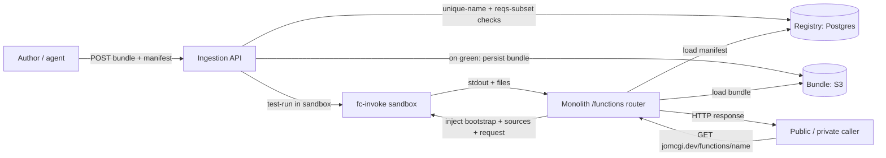

# ADR 045: FaaS on the fc-invoke Sandbox Runtime

**Author:** Joe McGinley
**Status:** Accepted (execution semantics migrated to EmberVM, see note below)
**Created:** 2026-07-05

> **Execution update (2026-07-15):** the registry, the unique-name rule, the
> test-run gate, the visibility tiers, and the `/functions/<name>` URL surface
> decided here shipped as specified, but the EXECUTION substrate migrated from
> per-request code injection into the shared `sandbox` workload to a per-function
> EmberVM `zip` Workload (its own baked snapshot), per the [embervm/001](../embervm/001-embervm-beam-firecracker-workload-orchestrator.md)
> roadmap ("R1 resolves the agents/045 relationship"). A function IS an EmberVM
> Workload; EmberVM never learns what a "function" is. Shipped in EmberVM R1,
> live at `https://jomcgi.dev/functions/og-image`. This does not change any decision
> below; it changes only where the code runs.

---

## Problem

We have a mature microVM execution substrate (fc-invoke, ADR 030) and a zero-egress Python runtime on top of it (the `sandbox` workload, ADR 044) that already runs one untrusted Python snippet per request in a warm-restored Firecracker guest. What we do not have is a way to **register a named function once and invoke it many times by URL**: today every caller has to ship the code inline on each request, so there is no durable, addressable, shareable unit of compute.

The desire is the Cloudflare Workers developer experience ("write a small function, get a URL, no server to run") scoped to a personal homelab: OG-image generation for the sites, a live CV-to-PDF endpoint, small data transforms, glue endpoints, and functions that agents can author and call. We want that without standing up a new pod per function and without loosening the isolation that makes running untrusted code safe.

An earlier exploration weighed self-hosting the actual Workers runtime (`workerd`, V8 isolates) for true "any request at scale" density. That is a genuinely different substrate (featherweight isolates, thousands concurrent, but JS/WASM and no native Python). This ADR deliberately does **not** take that path for v1: it records it as the future high-density tier (see Alternatives) and instead reuses the CPython sandbox we already operate, trading density for reuse, real Python, and the best authoring experience.

---

## Decision

Build Function-as-a-Service as a **thin framework in the monolith over the unchanged `sandbox` guest**. The guest stays a dumb generic Python runtime (`{code, files}` in, `{stdout, files}` out, per ADR 044); every FaaS-specific concept (a registry, name uniqueness, request/response marshaling, routing, visibility) lives in the orchestrator, where durable state already lives. This preserves ADR 030's stateless-daemon invariant and means v1 requires no guest image, chart, or workload change.

A function is a bundle (one or more Python modules) plus a manifest (name, entrypoint, visibility, declared requirements). It is invoked through a fixed handler contract, `def handle(request) -> response`, and must be **restore-safe**: because every invocation is a warm-restore of a frozen snapshot, a handler must not cache wall-clock time or reuse a seeded RNG across invocations (the AWS Lambda SnapStart lesson, which applies verbatim because our `warmBase` is the same mechanism). The monolith reads the bundle from storage, injects a synthesized bootstrap plus the module sources into the guest payload, runs it in the sandbox, and reassembles the HTTP response from `stdout` (status, headers, text body) and the returned `files[]` channel (binary bodies such as a PNG).

Registration goes through an **authenticated ingestion API that validates and test-runs a function before it is registered**. The API enforces a globally unique name, checks the declared requirements are a subset of the sandbox base image, and executes the function's own tests (or a smoke invocation) inside the sandbox; the function is persisted and gets a live URL only if that passes. A function that fails its own tests never receives a URL. Registered functions are exposed on either the **private or public monolith tier**, addressed as `jomcgi.dev/functions/<name>` (public) or the private-tier equivalent, reusing the existing public/private tiering and `public_reader` / ACL machinery.

| Aspect                | Today (ADR 044 sandbox)                     | Decided (FaaS)                                                         |
| --------------------- | ------------------------------------------- | --------------------------------------------------------------------- |
| Unit of compute       | Inline code, shipped every request          | Named, registered function with a durable URL                         |
| Where the logic lives | Caller assembles the request                | Monolith framework: registry, routing, marshaling                     |
| Guest                 | Generic Python runtime                       | **Unchanged** generic Python runtime                                  |
| Invocation contract   | `{code}` in, `{stdout}` out                 | `def handle(request) -> response`, marshaled monolith-side            |
| Registration          | None                                        | Authenticated API: unique-name + requirements + test-run gate         |
| Exposure              | Internal MCP / concierge only               | Private or public tier, `jomcgi.dev/functions/<name>`                 |
| Dependencies          | Baked scientific stack                      | Baked-subset-only at v1; per-function baking is the v2 escape hatch   |
| Egress                | Zero                                        | Zero at v1; egress-capable functions are a v2 workload (ADR 023)      |

---

## Architecture

The daemon and guest never learn what a "function" is. The monolith is the framework; the guest is the runtime. Durable state (the registry row and the bundle) is orchestrator-owned, exactly as sessions (ADR 030) and artifacts (ADR 024) already are, so the daemon stays stateless and node-affine without owning any of this.

**Injection, not a Postgres import loader.** A tempting alternative is a custom `importlib` finder that imports a function module straight from Postgres. It does not fit, because its data source and its execution context sit on opposite sides of the isolation boundary: the guest is zero-egress with no database credentials by design, so it cannot reach Postgres; and importing the (untrusted) module into the monolith process would run function code outside the sandbox, defeating the isolation entirely. The monolith therefore reads the bundle and **injects** the sources into the guest payload. For a single-module function this is a plain source string; for a multi-module package, the injected bootstrap installs an in-memory `sys.meta_path` finder that serves the shipped sources so `import mypkg.sub` works without materializing a file tree. The import loader is thus a no-disk flavor of injection, not an alternative to it.

**Security framing of public exposure.** A public function URL is safe not because the code is trusted but because **only an authenticated author can register**, so the public can only *invoke* pre-vetted functions, never submit arbitrary code. Every invocation still runs in the zero-egress, disposable, resource-capped sandbox (ADR 044: 30s timeout, concurrency cap, `oom_score_adj` disposability). Public functions additionally follow the public-tier checklist (`docs/runbooks/public-tier-checklist.md`).

---

## Alternatives Considered

- **Self-hosted `workerd` (V8 isolates) for the Workers model at scale**: the right substrate for thousands of featherweight concurrent requests, but a whole new runtime to operate, JS/WASM only, and Python only via Pyodide (curated, no native libs). Rejected for v1; recorded as the future high-density tier. A microVM is the wrong shape for "any request at scale," but it is the right shape for real Python with native libs and strong isolation, which is what v1 optimizes for.
- **A guest-side "function mode"**: teaching the guest a request/response contract. Rejected: it leaks framework concerns into the runtime and breaks the stateless-daemon invariant. The guest is already a generic runtime; the framework belongs in the monolith.
- **A lighter starter runtime (QuickJS, WASM via wazero, Go static binaries)**: much smaller guests (~128Mi) and far higher density, since RAM is consumed only per request. Rejected for v1 because it loses real Python and the drop-in authoring DX; recorded as the density-tier follow-on (a small runtime multiplies concurrency on the same node).
- **Runtime `pip install` of a function's requirements**: matches the naive Lambda mental model but breaks zero-egress isolation, is non-reproducible, and makes cold starts slow. Rejected. Dependencies are baked-subset-only at v1, with per-function dependency baking as the reproducible v2 path.
- **A dedicated egress-capable `faas` workload from day one**: needed the moment a function wants to `fetch()`. Deferred to v2 to ship the pure-compute pipeline first; it reuses the ADR 023 split-horizon egress and secret-swap when it lands.

## Security

Baseline per `docs/security.md`. FaaS inherits the sandbox's isolation posture (ADR 044): zero-egress, disposable microVM, non-root, resource-capped, disposable-victim `oom_score_adj`. The two new surfaces are:

1. **Registration** is authenticated and test-gated: only authorized identities register, and a function must pass validation (unique name, requirements-subset) and a test-run before it gets a URL.
2. **Public invocation** exposes pre-vetted functions to unauthenticated callers. The mitigation is that the public submits no code (only authorized authors do), each run is sandboxed and capped, and public functions follow the public-tier checklist. Public exposure does not relax the zero-egress guest.

## Risks

| Risk                                                        | Likelihood | Impact | Mitigation                                                                                 |
| ----------------------------------------------------------- | ---------- | ------ | ------------------------------------------------------------------------------------------ |
| Low density (CPython ~2Gi, concurrency ~4) starves at load  | Medium     | Medium | Accept for v1 (personal scale); the lighter-runtime density tier is the recorded follow-on |
| Public function URL abused (compute exhaustion)             | Medium     | Medium | Sandbox 30s timeout + concurrency cap + disposability; add rate limiting on public routes  |
| Function relies on frozen snapshot state (time, RNG, socket)| Medium     | Low    | Restore-safe handler contract, documented and covered by the ingestion test-run            |
| Author wants a dep the base image lacks                     | High       | Low    | v1 rejects at registration with a clear message; v2 per-function dependency baking          |
| Name collisions across visibility tiers                     | Low        | Low    | Globally unique names enforced by a registry constraint; visibility is a flag, not a namespace |

## Open Questions

1. **Cron triggers**: "a function on a schedule" reuses the same registry with a schedule field. Defer to a follow-on; decide whether it rides the existing scheduler or Argo CronWorkflows.
2. **Stateful functions**: the `sessioned` fc-invoke knob could give Durable-Objects-like per-function state. Defer; v1 functions are stateless.
3. **Egress-capable v2 workload**: per-function egress policy granularity and how it maps onto ADR 023 allowlists and secret-swap.
4. **Versioning and rollback**: whether the registry keeps function versions and supports pinning / rollback, or is last-write-wins.
5. **Rate limiting** on public `jomcgi.dev/functions/<name>` routes: where it lives (edge Cloudflare vs monolith).
6. **First function**: OG-image generation (pure Pillow, zero new deps) is the natural first slice; CV-to-PDF is the first case that exercises a baked dependency.

## References

| Resource                                                              | Relevance                                                        |
| --------------------------------------------------------------------- | ---------------------------------------------------------------- |
| [ADR 044](044-code-executor-sandbox.md)                               | The zero-egress Python sandbox runtime FaaS is built on          |
| [ADR 030](030-fc-invoke-configurable-firecracker-surface.md)          | The stateless configurable microVM daemon and its workload model |
| [ADR 023](023-egress-secret-proxy.md)                                 | Split-horizon egress + secret-swap for the v2 egress-capable tier|
| [ADR 024](024-discord-agent-hosted-model-tiers-and-artifacts.md)      | The artifact publish/read pattern the OG-image function mirrors  |
| [public-tier checklist](../../runbooks/public-tier-checklist.md)      | Required gate for exposing functions on the public tier          |
| AWS Lambda SnapStart                                                  | Prior art: the restore-safety contract for snapshot-warmed code  |
| OpenFaaS python3-http template                                        | Prior art: the `handler.py` + requirements registration model    |
| Cloudflare Workers / workerd                                          | Prior art and the recorded future high-density (isolate) tier    |
