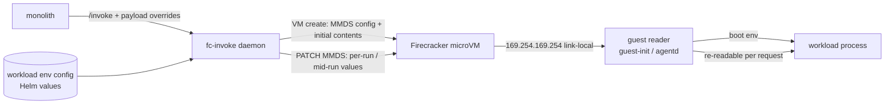

# ADR 046: MMDS for Dynamic Per-Workload Guest Env

**Author:** Joe McGinley
**Status:** Accepted
**Created:** 2026-07-07
**Supersedes:** extends [030-fc-invoke-configurable-firecracker-surface](030-fc-invoke-configurable-firecracker-surface.md)

---

## Problem

fc-invoke launches a Firecracker microVM per workload (ADR 030). A guest's environment is delivered two ways today, and both are set-once:

1. **Per-invocation payload env.** The agent and sandbox workloads receive an `env` map in the `/invoke` payload, applied when the guest process is launched (`goosecracker/runner.py` builds it from the tier JSON `GOOSECRACKER_TIERS`; the guest-init `execRunner.Run` merges it into the child process env).
2. **Static boot env.** The semgrep workload is a warm LSP spawned once at boot with a hardcoded offline environment (`projects/firecracker/semgrep/guest-init`), and every subsequent scan reuses that same process.

This leaves two gaps that keep surfacing:

- **No mid-run env update.** Once a process is launched its env is frozen. A long agent run (minutes) cannot pick up a refreshed token, a steering signal, or updated config without a full re-invoke and reboot, which throws away the warm-snapshot benefit (ADR 022).
- **Persistent-process workloads cannot take per-invocation data.** Because the semgrep LSP is spawned once and shared, there is nowhere to put per-scan metadata (a correlation id, scan-specific config): the boot env is static and shared across all scans. This gap is what blocked correlating a semgrep scan's telemetry to a specific caller during the demos-page tracing work.

Underneath both: env config is ad hoc. The agent env lives in tier JSON, the semgrep env is hardcoded in Go. There is no single declarative "this is the workload's env" surface, so adding or changing a variable means editing code in different places per workload.

---

## Decision

Two coupled decisions.

**1. Workload env becomes declarative config.** Each workload declares its environment (literal values and secret references) in the fc-invoke workload catalog, the same Helm-values surface ADR 030 already uses to declare workloads. fc-invoke composes the guest environment from that config plus per-invocation overrides from the `/invoke` payload. This replaces the code-scattered, per-workload env handling with one config-driven surface: to change a workload's env you edit values, not Go or tier JSON.

**2. fc-invoke adds Firecracker MMDS as the dynamic-env channel.** fc-invoke configures each microVM with the Micro VM Metadata Service, a small metadata store the host (fc-invoke) owns and can update at runtime, which the guest reads over the link-local metadata endpoint. Static env still arrives at boot (the fast common path); MMDS carries the values that change during a run, or that a persistent process must re-read per request. fc-invoke `PATCH`es MMDS with a run's dynamic values; the guest reads them without any change to the running process's boot env.

The two together: workload env is config-declared and fc-invoke-delivered, boot env for the common case, MMDS for the dynamic and per-request case.

| Aspect | Today | Decided |
| ------ | ----- | ------- |
| Env source | tier JSON (agent) + hardcoded guest-init (semgrep), scattered | declarative per-workload config in the fc-invoke catalog (Helm values) |
| Delivery | payload env at process launch, or static boot env | config-composed boot env + payload overrides, plus MMDS |
| Mid-run update | impossible (env frozen at launch) | fc-invoke PATCHes MMDS, guest re-reads |
| Per-request data for a persistent process | impossible (shared boot env) | per-request metadata via MMDS |

---

## Architecture

fc-invoke owns the metadata store and is the only writer; the guest only reads. MMDS is host-served over the guest's link-local address, so it adds no egress path.

- **VM create:** the driver configures the MMDS network interface and seeds initial contents (`PutMmds`) from the composed config + payload.
- **Dynamic path:** for a mid-run change or a per-request value, fc-invoke `PATCH`es MMDS; the guest reader re-fetches.
- **Guest reader:** a small reader in guest-init / agentd fetches MMDS (link-local endpoint, MMDS v2 token dance) and exposes values to the workload, as boot env for the launch path, and as a re-readable file or in-process value for a persistent process (the semgrep LSP reads per-scan metadata rather than relying on its frozen boot env).

---

## Alternatives Considered

- **A custom vsock side-channel for dynamic config.** Reinvents a metadata service over a bespoke protocol; MMDS is the Firecracker-native, documented mechanism for exactly this.
- **Re-invoke / reboot on any env change.** Too heavy for a mid-run update and discards the warm-snapshot restore (ADR 022) that fast starts depend on.
- **Everything through the `/invoke` payload only.** Cannot deliver mid-run updates, and cannot give a persistent shared process per-request data.
- **Guest polls the monolith for config.** Couples the guest to monolith egress and widens the guest's network surface; MMDS is host-local and needs no egress, which matters for the zero-egress sandbox (ADR 044).

---

## Security

Baseline: `docs/security.md`.

- **Host-write-only.** Only fc-invoke (the host) writes MMDS; the guest can only read. MMDS adds no new egress: it is served by the host over the guest's link-local address, so a guest that reads MMDS is not reaching the network. This preserves the zero-egress property of the sandbox workload (ADR 044): the sandbox can read per-run metadata without any egress grant.
- **Treat MMDS contents as guest-visible.** Anything in MMDS is readable by the guest, so it is no more confidential than the workload's own env. Long-lived secrets continue to come from Kubernetes secrets composed into the boot env by fc-invoke; MMDS carries per-run non-secret metadata (correlation ids, steering) and, where a workload legitimately needs it, short-lived rotating tokens, never standing credentials.
- **MMDS v2.** Prefer MMDS v2 (session-token gated) so a confused-deputy request from inside the guest cannot trivially read the store, matching the SSRF hardening rationale that motivated IMDSv2 on cloud metadata services.

---

## Risks

| Risk | Likelihood | Impact | Mitigation |
| ---- | ---------- | ------ | ---------- |
| Our Firecracker launch path does not cleanly expose MMDS | Medium | High | fc-invoke launches Firecracker directly (its own driver, not via kata), so it controls VM config including MMDS; validate end to end on node-4 before wider rollout. This is the load-bearing feasibility check. |
| Snapshot-restore (ADR 022) drops or staleness the MMDS store across restore | Medium | Medium | Verify MMDS survives restore; if not, fc-invoke PATCHes fresh contents immediately after resume, before the guest reads. |
| Guest reader complexity (v2 token dance, re-read semantics) | Medium | Low | Small, well-trodden client; the reader lives once in guest-init and is shared across workloads. |
| Secret leakage via MMDS | Low | High | Host-write-only + treat as guest-env-equivalent; keep standing secrets in boot env from k8s secrets, MMDS only for short-lived or non-secret values. |

---

## Open Questions

1. Does our Firecracker version plus the snapshot-restore path (ADR 022) preserve the MMDS store across restore, or must fc-invoke re-PATCH after resume?
2. MMDS v1 vs v2: v2's token requirement hardens the guest surface but adds a step to every read; confirm the guest reader cost is acceptable for the hot path.
3. For the persistent semgrep LSP specifically: does the LSP re-read a metadata file per request, or does the guest shim read MMDS and fold per-scan values into the scan request it forwards? (Guest-side plumbing to design in the implementation plan.)
4. Scope line: this ADR decides the config surface and the MMDS channel. The mechanical refactor of today's tier-JSON and hardcoded semgrep env onto the declarative config surface is implementation, tracked in a plan/PR, not here.

---

## References

| Resource | Relevance |
| -------- | --------- |
| [ADR 030](030-fc-invoke-configurable-firecracker-surface.md) | The configurable fc-invoke surface this extends |
| [ADR 022](022-firecracker-snapshot-restore-controller.md) | Snapshot restore, which MMDS must coexist with |
| [ADR 044](044-code-executor-sandbox.md) | Zero-egress sandbox whose property MMDS must preserve |
| [Firecracker MMDS docs](https://github.com/firecracker-microvm/firecracker/blob/main/docs/mmds/mmds-user-guide.md) | The mechanism and v1/v2 semantics |
