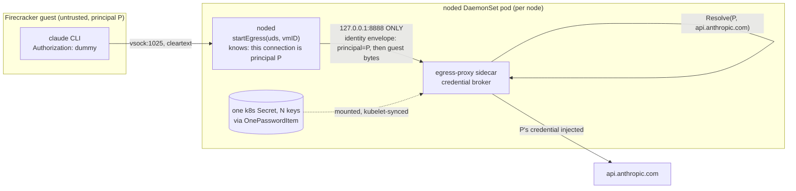

# ADR 047: Per-Principal Egress Credentials and the Broker Identity Envelope

**Author:** jomcgi
**Status:** Draft
**Created:** 2026-07-27
**Amends:** [023 - Egress Secret Proxy for Agent Sandboxes](023-egress-secret-proxy.md) (decision 6's credential provisioning, decision 3's env-placeholder primitive already superseded in code by header injection, and the risk table's "per-node shared catalog" row)

---

## Problem

EmberVM agent sessions run the Claude Code CLI inside Firecracker microVMs. Today one shared Anthropic subscription credential lives in the egress-proxy sidecar and is injected into every guest request bound for `api.anthropic.com` (`projects/embervm/deploy/values.yaml:279-292`, mechanism in `projects/firecracker/substrate/egress-proxy/cmd/swap.go`, shipped in PR #4100). The guest never holds it: the sidecar sets the `Authorization` header on the way out and discards whatever the guest sent there.

That solves exfiltration and nothing else. Two independent frontier-model reviews reached the same conclusion separately: keeping the credential out of the guest stops a prompt-injected agent from stealing a token it can spend later, outside the session, but it does nothing about spend. Any request the guest sends to a covered host gets the credential attached, so a hostile prompt can exhaust the whole allowance through turns that look entirely legitimate. `projects/embervm/ARCHITECTURE.md` already commits this repo to a specific answer for that class of problem: metering is counting, not enforcement, and fails open by design, and cutting off a principal is an admission action, not a metering one. That posture only holds if spend is self-limiting per principal. A shared credential is the opposite: one careless or compromised session burns an allowance every other session is drawing from, with no platform-side cap to catch it, because none is meant to exist.

The credential is also load-bearing for something outside EmberVM. `projects/embervm/deploy/values.yaml:288-289` states it plainly: the 1Password item is "shared with the monolith gardener, which reads the same item." Revoking the one credential the sidecar holds takes out an unrelated service.

The catalog cannot currently tell principals apart even if it wanted to. `secretFor` in `swap.go` matches a connection's destination host against each entry's `EgressTo` list and returns the first match; there is no caller identity in scope at all, so a second entry with the same `egressTo` would be dead code, silently shadowed by whichever entry `loadSecrets` happened to build first.

---

## Decision

**Move to per-principal credentials, and make the egress-proxy sidecar an explicit credential broker keyed on caller identity, rather than a proxy holding one static shared secret.**

| Aspect | Today | Decided |
| --- | --- | --- |
| Credential scope | one shared token, used by every EmberVM guest and the monolith gardener | one credential per principal |
| Abuse containment | none; a hostile prompt spends the shared allowance | self-contained; a principal can only spend its own credential |
| Catalog selection key | destination host only (`secretFor(host)`), first match wins | (principal, host); `loadSecrets` rejects a duplicate (principal, host) |
| Caller identity on the sidecar connection | none | an identity envelope noded frames before the guest's own bytes, unforgeable by the guest |
| Credential storage | one `secretRef` per catalog entry resolved into an individually-named sidecar env var, so a new credential is a pod-spec change | one catalog Secret with N keys behind a `credentialResolver` interface, membership changes stay in the mounted Secret |
| Missing credential for a principal | not reachable today (one credential covers everyone) | DENY, never a cleartext tunnel |
| Platform-side spend cap | none | still none, deliberately: per-principal credentials make one unnecessary |

**1. Per-principal credentials dissolve the abuse problem instead of mitigating it.** If each principal supplies its own credential, quota burn is self-inflicted. This is why a rate limiter or spend cap on `api.anthropic.com` is explicitly not being built: PR #4100 already named and rejected that shape ("Path allowlisting or rate limiting on api.anthropic.com: does not change abuse economics, since legitimate turns burn quota too. That control belongs to the Discord feature ACL over who may start a session."), and this ADR is the change that makes the rejection correct rather than merely convenient. It is consistent with `ARCHITECTURE.md`'s existing statement that metering fails open by design and that cutting off a principal is an admission action, not a metering one: nothing here adds enforcement, it removes the shared blast radius enforcement would otherwise have to cover.

**2. AWS Lambda is the reference model, and it is instructive because it does the opposite of concealment.** Lambda runs on Firecracker, the same isolation boundary this repo builds on, and hands the function's execution-role credentials to the guest as plain environment variables. What makes that safe is four properties of the credential, not of the sandbox: short-lived, scoped, attributable, and independently revocable. Lambda's abuse control is separate and explicit (timeouts, concurrency limits, budget alarms), not concealment. SnapStart, Lambda's Firecracker snapshot-restore feature, hit the same snapshot-persistence hazard this repo records for its own memory snapshots, and AWS answered it with rotate-after-restore hooks rather than concealment. EmberVM cannot simply copy this because an Anthropic subscription OAuth token has none of the four properties: it is long-lived, unscoped to one principal, unattributable on the wire, and, per the Problem section, shared with the monolith gardener through the same 1Password item. **The injection apparatus built in PR #4100 exists to compensate for a credential that lacks the properties AWS's model presumes.** Giving each principal their own credential is the more direct fix; it does not remove the need for injection (see 3), but it removes the reason concealment is the only lever available.

**3. Concealment stays even under per-principal credentials.** Do not read this ADR as "credentials can now live in the guest." Guest RAM is the memfile that a bank snapshots to disk, and `docs/decisions/embervm/027-snapshot-modes-workload-property.md:139` records the general shape of the hazard: "a snapshot at rest is a leak amplifier compared to the live credential it copied, since the artifact persists and gets replicated/archived long after the credential's original validity window." That reasoning was written about the filesystem workspace tier's capture manifest, but it applies without modification to the memory snapshot: a credential resident in guest RAM at bank time is a credential in an archived artifact that outlives the VM. So injection (the sidecar sets the header, the guest never sees the value) is retained exactly as PR #4100 built it. Per-principal changes who owns the loss if the sidecar or its Secret is compromised; it does not change where the credential is allowed to live.

**4. Caller identity has to come from noded, unforgeable by the guest.** noded already forwards each guest's vsock egress to the sidecar (`startEgress`, `projects/embervm/noded/server/server.go:2329`), and it already has the one piece of identity that exists today, the VM handle's ID, in scope at the call site (`s.startEgress(uds, h.ID)`). PR #4100's own deferred-work list named this precisely: "Host-asserted per-connection identity: buys nothing with one credential and one workload. The hook already exists (`startEgress` has the vmID). Trigger: a second principal class, or #4034 starting." This ADR is that trigger firing. The identity envelope this decision requires is noded framing a principal marker onto the sidecar connection before the guest's own preamble bytes, so the bytes the sidecar trusts for identity never pass through guest-writable memory.

That framing is only trustworthy if nothing else can produce it. Until PR #4112 the sidecar's listener bound every interface in the pod's network namespace (`EGRESS_LISTEN` was `":8888"`) while noded dialled it at `127.0.0.1:8888` (`projects/embervm/noded/config/config.go`), and this chart defines no `NetworkPolicy`, so any pod that could route to the DaemonSet pod's IP could open the port directly. PR #4112 moved that bind to loopback and scoped the lane to named workloads. Record why, because the reason is no longer visible from the diff: loopback is not incidental hardening here, it is the trust anchor for the whole envelope. The moment anything other than noded can reach the listener, that caller can claim to be any principal, and every later refinement of the envelope's contents is decoration on an unauthenticated channel.

`principal` is real elsewhere in this repo's design (`ARCHITECTURE.md:64` defines it as "the identity boundary a workload runs as"; section 9, `ARCHITECTURE.md:486`, states "Only `principal` and `domain` ship now"; line 287 states "No VM or snapshot lineage ever crosses a principal"), but it is not yet plumbed to where this decision needs it. It appears in `projects/embervm/noded/` only inside comments (`server.go:2568`, `registry.go:14`, `server_test.go:1766`, `fcvm/driver/driver.go:1190`), never as a field, and the workload CRD (`projects/embervm/chart/crds/workload-crd.yaml`) carries no principal field at all. Getting a principal identifier from wherever a session is assigned through to the byte noded writes onto the sidecar connection is real, not yet built, work.

**5. The catalog key becomes (principal, host), and duplicate ownership must be rejected, not silently shadowed.** `secretFor` matches on `EgressTo` alone and returns the first entry whose allowlist contains the host (`swap.go`). Once two principals both have an entry for `api.anthropic.com`, that lookup stops discriminating and hands every guest whichever entry `loadSecrets` built first, regardless of who actually asked. Selection has to become a lookup on (principal, host), and `loadSecrets` has to fail the same way it already fails on a malformed catalog: refuse to start rather than let one principal's credential silently serve another's traffic.

**6. Credential storage: one catalog Secret with N keys, behind a resolver interface.** Reject one-Secret-per-principal (a separate k8s Secret, or even a separate `secretRef` entry, per person). Today's catalog already shows why that shape is wrong at this scale: each `egress.secrets[]` entry becomes its own named env var in the pod spec (`_noded-pod.tpl:357-365`, `env: {{ $s.env }}` sourced via `secretKeyRef`), so adding a credential today means editing the chart and rolling the DaemonSet across every node, disrupting whatever live microVMs are running. One 1Password item with a field per principal, synced into one k8s Secret, keeps membership changes out of git and out of the pod spec entirely: kubelet updates the mounted file in place, and the sidecar reads it at request time instead of the fixed env var it reads today. A `credentialResolver` interface (`Resolve(principal, host) (value, ok)`) makes fetching from this mounted Secret a swap of one implementation, so a future move to a secrets manager, or to the control plane acting as distributor, does not touch the call sites around it.

This is the same shape PR #4100 named and deferred: "Envelope-encrypted credentials, per-principal keys, CP as distributor: solves multi-tenant credential distribution that does not exist yet. Trigger: per-user credentials being minted." At the current scale, hard-bounded under 50 users (issue #4034's stated non-goal, "the owner plus friends testing," pinned to the Cloudflare Zero Trust free-tier line), a mounted Secret and a resolver interface deliver the multi-tenant part of that deferred idea without the operational cost of envelope encryption or a control-plane distribution service, neither of which this decision needs yet. Accept the costs explicitly: every principal's credential sits in one etcd object, revocation latency is bounded by kubelet's secret sync interval rather than being instant, and there is no per-principal access audit trail beyond what the sidecar's own request log already gives.

**7. Custody obligation, stated plainly.** Per-principal means the node holds other people's credentials, not just its own workload's. Host compromise moves from one person's loss to everyone's whose credential is in that Secret. This is the same trade Lambda makes (point 2), and it is the right place for the trust to sit given the alternative (a shared credential with no attribution at all), but it raises the bar on host and sidecar security rather than on guest isolation, and it should be a conscious acceptance rather than a side effect of following the Lambda comparison this far.

---

## Architecture

The envelope is a framing change on an existing connection, not a new channel: noded already owns the byte stream between the guest's vsock 1025 tunnel and the sidecar's loopback listener, so it is the only party positioned to assert identity the guest cannot write itself. The sidecar's obligation changes from "read the catalog, match the host, inject" to "read the envelope's principal, resolve (principal, host) against the catalog, inject or deny." A guest with no credential registered for its principal is denied, never tunnelled in cleartext: that follows the fail-closed posture PR #4100 already established for a catalog entry whose secret fails to resolve, extended to a principal the catalog has never heard of.

This ADR does not change the split-horizon egress posture, the TLS-MITM-optional lane, or the cleartext vsock hop's reasoning; all of that is decisions 2 through 5 of ADR 023 and stands as written.

---

## Alternatives Considered

- **A platform-side spend cap or rate limiter on `api.anthropic.com`.** Rejected, and already rejected once in PR #4100's deferred-work list: it does not change abuse economics, since legitimate turns burn quota too, and it duplicates the admission control this repo already places at the Discord feature ACL layer over who may start a session.
- **One k8s Secret (or one `secretRef` entry) per principal.** Rejected: every named credential today becomes its own pod-spec env var (`_noded-pod.tpl:357-365`), so adding a principal means editing the chart and rolling the DaemonSet across every node, which disrupts live microVMs for a membership change that should be as cheap as adding a 1Password field.
- **Standalone per-thread `SecretProxy` CRD and operator (ADR 023's Future Work).** Deferred, not rejected: it buys per-thread proxy selection and independent scaling that per-principal credentials do not need yet. The identity envelope and the resolver interface are deliberately shaped so that migration is a swap of the resolver's backing store, not a rewrite of the broker.
- **Leave the credential shared and rely on guest-side prompt hygiene or output filtering to bound spend.** Rejected: this is exactly the concealment-without-abuse-control gap the Problem section describes, and it does not survive a prompt injected specifically to run up cost through requests that look like normal tool use.

---

## Security

Baseline: `docs/security.md`. Deviations and security-relevant properties beyond what ADR 023 already states:

- **Concealment is unchanged.** The credential still never enters the guest, still never enters a memory snapshot (`docs/decisions/embervm/027-snapshot-modes-workload-property.md:139`), and injection remains the mechanism.
- **The identity envelope's trust rests entirely on the sidecar listener being unreachable except from noded.** PR #4112 bound the listener to loopback, matching how noded already dials it, so no other pod can produce a forged envelope. The chart still defines no `NetworkPolicy`, so the bind address is the only control and must not be widened.
- **Custody obligation.** The node now holds every registered principal's credential, not just one shared one. A host or sidecar compromise now exposes every principal in that catalog, not one shared token everyone was already implicitly trusting. This is accepted as the cost of the Lambda-style trade in decision 2, not treated as a side effect.
- **Revocation latency moves from "edit one value" to "kubelet's Secret sync interval."** Acceptable at the stated scale (under 50 users); noted as a residual cost in Risks rather than solved here.

---

## Risks

| Risk | Likelihood | Impact | Mitigation |
| --- | --- | --- | --- |
| Sidecar listener remains reachable from outside the pod, letting any node-local pod forge the identity envelope | Low, once landed | High | Closed by PR #4112, which binds `EGRESS_LISTEN` to `127.0.0.1:8888` in the binary default and both charts. Any future change that widens that bind reopens the whole envelope, so treat the bind address as a security invariant rather than a config knob |
| `loadSecrets` accepts two catalog entries for the same (principal, host), silently shadowing one | Medium | High | Reject at load time, the same fail-closed posture already used for a malformed catalog |
| Centralized catalog Secret: a host or sidecar compromise now exposes every registered principal's credential, not one shared token | Medium | High | Accepted custody obligation (Security, above); scope to node hardening, not guest isolation, since Firecracker already isolates the guest |
| Revocation latency bound by kubelet's Secret sync interval rather than instant | Low | Medium | Acceptable at current scale (under 50 users); document, do not build a faster path until it is asked for |
| Principal plumbing lands partially (CRD or control plane before noded, or vice versa), leaving a window where the envelope cannot be produced | Medium | Medium | The sidecar's existing fail-closed default (deny an unresolvable credential) applies unchanged to a missing or malformed envelope; no partial-rollout state can fall through to cleartext or to the wrong principal's credential |

---

## Open Questions

1. **Which workload classes need this first.** The claude-runtime session workload is the only egress-proxy consumer today; whether task-class or future workload classes need per-principal credentials on the same timeline, or can keep sharing a credential because they never hold a principal-attributable session, is not settled here.
2. **Whether kubelet's Secret sync interval is fast enough for revocation in practice**, or whether a compromised-credential incident would need a faster path (a sidecar restart, a watch-based reload) than a config change earns on its own.
3. **Whether the `credentialResolver`'s first non-mounted-Secret backing is the control plane acting as distributor**, as PR #4100's deferred-work note framed it, or a secrets manager client, once the resolver interface makes that a real choice rather than a guess.

---

## References

| Resource | Relevance |
| --- | --- |
| [ADR 023 - Egress Secret Proxy for Agent Sandboxes](023-egress-secret-proxy.md) | The injection mechanism and fail-closed posture this ADR amends, not replaces |
| [ADR 027 - Snapshot Modes as a Workload Property (embervm)](../embervm/027-snapshot-modes-workload-property.md) | "A snapshot at rest is a leak amplifier" (line 139), the reason concealment survives per-principal credentials |
| `projects/embervm/ARCHITECTURE.md` | `principal` definition (line 64), section 9 (line 486, only `principal` and `domain` ship), metering-fails-open posture (lines 292-299) |
| PR #4100 (`feat(egress-proxy): inject credentials instead of swapping a placeholder`) | Shipped the injection mechanism this decision builds on; named and deferred both the identity-envelope hook and the per-principal-keys shape this ADR now picks up |
| `projects/firecracker/substrate/egress-proxy/cmd/swap.go` | `secretFor`, `loadSecrets`; the host-only selection key this decision changes to (principal, host) |
| `projects/embervm/noded/server/server.go:2329` (`startEgress`) | Where the vmID is already in scope; the call site the identity envelope extends |
| `projects/embervm/chart/templates/_noded-pod.tpl` | `EGRESS_LISTEN` binding (line 320) and the per-catalog-entry env-var wiring (lines 357-365) this decision moves off of |
| `projects/embervm/deploy/values.yaml:279-292` | Today's single shared credential, and its "shared with the monolith gardener" note |
| `docs/security.md` | Security baseline |
