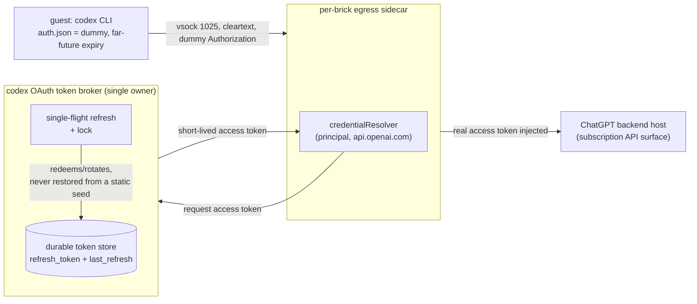

# ADR 048: Codex Subscription OAuth, a Single-Owner Token Broker for Guest Turns

**Author:** jomcgi
**Status:** Proposed
**Created:** 2026-08-02
**Extends:** [047 - Per-Principal Egress Credentials and the Broker Identity Envelope](047-per-principal-egress-credential-broker.md) (the broker direction this applies to a second provider)
**Preserves:** [023 - Egress Secret Proxy for Agent Sandboxes](023-egress-secret-proxy.md) (the concealment boundary: no live credential ever enters a guest)
**Supersedes (for codex):** the deferred `OPENAI_API_KEY` catalog entry from PR #4246 (issue #4244)

---

## Problem

PR #4246 wired the OpenAI egress lane for codex guest turns but deliberately left the credential field empty: the catalog entry, the header injection shape, and the shim's dummy-key handshake are all in place, fail-closed, waiting on one 1Password value. That was written assuming the value would be an `OPENAI_API_KEY`, metered like any other API credential. It should not be filled that way.

Luna and Terra (issue #4234's per-model adapter) are routed to run on the existing ChatGPT Plus/Pro subscription, not on OpenAI API billing. A subscription has no API key at all; it authenticates via OAuth against a ChatGPT account, and the codex CLI's own auth flow is built around that: `codex login` opens a browser, redeems an authorization code, and writes the resulting token bundle to `$CODEX_HOME/auth.json`. There is no `OPENAI_API_KEY` to put in the 1Password item PR #4246 named, so the deferred entry as specified cannot be completed; the credential shape itself has to change.

Naively, the fix looks like "distribute `auth.json` the same way `CLAUDE_AUTH_TOKEN` is distributed": mount it, or a copy of it, wherever a guest or sidecar needs to authenticate as the account. That shape breaks on contact with how codex's OAuth tokens actually behave, verified against OpenAI's own CI/CD auth documentation (learn.chatgpt.com/docs/auth/ci-cd-auth) and two upstream issues:

- Codex refreshes the access token proactively when `last_refresh` in `auth.json` is roughly eight days stale, and reactively on any 401, rewriting the file in place each time. The refresh token is single-use and rotating (openai/codex#15410, #10332): the first process to redeem it gets a new refresh token and the old one dies, so a second process holding a stale copy that also tries to refresh gets `refresh_token_reused` and is locked out, not merely delayed. Codex has no cross-process refresh lock, so this is not a race that occasional collisions smooth over; every collision is a failure.
- `codex logout` revokes the grant server-side (openai/codex#22577). Any sibling client sharing that grant does not get a local logout, it gets a live token that is now dead server-side, discovered only on its next call.
- OpenAI's own CI/CD doc says this in as many words: "Do not share the same file across concurrent jobs or multiple machines." That is not a suggestion this repo can route around with careful scheduling; it is a description of how the rotation protocol fails when violated.

So the credential this ADR has to place is not a value to fan out like an API key, it is a single mutable OAuth grant that tolerates exactly one refreshing owner. The egress-proxy sidecar (per node, DaemonSet-scoped, ADR 023 decision 5) is the wrong shape for that owner: N nodes each running the codex adapter would be N processes independently racing to refresh the same grant, which is precisely the failure mode above, just moved from "guest copies of auth.json" to "sidecar copies of auth.json." The fix has to concentrate ownership to one process, not merely move it.

---

## Decision

**EmberVM guest codex turns authenticate against the ChatGPT subscription through a single in-cluster token broker that exclusively owns one cluster-dedicated OAuth grant. No `OPENAI_API_KEY` will exist, and no copy of `auth.json` is ever fanned out to a guest, a sidecar, or any second process.**

| Aspect | PR #4246 (as deferred) | Decided |
| --- | --- | --- |
| Credential type | `OPENAI_API_KEY`, one value in a 1Password field | ChatGPT subscription OAuth grant, redeemed once via device-auth |
| Number of processes that can refresh the token | N/A (API key does not rotate) | Exactly one: the broker, single-flight, lock-guarded |
| What a guest holds | dummy key (already shipped) | dummy `auth.json` with a far-future expiry, never real |
| What the sidecar injects | static bearer value from a Secret | short-lived access token fetched from the broker |
| Failure mode of two owners | none (API keys do not rotate) | `refresh_token_reused`, a locked-out grant, possibly for both owners |
| Relationship to Joe's laptop `dispatch.sh` sessions | none | independent grant; neither this nor the laptop's `auth.json` lineage ever crosses into the other |
| Billing | OpenAI API usage | ChatGPT subscription, unmetered per call |

**1. The cluster gets its own OAuth grant, obtained by device-auth against the broker's durable store, never by copying Joe's laptop credential.** `codex login --device-auth` is run once, targeting the broker's storage rather than a workstation's `$CODEX_HOME`, after enabling "Allow device code login" on the ChatGPT account; Joe approves the resulting code from any browser. This produces a grant that belongs to the cluster the same way a service account belongs to a service, distinct from the grant `bazel/tools/codex/dispatch.sh` uses on Joe's machine. Keeping them distinct is not a convenience, it is the same single-owner property this whole decision rests on applied one level up: if the cluster grant and the laptop grant were the same grant, the laptop's local `codex exec` runs and the broker's refreshes would be exactly the two concurrent owners this ADR exists to prevent.

**2. The broker is the only process that ever redeems or rotates the refresh token.** It holds the durable token store, performs single-flight refresh (a lock so concurrent requests for an access token wait on one in-flight refresh rather than each starting their own), and persists the full token bundle plus `last_refresh` durably on every rotation, the same field codex itself keys proactive refresh off. It never restores from a static seed; the durable store is the only source of truth for the current grant, because seeding from a stale snapshot after a restart would hand the broker a refresh token that may already have been consumed by its own earlier rotation, self-inflicting the exact `refresh_token_reused` failure a single owner is supposed to make impossible. On `refresh_token_reused` the broker re-reads the durable store and retries once before failing outward, because that response code is also what a legitimate concurrent refresh looks like from the loser's side, not only what a real collision with an outside actor looks like; a bare retry against the same in-memory state cannot tell the two apart, a re-read can. It serves callers only a short-lived access token, never the refresh token or the full bundle.

**3. Per-brick egress sidecars consume broker-issued access tokens and inject them at the existing ADR 023 cleartext lane; guests never hold a live credential.** This is the same shape ADR 023 decision 4's 2026-07-27 update established for the Anthropic leg and ADR 047 established for per-principal identity: the sidecar sees plaintext because the vsock hop needs no TLS, and it attaches the real header only at egress. A guest's `CODEX_HOME/auth.json` is a dummy with a far-future expiry, so the CLI never attempts its own refresh and always sends the header the sidecar overwrites; the guest process holding a token that will never expire and was never valid to begin with is exactly the login-gate pattern ADR 023 already uses for the Anthropic leg (`ember-guest-login-gate-dummy-not-a-credential` in `projects/embervm/runtimes/claude/shim.py`), extended to codex's file-based auth instead of an env var. No live credential crosses the Firecracker boundary in either direction: this decision changes what the sidecar injects, not the injection mechanism or where the trust boundary sits.

**4. The broker is a consumer of the identity envelope ADR 047 built, not a redesign of it.** ADR 047 gave the sidecar an unforgeable (principal, host) lookup; this decision adds a resolver path where the value behind that lookup, for `api.openai.com`-class destinations under subscription auth, is not a static Secret field but a live call to the broker for a short-lived token. The resolver interface ADR 047 decision 6 specified (`Resolve(principal, host) (value, ok)`) is exactly the seam this needs: subscription OAuth becomes one more backing implementation of that interface, not a parallel injection path.

**5. Three alternatives were on the table and rejected:**

- **The `OPENAI_API_KEY` lane PR #4246 already built.** No key exists to put in it: the whole point of routing Luna/Terra through the subscription is to spend subscription capacity, not API billing. Filling that field would mean provisioning an API key nobody wants to pay for just to satisfy a catalog shape built for the wrong credential type.
- **Seed real `auth.json` into each guest workspace, one copy per session.** This is the shape the Problem section rules out directly: N concurrent sessions is N processes that can independently trigger a refresh, and the documented failure of codex's refresh protocol under exactly that condition is `refresh_token_reused`, not graceful serialization. It would also mean a long-lived, live OAuth credential sitting in every guest's writable workspace, which is a strictly worse position than ADR 023 already rejected for the Anthropic leg (a credential resident at bank time is a credential in an archived snapshot).
- **Let each per-brick sidecar own a copy of the refresh token and rotate independently.** Same failure mode as guest-side seeding, one layer up: N sidecars is still N owners, and ADR 023 decision 5 (a sidecar per node) means N is the node count, not one. Concentrating ownership only helps if it actually concentrates to one process; a sidecar-per-node design does not.

**6. This shape already exists once in the wild.** OpenClaw (docs.openclaw.ai/concepts/oauth) converged independently on the same architecture for its own multi-agent OAuth problem: one authoritative credential store, read-through inheritance for consumers, and refresh serialized under a file lock. Its own incident record (issue #26322: 18 agents sharing a grant hit a refresh burst roughly every 12 hours, initially misread as a provider outage before the shared-grant contention was found) is the concrete version of the failure this ADR is designed to avoid before it happens once here, and it is where the two guardrails in decision 2 (single-flight refresh with waiters, re-read-and-retry-once on `refresh_token_reused`) come from.

**7. Forced interactive re-login is a months-scale event under single ownership, not a scheduled expiry.** With no sibling clients contending for the grant, the only things that force `codex login --device-auth` again are revocation, a ChatGPT password change, an explicit logout-anywhere, or a refresh gap long enough that even proactive refresh missed it (the ~8-day `last_refresh` staleness window codex itself uses). None of those are routine; this is not a token that needs a rotation calendar entry the way a short-lived API key does.

---

## Architecture

The broker sits outside the per-brick sidecar fleet: it is the one process ADR 047's custody obligation now extends to for this credential, holding a grant no other process ever redeems. Sidecars remain stateless with respect to this credential, the same role they already play for the Anthropic leg's per-principal keys; they call out for a token rather than holding one at rest.

---

## Alternatives Considered

- **`OPENAI_API_KEY` (the deferred PR #4246 lane).** Rejected: no such key will exist under subscription billing, which is the reason to route Luna/Terra through codex at all.
- **Real `auth.json` seeded into each guest workspace.** Rejected: N concurrent sessions is N refresh owners, the documented failure mode (`refresh_token_reused`) is not a race that resolves itself, and it puts a live long-lived credential inside every sandbox, worse than what ADR 023 already rejected for a different provider.
- **Per-brick sidecar ownership of the refresh token.** Rejected: identical failure shape to guest-side seeding one layer up; ADR 023's per-node sidecar topology means "per-sidecar" is still plural, not the single owner this credential needs.

---

## Security

Baseline: `docs/security.md`. Deviations and security-relevant properties beyond what ADR 023 and ADR 047 already state:

- **Concealment is unchanged.** No live credential enters a guest under this decision either; the guest's `auth.json` is inert by construction (a dummy with an expiry far enough in the future that codex never attempts its own refresh), matching the pattern ADR 023 already ships for the Anthropic leg.
- **Custody concentrates further than ADR 047's per-principal model, deliberately.** ADR 047 accepted that a node holds every registered principal's credential. This decision goes narrower: exactly one process in the cluster ever holds the refresh token, and every other consumer, including the per-brick sidecars, holds at most a short-lived access token. A broker compromise is total for this one grant; a sidecar compromise, unlike under ADR 047's model for the Anthropic credential, exposes only whatever short-lived access token is currently cached there.
- **A grant is bound to the cluster, not to a person.** The device-auth flow is initiated once against the broker's store and never against, or from, Joe's own workstation `auth.json`, so a security event on either grant (revocation, logout-anywhere, password change) does not automatically implicate the other.

---

## Risks

| Risk | Likelihood | Impact | Mitigation |
| --- | --- | --- | --- |
| Broker's durable store is lost or corrupted (no backup, or restored from a stale seed) | Low | High | Never restore from a static seed (decision 2); durable store is the single source of truth, backed up like any other stateful credential store in the cluster |
| Two processes end up racing a refresh despite the single-owner design (a bug, a duplicate broker deployment, a stuck old pod) | Low, once correctly deployed | High | Single-flight lock plus re-read-and-retry-once on `refresh_token_reused` (decision 2), the same guardrail OpenClaw's issue #26322 motivated |
| Silent refresh failure strands the fleet without warning, discovered only when guests start failing turns roughly 8 days later | Medium | Medium | Open question below; monitoring for refresh failures is required before this ships, not optional follow-up |
| Grant revoked or logged out server-side outside the broker's control (password change, manual logout-anywhere) | Low | High | No sibling clients to blame or debug against, unlike a shared grant; broker surfaces the failure immediately on next refresh attempt rather than masking it with a stale cached token |
| Exact ChatGPT backend host(s) and whether `chatgpt_base_url` accepts cleartext are unverified against the vendored binary | Medium | Medium | Open question below; must be confirmed against the vendored rust-v0.146.0 binary before the sidecar's cleartext-lane assumption (ADR 023's 2026-07-27 update) is relied on for this provider too |

---

## Open Questions

1. **Exact ChatGPT backend host(s) codex uses in subscription mode, and whether `chatgpt_base_url` honors `http://` the way `ANTHROPIC_BASE_URL` does for the cleartext lane.** ADR 023's 2026-07-27 update established that the Anthropic CLI accepts a cleartext base URL with no downgrade guard; codex's subscription-mode client has not been verified the same way and must be checked against the vendored rust-v0.146.0 binary before the sidecar can rely on peeking one byte to distinguish TLS from cleartext for this provider.
2. **Whether the broker lives inside the existing egress-proxy codebase or as its own small service.** The resolver interface (ADR 047 decision 6) makes this a deployment choice rather than an API contract change, but it is not decided here.
3. **Monitoring for refresh failures.** A silent refresh failure strands the fleet within the ~8-day proactive-refresh window with no user-visible symptom until the first guest turn fails. What alerts on a stale `last_refresh`, and where, is unresolved.

---

## References

| Resource | Relevance |
| --- | --- |
| [OpenAI CI/CD auth docs (learn.chatgpt.com/docs/auth/ci-cd-auth)](https://learn.chatgpt.com/docs/auth/ci-cd-auth) | Proactive ~8-day refresh, reactive 401 refresh, "Do not share the same file across concurrent jobs or multiple machines" |
| [openai/codex#15410](https://github.com/openai/codex/issues/15410), [openai/codex#10332](https://github.com/openai/codex/issues/10332) | Refresh tokens are single-use and rotating; no cross-process refresh lock in codex itself |
| [openai/codex#22577](https://github.com/openai/codex/issues/22577) | `codex logout` revokes the grant server-side; sibling clients on the same grant discover this only on their next call |
| [OpenClaw OAuth concepts (docs.openclaw.ai/concepts/oauth)](https://docs.openclaw.ai/concepts/oauth) | The same architecture converged on independently: one authoritative store, read-through inheritance, lock-serialized refresh |
| OpenClaw issue #26322 | 18 agents sharing a grant, refresh burst every ~12h misread as a provider outage; motivates single-flight refresh and the re-read-and-retry-once guardrail |
| [ADR 023 - Egress Secret Proxy for Agent Sandboxes](023-egress-secret-proxy.md) | The concealment boundary and the cleartext-vsock-lane reasoning this decision reuses for a second provider |
| [ADR 047 - Per-Principal Egress Credentials and the Broker Identity Envelope](047-per-principal-egress-credential-broker.md) | The `credentialResolver` interface and per-principal identity envelope this decision plugs a subscription-OAuth backing into |
| [embervm/024 - Identity Hierarchy, Templates and Registration](../embervm/024-identity-hierarchy-templates-and-registration.md) | The `principal` identity this decision's resolver lookups key on |
| Issue #4244, PR #4246 | The deferred `OPENAI_API_KEY` catalog entry this ADR supersedes for codex; `projects/embervm/deploy/values.yaml`, `projects/embervm/runtimes/claude/shim.py` (the guest shim's codex adapter, despite the directory name) |
| `bazel/tools/codex/dispatch.sh` | Joe's laptop-side codex dispatch, whose `auth.json` lineage stays independent of the cluster grant this ADR creates |
| `docs/security.md` | Security baseline |
