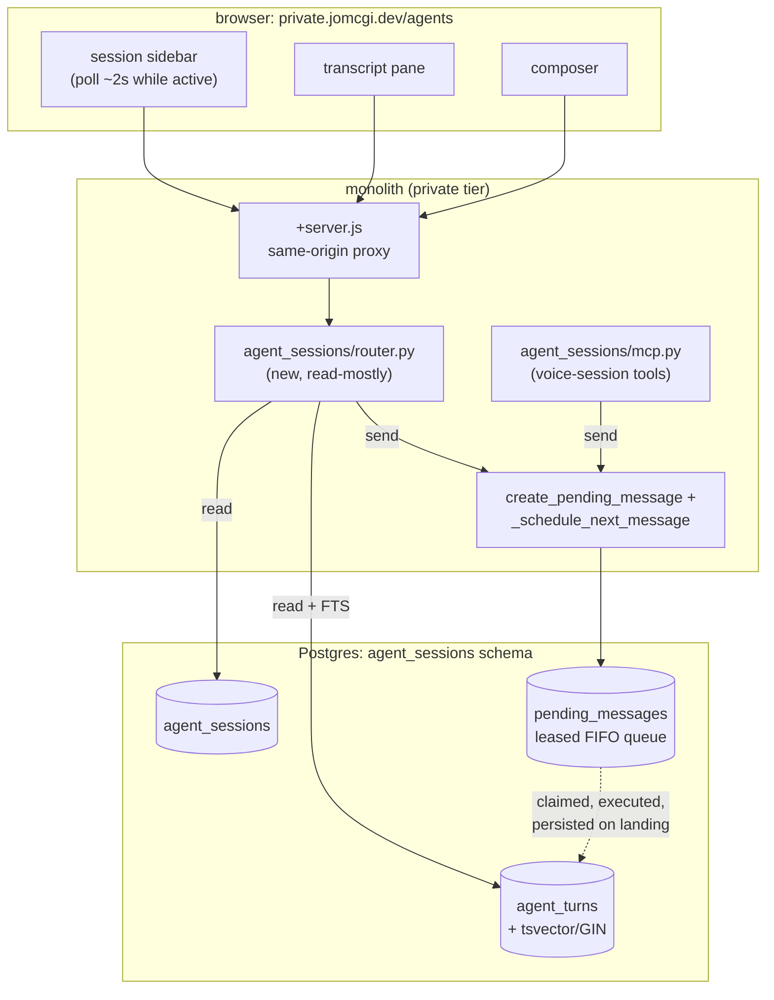

# ADR 049: Turn-Granular, Poll-Shaped Agent Session UI on Durable Postgres, Not a Live Event Stream

**Author:** jomcgi
**Status:** Accepted
**Created:** 2026-08-04
**Relates to:** [embervm/030 - Lineage Decoupled From Session Generation](../embervm/030-lineage-decoupled-from-session-generation.md) (documents the same synchronous shim-to-monolith hop this decision works around), [chat/002 - Structured, Scope-Locked Channel-History Query for the Chat Agent](../chat/002-structured-channel-history-query.md) (the FTS pattern this decision's search reuses)

---

## Problem

Issue #4320 asks for a private web UI at `private.jomcgi.dev/agents` over the
agent-session pipeline, the same machinery the voice-session MCP tools already
drive. The obvious shape for a chat-like UI is a live view: tokens appearing as
the model writes them, tool calls animating in as they run. That shape is not
available here without a real protocol change, and this ADR records why, and
what is built instead.

The session pipeline is buffered single-shot at every hop between the guest and
the browser:

- The guest shim (`projects/embervm/runtimes/claude/shim.py`) drives the CLI
  with `--output-format stream-json` and accumulates every event into a list,
  only closing the turn out on `event.get("type") == "result"`
  (`shim.py:850-854`). The full event stream, intermediate assistant text,
  complete tool inputs and outputs, is reduced in guest memory to a bounded
  `activity_from_events` summary and a short `voice_summary`, and only that
  reduction ever leaves the guest. There is no code path today that emits
  anything before the turn is over.
- The guest-to-noded surface is a unary proto call: `node.proto` carries the
  turn body as a single `bytes body` field (`node.proto:641`, `:660`), not a
  stream.
- The control plane parks the caller on one `GenServer` call for the whole
  turn (`projects/embervm/control/lib/embervm/sync_wait.ex`) rather than
  fanning out intermediate frames to a second consumer.
- The monolith's transport blocks on the full HTTP response:
  `EmberVmShimTransport.deliver` (`projects/monolith/agent_sessions/transport.py:302-418`)
  does one `httpx.AsyncClient.post` and awaits the complete body before
  returning, mirroring every other call in that file.

So a live token view is not a UI feature to add, it is a four-layer protocol
change: chunked output from the shim, a streaming noded RPC instead of a unary
one, the control plane turning a parked unary call into a server-stream plus a
chunked HTTP leg, and a monolith fanout to however many browser tabs are
watching. There is also no cheap side channel to fake it with: the per-session
turn is a single serialized call at the control-plane layer, so nothing else
can peek at it mid-flight without contending with the turn itself.

What the pipeline already has, as of the #4229 fix (issue #4229, closed by
PR #4230, "enqueue the first agent turn instead of running it inline"), is
durable and queue-shaped. Before that fix, `session_start` ran the first turn
synchronously inside the MCP tool call; a cold turn exceeding Cloudflare's
proxy timeout meant the CLI call was billed and the result thrown away
(observed live: `cost_usd: 0.056028` persisted against a turn stuck at
`status: "running"` with no result text). PR #4230 made `session_start`
enqueue exactly the way `session_send` already did:
`create_pending_message` durably writes to `agent_sessions.pending_messages`
(`store.py:222-267`), a lease-based FIFO queue keyed by
`(session_id, seq)`, claimed by `claim_pending_message_for_session_sync`
(lowest unclaimed seq wins, `store.py:287-329`), and reclaimed from a dead
replica once its lease expires (`reclaim_stale_claims_sync`,
`store.py:433-476`). The call that enqueues now returns `{"accepted": true,
"turn": N}` immediately, and `persist_turn_from_pending_sync`
(`store.py:349-387`) writes `result_text`, `usage_json`, `cost_usd`, and the
activity summary to `agent_sessions.agent_turns` when the turn lands,
independent of whether the original caller is still connected. That substrate
is already exactly poll-shaped.

## Decision

**Build the `/agents` UI turn-granular and poll-shaped directly on
`agent_sessions` / `agent_turns` / `pending_messages`, not on a live event
stream.** A turn-granular view (session list, per-turn transcript, status,
cost, search) is a read-only FastAPI router plus one full-text-search
migration, entirely inside the monolith, because the durability work the
tables already do for the MCP path is exactly the data a poll-driven UI needs.

| Aspect | Rejected shape (live stream) | Decided |
| --- | --- | --- |
| Data source | A new streaming leg through shim, noded, control plane, monolith | Existing `agent_sessions` / `agent_turns` / `pending_messages` tables |
| Freshness | Sub-second, token-by-token | Turn-granular; ~2s poll while a session is active |
| Protocol changes required | Four layers (shim chunking, noded streaming RPC, CP unary-to-stream, monolith fanout) | None; read path only |
| Write path | Would need its own | Reuses the same enqueue + `_schedule_next_message` path the MCP tools already call |
| Scope | Open-ended (a new capability) | One router, one migration, one SvelteKit route tree |

**1. A turn is the unit of freshness, not a token.** Turns here run minutes of
tool use; "landed seconds ago, full prompt and result visible" already covers
most of what a user watching a session wants. Sub-turn visibility (intermediate
assistant text, tool calls animating in) is deferred until it is a demonstrated
want rather than an assumed one, because building it first means committing to
the four-layer protocol change above before anyone has confirmed the gap
matters in practice.

**2. The UI writes through the same enqueue path the MCP voice-session tools
use, not a parallel one.** `monolith_agent_session_send` and the new UI's
"send message" both end at `create_pending_message` plus the same
`_schedule_next_message` dispatch. That keeps the MCP surface (voice sessions)
and the web UI as one interface with two frontends rather than two
independently-maintained write paths, and it means the per-model adapter seam
in the guest shim (issue #4234: claude, codex, and pi runtimes behind one
shim contract) makes the UI model-agnostic for free; nothing in the router or
the frontend needs to know which model a session is running.

**3. The path is bare `/agents`, not `/app/agents`.** On the private tier,
`/app/*` is the reserved namespace for gateway-proxied third-party UIs
(ArgoCD, SigNoz, Longhorn), and `projects/monolith/frontend/src/routes/private/+layout.svelte`
already suppresses chrome specifically for that prefix. `/agents` is a
first-party private page, so it follows the existing bare-path precedent
(`routes/private/chat/`, `routes/private/dashboard-chat/`,
`routes/private/notes/`), not the proxied-app one.

**4. Search is Postgres full-text search, not hybrid retrieval.** A generated
`tsvector` column plus a GIN index on `agent_turns` (prompt and result_text),
queried through `websearch_to_tsquery` and `ts_rank_cd`, follows the exact
precedent `20260706190000_chat_messages_fts.sql` set for `chat.messages` and
that `chat/store.py`'s `lexical_search` already queries (see ADR chat/002 for
the tool built on top of it). Hybrid RRF plus pgvector, the richer retrieval
`chat/002`'s sibling `search_hybrid` already does for chat history, is an
explicit follow-up, not in scope: lexical search alone answers "find that turn
where I asked about X" for the volume of turns this UI serves today, and
adding embeddings now would be infrastructure ahead of a demonstrated recall
gap.

**5. Browser calls are same-origin proxies, not a new HTTPRoute surface.**
Every call goes through a colocated `+server.js` under
`routes/private/agents/`, the pattern the rest of the private tier already
uses, so this needs no `httproute-private.yaml` change and inherits the
private tier's existing auth boundary rather than opening a new one.

## Architecture

The buffered chain below `agent_turns` (shim, noded, control plane, the
`EmberVmShimTransport.deliver` call) is unchanged by this decision; the router
never talks to it directly, it only reads what that chain has already
persisted.

## Alternatives Considered

- **True mid-turn token streaming now.** Rejected: requires chunked shim
  output, a streaming noded RPC, the control plane turning a parked unary call
  into a server-stream, and a monolith fanout, four independent protocol
  changes, to serve a want that has not yet been demonstrated against the
  turn-granular alternative.
- **`NOTIFY` on `agent_turns` / `pending_messages` plus SSE fanout instead of
  polling.** Deferred, not rejected outright: it would need a timeouts
  carve-out on the private `HTTPRoute` (the same shape `/private/chat`
  already required) for a freshness gain over a 2s poll that changes nothing
  about what data exists. Recorded as the first-choice follow-up once push
  freshness is worth that infrastructure.
- **Persisting the full per-turn event list now**, not just the bounded
  activity summary. Deferred: no consumer needs it until sub-turn fidelity is
  actually being displayed, and building the storage ahead of the display
  layer is scope creep against this PR.
- **Hybrid RRF plus pgvector search now**, matching `chat/store.py`'s
  `search_hybrid` in full. Deferred: FTS alone already answers "find that turn"
  at current turn volume; embeddings are follow-up infrastructure once lexical
  search demonstrably misses something.
- **`/app/agents`.** Rejected: violates the private tier's `/app/*`
  convention, which is reserved for gateway-proxied third-party UIs and whose
  chrome-suppression logic assumes exactly that.

## Security

Baseline: `docs/security.md`. This decision adds a read surface and a second
frontend onto data and a write path that already exist and already cross the
MCP boundary to Discord via the voice-session tools, so it introduces no new
sensitivity class:

- **No new write path.** The UI's send/destroy actions call the same
  `create_pending_message` / `_schedule_next_message` path the MCP tools call;
  there is no second enqueue implementation to keep in sync or to diverge in
  its validation.
- **No new network surface.** Same-origin `+server.js` proxies mean no new
  `HTTPRoute`, so no new CORS or timeout configuration to get wrong.
- **Search is parameterized, not free text into SQL.** The FTS query goes
  through `websearch_to_tsquery` with bound parameters, the same convention
  `chat/002` established; there is no path from a search box to interpolated
  SQL.
- **Broadened visibility, not new visibility.** Turn content (prompts, results,
  commands run, files touched) is already exposed today through the MCP
  voice-session tools; this UI is a second way to read data a private-tier
  principal could already retrieve, not a new disclosure.

## Risks

| Risk | Likelihood | Impact | Mitigation |
| --- | --- | --- | --- |
| A long turn shows only "running" for minutes with no detail, reading as stalled or broken | Medium | Low | Accepted limitation (issue #4320); status plus elapsed time in the UI, and turn-granular is the explicit scope decision here |
| A stop/interrupt button is expected but unavailable | Medium | Low | Interrupt is dead code today for codex/pi turns (issue #4321, separate scope); ship without a stop button, or a visibly disabled one, rather than a broken one |
| The UI is the first surface someone actually watches turn-by-turn, and makes the replica-death re-execution bug (issue #4322) visible as a duplicate or repeated turn | Medium | Medium | Tracked separately in #4322; not blocking this ADR, but worth flagging since this UI is what will surface it, not new code introducing it |
| Browser tabs left open poll indefinitely, adding steady Postgres read load | Low | Low | 2s poll only while a session is active; pause or slow polling once a session reaches a terminal status |

## Open Questions

1. **Poll cadence once a session is idle or terminal.** Issue #4320 specifies
   ~2s while active; whether idle/terminal sessions poll slower, on a much
   longer interval, or not at all until the tab regains focus is not decided
   here.
2. **What "demonstrated want" for mid-turn streaming looks like.** This ADR
   defers true streaming until the turn-granular view proves insufficient, but
   does not define the signal (a specific user complaint, a usage pattern) that
   would trigger picking that follow-up up.
3. **Whether FTS search should ever be scoped narrower than all private-tier
   sessions.** Single-operator today, so unscoped search is fine; whether that
   changes if the agent surface grows multi-user is unresolved.

## References

| Resource | Relevance |
| --- | --- |
| Issue #4320 | The UI this ADR decides the shape of; scope, known limits, and the deferred follow-ups this ADR's Alternatives section restates |
| Issue #4321 | Interrupt is dead code for codex/pi turns; why this UI ships without a working stop button |
| Issue #4322 | Replica-death re-execution/re-billing; the latent bug this UI is likely to make visible first |
| Issue #4229, PR #4230 | The fix that made `session_start` enqueue like `session_send`, the reason the substrate is already poll-shaped |
| `projects/monolith/agent_sessions/store.py` | `create_pending_message`, `claim_pending_message_for_session_sync`, `persist_turn_from_pending_sync`, `reclaim_stale_claims_sync`: the queue and durability mechanics this decision relies on |
| `projects/monolith/agent_sessions/models.py` | `AgentSession`, `AgentTurn`, `PendingMessage` schema |
| `projects/monolith/agent_sessions/transport.py` | `EmberVmShimTransport.deliver`, the blocking unary call that makes streaming a four-layer change |
| `projects/embervm/runtimes/claude/shim.py` | The guest-side event accumulation (`activity_from_events`, `voice_summary`) that reduces the full stream before it ever leaves the guest |
| `projects/embervm/proto/embervm/node/v1/node.proto` | The unary `bytes body` shape of the guest-to-noded call |
| `projects/embervm/control/lib/embervm/sync_wait.ex` | The control plane's parked per-turn call |
| `projects/monolith/chart/migrations/20260706190000_chat_messages_fts.sql` | The generated-`tsvector`-plus-GIN precedent this decision's migration follows |
| [chat/002 - Structured, Scope-Locked Channel-History Query](../chat/002-structured-channel-history-query.md) | The FTS/lexical-search tool built on that precedent, and its hybrid-search sibling this decision defers |
| [embervm/030 - Lineage Decoupled From Session Generation](../embervm/030-lineage-decoupled-from-session-generation.md) | Documents the same `EmberVmShimTransport.deliver` hop from a different angle |
| `projects/monolith/frontend/src/routes/private/+layout.svelte` | The `/app/*` chrome-suppression logic this decision's path choice avoids |
| `docs/security.md` | Security baseline |
