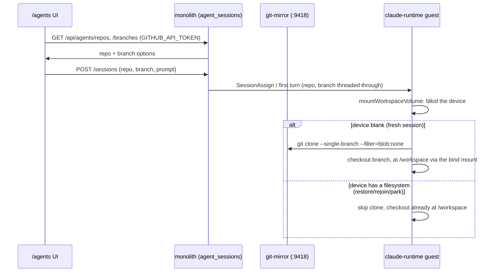

# ADR 050: Workspace Hydration for Agent Sessions from the Hot Git Mirror

**Author:** jomcgi
**Status:** Accepted
**Created:** 2026-08-04
**Extends:** [041 - Hot Git Mirror for goosecracker Agent Workspaces](041-hot-git-mirror-agent-workspaces.md) (the mirror this ADR is the first real hydration consumer of, and whose `internalTrafficPolicy: Local` and clone-shape choices this ADR revises)
**Relates to:** [embervm/001 - EmberVM, a BEAM Orchestrator for Firecracker Workloads](../embervm/001-embervm-beam-firecracker-workload-orchestrator.md) (the fork-not-extend precedent this ADR follows for the clone code), [023 - Egress Secret Proxy for Agent Sandboxes](023-egress-secret-proxy.md) and [047 - Per-Principal Egress Credentials and the Broker Identity Envelope](047-per-principal-egress-credential-broker.md) (why the mirror, not GitHub direct, is the only thing the egress allowlist widens for)

---

## Problem

Issue #4320's `/agents` UI (built on ADR 049's poll-shaped design) puts repo and branch fields in front of a user starting a session. Today those fields are decoration. `StartRequest` on `POST /api/agents/sessions` accepts `workspace` and `branch` (`projects/monolith/agent_sessions/router.py:118-122`, defaulting to `"<guest>"` and `"main"`), and `_persist_session` writes them onto the `agent_sessions` row (`store.py:21-28`, `models.py:15-16`). Nothing downstream ever reads them back: the turn that actually reaches the guest carries `{"message": ..., "session_id": ..., "model": ...}` and nothing else (`transport.py:364-366`), and the voice-session MCP path does not even try to pass a real value through, it hardcodes `workspace = "<guest>"` at the call site with the comment "Workspace is in the guest, not the pod" (`mcp.py:461`, `:463`). A selector that writes to a column no code path reads is metadata theater.

The reason nothing reads them is that there is nothing to hydrate with. The claude-runtime guest image ships a git binary, but the EmberVM internal egress allowlist has exactly one entry, the in-cluster Qwen inference endpoint (`projects/embervm/deploy/values.yaml:271-283`), so a guest that ran `git clone` today would hit a deny at the sidecar before the connection left the pod. And the workspace itself starts with nothing to check out into: `mountWorkspaceVolume` in guest-init `mkfs.ext4`s the session's device on first mount whenever `blkid` reports no filesystem signature (`projects/embervm/runtimes/claude/guest-init/cmd/volume_linux.go:158-172`), so a freshly created session boots into an empty directory every time.

The interesting part is that the guest-side plumbing already anticipates this. `mountWorkspaceVolume` bind-mounts `<session-root>/workspace` onto `/workspace`, the exact path the shim spawns the CLI in (`DEFAULT_WORKSPACE` / `EMBER_CLAUDE_WORKSPACE`, `shim.py:32`, `apko.yaml:64`), with the comment: "Both the checkout and HOME are subdirectories of it, bind-mounted onto the paths the image already uses, so when a real disk lands here BOTH become disk-backed with no further guest change" (`volume_linux.go:22-25`). "The checkout" was named in that comment before anything ever produced one. This ADR is the decision that fills the gap: put a real repository at `/workspace` when a session is created, on the same durable volume that already survives park, rejoin, and restore.

---

## Decision

**The `/agents` new-session flow's repo and branch selection becomes real.** At session create, the EmberVM claude-runtime guest clones the selected `repo@branch` from the in-cluster git mirror (ADR 041) into `/workspace`. Because `/workspace` is bind-mounted from the session's durable ext4 volume, the checkout is durable for free: park, rejoin, and restore already preserve whatever sits on that volume, and this decision only adds a repository to what's on it rather than building new persistence.

| Aspect | Today | Decided |
| --- | --- | --- |
| `workspace`/`branch` on `agent_sessions` | stored, never read past the row | read once, at create, to drive a real clone |
| What a session VM boots into | an empty bind-mounted directory | a checked-out `repo@branch` |
| Clone source | none | the git mirror (ADR 041), never GitHub direct |
| Credential in the guest for this path | none possible (no egress route exists) | still none: the mirror serves anonymous read-only `upload-pack` |
| EmberVM internal egress allowlist | one entry (`inference:8080`) | two entries: `inference:8080`, `git-mirror:9418` |
| git-mirror Service reachability | `internalTrafficPolicy: Local` (node-4 callers only) | cluster-wide (session guests schedule across every labeled node) |
| Repo/branch enumeration for the UI | n/a | GitHub API, via `GITHUB_API_TOKEN`, not the git wire protocol |
| Hydration on restore | n/a | never re-runs; the checkout is already on the restored volume |

**1. Hydration is a clone-on-fresh-volume operation, not a per-turn or per-restore one.** `mountVolumeDevice`'s `blkid` check already distinguishes a genuinely blank device from one carrying a filesystem (`volume_linux.go:153-172`): the same signal that decides whether to `mkfs.ext4` is the signal that decides whether to clone. A restored, parked, or rejoined session has a non-blank device and skips both. This is what makes "restores never re-clone" fall out of plumbing that already exists, rather than needing new state to track whether a lineage has been hydrated.

**2. The clone source is the git mirror, never GitHub direct, for the same reasons ADR 041 built it.** A fresh-to-~60s in-cluster mirror (`refreshIntervalSeconds: 60`, `git-mirror/deploy/values.yaml:29`) gives sub-second, node-local hydration with no GitHub rate-limit or availability dependency on the session-create path, and it needs no credential in the guest at all: the mirror serves `upload-pack` unauthenticated (`git-mirror/README.md`). That is also why this decision adds nothing to the ADR 023/047 credential-broker surface: those ADRs exist to keep a credential the guest must hold out of its reach, and this clone needs no credential to begin with, so it never touches that machinery. The reference clone shape, `--single-branch --filter=blob:none` then `checkout <ref>` (`projects/firecracker/substrate/shim/capabilities/git.go:119-135`), is not reused as a dependency: ADR embervm/001 already decided that EmberVM forks rather than imports across the firecracker-substrate/EmberVM boundary, so the roughly thirty lines that shape represents are reimplemented in the claude-runtime guest, not linked in.

**3. Two posture changes on the mirror and the allowlist, made explicitly rather than as incidental scope creep.**

- The git-mirror `Service` drops `internalTrafficPolicy: Local` (`chart/templates/service.yaml:13`). That setting was correct when the only consumer was a node-4-local guest; claude-runtime session VMs schedule across every `homelab.io/firecracker`-labeled node, so a node-local-only Service would silently fail hydration on every node but one. Widening it makes the mirror an ordinary cluster ClusterIP. What it exposes cluster-internally is anonymous, read-only `upload-pack`, unchanged from what node-4 guests already reached.
- `receive-pack` stays enabled on the mirror for the scratch-ref recording path (`refs/agents/**` pushes, `configmap.yaml:17`, `:142`), gated by the pre-receive hook that already rejects anything outside that namespace. Widening the Service's reachability widens who can attempt a push, not what a push can touch: the hook, not the network boundary, is what keeps upstream refs read-only, and this decision does not change it. Recording rather than silently disabling it here is the point: a widened Service is exactly the kind of change that should not travel alongside an unreviewed write-surface change, and scratch-ref recording (ADR 041's audit/replay trail) is worth keeping for claude-runtime sessions too.
- The EmberVM internal egress allowlist (`values.yaml:271-283`) gains `git-mirror.monolith.svc.cluster.local:9418`. The existing comment on that block states plainly that "adding an entry here is a security decision, not tuning" (`values.yaml:281`); this ADR is that decision, recorded for the second entry the same way the first (the Qwen endpoint) already is. `internal.default` stays deny: nothing else in-cluster becomes reachable from a prompt-injected guest.

**4. Repo and branch enumeration for the UI comes from the GitHub API, not from teaching anything the git wire protocol.** The monolith image carries no `git` binary and the mirror exposes no HTTP surface at all, only `git://` on :9418 (`git-mirror/README.md`), so neither side can cheaply answer "what branches does this repo have" without adding one of those. The GitHub API already can, so the listing endpoints call it directly using `GITHUB_API_TOKEN`. This is deliberately not the `GITHUB_TOKEN` value already in the monolith's environment: that value is a kloak placeholder (`"kloak:gh:01JZX8K3N7Q2M5R9W4T6Y0F1B8"`, `projects/monolith/deploy/values.yaml:241`), swapped for a real credential only at the ADR 023 egress hop as a guest's request leaves its VM, and a direct call from the monolith process never crosses that hop, so it would send the literal placeholder string as a bearer token and get rejected. `GITHUB_API_TOKEN` is a separate, real credential for exactly this direct-call case. The four repos the git mirror registers (`jomcgi/homelab`, `weave-hand/loom`, `colincee/homelab`, `scotscottmca/parkedlikea`, `git-mirror/deploy/values.yaml:14-27`) already carry one-line descriptions in `projects/monolith/goosecracker/repo_catalog.py`, seeding the dropdown's labels without new copy.

**5. A dropdown answer up to 60 seconds stale, while the clone itself is exact, is accepted rather than closed.** The GitHub API call the dropdown makes is live; the mirror's own content lags GitHub by up to one refresh interval. A user could in principle select a branch tip the mirror has not fetched yet. The gap is bounded, self-healing on the next refresh, and cheaper than the alternative: blocking session create on an out-of-band mirror-freshness check, or driving the dropdown off the mirror itself, which decision 4 already rejects. What the guest ultimately checks out is exactly what the mirror holds at clone time, never a stale read masquerading as current, so the divergence is confined to the picker, not the checkout.

---

## Architecture

The clone sits behind the same fresh-vs-restored branch that already gates `mkfs.ext4`, so no new state is introduced to track "has this lineage been hydrated": the block device's own signature is that state.

---

## Alternatives Considered

- **Clone from GitHub directly.** Rejected for the reasons ADR 041 already established: GitHub availability and rate limits on the session-create hot path, higher latency than a node-local mirror, and it would need a credential in the guest (`weave-hand/loom` is private) that the egress-broker ADRs (023, 047) exist specifically to keep out of untrusted, prompt-injectable guest code.
- **Bake a repo checkout into the warm base image.** Rejected for the same reason ADR 041 rejected baking the repo into the base: it couples base freshness to repo freshness, forcing a rebuild on every push to track. It fits worse here specifically, since the point of this decision is a per-session repo *choice*; a baked base could hold at most one repo.
- **Teach the monolith the git wire protocol (fetch branch lists via a git subprocess) instead of the GitHub API.** Rejected: the monolith image has no git binary and would need one added purely to answer a dropdown, and the mirror has no HTTP surface to query over. The GitHub API is the cheaper, already-available source of truth for enumeration; the mirror stays exactly what ADR 041 built it as, a clone target.
- **Drive the repo/branch dropdown off the mirror's own state instead of the GitHub API.** Rejected alongside the point above: it would add an HTTP query surface to a service ADR 041 deliberately kept to `git://` only, to buy freshness the GitHub API already gives more simply. The mirror's up-to-60s staleness is accepted (decision 5) rather than engineered around.
- **Keep `internalTrafficPolicy: Local` and run one mirror replica per node instead.** Rejected as disproportionate: four mirrors instead of one, each independently refreshing and each its own GitHub-rate-limit consumer, to avoid a single Service-field change that costs nothing further once the mirror serves nothing but anonymous read-only content plus a namespace-restricted write.
- **Reuse the firecracker-substrate shim's `Git` capability directly instead of reimplementing the clone in EmberVM.** Rejected per ADR embervm/001: EmberVM forks from the firecracker-substrate lineage rather than importing across that boundary, so the clone call is copied, not linked, matching how the rest of the claude-runtime guest already stands apart from the substrate shim.

---

## Security

Baseline `docs/security.md`. This widens one Service's reachability and adds one egress-allowlist entry; it changes no credential's custody.

- **No credential ever enters the guest for this path.** The mirror clone is unauthenticated `upload-pack`; nothing here touches the ADR 023/047 credential broker at all. A prompt-injected guest gains no new credential to exfiltrate.
- **The widened Service surface is bounded to anonymous read plus a namespace-restricted write.** Any cluster-internal caller can now reach `git-mirror:9418`, not just node-4 pods, but what they can do there is unchanged: read any mirrored ref, or push only under `refs/agents/**` per the existing pre-receive hook. Upstream branches, tags, and the fetch refspec from GitHub stay read-only regardless of who can reach the port.
- **The new allowlist entry is scoped exactly like the existing one.** `git-mirror.monolith.svc.cluster.local:9418` is an exact host:port match with no wildcard, matched against the resolved IP as well as the requested name, the existing SSRF/DNS-rebinding defense in the egress sidecar, unchanged by this decision. A prompt-injected guest gains reachability to exactly one more destination, not a general cluster-pivot path; `internal.default` stays deny for everything else.
- **`GITHUB_API_TOKEN` is a real, standing monolith-side credential**, distinct from the guest-facing kloak placeholder. It is provisioned the same way every other monolith secret is, via the 1Password Operator, scoped to reading the four catalog repos, and never handed to a guest.

---

## Risks

| Risk | Likelihood | Impact | Mitigation |
| --- | --- | --- | --- |
| A session created between two mirror refreshes hydrates from a branch tip up to ~60s behind what the dropdown showed | Medium | Low | Bounded, self-healing window; the agent can `git fetch` inside the guest afterward since the egress hole permits it (decision 3) |
| Mirror pod is down at session create (single replica, ADR 041's known risk, now a dependency for a second, node-spanning consumer) | Low | Medium | Degrade rather than fail: create proceeds with an empty `/workspace` and a surfaced warning, consistent with issue #4329's direction for degraded restores, extended here to a degraded hydration |
| Widened Service reachability lets any cluster-internal pod attempt a scratch-ref push, not just node-4 ones | Low | Low | The pre-receive hook, not the network boundary, is the actual write boundary (decision 3); unaffected by this change |
| The four-repo catalog (`git-mirror/deploy/values.yaml`, `goosecracker/repo_catalog.py`) drifts from what the selector should offer as usage grows | Medium | Low | Both lists are hand-maintained by design (ADR 041 deferred a DB-backed registry until the static list hurts); a mismatch degrades gracefully per `repo_catalog.py`'s own doc comment: a grant is never hidden from selection, an uncatalogued repo just cannot hydrate |
| A first clone of a large repo on a cold guest has a latency floor even against a warm mirror | Medium | Low | `--filter=blob:none --single-branch` keeps the fetch to commits and trees, not blobs, matching ADR 041's stated shape; the cost is paid once per session lineage, never per turn or per restore |

---

## Open Questions

1. Whether `gcRetentionDays` on the mirror needs to move off its default-disabled setting once claude-runtime sessions add meaningfully to `refs/agents/**` push volume; not a concern this ADR needs to settle before landing.
2. Whether the mirror's single-replica posture needs an HA follow-up now that a second, node-spanning consumer depends on it at session-create time, or whether the degrade path (Risks, above) is an acceptable steady state.
3. Whether `GITHUB_API_TOKEN`'s scope should narrow further than "read the four catalog repos" once the selector's repo set is no longer a hand-maintained values list.

---

## References

| Resource | Relevance |
| --- | --- |
| [041 - Hot Git Mirror for goosecracker Agent Workspaces](041-hot-git-mirror-agent-workspaces.md) | The mirror this ADR is the first real hydration consumer of; the `internalTrafficPolicy: Local` and clone-shape decisions this ADR revises and reuses |
| [embervm/001 - EmberVM, a BEAM Orchestrator for Firecracker Workloads](../embervm/001-embervm-beam-firecracker-workload-orchestrator.md) | The fork-not-extend precedent for why the clone code is reimplemented rather than imported |
| [023 - Egress Secret Proxy for Agent Sandboxes](023-egress-secret-proxy.md), [047 - Per-Principal Egress Credentials and the Broker Identity Envelope](047-per-principal-egress-credential-broker.md) | Why the mirror, needing no credential, never touches the broker this ADR would otherwise have to extend |
| `projects/monolith/agent_sessions/router.py:118-122`, `store.py:21-28`, `models.py:15-16`, `mcp.py:461,463` | `workspace`/`branch` as dead labels today |
| `projects/monolith/agent_sessions/transport.py:364-366` | The turn payload's actual shape, `{message, session_id, model}` |
| `projects/embervm/runtimes/claude/guest-init/cmd/volume_linux.go:22-25,60-105,153-172` | `mountWorkspaceVolume`: the blank-device signal this ADR reuses to gate cloning, and the bind mount that makes `/workspace` durable for free |
| `projects/embervm/runtimes/claude/shim.py:32`, `apko.yaml:64` | `/workspace` as the CLI's actual working directory |
| `projects/embervm/deploy/values.yaml:271-283` | The internal egress allowlist and its "adding an entry here is a security decision" comment |
| `projects/firecracker/git-mirror/chart/templates/service.yaml:13`, `configmap.yaml:17,142`, `deploy/values.yaml:14-27` | `internalTrafficPolicy: Local`, the receive-pack pre-receive hook, and the registered repo list |
| `projects/firecracker/substrate/shim/capabilities/git.go:119-135` | The reference clone shape (`--single-branch --filter=blob:none`, then checkout), not imported per ADR embervm/001 |
| `projects/monolith/deploy/values.yaml:241` | `GITHUB_TOKEN` as a kloak placeholder, why it cannot serve a direct monolith-side call |
| `projects/monolith/goosecracker/repo_catalog.py` | The four-repo catalog seeding the selector's descriptions |
| Issue #4330 | The work items this ADR's decision decomposes into |
| Issue #4329 | The degraded-restore UI direction this ADR's Risks table extends to degraded hydration |
