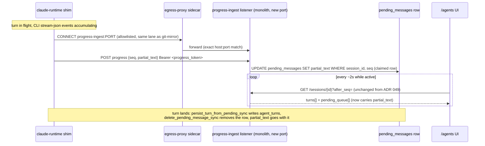

# ADR 051: Mid-Turn Session Progress Pushed by the Guest, Not Polled Through the Control Plane

**Author:** jomcgi
**Status:** Accepted
**Created:** 2026-08-04
**Relates to:** [049 - Turn-Granular, Poll-Shaped Agent Session UI on Durable Postgres, Not a Live Event Stream](049-turn-granular-poll-shaped-agent-ui.md) (the poll shape this ADR feeds without reopening), [050 - Workspace Hydration for Agent Sessions from the Hot Git Mirror](050-workspace-hydration-from-git-mirror.md) (the egress-allowlist precedent this ADR's ingest entry follows as the third), [023 - Egress Secret Proxy for Agent Sandboxes](023-egress-secret-proxy.md) and [047 - Per-Principal Egress Credentials and the Broker Identity Envelope](047-per-principal-egress-credential-broker.md) (why the progress token deliberately does not join that broker), [041 - Hot Git Mirror for goosecracker Agent Workspaces](041-hot-git-mirror-agent-workspaces.md) (the hook-not-network-boundary write-authorization pattern this ADR extends to a token)

---

## Problem

ADR 049 built `/agents` turn-granular and poll-shaped on purpose, deferring mid-turn visibility explicitly: "sub-turn visibility (intermediate assistant text, tool calls animating in) is deferred until it is a demonstrated want rather than an assumed one." Its own Risks table named the cost of that deferral: "a long turn shows only 'running' for minutes with no detail, reading as stalled or broken." That is the demonstrated want. Issue #4330 is the parent program this ADR's decision sits under, and #4329's degraded-state surfacing work benefits from the same visibility.

The obvious next step, poll a shim progress endpoint the same way `/agents` already polls `agent_turns`, does not work here, because it would have to transit the guest-invoke path, and that path is deliberately single-flight at two independent layers:

- `Embervm.Session`, the per-session GenServer, documents "standing decision 9": at most one `SessionAssign` is ever in flight for a session, behind a bounded FIFO queue (`invoke_queue_cap`, default 4); a pile-up past the cap is rejected `{:error, :queue_full}` and the router 429s (`projects/embervm/control/lib/embervm/session.ex:8-25`).
- noded's `SessionAssign` handler takes a per-`vm_id` `beginInFlight` guard before it ever reaches the guest; a concurrent call on the same VM is rejected `FAILED_PRECONDITION`, "a call is already in flight" (`projects/embervm/noded/server/server.go:1272-1290`).

Both guards exist for the same reason: an agent turn is sequential by nature, so nothing else is meant to be able to interleave with it. A progress poll at `/agents`'s existing ~2s cadence would fill the default queue cap in about eight seconds and start 429ing the user's next real message, and that is the *good* outcome; if the poll instead raced the guard directly it would collide with the turn actually in flight. Unwinding either guard to make room for a read-only side channel means reopening standing decision 9 in Elixir and the per-VM single-flight invariant in Go, both deliberate isolation boundaries, to serve a want that a push, not a pull, answers without touching either.

## Decision

**The guest pushes progress outward instead of the monolith polling in.** While a turn runs, the claude-runtime shim sends progress events, completed assistant messages and tool activities, message-granular because the CLI runs without `--include-partial-messages`, out through its existing egress lane to a new, dedicated progress-ingest listener on the monolith. The monolith writes the accumulating output onto the session's claimed `pending_messages` row, a new `partial_text` column, and `/agents`'s existing `?after_seq` poll surfaces it. Nothing on the read side changes: `GET /sessions/{id}?after_seq=` already returns both `turns` and `pending_queue` in one payload (`projects/monolith/agent_sessions/router.py:138-198`), and the frontend already renders each `pending_queue` entry with a claimed/waiting state and a "running…" shimmer line (`projects/monolith/frontend/src/routes/private/agents/+page.svelte:539-557`). `partial_text` is one more field threaded through a poll response shape that already exists, not a new one.

| Aspect | ADR 049 (today) | Decided |
| --- | --- | --- |
| Mid-turn visibility | None; status reads "running" until the turn lands | Message-granular progress visible while the turn runs |
| Direction | n/a | Guest pushes out; monolith never polls the guest-invoke path |
| New protocol layers | n/a | One: a progress-ingest listener on the monolith and a shim-side sender |
| Guest-invoke path (session.ex / noded) | Unchanged, single-flight | Unchanged, single-flight; this decision never contends for that slot |
| Where partial output lands | n/a | `pending_messages.partial_text`, a new column on the row the turn already claims |
| Read-side poll shape | `?after_seq` on `agent_sessions`/`agent_turns`/`pending_messages` | Unchanged; `partial_text` rides the existing `pending_queue` entries |
| Egress allowlist | Two entries: inference, git-mirror (ADR 050) | Three: adds the progress-ingest listener, its own host:port |
| Credential | n/a | A per-session progress token, not broker-mediated |

**1. Push, not poll, because the guest-invoke path is structurally unavailable for a side channel, not merely slow.** Section above; this is not a case for tuning a poll interval or raising `invoke_queue_cap`, since either guard exists to keep a turn from being interleaved with anything else, and a progress poll is exactly the kind of anything-else those guards were built to exclude.

**2. The push travels a new destination on the same lane the guest already uses, never the monolith's main API port.** The claude-runtime guest already reaches an allowlisted in-cluster destination through the egress-proxy sidecar: `core.gitProxy` opens a raw `CONNECT` tunnel through `127.0.0.1:<egress_port>` to `git-mirror.monolith.svc.cluster.local:9418` for the workspace clone (`projects/embervm/runtimes/claude/shim.py:1559-1565`, mechanism at `:161-180`). The progress push reuses that same tunnel mechanism from the shim's own process, aimed at a new destination, not a new mechanism. The egress allowlist (`projects/embervm/deploy/values.yaml:291-307`, "adding an entry here is a security decision, not tuning" at `:298`) gains exactly one exact host:port entry for the progress-ingest listener. That listener MUST be its own port, distinct from the monolith's main API port: the allowlist is host:port granular by design, so a prompt-injected guest that reaches it gains exactly one write-only ingest route, never the private API that in-cluster code otherwise trusts the network for (Cloudflare Access sits only at the edge, per `docs/security.md`'s baseline).

**3. Message-granular fidelity is the accepted shape, not a stopgap for token-level streaming.** The shim already parses a full `stream-json` event stream and already accumulates it in a loop that today only closes out on `event.get("type") == "result"` (`shim.py:917-943`). This decision has that same loop push out on each qualifying event, completed assistant messages and tool activity, as it arrives, instead of waiting for the turn to end. The CLI runs without `--include-partial-messages` (`shim.py:673-681` shows the invocation flags), so token deltas are not available at this layer; getting them would be a separate decision, not an omission in this one.

**4. `partial_text` needs no cleanup logic beyond what the queue already does.** `pending_messages` rows are deleted once their turn is persisted (`delete_pending_message_sync`, `projects/monolith/agent_sessions/store.py`); `persist_turn_from_pending_sync` writes the final `result_text` to `agent_turns` and the pending row is gone immediately after. `partial_text` living on that same row means its lifetime is bounded for free by a lifecycle that already exists, the same shape ADR 050 used for hydration state: reuse an existing signal rather than track a new one.

**5. The progress token is a new, narrow credential, not a broker-mediated one.** Minted at session create, stored on the `agent_sessions` row alongside the existing `ember_session_token` (`projects/monolith/agent_sessions/models.py`), and threaded to the guest inside the turn payload, the same `{message, session_id, model, repo, branch}` dict the monolith already builds and sends over the already-trusted monolith-to-control-plane-to-vsock path (`projects/monolith/agent_sessions/transport.py:423-434`). The guest presents it as a bearer on each push. This is deliberately outside the ADR 023/047 credential-broker surface: that machinery exists to keep a long-lived, unscoped, attributable-elsewhere credential (the Anthropic subscription token) out of a prompt-injectable guest's reach entirely. A progress token is the opposite profile: single-session-scoped, write-only to one row, and already implicitly trusted to the guest the moment the turn payload carrying it is delivered. Routing it through the broker would add machinery built for a different threat model to a credential that does not have that shape.

**6. Fire-and-forget with a fail-safe degrade.** The shim sends each push with a short timeout and does not block the turn on the result. A down or unreachable ingest listener degrades to today's behavior exactly: output appears only when the turn lands. This decision adds a visibility improvement, not a new way for a turn to stall or fail.

---

## Architecture

The guest-invoke path (`session.ex`'s FIFO queue, noded's `beginInFlight` guard, `SessionAssign` itself) is untouched and does not appear in this diagram: nothing in this decision calls it more than once per turn, which is the entire point.

---

## Alternatives Considered

- **Poll a shim progress endpoint through the control plane's guest-path proxying.** Rejected: blocked by `Embervm.Session`'s single in-flight invoke queue and noded's per-VM `beginInFlight` guard, two independent layers that exist specifically to keep a turn from being interleaved with anything else. At the UI's existing ~2s cadence the queue cap (default 4) fills in roughly eight seconds and the next real message 429s.
- **Relax either guard to let a read-only status call coexist with an in-flight `SessionAssign`.** Rejected: both guards are deliberate, standing decisions (session.ex names its own "standing decision 9"), and loosening either is an Elixir change and a Go change to a boundary that exists on purpose, disproportionate to a UI visibility want that push answers without touching either.
- **Route the progress token through the ADR 047 credential broker, like the Anthropic OAuth token.** Rejected: the broker exists for credentials that must never be visible to the guest because they are long-lived, unscoped, and valuable outside the session. A progress token is short-purpose, single-session, write-only, and already implicitly disclosed to the guest via the turn payload; broker-mediating it adds machinery sized for the wrong threat model.
- **Send progress pushes over the monolith's existing main API port instead of a dedicated listener.** Rejected: the egress allowlist is host:port granular by design, and a shared port would mean a prompt-injected guest reaching the progress destination also reaches every other route the monolith's main API serves. A dedicated listener keeps the allowlist entry, and what it exposes, to exactly the write-only ingest route this decision needs.
- **Token-level streaming now, via `--include-partial-messages`.** Deferred, not rejected, matching ADR 049's own deferred item: it changes what the CLI emits, not just how the shim relays it, and is a separate decision once message-granular visibility is confirmed insufficient.
- **Reopen the poll mechanism itself (shorter interval, SSE, `NOTIFY`) on the browser side.** Not reopened: ADR 049 already decided and deferred that surface, and this ADR changes only what data a poll response can contain, not how or how often the browser polls.

---

## Security

Baseline `docs/security.md`. This adds one egress-allowlist entry and one new credential; it does not touch the guest-invoke path or the ADR 023/047 broker.

- **The allowlist entry is exact host:port, matched against the resolved IP as well as the requested name**, the same SSRF/DNS-rebinding defense every existing entry uses. A prompt-injected guest gains reachability to exactly one more destination; `internal.default` stays deny for everything else.
- **The ingest surface is its own listener/port, never the monolith's main private API port.** That port in-cluster trusts the network, since Cloudflare Access sits only at the edge; a guest reaching it would otherwise reach every private-tier route, not just progress ingestion. A dedicated listener means the only thing a compromised guest can reach through this new entry is a single write-only route.
- **Authentication is a per-session progress token, minted at create and scoped to write only that session's `partial_text`.** It authorizes nothing else: not other sessions, not reads, not the turn-send path itself. A compromised guest with this token can corrupt its own session's in-flight progress display and nothing more.
- **The token is deliberately not broker-mediated (ADR 023/047).** That machinery exists to keep a long-lived, unscoped, attributable-elsewhere credential out of guest reach entirely. This token is the opposite: single-session-scoped, low-value, and already implicitly trusted to the guest the moment the turn payload carrying it is delivered over the existing monolith-to-CP-to-vsock path.
- **Failure is fail-safe, not fail-open toward a stall.** Pushes are fire-and-forget with a short shim-side timeout. A down or unreachable listener degrades to ADR 049's original behavior, output at turn end, and never blocks or fails the turn itself.
- **Extends ADR 041/050's "the hook, not the network boundary, is the write boundary" pattern.** 050 named it explicitly for git-mirror's pre-receive hook: widening a Service's reachability widens who can attempt a write, not what the write can touch. Here the equivalent boundary is the token: any labeled node can route to the ingest listener, but only a request bearing a given session's token can move that session's `partial_text`.

---

## Risks

| Risk | Likelihood | Impact | Mitigation |
| --- | --- | --- | --- |
| Progress-ingest listener is down or unreachable at push time | Low | Low | Fire-and-forget with a short timeout; degrades to ADR 049's original turn-end-only behavior, never stalls or fails the turn |
| A push lands after its turn has already been persisted and `delete_pending_message_sync` has removed the row | Low | Low | The write targets a row that no longer exists and no-ops; `agent_turns.result_text` is already authoritative and unaffected |
| A guest holding a valid progress token pushes malformed or oversized `partial_text` repeatedly | Low | Low | Fire-and-forget bounds the guest's own cost; the write is a single-column UPDATE on one row it is already entitled to influence, not a growing or unbounded surface |
| A leaked progress token (e.g., resident in guest RAM at bank/snapshot time, the same class of hazard ADR 047 records for the Anthropic token) is replayed | Low | Low | Unlike the credential ADR 047 guards, this token's blast radius is one session's own `partial_text` column; there is nothing of value to exfiltrate beyond what the guest already controls |
| Concurrent or out-of-order pushes overwrite each other (no server-side sequencing decided here) | Medium | Low | See Open Questions; accepted as a display-only race for now, since the authoritative `result_text` is unaffected regardless |

---

## Open Questions

1. Whether progress pushes need per-push sequencing (a monotonic counter, or last-write-wins by timestamp) to guard against an out-of-order overwrite, or whether one shim process pushing serially over one connection makes this moot in practice.
2. Whether the progress-ingest listener needs an explicit payload-size cap on `partial_text`, given it is a new write surface reachable by any session holding a valid token.
3. Whether token-level streaming (`--include-partial-messages`) is worth the CLI-side protocol change once message-granular visibility is in front of a user; not decided here, per ADR 049's own precedent of deferring streaming until demonstrated insufficient.
4. Whether other turn-record fields that currently only surface at turn end, `workspace_hydration` (`shim.py:1632-1744`) among them, should ride this same push path; noted as a likely consequence of this decision, not a commitment made here.

## Addendum (2026-08-05)

Open Question 3 is resolved in the affirmative, and quickly: message-granular
visibility was confirmed insufficient by the owner on the first evening it
shipped (long tool phases and long generations still read as stalled), so the
CLI now runs with `--include-partial-messages` and the shim folds
`content_block_delta` text into the pushed partial. Token-granular is the
accepted fidelity going forward.

Open Question 4 is partially resolved: tool activities now ride the same push
(capped to the most recent 300), giving the pending entry a live activity
trail; `workspace_hydration` remains turn-end-only.

The original fire-and-forget bound of roughly one push per second is
superseded: the shim pushes on a 200ms cadence with a trailing-edge drain, the
ingest accepts at a 0.15s per-token window, and the single-user UI polls the
detail endpoint on a 100ms self-scheduling loop while a turn is in flight. The
sequencing question (Open Question 1) stays open and unchanged by this.

---

## References

| Resource | Relevance |
| --- | --- |
| `projects/embervm/control/lib/embervm/session.ex:8-25` | Standing decision 9: the per-session FIFO invoke queue and its `queue_cap` 429 |
| `projects/embervm/noded/server/server.go:1272-1290` | `SessionAssign`'s `beginInFlight` guard, "a call is already in flight" |
| `projects/embervm/deploy/values.yaml:291-307` | The internal egress allowlist, its "security decision, not tuning" comment, and where the third entry lands |
| `projects/embervm/runtimes/claude/shim.py:161-180`, `:1559-1565` | The `CONNECT`-tunnel-through-the-sidecar mechanism already proven for the git-mirror clone, reused here for a new destination |
| `projects/embervm/runtimes/claude/shim.py:673-681` | CLI invocation flags: no `--include-partial-messages`, why fidelity is message-granular |
| `projects/embervm/runtimes/claude/shim.py:917-943` | The turn event-accumulation loop this decision has push incrementally instead of only at `type == "result"` |
| `projects/embervm/runtimes/claude/shim.py:1632-1744` | `workspace_hydration`, an existing turn-end-only field that is a likely future rider on this path |
| `projects/monolith/agent_sessions/router.py:138-198` | `GET /sessions/{id}?after_seq=`, the existing poll response already returning `turns` and `pending_queue` together |
| `projects/monolith/frontend/src/routes/private/agents/+page.svelte:539-557` | The existing `pending_queue` render loop `partial_text` joins with no new plumbing |
| `projects/monolith/agent_sessions/store.py` | `create_pending_message`, `persist_turn_from_pending_sync`, `delete_pending_message_sync`: the claim-then-delete lifecycle `partial_text` rides for free |
| `projects/monolith/agent_sessions/models.py` | `AgentSession` (`ember_session_token`, where the new progress token sits alongside it), `PendingMessage` (where `partial_text` lands) |
| `projects/monolith/agent_sessions/transport.py:423-434` | The turn payload dict and its Bearer-token delivery pattern, reused to thread the progress token to the guest |
| [049 - Turn-Granular, Poll-Shaped Agent Session UI](049-turn-granular-poll-shaped-agent-ui.md) | The poll shape and its explicitly deferred mid-turn visibility this ADR fills in |
| [050 - Workspace Hydration from the Hot Git Mirror](050-workspace-hydration-from-git-mirror.md) | The egress-allowlist precedent (second entry) this ADR's ingest entry follows as the third; the "hook, not the network boundary" framing extended here |
| [023 - Egress Secret Proxy for Agent Sandboxes](023-egress-secret-proxy.md), [047 - Per-Principal Egress Credentials and the Broker Identity Envelope](047-per-principal-egress-credential-broker.md) | Why the progress token deliberately stays outside that broker's surface |
| [041 - Hot Git Mirror for goosecracker Agent Workspaces](041-hot-git-mirror-agent-workspaces.md) | Origin of the pre-receive-hook write-boundary mechanism the "hook, not the network boundary" framing (050) generalizes |
| Issue #4330 | Parent program this ADR's decision sits under |
| Issue #4329 | Degraded-state surfacing this decision also benefits |
| PR #4344 | Landed the `workspace_hydration` turn-record field referenced in Open Questions |
| `docs/security.md` | Security baseline |
