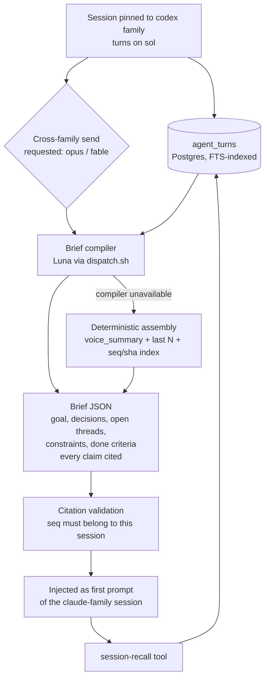

# ADR 052: Cross-Family Agent Session Handoff via a Luna-Compiled Brief

**Author:** Joe McGinley
**Status:** Accepted
**Created:** 2026-08-04

---

## Problem

An agent session is pinned to one adapter family for its entire life.
`model_family()` (`projects/monolith/agent_sessions/__init__.py`) maps
`luna|terra|sol` to `codex`, `opus|sonnet|fable` to `claude`, and `qwen` to
`pi`, and `monolith_agent_session_send` rejects any send whose requested family
differs from the session's pinned family.

The pin is load-bearing, not arbitrary. Session continuity is carried today by
**adapter-native transcript handles**: `cli_session_id` for the Claude CLI
`--resume` path, and the codex `exec resume <id>` protocol. Neither adapter can
read the other's transcript. Without the pin, a family switch would hand the
receiving adapter a cold start with no memory of the session at all, which is
worse than a clean refusal because the failure is silent and the user pays for
the confused turns.

The cost of the pin is that the escalation shape we actually want is
unavailable. The natural way to run a session under a weekly-subscription
constraint is to do the bulk on a cheap model that bills OpenAI (Luna, or Sol
for harder stretches) and move to Opus or Fable only for the slice that needs
it. Today that means starting a second session by hand and re-explaining the
context, or staying on one family for work that did not need it.

Replaying the raw transcript into Opus would technically bridge the gap, but it
spends the binding constraint (the Claude weekly limit) on re-reading context
that has already been paid for once. The handoff has to be cheaper than the
thing it replaces, or it is not worth having.

---

## Decision

Introduce a **family-neutral handoff artifact**: a compacted brief carrying
mandatory signposts back into the raw transcript. Because it is prose plus
citations rather than an adapter-native transcript, it is the only continuity
format that can cross the adapter boundary, which makes it the enabling
mechanism for cross-family handoff and not merely a cheaper variant of an
existing path.

The brief is compiled by **Luna** (`gpt-5.6-luna`, via
`bazel/tools/codex/dispatch.sh`), reading the session's `agent_turns` history
and emitting structured JSON: goal, decisions, open threads, constraints, and
done criteria. Every decision and constraint carries a `(session_id, seq)`
citation, plus the turn's `commit_sha` where it produced one. The receiving
session gets the brief injected as its first prompt and a `session-recall` tool
that resolves those citations against the durable transcript.

Compaction stays lossy. The signposts are what make the loss **recoverable**
rather than permanent, and that recoverability is the entire justification for
accepting a lossy handoff. A brief without citations would be a summary we have
to trust; a brief with them is an index we can audit.

The family pin is relaxed **as an invariant, not as a flag**: a cross-family
send is permitted only when it carries a brief. A flag would let a cold
cross-family send through the moment someone flipped it in values, whereas the
invariant makes the brief a precondition of the transition itself, so the
original guarantee (no adapter ever resumes cold) cannot be lost by
configuration.

Cost framing, stated plainly because it is easy to misread: this does not reduce
total token spend. It moves the read of the raw transcript onto OpenAI billing
and hands Opus or Fable a short brief instead of a replay. The win is converting
the binding constraint into the non-binding one, per the routing lanes in
`CLAUDE.md`.

| Aspect                   | Today                                              | Decided                                                                 |
| ------------------------ | -------------------------------------------------- | ----------------------------------------------------------------------- |
| Cross-family send        | Rejected outright by `model_family` comparison     | Permitted, and only, when it carries a compiled brief                   |
| Continuity mechanism     | Adapter-native handle (`cli_session_id`, `exec resume`) | Adapter-native within a family; brief plus signposts across families |
| Context cost of a switch | Not possible, or a full replay onto the Claude limit | One Luna read of the transcript, billed to OpenAI                      |
| Recovering detail        | Whatever the adapter's transcript still holds      | `session-recall` over the durable `agent_turns` history                 |
| Compactor model          | None                                                | Luna, behind an `agent_sessions.compactor.model` values knob            |

---

## Architecture

The storage and retrieval halves already exist. `agent_turns` is durable in
Postgres with `prompt`, `result_text`, `commit_sha`, `usage_json`, and
`cost_usd` per turn; `store.lexical_search` is Postgres full-text search over
prompt and result with `ts_headline` snippets; `store.get_turn(session_id, seq)`
fetches an exact turn. This decision therefore adds no new storage for raw
preservation, and the `session-recall` tool is a thin scoped wrapper over those
two functions.

Two properties of the assembly matter enough to name here.

**The compiler has a deterministic fallback in the same seam, not as a later
improvement.** The Codex broker fails fast when its login status is `none` (ADR
048), so an unavailable compiler is a routine condition rather than an
exceptional one. When it is unavailable the brief is assembled in code from the
existing per-turn `voice_summary` values, the last N turns verbatim, and a
`(seq, commit_sha, cost)` index. A degraded handoff is acceptable; a handoff
that hard-fails on a dependency outage is not, because the user's alternative at
that moment is to lose the session.

**Prompt assembly is stable-prefix-first**, following ADR 036: base instructions
and schema first, then per-session stable content, then the volatile turn
history. Provider-side caching keys on exact leading bytes, so ordering is the
difference between paying for the prefix once and paying for it every handoff.

`commit_sha` deserves specific mention as a signpost. For a code session, the
faithful compaction of "what happened between turn 4 and turn 11" is
`git diff <sha4>..<sha11>`, not prose about it. Citing shas lets the receiving
model reconstruct ground truth from the repository rather than trust a summary,
which is a materially stronger guarantee than any prose fidelity we could ask
of the compiler.

---

## Alternatives Considered

- **Replay the raw transcript into the receiving model.** Rejected: it spends
  the Claude weekly limit, the exact constraint the handoff exists to protect.
- **Deterministic brief only, with no model in the path.** Rejected as the
  primary mechanism, kept as the fallback: last-N is a poor relevance proxy on a
  long session and will silently drop a constraint stated early.
- **Rolling per-turn compaction into a `turn_brief` column.** Rejected for now:
  it amortises input cost but puts a compiler call on every turn, which only
  pays off when handoffs are frequent relative to turns. Handoffs are currently
  zero because they are blocked, and it would need reconciling with the
  guest-pushed mid-turn progress path (ADR 051).
- **Local qwen as the compiler.** Rejected for this role: a hallucinated
  `(session_id, seq)` citation destroys the recoverability property that
  justifies accepting lossy compaction at all, and ADR 036 records task framing
  as qwen's dominant failure mode. It stays reachable through the values knob.
- **A shared cross-adapter transcript format.** Rejected as disproportionate: it
  means owning a translation layer for three CLIs whose transcript schemas are
  upstream-controlled and change without notice.
- **Relaxing the family pin behind a values flag.** Rejected: it makes a
  correctness guarantee configurable, so a cold cross-family resume becomes one
  values edit away.

---

## Security

Baseline is `docs/security.md`. Two deviations specific to this decision.

**Handoff direction determines whether transcript content newly crosses a
vendor boundary.** For a codex-family session moving to a claude-family model,
the transcript has already been processed by OpenAI, so the compiler read adds
no new egress. For the reverse direction (claude to codex), compiling on Luna
would send Claude-produced transcript content to OpenAI for the first time. The
directions are not symmetric and must not be treated as one case. Compilation is
therefore scoped to the direction where the content has already been seen by the
compiling vendor, and the reverse direction takes the deterministic fallback
unless and until that egress is explicitly accepted.

**Citations are model-produced identifiers and must be validated
server-side.** A `(session_id, seq)` pair emitted by the compiler is untrusted
input. `session-recall` resolves citations only within the requesting session's
own turn history and its `ember_lineage_id` ancestry, so a malformed or
manipulated brief cannot be used to read another session's transcript. Rejected
citations are dropped and logged rather than silently resolved to a neighbouring
turn, because a plausible wrong turn is worse than a visible gap.

The compiler holds no tools and takes no actions. It is retrieval in, text out,
matching the containment ADR 036 established for the orchestrator tier.

---

## Risks

| Risk                                                                     | Likelihood | Impact | Mitigation                                                                                                              |
| ------------------------------------------------------------------------ | ---------- | ------ | ----------------------------------------------------------------------------------------------------------------------- |
| Compiler drops a constraint stated early; receiver never learns it existed | Medium     | High   | Mandatory citations plus `session-recall` make the omission recoverable; brief schema requires an explicit constraints list |
| Compiler fabricates a citation                                           | Low        | High   | Server-side validation against the session's own turns; invalid citations dropped and logged, never resolved approximately |
| Codex broker logged out at handoff time                                  | Medium     | Medium | Deterministic fallback assembly in the same seam, shipped together, never as a follow-up                                  |
| Brief grows until it costs as much as the replay it replaced             | Low        | Medium | Signposts are the mechanism for keeping it short; size is a reviewable property of the schema                             |
| Relaxed family pin lets a genuinely cold session through                 | Low        | High   | The relaxation is an invariant (brief required) rather than a flag, so it cannot be disabled by configuration             |
| Handoff loses provenance of which model produced which decision          | Medium     | Low    | `AgentTurn.model` is already per turn; the brief carries it alongside each citation                                       |

---

## Open Questions

1. Whether the handoff is user-initiated only, or whether an automatic trigger
   (context pressure, repeated failure on the cheap model) is worth having.
2. Whether the brief is persisted as a first-class row or recomputed per
   handoff. Persisting gives an audit trail of what the receiver was actually
   told, at the cost of another table.
3. Whether `voice_summary` should converge with the brief's per-turn content or
   stay a separate UI-facing one-liner.

---

## References

| Resource                                                             | Relevance                                                                       |
| -------------------------------------------------------------------- | ------------------------------------------------------------------------------- |
| ADR 036                   | Prior art for a cheap model compiling a brief, and for stable-prefix assembly    |
| [ADR 048](048-codex-oauth-token-broker.md)                           | Codex broker login gate, the failure mode the deterministic fallback exists for  |
| ADR 049                 | The `/agents` UI where a handoff surfaces to the user                            |
| [ADR 051](051-guest-pushed-mid-turn-progress.md)                     | Mid-turn progress path that rolling per-turn compaction would have to reconcile  |
| [Issue #4350](https://github.com/jomcgi/homelab/issues/4350)         | Outstanding implementation work for this decision                                |
