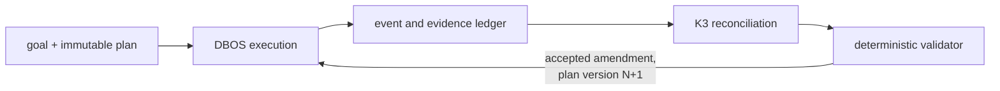

# ADR 053: Swarm Development, Bounded Conductor Orchestration for Feature-Scale Agent DAGs

**Author:** jomcgi
**Status:** Draft
**Created:** 2026-08-09
**Extends:** [038 - Autonomous Work Queue with Capability-Tier Routing and
Reviewer-Verdict Feedback](038-autonomous-work-queue-tiered-gating.md)
(Accepted), specifically decision 8, which confined a cheap orchestrator model
to two seams (Planner, Adjudicator) and never let it hold control flow. This
ADR is that decision applied to feature-scale work: many interdependent
components instead of one implement/review chain.
**Depends on:** [027 - Agent GitHub App Roles](027-agent-github-app-roles.md)
(Draft, the merge gate this design routes every delivery through);
[047 - Per-Principal Egress Credentials and the Broker Identity Envelope](047-per-principal-egress-credential-broker.md)
(Draft, revised in parallel, the capability broker referenced in decision 1)

---

## Problem

The graph in ADR 038 proves a useful vertical slice: one implementer runs, the
remote branch head is checked, bounded retries occur, and a fresh reviewer
session inspects the result. It is a chain, not a DAG, and it has no notion
of a feature that decomposes into interdependent pieces.

The next capability is feature-scale delivery: several agents investigating,
implementing, validating, integrating, and reviewing interdependent slices of
one feature, while something keeps the overall effort aligned with the goal.
A flat collection of agents cannot do this safely. Parallel patches can be
locally correct yet semantically incompatible with each other. Retries can
consume quota without making progress. An upstream change can silently
invalidate completed downstream work. And an unconstrained model-driven loop
would make recovery, budgets, and merge safety non-deterministic, exactly the
failure mode ADR 038 decision 8 rejected for the single-chain case ("let the
cheap orchestrator model drive control flow directly").

This ADR decides how that same rejection generalizes once the graph has real
width: a conductor model proposes shape and recovery, and a deterministic
layer keeps sole ownership of execution, budgets, privilege, gates, and
terminal outcomes. The design review that produced this ADR happened against
GitHub issue #4584, which also carries the incremental delivery plan; this
document keeps the decisions and their rationale, the issue keeps the work
breakdown.

---

## Decision

### 1. Control boundary: the conductor proposes, it never executes

A conductor model, "K3-class" (a Kimi K3-class cheap frontier model or
similar; the seam and privilege profile are what is decided here, not the
vendor, which stays swappable), proposes typed plans and typed amendments
only. A deterministic validator compiles accepted plans into DBOS workflows.
DBOS and policy code own execution, budgets, privileges, gates, and terminal
outcomes, and persist every model decision made in a step so replay never
calls the conductor again and gets a different answer.

The conductor must not:

- Invent arbitrary Python control flow.
- Extend its own retry, fan-out, time, token, or cost budget.
- Grant credentials or capabilities.
- Weaken validation or review requirements.
- Treat an agent's claims as evidence.
- Merge or bypass merge serialization.
- Silently mutate a running DAG (it may propose typed amendments; see
  decision 2).

The conductor is the least-privileged actor in the system: a read-only
reconciliation snapshot in, a typed amendment proposal out, no credential of
any kind, no git push, no BuildBuddy key, no k8s access, no EmberVM control
plane access. ADR 038 decision 8 constrained what its orchestrator may own
(attempt counters, concurrency limits, merge authority, the graph's edges)
without enumerating credentials; this ADR makes the zero-credential floor
explicit, because at feature scale the conductor also reads more
untrusted surface (multi-component CI logs, cross-slice review findings,
issue and PR text across the whole feature), so the privilege floor has to
stay at zero rather than merely low.

The rationale is the same anti-correlation ADR 038 decision 8 argued for the
single-chain case, restated because it is the load-bearing property of this
whole ADR: exposure to untrusted input and privilege must move in opposite
directions. The component that reads attacker-influenceable text (issue
bodies, CI logs, PR comments) is the one most likely to be steered by it, so
it is exactly the component that must hold nothing to steer. A fully
compromised conductor can propose a wasteful or malformed plan; it cannot
grant itself a credential, widen a budget, or merge, because none of those
levers exist on its side of the boundary. This is also what closes plan
laundering: an untrusted-input-influenced proposal still has to pass a
validator that does not read that input, so persuasion has nowhere to land.

### 2. Durability topology

Plan and node state live in application Postgres tables, an explicit ledger
(plans, nodes, artifacts, evidence, amendments), not solely in the DBOS
system schema's workflow result dict, which today is the only durable
record. Each DAG node runs as a short-lived DBOS workflow. A leader-side
reconciler and dispatcher loop reads the current immutable plan version and
enqueues ready nodes.

Amendments create plan version N+1 and take effect at the next dispatch
tick. A running node is never mutated mid-flight, and no workflow needs to
observe a plan change while it is executing: the amendment lands in the
ledger, and the next tick of the reconciler is what acts on it. This
resolves the amendment-adoption question the design review raised (does a
running workflow re-read plan state inside a step, or does the workflow
fork?) by making it not arise: nothing running ever needs to adopt a new
plan version, because nothing running outlives the tick boundary.

Because no workflow outlives a single node, DBOS's `app_version`-scoped
recovery, which ADR 038 decision 2 already had to design around for the
single-chain graph, stops mattering here by construction. A short-lived
node workflow starts and finishes inside one deploy's app version far more
often than not, and when it does not, its ledger row (not its DBOS workflow
state) is what the next reconciler tick resumes from. This is the reason to
explicitly reject the alternative design: one long-lived feature workflow
with an internal supervisor loop. Feature DAGs span monolith deploys (a
docs regen alone forces a chart bump), and a long-lived workflow would need
`DBOS__APPVERSION` pinned deliberately across that whole span plus a
migration story for every deploy that lands mid-feature. Short-lived nodes
plus an external ledger sidestep the problem instead of solving it, which is
the cheaper and more auditable shape.

Decision 1's prohibition is on *silently* mutating a running DAG, not on
mutation as such: `ADD_NODE` and `INVALIDATE_NODE` are typed amendments that
do change the running DAG, by design. What is prohibited is a conductor
write that bypasses the validator and the plan-version mechanism, not the
act of changing the plan at all.

### 3. Evidence ladder: three rungs, one PR

Three tiers of evidence exist, and only the last one gates merge.

1. **Agent self-checks (advisory).** Guests are Linux, so implementers may
   run local lint and targeted `bazel test` on their own time. No
   BuildBuddy credential exists in any guest, ever. These checks advance
   nothing in the graph.
2. **Handoff-triggered Agent CI (advances the node).** A control-plane step
   calls BuildBuddy `ExecuteWorkflow` at the exact commit SHA and records
   the invocation in the ledger. This is what makes PR-less component
   validation possible at all, since BuildBuddy Workflows otherwise only
   fire on pushes and PRs.
3. **Integration PR CI (gates merge).** The single integration branch's PR
   is the only PR in the entire DAG, and its check-run conclusions on the
   exact SHA are the only merge evidence.

Component branches never get a PR. Three reasons compound:

- **BuildBuddy usage.** Per-component PRs would multiply Workflows runs
  against this repo's usage-reduction target, mostly on branch states
  nobody ever merges.
- **Bot head mutation.** The format bot and the legacy chart-version-bot
  push onto PR branches, not onto arbitrary branches. No PR on a component
  branch means its head stays immutable by construction; the "evidence must
  be re-bound after a bot push" problem collapses to the one branch that
  does get a PR, the integration branch.
- **Evidence semantics.** Component-level green is a progress signal for
  the reconciler, not merge evidence. It never needed PR machinery to serve
  that purpose.

Every evidence record in the ledger is `(commit SHA, invocation ID, verdict,
scope)`. Verdicts are read from BuildBuddy's `get_invocation` result and
require the `Executed N out of M` summary with N > 0 before a node is
allowed to advance. Exit codes are never trusted as a verdict on their own;
this repo has a known false-green mode where an action reports success
without running anything (#4118).

### 4. Agent CI action: floor-plus-additive scope

A named action in `buildbuddy.yaml`, working name `Agent CI`, exists to
serve rung 2:

- **No push or PR triggers.** It fires only by name, via `ExecuteWorkflow`.
  Its run count is therefore exactly the handoff count, and it never runs
  against a human branch.
- **`ExecuteWorkflow` carries `repo_url`, `branch`, `commit_sha`,
  `action_names`, and an `env` map applied to each action, runs
  asynchronously, and requires BuildBuddy GitHub App auth**, verified
  against the live API surface during the design review. `disable_retry`
  is set true: the graph, not BuildBuddy, owns retries, so a BuildBuddy-side
  retry would create a second invocation the ledger does not expect.
- **Scope is plan-determined and floor-plus-additive.** The control plane
  computes an affected-target floor deterministically from the diff
  (changed files mapped to owning Bazel packages). The plan may only add to
  that floor (opt-in Semgrep, extra suites, adjacent packages); it may never
  subtract below it. Security-sensitive paths force Semgrep into the floor
  regardless of what the plan requests; the path set is an explicit list
  maintained in the validator's own policy config, seeded from the concerns
  `docs/security.md`'s review checklist covers (auth boundaries, RBAC,
  ingress, secrets), since `docs/security.md` itself names concerns, not
  paths.
- **Scope travels in the control-plane-supplied `env` of the
  `ExecuteWorkflow` request, never in the commit.** An agent that could set
  its own evidence scope by editing a file in its own commit would be
  grading its own homework.
- **Ownership enforcement happens before CI runs, not after.** A diff
  touching paths outside the node's declared ownership, or touching
  `buildbuddy.yaml`, `bazel/tools/`, or the `ci` wrapper itself, fails
  validation and routes to elevated review instead of triggering Agent CI
  at all. This subsumes what would otherwise be a separate
  config-tamper caveat (an agent editing `buildbuddy.yaml` to fake a green
  run) into the same ownership check, rather than adding a second special
  case.
- **Uses the same argv family as the `Test` action**, check-mode lint,
  fail-on-diff formatting assertion (never auto-format, so it cannot
  rewrite the branch head it is validating), no image build or push
  targets. Sharing the argv family means BuildBuddy's action cache is
  shared, so the eventual integration PR's full `Test` run is mostly a
  cache hit against work Agent CI already did.

The general principle this decision is an instance of, worth stating once
because several other knobs in this ADR are instances of it too: **budgets
are ceilings the conductor cannot raise; evidence scopes are floors it
cannot lower.** Any plan-touchable knob that is neither has to be classified
as one or the other before it is allowed to exist, or it is a laundering
vector by omission.

### 5. Deterministic monitors, stability controls, budgets

The design adopts the monitor and stability mechanisms from issue #4584's
body without modification:

- A deterministic `unhandled_conditions` queue populated when invariants
  fail (a failed node with no recovery edge, a blocked dependency with no
  active producer, a stale artifact, a lease that has not renewed, and the
  rest of the list in the issue). Detection stays mechanical; diagnosis of
  a queued condition is the conductor's job, proposed as a typed amendment
  and validated like any other.
- Debounce, cooldown after a plan change, detection of repeated and inverse
  amendments, and a per-feature and per-subgraph replan cap, so that
  ordinary transient failure does not trigger a replan and a persistent one
  does not thrash.
- A fixed recovery escalation ladder: local bounded retry, then focused
  investigation, then affected-subgraph revision, then feature plan
  revision, then human escalation. Each rung is tried in order and none is
  skipped by conductor judgment.
- Budgets are enforced independently at node, subgraph, feature,
  repository, and global levels, and the conductor may suggest priority
  among ready nodes but cannot exceed admission limits at any level.

### 6. Dependencies and relationships

Merge stays a deterministic, concurrency-1, gated operation, unchanged from
ADR 038 (the `concurrency=1` merge queue is decision 2's primitive; the gate
itself is decision 6), through the ADR 027 (Draft) implementer/reviewer
split.
ADR 027 is the floor for any delivery this graph produces: the merge queue
this design assumes exists, but as of this ADR nothing yet enqueues to it,
and that dependency is explicit rather than assumed.

Capability minting and identity for every node (broker-issued lease-scoped
credentials, delegation rather than impersonation) are recorded in ADR 047
(Draft, revised in parallel with this ADR). This document does not restate
047's content; it only asserts that decision 1's "no credential of any
kind" for the conductor, and the lease-scoped credentials every other node
holds, are the same broker boundary 047 specifies.

---

## Architecture

The conductor sits entirely on the read side of the ledger and the propose
side of the validator. Nothing in this diagram gives it a path into `E`
except through `V`.

---

## Alternatives Considered

- **One long-lived feature workflow with an internal supervisor loop**,
  instead of short-lived per-node workflows plus a ledger. Rejected: feature
  DAGs span monolith deploys, and DBOS recovery is scoped to
  `app_version`, so a long-lived workflow would require deliberately
  pinning `DBOS__APPVERSION` across the whole feature plus a migration
  story for every deploy landing mid-feature. Decision 2's short-lived
  nodes make that problem not arise instead of solving it.
- **Letting the conductor drive control flow directly**, the same rejection
  ADR 038 decision 8 already made for the single-chain graph, retested here
  because feature scale multiplies the untrusted surface the conductor
  reads (multi-component CI, cross-slice review findings). It fails worse
  at this scale, not better: reproducibility, cost bounding, and injection
  containment are all the same objections, applied to a wider blast radius.
- **Component branches getting their own PRs**, mirroring the integration
  branch. Rejected on the three compounding grounds in decision 3
  (BuildBuddy usage, bot head mutation, evidence semantics); none of them
  weakens at feature scale, and the BuildBuddy usage argument strengthens
  with the node count.
- **Impersonation instead of delegation for the conductor's read access.**
  Rejected for the same reason ADR 048's Codex broker's narrow impersonation
  exception does not generalize here: GitHub-adjacent and merge-adjacent
  actions have approval semantics that depend on actor identity being
  distinguishable from the human's, and the conductor is not even a
  credentialed actor in this design, so the question does not arise; it
  reads a snapshot, it does not act as anyone.

---

## Security

Baseline `docs/security.md`; inherits ADR 038's posture (autonomous runs
widen throughput, not privilege) and composes with 027 (implementer
structurally cannot merge) and 047 (per-principal egress, once implemented).

- **The conductor holds zero credentials, by construction, not by policy.**
  Decision 1 makes this the load-bearing security property of the whole
  design: a compromised conductor can only produce a bad plan, which still
  has to survive the validator, the evidence floors, and the ADR 027
  merge gate.
- **Evidence scope cannot be lowered by the plan, only raised.** Decision 4
  makes the floor-plus-additive rule the mechanism that stops a
  conductor-authored plan from thinning out its own CI coverage.
- **Config-in-commit tampering is caught by the same ownership check that
  gates node scope**, not by a separate rule: a diff touching
  `buildbuddy.yaml`, `bazel/tools/`, or the `ci` wrapper fails validation
  before Agent CI ever runs.

---

## Risks

| Risk | Likelihood | Impact | Mitigation |
| ---- | ---------- | ------ | ---------- |
| Ledger becomes the single source of truth but is not yet a first-class schema (today the DBOS result dict is the only durable record) | High | Medium | decision 2 names the ledger tables explicitly as a prerequisite, tracked as an issue #4584 work item, not assumed to already exist |
| Amendment-created nodes derive non-deterministic session keys, producing duplicate live sessions (a uuid4-in-step failure mode already seen in this codebase) | Medium | High | session idempotency keys must derive from `(plan version, node id, attempt)`, not a fresh uuid4, per the design review's correctness pass |
| ADR 027's merge gate is Draft, so this design has no merge path to route through until it ships | High | High | explicit dependency stated in decision 6; this ADR is not buildable ahead of its floor, matching how ADR 038 already treats 027 |
| Concurrent Agent CI triggers are a new load pattern on BuildBuddy | Medium | Medium | handoff validations flow through a bounded queue from day one, matching the existing codex dispatch queue pattern |
| Cancellation does not reap the guest session, and parked sessions count against the live capacity cap | Medium | High | cross-linked to #4578; every terminal and cancellation path carries a compensating session-delete step |

---

## Open Questions

1. Where the ledger schema (plans, nodes, artifacts, evidence, amendments)
   is formally specified: this ADR asserts its existence and shape at a
   narrative level; a schema-level design may warrant its own follow-up
   once the first two incremental delivery steps in issue #4584 land.
2. Whether a second principal class (the existing `mcp-friends` group) ever
   triggers a swarm run, which would bound the conductor's proposal space
   by the triggering principal's own scopes rather than a single operator's,
   composing with ADR 047's delegation model once that ships.

---

## References

| Resource | Relevance |
| -------- | --------- |
| [ADR 038 - Autonomous Work Queue with Capability-Tier Routing and Reviewer-Verdict Feedback](038-autonomous-work-queue-tiered-gating.md) | Decision 8 is the seam this ADR extends from one chain to a feature-scale DAG. |
| [ADR 027 - Agent GitHub App Roles](027-agent-github-app-roles.md) | The merge gate every delivery in this design routes through; Draft, a hard dependency. |
| [ADR 047 - Per-Principal Egress Credentials and the Broker Identity Envelope](047-per-principal-egress-credential-broker.md) | The capability broker backing every node's credentials; Draft, revised in parallel. |
| [GitHub issue #4584](https://github.com/jomcgi/homelab/issues/4584) | Design discussion this ADR records, and the incremental delivery work breakdown this ADR deliberately does not duplicate. |
| #4118 | The false-green CI mode behind the `Executed N out of M`, N > 0 verdict rule in decision 3. |
| #4578 | The ADR 038 graph-layer build issue; its body carries the cancellation-does-not-reap-the-guest work item this design's compensating session-delete steps compose with. |
