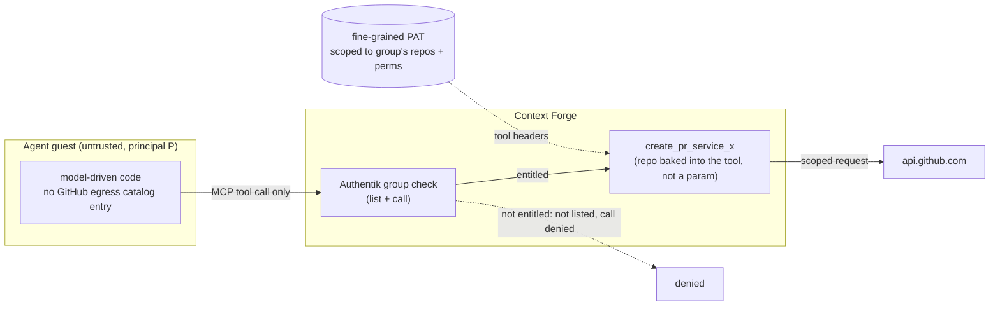

# ADR 055: Tool-Mediated GitHub Access for Agent Principals

**Author:** jomcgi
**Status:** Draft
**Created:** 2026-08-10
**Relates to:** [020 - Deprecate Context Forge, Serve MCP Directly from the
Monolith](020-deprecate-context-forge-mcp-gateway.md) (Accepted, deferred
execution; a genuine tension this ADR states rather than resolves),
[047 - Per-Principal Egress Credentials and the Broker Identity
Envelope](047-per-principal-egress-credential-broker.md) and
[023 - Egress Secret Proxy for Agent Sandboxes](023-egress-secret-proxy.md)
(both Draft, the egress lane this ADR removes GitHub from for agent
principals), [027 - Agent GitHub App Roles](027-agent-github-app-roles.md)
(Draft, a different axis, out of scope here), [005 - Role-Based MCP
Access](005-role-based-mcp-access.md) (Deprecated, prior art)

---

## Problem

Agent guests today reach GitHub through the egress-proxy credential lane
described in ADR 023 and refined by ADR 047: the sidecar picks a credential by
matching a connection's destination host against its catalog (`secretFor`,
defined at `projects/firecracker/substrate/egress-proxy/cmd/swap.go:317`,
called from `projects/firecracker/substrate/egress-proxy/cmd/main.go:233`:
`if sec := p.secretFor(host); sec != nil {`). A `GH_AUTH_TOKEN` catalog entry
for `api.github.com` is attached to whatever request the guest shapes,
because the lookup only ever asks "which host," never "which repo, on whose
behalf, for what."

The guest runs prompt-injectable model-driven code. Content the model reads
(an issue body, a PR comment, a fetched web page) can steer what request it
constructs, and that steered request looks like ordinary guest traffic to the
sidecar. So a prompt injection can construct an arbitrary GitHub API call, and
whatever credential the catalog holds for that host attaches to it regardless
of what the guest's actual task was for. Capability is bounded by the token's
own scope alone, and today there is exactly one identity for every agent
principal that reaches this catalog entry: whatever that token can do, every
guest can do, on any repo the token covers, through any request a hostile
prompt can talk the model into shaping.

This is not a new failure mode for this codebase. The mechanism GitHub's
credential is injected through today replaced an earlier placeholder-
substitution design for exactly this reason: that scheme "substituted over
headers, query and path, so a guest could splice the placeholder into a URL
and get the real credential reflected into a request line"
(`projects/firecracker/substrate/egress-proxy/cmd/swap.go:10-14`). Header
injection closed that specific leak by confining the credential to one
header the guest never touches, but it does nothing about which request the
guest is allowed to shape in the first place. That is the gap this ADR
closes.

---

## Decision

Four parts.

**1. Agents get no direct GitHub egress.** GitHub leaves the egress catalog
for agent principals: no `secretEntry` with `EgressTo` covering
`api.github.com` or `github.com` exists for a guest whose raw traffic the
sidecar's host-matched `secretFor` lookup can reach. What this changes is
precise, not a new mechanism. The sidecar's own file-header comment
describes injection as "the sidecar reads the plaintext request, sets the
configured header to the real secret value..., and originates a fresh
verified TLS connection to the real destination. Injection fires only when
the request's destination is in that secret's `egressTo`, so the credential
is unreachable at every other host" (`swap.go:3-8`). This decision removes
GitHub from `egressTo` on the agent-principal catalog entries, so injection
has nothing to fire on for that host anymore. An agent guest that dials
`api.github.com` directly gets exactly what any uncovered destination gets
under ADR 023's split-horizon policy: no credential attached, not a
network-level block (`main.go:81`, where `EGRESS_EXTERNAL` defaults to
`allow`). What removes GitHub as a place to spend a credential is that no
catalog entry names it for this principal class at all.

Today that is two entries, not one
(`projects/embervm/deploy/values.yaml:487-502`): `github.com` carrying Basic
auth (`basicUser: x-access-token`) for the git lane, because
`git-receive-pack` rejects Bearer and accepts Basic, and `api.github.com`
carrying `Bearer ` for the API lane. Both resolve the same `GH_AUTH_TOKEN`
key. Which of the two this decision removes is deliberately left open (see
Open Questions), because removing the git lane also removes `git push`, and
that needs an answer for how an agent's code reaches GitHub at all.

Removing an entry is also not the same as emptying its secret, and the two
give opposite postures. The same values file records that "A key missing here
DENIES its egressTo hosts rather than tunnelling them", so blanking
`GH_AUTH_TOKEN` while leaving the entries in place is a hard network block on
GitHub, not the uncredentialed pass-through described above. Removing the
entries is what yields the pass-through.

**2. Agents reach GitHub only through MCP tools whose URLs bake in the target
repo, served by Context Forge.** A tool like `create_pr_service_x` carries
its target repository in the tool's own definition, not as a guest-suppliable
parameter, so invoking it is the only way an agent can act on GitHub at all,
and which repo it can act on is fixed at tool-registration time, not request
time. This is a capability boundary, not a policy boundary: there is no verb
an agent can construct, however cleverly a prompt injection shapes the
model's output, that reaches a repo the tool surface never exposed. Contrast
the status quo, where "which repos are authorized" is a property of a token
that a request-shaping bug or a persuasive prompt can silently violate; here
it is a property of which functions exist for the caller to invoke.

**3. Authentik groups gate the tools.** Context Forge filters per identity
and enforces on both list and call, the same group-to-tool-tier machinery
issue #4569 is already building for the monolith's own MCP surface: a
declarative tier map with `admin: {default: true}` so an unclassified tool
lands in the most restrictive tier, plus a reconcile pass on the tool-refresh
CronJob because federation creates tools `visibility=public` by default.
Entitlement to a tool is entitlement to that repo: a principal's Authentik
group membership decides which of the fixed GitHub tools it can even see, and
Context Forge's own enforcement, not agent-side judgment, is what keeps
"sees" and "may call" the same set.

This works because of a property Context Forge already has, not a
result-scoping layer these tools invent: "Context Forge's ACL is
tool-granular: it decides whether you may call `search_knowledge`, never
what `search_knowledge` returns" (`projects/mcp/context-forge-gateway/deploy/
values.yaml:73`). A call-level ACL only ever answers "may this identity
invoke this tool," never "what may this tool touch." Baking one repo into
each GitHub tool's own URL is what turns that call-level answer into a repo
answer: with a fixed tool surface, entitlement to a tool *is* a repo scope,
because there is nothing else the entitlement could be gating.

**4. A fine-grained PAT per group sits behind that group's tools, in the
tool headers, scoped to exactly that group's repos and the permissions its
tools need.** This reuses the per-gateway static-header credential mechanism
Context Forge already carries for other backends (`auth_type` plus header
injection, per issue #4569's notes on `gateways.auth_type` and
`passthrough_headers.py`) rather than inventing a new credential-carriage
primitive for GitHub specifically.

**Net effect: two independent enforcement layers.** The Authentik group
gates which tools exist for a principal; the PAT's own repo scope
independently bounds what those tools can touch, enforced by GitHub itself,
outside Context Forge's control entirely. A bug in Context Forge's
entitlement logic, an over-broad group assignment, or a misconfigured tier
map still cannot reach a repo outside that group's PAT scope, because GitHub,
not Context Forge, is the second gate.

**5. Relationship to existing ADRs and issues.**

[ADR 020](020-deprecate-context-forge-mcp-gateway.md) (Accepted) decided to
delete Context Forge and serve MCP from the monolith, but explicitly deferred
execution ("Execution is deferred... The live `mcp.jomcgi.dev` route is not
touched by this ADR"), and its tracking issues #3831, #3832, and #3833 remain
open. This is a genuine tension, stated plainly rather than papered over:
this ADR builds tool-mediated GitHub access on Context Forge, the very
component 020 decided to remove. The tool-mediation design itself is
host-agnostic; a monolith-served MCP surface could enforce the same group
gating (issue #4569 section 1 already specifies monolith-side authentik
token validation as the mechanism, independent of which process hosts the
tool), so nothing here is undone if 020 eventually executes. This ADR
specifies Context Forge because that is where the tools live today and what
#4569 was written against. 020 needs revisiting in light of the work #4569
and this ADR both invest in Context Forge; that revisit is not this ADR's
decision to make.

[ADR 047](047-per-principal-egress-credential-broker.md) and
[ADR 023](023-egress-secret-proxy.md) (both Draft) specify the per-principal
credential lane for egress generally. This ADR does not replace them; it
removes GitHub from that lane's scope for agent principals (decision 1),
leaving the egress broker to the credentials that genuinely need host-keyed
injection, such as the model-provider grants ADR 048 already brokers there.
Note that ADR 023's original placeholder-swap primitive is already
superseded in code by header injection (see Risks, below), so this ADR's
tool-header PAT injection is a third, distinct credential-carriage
mechanism, alongside egress-catalog header injection and GitHub App
installation tokens, not a variant of either.

[ADR 027](027-agent-github-app-roles.md) (Draft) is out of scope: it
addresses separation of duties between an implementer and a reviewer
identity, who may merge, a different axis from the repo-scoping this ADR
decides, which repos a principal may touch at all. This ADR neither
supersedes nor amends 027.

[ADR 005](005-role-based-mcp-access.md) (Deprecated) is prior art worth
naming: it designed the same team-claim-plus-RBAC shape Context Forge still
provides and issue #4569 now uses. Its file records only its status, not a
rationale for deprecation, so none is restated here; it is cited only
because the mechanism it designed is the one #4569 and this ADR now depend
on.

Issue #4569 ("mcp: fine-grained authorization for mcp.jomcgi.dev") already
specifies the group and tool-tier machinery decision 3 depends on; its
reconcile-pass requirement matters here directly, since a newly federated
GitHub tool defaults to `visibility=public` until that reconcile pass runs
(see Risks). Issue #4462 ("Per-user credential brokering for agent
sessions") records the egress-lane credential model for per-user GitHub and
Codex OAuth grants, and already weighed a GitHub App against per-user OAuth
device flow, choosing OAuth; this ADR's option, a shared per-group PAT
behind fixed tools, was not in that trade. The two are complementary, not
competing: #4462 governs the egress lane's per-user credentials, this ADR
removes GitHub from that lane entirely for agent principals. Issue #4115
("egress-proxy: bind each request to the catalog host, and bound hostile
input") is adjacent hardening of the lane this ADR routes around; its
request-authority binding and hostile-input bounds apply to the whole
sidecar, but its GitHub-specific stakes shrink once decision 1 lands, and it
stays relevant for the catalog entries this ADR leaves untouched (the
Anthropic credential under ADR 047, the Codex credential under ADR 048).

---

## Architecture

| Aspect | Today | Decided |
| --- | --- | --- |
| GitHub reachability from an agent guest | egress catalog entry matched by destination host (`secretFor`) | no catalog entry; GitHub removed from the egress catalog for agent principals |
| What bounds a request | the token's own scope, against whatever request the guest happened to shape | the fixed tool surface (which repo is baked into the tool) intersected with the PAT's own scope |
| Identity | one shared `GH_AUTH_TOKEN` | one fine-grained PAT per Authentik group |
| Enforcement layers | one (the token's scope) | two, independent (Context Forge entitlement, PAT repo scope) |
| Where "which repos" is decided | wherever the token happens to be scoped | Authentik group membership intersected with that group's PAT scope |

---

## Alternatives Considered

- **Status quo: `GH_AUTH_TOKEN` in the egress catalog.** Rejected: this is
  the risk the whole ADR exists to close. A prompt-injected guest shapes an
  arbitrary request and the credential attaches to it regardless, because
  the catalog only ever asked "which host," never "which repo, on whose
  behalf."
- **Org-wide GitHub App plus a token minter.** Installation tokens expire
  hourly, and a static `headers` value in a tool definition cannot carry a
  refreshing credential, so this shape needs something that mints and
  refreshes installation tokens for Context Forge to draw on. That minter
  does not exist and is the bulk of the implementation work this alternative
  would require. Rejected because the fixed tool surface (decision 2)
  already bounds capability on its own; short-lived tokens buy little
  against the actual threat, a compromised agent principal reaching only the
  tools its group is entitled to, at the cost of building the one component
  the chosen design does not need.
- **A GitHub App per group, installed only on that group's repos.** Gives
  the same two enforcement layers as the decided design, with the App's
  installation scope independently bounding repos instead of a PAT's scope
  doing it. Rejected: it needs the identical minter the previous alternative
  needed, and multiplies that minter's configuration by the number of
  groups rather than sharing one component across all of them.
- **One org App minting scoped-down installation tokens.** GitHub's
  `POST /app/installations/{id}/access_tokens` accepts `repositories` and
  `permissions` subsets, so one App could issue each tool a token narrowed
  to one repo and one permission per call, narrowing per call rather than
  per installation. Elegant, and it gets both enforcement layers from a
  single App. Rejected for now: it still needs the minter, and additionally
  needs Context Forge to pass caller or tool context down to that minter so
  it knows which subset to request, machinery none of the other
  alternatives need.

**The reasoning error worth naming, because it is the reusable lesson.** The
hourly-expiry problem in the first App-based alternative was self-inflicted,
not intrinsic to the goal. Reaching for App installation tokens introduced
expiry; expiry required a minter; the minter was the actual complexity every
App-based alternative carried. Dropping the App removes all three at once.
The lesson generalizes past this ADR: when a design's complexity traces back
to a property, here, short-lived tokens, that the threat model does not
actually need, check whether that property was requested by the problem or
merely imported along with the mechanism that happened to also solve it.

---

## Security

Baseline `docs/security.md`. This ADR changes the credential a compromised
agent principal can reach for GitHub, not the surrounding posture.

- Decision 1 removes the only channel through which an arbitrary
  guest-shaped request could ever carry a GitHub credential. What replaces
  it is decision 2's capability boundary (a fixed tool surface, repo baked
  in) rather than a scope-based policy boundary, so exposure no longer
  reduces to "how broad is the token": it reduces to "which tools does this
  principal's Authentik group entitle," a materially smaller and more
  auditable question.
- The two enforcement layers (decision 3's Context Forge gating, decision
  4's PAT scope) are independent by construction: a failure in either one is
  caught by the other, so neither is a single point of failure for the
  property "an agent may only touch its own repos."
- **Credential classification, tied to the ADR 016 security contract this
  repo already keeps** (`projects/embervm/ARCHITECTURE.md:538-554`):
  "material may sit where it can be stolen only if the platform can kill its
  validity on demand; otherwise the request moves to the credential,"
  classing secrets as derivable short-lived (class 1), fixed-but-rotatable
  (class 2), or fixed-manual (class 3), and naming revocation at the
  validator, not RAM scrubbing, as the actual control. A fine-grained PAT is
  a class 2 secret: fixed, but rotatable, and GitHub itself is the validator
  that can kill its validity on demand. That is exactly the property this
  design leans on, and exactly why it does not need the short-lived,
  auto-refreshing shape an installation token would add.
- **Why fine-grained PATs fit despite being longer-lived than an
  installation token.** They are per-repository, per-permission, revocable,
  and their expiry is chosen rather than imposed, delivering three of the
  four properties a good agent credential wants (ADR 047 decision 2's Lambda
  comparison names the same four: short-lived, scoped, attributable,
  independently revocable) without any refresh machinery. The one property
  they lack, short-lived, is the one the fixed tool surface makes least
  important: a stolen PAT can still only be presented to the tools it was
  scoped for, and those tools are already the only thing an agent principal
  can invoke. Org-owned fine-grained PATs additionally carry an approval
  workflow, which suits provisioning one PAT per group rather than per
  person.
- **What is not decided here**: whether the PAT's value reaches Context
  Forge via the 1Password/ESO GitOps path this repo uses for every other
  secret, or via an admin-API-provisioned row the way issue #4569's
  `provision-mcp-auth.sh` already manages other Context Forge credentials
  outside git. Both exist as precedent in this repo; choosing between them
  is implementation, not this decision.

---

## Risks

The design's structural cost is that two things must independently agree: a
group's tool entitlements in Context Forge and its PAT's repo scope on
GitHub. Entitle a group to `create_pr_service_x` while the PAT behind it does
not cover `service_x`, and the failure is a runtime 403 from GitHub, not a
clean authorization denial from Context Forge, a materially worse failure
mode to debug because it looks like a permissions bug in the tool rather
than a configuration mismatch between two systems that were never told to
agree.

This repo has been bitten by exactly this shape before. The egress-proxy
sidecar's original placeholder-substitution design needed the same byte
string present in the guest and in its catalog, and the comment recording
why it was replaced by header injection (already cited in the Problem
section) states the coupling plainly: that scheme "needed the same byte
string present in the guest AND in this catalog, a coupling that could only
be kept honest by a test policing two copies"
(`projects/firecracker/substrate/egress-proxy/cmd/swap.go:10-14`; a
near-duplicate statement of the same point sits at line 123 of the same
file). Header injection removed that coupling by construction: the guest
never holds the byte string at all. This ADR's entitlement-versus-scope pair
is the same shape recurring one layer up. It cannot be removed by
construction the way the byte-string coupling was, because Context Forge and
GitHub are two separate systems with no shared source of truth, but it can
be kept from being test-policed indefinitely.

Mitigation: generate the tool definitions and the PAT scope from one
declarative source rather than maintaining them separately, so drift is
structurally reduced rather than merely tested for, the same
declarative-source instinct issue #4569's own tier map already applies to
unclassified tools.

| Risk | Likelihood | Impact | Mitigation |
| --- | --- | --- | --- |
| A group's Context Forge tool entitlement and its PAT's GitHub repo scope drift apart | Medium | Medium | Single declarative source generating both (see above); until it exists, treat any GitHub-tool addition as a two-system change, never a one-system edit |
| A newly federated GitHub tool defaults to `visibility=public` before issue #4569's reconcile pass runs, so every identity can see and call it ahead of group gating | Medium | High | Land these tools only after #4569's reconcile pass ships, or set `visibility` explicitly at registration rather than relying on the CronJob's next tick |
| Context Forge itself is compromised or misconfigured, exposing every group's PAT it holds, not just one | Low | High | PATs stay independently revocable at GitHub per group; no single PAT spans groups, so blast radius is bounded to that group's repos even in the worst case |
| Org-owned fine-grained PAT approval or renewal lapses, and a group's tools go silently from working to 403 | Medium | Medium | Expiry is chosen, not imposed (see Security); track renewal deliberately rather than discovering the lapse from a failed tool call |

---

## Open Questions

1. **Which of the two GitHub catalog entries decision 1 removes, and how an
   agent's code reaches GitHub if the git lane goes.** Removing
   `api.github.com` alone tool-mediates the API surface while leaving `git
   push` credentialed, which keeps the largest capability a prompt-injected
   guest has: pushing to any repo the token covers. Removing `github.com`
   too closes that, but then a branch has to reach GitHub some other way, a
   tool that accepts a patch, the Contents API, or a server-side push, none
   of which this ADR specifies. A third posture is available and worth
   naming because it is nearly free: keeping the entries and emptying
   `GH_AUTH_TOKEN` network-denies both hosts fail-closed rather than passing
   them through uncredentialed. This is the question that most changes the
   scope of the work and it is deliberately not answered here.
2. Whether ADR 047 decision 8's delegation model (subject is the triggering
   principal, actor is the node, the minted capability is their
   intersection) extends to this lane. Today a group's PAT is a shared
   identity across every principal in that group; whether a future swarm run
   (ADR 053) needs a tool call attributed to the triggering principal
   specifically, the way 047 requires for the egress lane, is not settled
   here.
3. Whether this design and ADR 027's role-scoped GitHub Apps are ever meant
   to compose for the same call, an implementer node needing both a role
   identity for push and merge actions and a group-scoped tool for a
   repo-scoped API call, or whether they stay genuinely disjoint. Not
   resolved here, and deliberately not 027's question to answer either.
4. Where the single declarative source that would close the drift risk
   above should live: Context Forge's own tool registration config, a
   manifest in this repo reconciled into both Context Forge and GitHub's PAT
   admin surface, or something else. Not decided here.

---

## References

| Resource | Relevance |
| --- | --- |
| [ADR 020 - Deprecate Context Forge, Serve MCP Directly from the Monolith](020-deprecate-context-forge-mcp-gateway.md) | Accepted, deferred execution; the genuine tension this ADR states rather than papers over |
| [ADR 047 - Per-Principal Egress Credentials and the Broker Identity Envelope](047-per-principal-egress-credential-broker.md) | The egress-lane credential model this ADR removes GitHub from for agent principals |
| [ADR 023 - Egress Secret Proxy for Agent Sandboxes](023-egress-secret-proxy.md) | The placeholder-swap-then-header-injection mechanism ADR 047 amends and this ADR routes GitHub out of |
| [ADR 027 - Agent GitHub App Roles](027-agent-github-app-roles.md) | Out of scope: a different axis (who may merge), not amended or superseded here |
| [ADR 005 - Role-Based MCP Access](005-role-based-mcp-access.md) | Deprecated; prior art for the team-claim-plus-RBAC shape Context Forge still provides |
| [Issue #4569](https://github.com/jomcgi/homelab/issues/4569) | The group and tool-tier machinery decision 3 depends on, and the reconcile-pass requirement behind the `visibility=public` risk |
| [Issue #4462](https://github.com/jomcgi/homelab/issues/4462) | The egress-lane per-user credential model; complementary, not competing, with this ADR |
| [Issue #4115](https://github.com/jomcgi/homelab/issues/4115) | Adjacent egress-proxy hardening; its GitHub-specific stakes shrink once decision 1 lands |
| `projects/firecracker/substrate/egress-proxy/cmd/swap.go:3-14` | The injection mechanism decision 1 removes GitHub from, and the placeholder-substitution-to-header-injection comment this ADR's Problem and drift risk both draw on |
| `projects/mcp/context-forge-gateway/deploy/values.yaml:73` | "Context Forge's ACL is tool-granular," the property decision 2's repo-in-the-URL design leans on |
| `projects/embervm/ARCHITECTURE.md:538-554` | The ADR 016 security contract; a fine-grained PAT's class-2 classification |
| `docs/security.md` | Security baseline |
