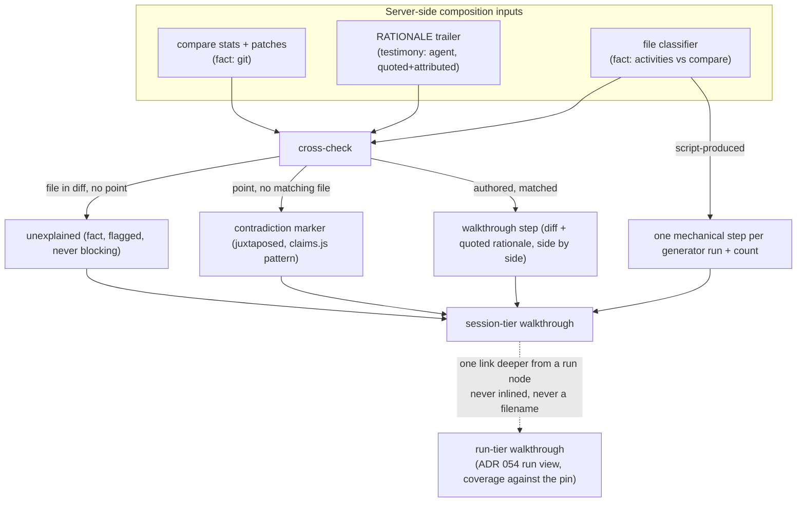

# ADR 056: Agent-Authored Walkthroughs: the Diff is Fact, the Points are Testimony

**Author:** jomcgi
**Status:** Draft
**Created:** 2026-08-13
**Extends:** [054 - The Run View: Pinned Plans, Epistemic Registers, and
Recorded-Not-Inferred Data](054-run-view-pinned-plans-epistemic-registers.md)
(Draft, the three-register vocabulary and run-tier surface this composes
with); 038 - Autonomous Work Queue, Tiered Gating
(Accepted, decision 1: a session's own account of itself is a claim, and
routing keys off artifacts instead, the constraint this whole design is
built to honour)
**Relates to:** issue #4600 (data prerequisites for a diff walkthrough,
re-scoped mid-issue), #4614 (walkthrough composition rule, closed by this
ADR), #4625 (the run-view design document and its tracking issue, program
status: built)

---

## Problem

The private agents console shows sessions and, as of ADR 054, runs. Neither
shows what a session actually did to the working tree, or why. Issue #4600
opened this as a data problem: revive `AgentTurn.commit_sha`, add a base SHA
recorded at hydration, and reconstruct a per-file walkthrough by joining
turns to a compare. Building that mockup surfaced the real defect before any
of the plumbing did: a caption invented after the fact for each file reads
as sourced when it is inferred, which is worse than no caption at all. #4600
records this exactly: "An earlier revision of the mockup made exactly that
mistake."

The fix was a reframe, not a fix to the reconstruction: the walkthrough
should not be reconstructed from a commit range at all. It should be
**agent-authored**, the same pattern this repo already trusts for the
review verdict (`reviewer_prompt` asks for `VERDICT: APPROVE |
REQUEST_CHANGES | BLOCKED`, `parse_review_verdict` parses it fail-closed).
That reframe deletes two of #4600's four prerequisites (`commit_sha`
revival, base-SHA-at-hydration) but does not by itself make an agent's own
account of its work safe to display, because ADR 038 decision 1 already
settled that a session's own account of itself is a claim. A console that
prints an agent's self-description in the same voice as its diff teaches
the reader to trust both equally, until the one time the agent is wrong,
incomplete, or self-flattering about what it did.

A second problem sits directly on top of the first. Issue #4614 asked what
a file-ordered walkthrough does past roughly a dozen files, and the honest
answer at the time was "not much": a 180-file listing is not legible at any
grouping. The run-tier design in #4625 changed the premise before this
issue could be answered on its own terms: once a walkthrough is organised
by intent instead of by file, most of the scale problem is a symptom of
the wrong grain, not a size limit to work around.

This ADR decides both together, because they are one design: how an
agent's own narrative earns a place next to the diff without becoming
indistinguishable from it, and what a walkthrough is built from at each of
the console's two grains (session, run) once that narrative exists.

---

## Decision

### 1. The narrative is agent-authored typed output, never reconstructed

The orchestrator asks for the walkthrough in the implementer spec, in
exactly the shape `reviewer_prompt` already asks for a verdict:
`implementer_prompt` (`projects/monolith/swarm/policy.py`) appends a
plain-text trailer instruction, and a fail-closed parser sits next to
`parse_review_verdict` in the same module, tolerating the same decoration
(bold, bullets, a closing code fence) the existing comment there already
names as the reason a bare-line match "turns fail-closed into
fail-always."

Rejected: reconstructing rationale from a commit range (#4600's original
framing, and again in an earlier mockup revision). A diff proves what
changed; it cannot prove why, and inventing a per-file "why" from the diff
alone produces a caption that reads as sourced when it is guessed. An
honest walkthrough with no captions is a better artifact than a confident
one with fabricated ones.

### 2. The diff is the artifact; the points are a claim

Straight from ADR 038 decision 1. The diff comes from git and is what
actually changed: register fact. The agent's points are its own
commentary on why: register testimony (ADR 054 decision 1's third
register). The two are never merged into one voice. A rendered step shows
its diff (or a link to one) and, beside it, the agent's own words quoted
and attributed to the turn and attempt that produced them; nowhere does
the interface restate a point as if the system itself were asserting it.

### 3. The diff and the points are cross-checked, and the cross-check is what makes this safe to show

A changed file that no point mentions is not silently included as if
explained; it surfaces labelled "unexplained," stated in the system's own
voice as a fact about absence, not as a judgment about the agent. A point
naming a file that is absent from the diff renders with the same
contradiction treatment `claims.js` already gives a run's terminal-state
claim when live activity is observed after it
(`projects/monolith/frontend/src/routes/private/agents/claims.js`):
juxtaposed, never merged, and never silently dropped in either direction.
This cross-check is the actual safety property. Without it, agent
testimony next to a diff is a narrator the reader has no way to catch;
with it, every claim is checked against something the agent does not
control.

### 4. An unexplained file flags, it never blocks the reviewer verdict

This was #4600's stated open question ("Should an unexplained file block
the reviewer's verdict, or only be flagged?"), now decided: flag only.
Two reasons, both already binding elsewhere in this repo's agent design.
First, blocking hands an agent a way to stall itself on a chart bump it
correctly ignored, or on any mechanical file the classifier (decision 5)
correctly does not expect a point about; a gate that an agent can trip by
doing the *right* thing is a bad gate. Second, and more fundamentally,
making an unexplained file block the verdict makes the agent's own
testimony load-bearing for routing: whether a point exists becomes a
control-flow input, exactly what ADR 053 decision 1 forbids ("treat an
agent's claims as evidence"). The tempting alternative, blocking, was
rejected because it buys a small nudge toward complete narratives at the
cost of exactly the coupling this repo's agent architecture has
repeatedly designed against.

### 5. The session-tier composition rule

Grain is the turn; per-attempt for swarm nodes, since `read_branch_head`
runs before and after every attempt (`swarm/workflows.py`) and both are
recorded step outputs, giving each attempt a well-defined prior/head pair.
Steps are composed server-side from three inputs, each held in its own
register:

- the compare's file stats (fact, from git),
- the agent's trailer areas, in the agent's own order (testimony), and
- a mechanical classifier (fact): a file present in the compare that no
  edit or write activity touched was produced by a script, not authored.

Authored files become steps, grouped under the trailer's named areas when
one parsed, otherwise in within-turn activity order (`usage_json.activities`
already carries `file_path` on edit and write; this is #4600's existing
rule, unchanged). Mechanical files collapse to **one** step per generator
`run` activity, carrying a count ("`ci regen` produced 143 files"), never
one step per file. Truncation is rendered, not hidden: GitHub's files-array
cap (around 300) and the activities ingest cap (300,
`progress_ingest.py:20`) both render as a labelled fact about the fetch
("300+, truncated upstream"), never as silent under-reporting.

### 6. A five-rung degradation ladder, each rung labelled as what it is

1. SHAs recorded and trailer parsed: full walkthrough.
2. Branch still exists, no SHAs: full walkthrough, labelled ephemeral,
   because it stops being resolvable once the branch merges and is
   deleted (this repo deletes branches on merge and allows rebase merges
   only, so a `compare` by name has a shelf life).
3. No compare, trailer parsed: quoted testimony plus the activities list,
   no diff panes.
4. No compare, no trailer, above roughly a dozen authored files: stats
   plus the activities list, labelled "files touched by tools this turn,"
   and **no walk is offered.**
5. Nothing at all: the section says so and stops.

Rung 4 is a requirement, not a shortfall to apologise for. #4614's own
framing states it plainly: "declining to offer one is the answer." Walking
an unstructured 180-file diff with no intent structure to hang it on would
not be more honest than declining; it would be a worse UI wearing an
honest label.

### 7. The run tier is coverage against the pinned plan, at plan-node grain, and it is the run view completed, not a new surface

Each node stamps delivered, deviated, or undelivered, computed from the
pinned plan (ADR 054 decision 2) against recorded outcome: fact. Mechanical
deviations render by type, fact register, from #4625's taxonomy (budget,
shape, path, identity, freshness deviations); testimony never enters the
`deviations[]` array (ADR 054 decision 4 already commits to this). The
engine's gate decisions render as log lines, fact register. Spend and
attempts render against the pin, fact register. Agent rationale renders
per node, quoted and attributed, same testimony grammar as the session
tier.

Everything file-shaped lives exactly one link deeper: a node opens its
session, whose walkthrough (decisions 1 through 6) owns the files. **The
falsifiable test from #4614 is preserved verbatim as a decision: if a
filename is visible in the run-tier walkthrough, the composition rule has
been violated.** This is deliberately made a composer unit test, not a
review habit, because a review habit erodes the first time someone is in
a hurry and a unit test does not.

Rejected: a separate run-walkthrough pane, prose-summarising what the run
did. It would restate the run view (already built by ADR 054, see the
Data reality note in #4625: the sharpest gap in that design was never
missing UI, it was missing recorded data) in a second voice, and it forks
polling, staleness tiering, theme, and the mobile drill exactly the way
ADR 054 decision 5 already rejected a separate `/agents/runs` route for
the same reason. A walkthrough that is a re-narration of data the run view
already renders as fact is not a new capability; it is a second, less
trustworthy copy of the first.

### 8. The compare is proxied through the monolith

The repo is private, so a GitHub token cannot go client-side; the console
proxies `compare/{base}...{head}` (or `compare/main...branch` where SHAs
are unavailable, rung 2) server-side. Stats are the primary payload;
per-step patches are fetched lazily, and only for authored steps. The
mechanical group gets a count and a label, never a patch. This matches
what #4600 already specified and what #4625's endpoint work already
serves stats-first for the run tier: a 200-file compare is megabytes, and
the console's polling habits plus GitHub's rate limits do not mix with
fetching it eagerly.

### 9. Trailer capture is unbackfillable, which sets its own urgency

Swarm sessions get typed output because an orchestrator wrote the spec
(`implementer_prompt`). Console- and MCP-started sessions can get it too,
through the existing `AgentSession.system_prompt` seam
(`projects/monolith/agent_sessions/models.py:56`), which already exists
precisely to append a caller instruction; adding the trailer request there
is a prompt-only change with no schema. A session started outside both
degrades to the diff alone (rung 3 or 4 above).

This is worth stating without softening: every week that capture is not
prompted for is a permanent population of walkthrough-poor sessions, not
a temporary gap that later tooling closes. `AgentTurn.commit_sha`
(`projects/monolith/agent_sessions/models.py:90`) is the precedent for
exactly this mistake in this codebase: declared, indexed, serialized by
the router, and both call sites that create a turn
(`projects/monolith/agent_sessions/store.py:521` and `:568`) pass `None`
positionally. It has never held a value, and nothing backfills a value a
system never recorded. A capture seam that ships later than the surface
that depends on it repeats that history for rationale instead of a SHA.

### 10. `AgentTurn.commit_sha` is revived, not replaced

The executor writes the observed branch head at turn end for repo
sessions, into the existing column, index, and router serialization,
rather than dropping it for a differently-named `head_sha`. Dropping and
re-adding buys nothing but a rename; the column, its index, and its
serialization already exist and only need a writer.

This lands off the v1 critical path, not on it: decision 1 removed the
reconstruction that needed a base SHA and a head SHA together, and the
per-attempt `prior_head`/`observed_head` pair the run tier already records
(ADR 054, #4625 contract deltas) covers most of what a swarm node needs.
`commit_sha` plus a future `base_sha` remain required only for durable
compares of sessions whose branch was merged away or rebase-rewritten,
which this repo makes the common case rather than the exception (branches
are deleted on merge, rebase merges only), so a session-tier walkthrough
for a session whose branch is long gone is exactly the case this pairing
exists to serve. It is real, recorded work; it is simply not gating
anything decided in this ADR.

---

## Architecture

| Aspect | Before this ADR | Decided |
| --- | --- | --- |
| Walkthrough source | none; #4600 proposed reconstructing from a compare | agent-authored trailer, parsed fail-closed, next to `parse_review_verdict` |
| Diff vs. rationale | not distinguished (undesigned) | diff is fact, rationale is testimony, never merged into one voice |
| Unexplained files | undesigned | cross-checked against the diff; flagged, system voice, never blocking |
| File-count scaling (#4614) | file-ordered list, unusable past ~12 files | intent-grain steps with mechanical collapse; files disappear from the run tier entirely |
| Degradation | none; a walkthrough either exists or the feature does not ship | five labelled rungs, rung 4 explicitly declines to walk rather than showing a bad one |
| Run tier | ADR 054's run view, no walkthrough | coverage against the pinned plan; the run view completed, not a new pane |
| `AgentTurn.commit_sha` | dead column, both writers pass `None` | revived: written at turn end for repo sessions |

---

## Alternatives Considered

- **Reconstruct rationale from a commit range** (#4600's original
  framing). Rejected: no per-file rationale exists in the data model, and
  inventing one produces a caption that reads as sourced when it is
  inferred, which is worse than an honest summary. Rejected twice: in
  #4600's own revision history, and again here.
- **Block the reviewer verdict on an unexplained file.** Rejected
  (decision 4): couples routing to whether an agent chose to comment on a
  file, which ADR 053 decision 1 forbids, and gives an agent a way to
  stall a correct outcome (a mechanical file it rightly said nothing
  about) by inaction.
- **A separate run-walkthrough pane summarising the run in prose.**
  Rejected (decision 7): restates data the run view already renders as
  fact, in a weaker, second voice, and forks polling, staleness, theme,
  and mobile handling the same way ADR 054 decision 5 already rejected a
  separate runs route.
- **Render agent testimony as system prose once corroborated by the
  diff.** Considered and rejected: corroboration confirms the file was
  touched, not that the stated reason is true. Collapsing testimony into
  system voice the moment it happens to check out teaches the reader that
  checked-out testimony is fact, which is precisely the blur ADR 054's
  register rule exists to prevent.
- **File-ordered walkthrough at any scale (#4614's original framing).**
  Superseded by organising at intent grain with mechanical collapse
  (decision 5): the file-count problem was a symptom of the wrong grain,
  not a size limit that needed a separate scaling design.

---

## Security

Baseline `docs/security.md`. No new credential or trust boundary: the
compare proxy (decision 8) reuses the same private-tier GitHub reachability
`projects/monolith` already has for other private-console features, and the
trailer capture (decision 9) is a prompt-text change to an existing agent
role, not a new write path. The one property worth stating for a reviewer:
agent testimony is rendered, never executed or interpreted as instruction
by the server. The trailer is parsed fail-closed for structure only
(`parse_status`, tail-window matching, decoration stripped), the same
posture `parse_review_verdict` already holds, so a hostile or malformed
trailer degrades to "no recorded rationale," never to a parse that guesses
or to content that reaches a code path.

---

## Risks

| Risk | Likelihood | Impact | Mitigation |
| --- | --- | --- | --- |
| An agent's trailer decorates or truncates in a shape the parser has not seen, silently dropping testimony | Medium | Low | Fail-closed by design (decision 1): a parse miss renders "no recorded rationale," the rung-3/4 floor, never a guess |
| The cross-check (decision 3) becomes a second thing every consumer has to hand-implement correctly, drifting per surface | Low | Medium | Server-owns-epistemics (ADR 054 decision 1) applies here too: the composer computes `unexplained`/`contradiction` once, server-side; clients render, never recompute |
| Rung 4's "no walk offered" reads as a missing feature rather than a deliberate floor, and gets quietly special-cased away under UI pressure | Medium | Medium | #4614 states the rationale explicitly enough to cite in review; the composer unit test (decision 7) makes the run-tier half of this enforceable, not just documented |
| Trailer capture ships later than the surfaces that read it, reproducing the `commit_sha` dead-column history for rationale specifically | Medium | Medium | Decision 9 states the cost plainly; the seam (`system_prompt`) is cheap enough that "not yet captured" should be a short window, not a permanent one |

---

## Open Questions

1. Whether `base_sha` (decision 10's remaining half) is recorded by the
   same turn-end write as the revived `commit_sha`, or by a separate
   hydration-time write as #4600 originally proposed. Both close the same
   gap; which is cheaper to land correctly is implementation, not decided
   here.
2. Whether the classifier in decision 5 (a compare file untouched by any
   edit/write activity is mechanical) needs a manual override for the rare
   case of a hand-edited generated file, or whether that case is rare
   enough to accept as a mislabel until proven otherwise.

---

## References

| Resource | Relevance |
| --- | --- |
| [Issue #4600](https://github.com/jomcgi/homelab/issues/4600) | Original data-prerequisites framing; its own re-scope comment is decisions 1 through 4 here |
| [Issue #4614](https://github.com/jomcgi/homelab/issues/4614) | The composition-rule question this ADR closes; source of the falsifiable run-tier test in decision 7 |
| [Issue #4625](https://github.com/jomcgi/homelab/issues/4625) | The run-view design document (walkthrough sections 12.1-12.8) and its tracking issue; program status records the walkthrough tiers as deliberately deferred pending this ADR |
| [ADR 054](054-run-view-pinned-plans-epistemic-registers.md) | The three-register vocabulary (fact / belief / testimony) and the run view this ADR's run tier completes rather than duplicates |
| [ADR 053](053-swarm-orchestration-bounded-conductor.md) | Decision 1: the conductor must never treat an agent's claims as evidence, the constraint behind decision 4 |
| ADR 038 | Decision 1: a session's own account of itself is a claim; routing keys off artifacts |
| `projects/monolith/swarm/policy.py` | `implementer_prompt`, `reviewer_prompt`, `parse_review_verdict`; the existing typed-output pattern this ADR extends |
| `projects/monolith/agent_sessions/models.py:56,90` | `AgentSession.system_prompt` (the capture seam for non-swarm sessions) and `AgentTurn.commit_sha` (the dead column revived by decision 10) |
| `projects/monolith/agent_sessions/store.py:521,568` | Both call sites that create a turn passing `commit_sha=None`, the precedent decision 9 and 10 draw on |
| `projects/monolith/frontend/src/routes/private/agents/claims.js` | The juxtapose-never-merge pattern decision 3 reuses for the diff/testimony cross-check |
| `docs/security.md` | Security baseline |
