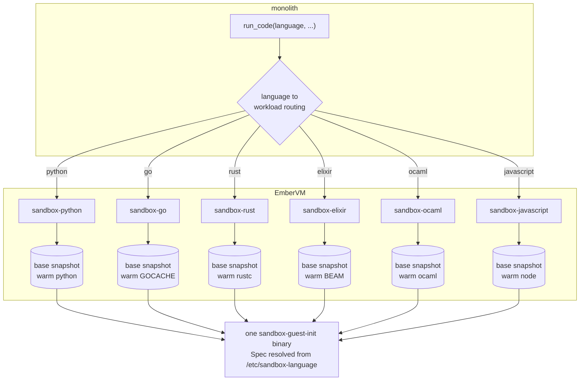

# ADR 057: Per-Language Sandbox Guests and the Retirement of Sessioned Execution

**Author:** jomcgi
**Status:** Draft
**Created:** 2026-08-15
**Supersedes in part:** [044 - Code Executor Sandbox Workload and Self-Describing Guest Runtimes](044-code-executor-sandbox.md) (decision 2, the concrete `run_python` tool name, is reversed here; decisions 1, 3, and 4 stand unchanged)
**Retires:** the sessioned `run_python` path introduced by [embervm/001 - EmberVM: BEAM + Firecracker Workload Orchestrator](../embervm/001-embervm-beam-firecracker-workload-orchestrator.md) R2, whose named first consumer this was
**Builds on:** [022 - Firecracker Snapshot/Restore Controller](022-firecracker-snapshot-restore-controller.md) (the warm-base restore every language guest rides)
**Issue:** #4981

---

## Problem

The code executor runs exactly one language. An agent asked something a compiler
would settle (does this Rust borrow check, what does this Go program print, is
this OCaml pattern match exhaustive) has two options, and both are bad: answer
from weights, or translate the question into Python first and answer a different
question. The tier that ADR 044 built to stop models estimating arithmetic does
not exist for any language except Python.

Meanwhile the sessioned variant added by EmberVM R2 has not earned its cost. It
holds a 2 GiB session-class workload, a persistent-kernel code path in the guest
(a length-prefixed frame protocol over a long-lived `python3` child, plus its
generation accounting and reset semantics), a Postgres table mapping caller
handles to capability tokens, and a `session=` parameter on two separate tools.
What it buys is a warm namespace across turns, whose value is undercut by its own
contract: state is best-effort, and every caller must already handle
`session_reset` by re-running its setup. A feature whose happy path must be
re-derivable on demand is a feature whose happy path is optional.

## Decision

**1. Six sibling guest images, one language each, not one polyglot image.**
`projects/firecracker/sandbox/{python,go,rust,elixir,ocaml,javascript}`, each
with its own apko config, its own lock, its own Bazel-pinned digest, its own
Workload CR, and its own base rootfs. The alternative (one image carrying every
toolchain) is cheaper in brick slots and scratch disk, and was rejected: it
couples the Python hot path, by far the most used, to five toolchains it does not
need, so a Rust package regression would take Python down with it. Six failure
domains at the cost of six bakes is the right trade when five of them are cold.

**2. One `guest-init` binary, table-driven, language selected at boot.** All six
images run the same Go binary. It reads `/etc/sandbox-language`, a one-line file
baked per image, and resolves a `Spec` carrying the source filename, the optional
compile argv, the run argv, the language-specific environment, the warm-up argv,
and the paths to exclude from collected output. Resolved once at startup, never
per request.

The guest therefore has **no** language field on the wire. The request shape
stays `{code, files?, timeout_seconds?}` exactly as ADR 044 froze it. A caller
selects a language by choosing which workload to POST to, which means language
selection is a routing decision in the monolith and an isolation boundary in
EmberVM, rather than a branch inside untrusted-code-adjacent guest logic.

**3. `run_python` becomes `run_code(language, code, files)`, reversing ADR 044
decision 2.** That decision gave two reasons for a concrete name. The first,
that models are RL-trained on concretely-named tools, is real but weaker than it
was: a required enum on a single tool is now as well-handled as a tool name, and
six near-identical tool registrations would crowd the catalogue for callers who
only ever want one.

The second reason is the one that mattered, and it is the one being knowingly
given up: `projects/mcp/ARCHITECTURE.md` records that the Context Forge ACL is
tool-granular, so it can decide whether you may call a tool but never how you may
call it. Under one `run_code`, a caller entitled to Python is entitled to all six
languages.

We accept that, because the six languages are **peers inside one security
posture**: same zero-egress microVM, same uid 65532, same wall clock, same output
caps, same absence of secrets and repo. "May run Python but not Go" is not a
boundary anyone would draw. ADR 044's argument was really about a hypothetical
`run_shell`, which is a genuinely different capability, and that argument
survives intact: a `run_shell` would be its own tool with its own ACL entry, not
a seventh value of this enum. The rule this ADR sets is that the enum may only
carry values sharing one posture, and a value that would widen the posture is a
new tool instead.

**4. Retire sessioned execution: `sandbox-session`, the guest kernel, and the
handle table all go.** Deleted: the `sandbox-session` Workload, `kernel.go` and
its tests, the `Mode` and `SessionReset` wire fields, `sandbox.session` in
Postgres (with a drop migration), the monolith's session client half, and the
`session=` parameter on both the MCP tool and the Discord concierge tool.

The EmberVM **session class itself stays**: `claude-runtime` uses it, and nothing
here touches `SessionAssign`, idle banking, or relight. This retires one
consumer, not the substrate.

**5. `floor: 0` on every sandbox workload, including Python.** Verified against
`dispatcher.ex`: `pick_node/3` prefers a warm brick but falls through to a MISS
tier that places a brand-new VM from the base snapshot, so a floor of zero serves
correctly and simply pays a restore on first use. Python gives up two parked VMs
and hands the bricks their RAM back; the five cold languages never hold RAM they
are not using. This is the snapshot design being used as intended rather than
worked around with standing pools.

**6. Warm-up is per language, and it is what the base snapshot captures.** Each
`Spec` carries a warm-up argv run once at boot before `/shim/ready` first returns
200, which is the instant `BuildBase` snapshots. What "warm" means differs by
language and the table is where that difference is written down: Python
pre-imports its scientific stack and renders a throwaway figure, Go builds a
program covering the common stdlib into a tmpfs `GOCACHE`, Rust compiles a hello
world to page in rustc and libLLVM, Elixir boots the BEAM, OCaml runs a bytecode
script, JavaScript starts Node.

Go is the one that changes sizing: its warm cache is *written*, not merely paged
in, and the rootfs is read-only, so `GOCACHE` lives on the `/tmp` tmpfs and is
charged against `memMib` rather than disk.

| Aspect | Before | Decided |
| ------ | ------ | ------- |
| Languages | Python | Python, Go, Rust, Elixir, OCaml, JavaScript |
| Guest images | 1, shared by 2 workloads | 6, one per language |
| Tool surface | `run_python(code, files, session)` | `run_code(language, code, files)` |
| Language on the wire | n/a | none; the workload URL is the selector |
| Sessioned execution | `sandbox-session`, guest kernel, Postgres handles | removed |
| Pool floor | 2 (python), 1 (session) | 0 everywhere |
| Warm-up | hardcoded Python imports | per-language argv in the Spec table |

## Architecture

## Alternatives Considered

**One polyglot image with a `language` request field.** One rootfs, one base, one
pool: materially cheaper on the master bricks, which hold roughly 21 GB of free
scratch each. Rejected on blast radius, per decision 1. It also puts a branch on
untrusted input inside the guest, where the whole design intent is that the guest
does exactly one thing.

**Keeping `sandbox-session` and adding sessions for the new languages.** A warm
BEAM or a warm Node REPL is a genuinely nicer interactive experience than a
one-shot. Rejected: it multiplies the retired machinery by six, and the observed
value of the Python session never justified it once.

**Per-language `run_go` / `run_rust` tools, preserving ADR 044 decision 2
exactly.** Keeps ACL granularity. Rejected: six registrations of one tool differing
only in an argument is catalogue noise for every caller, and the granularity buys
nothing when all six share one posture (decision 3).

**Deno or Bun for JavaScript.** Both are single Wolfi packages and Deno has a
permissions model that would be defence in depth. Rejected for Node because the
repo already tracks nodejs (`projects/monolith/frontend` pins `nodejs-22`), so it
is a runtime the tree already maintains, and the microVM is already the boundary
Deno's permissions would duplicate.

## Security

The posture is unchanged and is still an absence list: no egress, no secrets, no
repo, no session state, execution as uid 65532 under a hard wall clock with
capped output. Each new language inherits it by construction, because it inherits
the same guest-init, the same shim, and the same Workload class.

Two notes specific to the new languages:

- **Compilers are the new attack surface.** Go, Rust, and OCaml now run a
  compiler on caller-supplied source. A compiler is a far larger program than an
  interpreter loop, but it runs inside the same microVM with the same absence
  list, so the boundary that contains a malicious snippet is exactly the boundary
  that contains a malicious input to rustc.
- **Offline is enforced, not assumed.** Go is pinned with `GOTOOLCHAIN=local` and
  `GOPROXY=off`. Without them a snippet with an import the guest lacks does not
  fail fast: `go` tries to fetch, blocks on a network that is not there, and
  spends the caller's entire wall-clock budget before reporting a network error
  instead of the actual compile error.

## Risks

- **The first brick roll is slow.** `initContainers` run serially, so every brick
  pod gains five rootfs bakes ahead of `noded` starting, roughly 4 to 5 minutes
  each on a cold digest cache, and bricks roll one at a time. Expect a long roll
  with a capacity dip. Renaming `guest` to `python` is not part of that cost: the
  bake is keyed on image content digest, so a repository path change with
  identical layers hardlinks instantly.
- **Python loses its warm pool.** Decision 5 trades two parked VMs for a restore
  on first invoke, on the path the Discord concierge uses most. The mitigation if
  it bites is a one-line floor bump, not a redesign.
- **Compilation shares the wall clock.** For Go and Rust the 25s guest budget now
  covers compiling as well as running, which is why both carry a longer
  `timeoutSeconds`. A large snippet can still exhaust it at the compile step and
  return a timeout rather than a compile error.
- **Six locks to maintain.** Renovate's apko lock maintenance now has six more
  configs to move, and a Wolfi toolchain bump re-bakes that language's rootfs.

## Open Questions

- Does `ELIXIR_ERL_OPTIONS=-noinput` interact badly with any snippet worth
  supporting? It is set to stop the BEAM waiting on a stdin that will never
  arrive; verify against a real invoke before assuming it is free.
- Should OCaml grow `ocaml-dune` and native compilation via `ocamlopt`? Bytecode
  script mode was chosen for start-up speed and a smaller image, which is right
  for a snippet and wrong for anything numeric where native code is the point.
- Is `cap: 4` correct for the cold languages, or should they share one lower
  fleet-wide ceiling? Four each was picked as a bound, not measured.

## References

- Issue #4981 (this work)
- ADR 044 (the sandbox this extends and whose decision 2 it reverses)
- ADR embervm/001 R2 (the sessioned path this retires)
- `projects/mcp/ARCHITECTURE.md` (tool-granular ACL, the cost accepted in decision 3)
