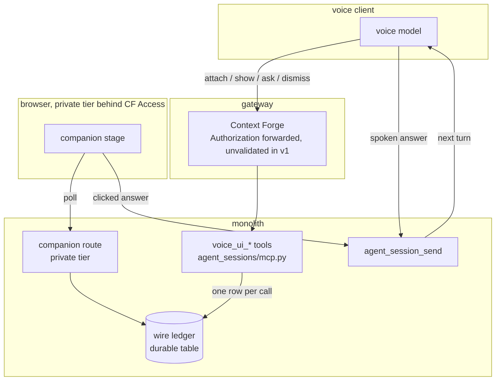

# ADR 058: The Voice Companion: a Ledger-First Screen the Conversation Drives, Never Load-Bearing

**Author:** jomcgi
**Status:** Accepted
**Created:** 2026-08-15
**Relates to:** [054 - The Run View: Pinned Plans, Epistemic Registers, and
Recorded-Not-Inferred Data](054-run-view-pinned-plans-epistemic-registers.md)
(Draft, the run surface the companion remounts); [056 - Agent-Authored
Walkthroughs](056-agent-authored-walkthroughs.md) (Draft, the walkthrough
surface, and the source of this ADR's rule against inferred surfaces);
[049 - Turn-Granular, Poll-Shaped Agent Session
UI](049-turn-granular-poll-shaped-agent-ui.md) (Accepted, the console's poll
shape, whose conclusion this ADR reuses and whose reasoning it explicitly does
not); issue #4977 (the design handoff this ADR closes the decisions for),
#4955 (the auth domain and token verification decision 5 builds on), PR #4966
(the `ARCHITECTURE.md` correction that supplied decision 5's real premises),
#4569 and #4940 (result scoping and the auth domain programme),
#3842 (verdict is data, the scope guard)

---

## Problem

A voice session drives agent sessions through the MCP tools in
`projects/monolith/agent_sessions/mcp.py` and gets back one thing it can
speak: the `<voice>` summary each turn emits, extracted by `_VOICE_RE` in
`agent_sessions/voice.py` and returned by `agent_session_status`. Everything
else the console knows how to show, the staged run DAG of ADR 054, the
agent-authored walkthrough of ADR 056, the decision gates, exists only for
someone sitting at `/private/agents` with a mouse.

The obvious fix, open the console alongside the voice session, fails for a
reason worth naming. The console is a **browsing** surface: it is organised
for someone hunting through sessions, deciding what to look at. A voice
conversation does not browse, and it moves faster than hunting. By the time a
listener has navigated to the run whose gate is being described, the
conversation is two beats further on. The material is not missing. The
pointing is.

So the feature is a screen the conversation drives: the voice model holds the
remote, conjures surfaces onto a stage keyed to what is being talked about
right now, and the stage holds only what is currently relevant. Issue #4977
carries the full contract and the mockup that established it.

That framing brings one hard constraint with it, and every decision below is
downstream of it. **The screen must never be load-bearing.** A voice
conversation has to work in a car, on a walk, with the companion closed or
never opened. So every `voice_ui_*` call accepts and returns with no companion
open, and nothing in the voice loop may block on, branch on, or fail because
of the state of a screen. A companion that can break a conversation is worse
than no companion, because it converts an optional convenience into a
dependency the user did not ask for.

---

## Decision

Four tools alongside the `agent_session_*` family, all accept-and-return, all
no-ops with no companion open: `voice_ui_attach`, `voice_ui_show`,
`voice_ui_ask`, `voice_ui_dismiss`. Issue #4977 carries their shapes. This ADR
records the five decisions that were open, and why each went the way it did.

| Aspect | Today | Decided |
| ------ | ----- | ------- |
| Companion transport | none | durable ledger table, polled |
| Wire ledger | none | persisted per session, auditable |
| Binding to a session | none | `attach` binds, or mints and returns the id |
| Two companions | n/a | latest explicit attach wins |
| Voice authorization | n/a | reads and attached-session sends free, all else asks |
| Caller identity on MCP | verified, no consumers | recorded in the ledger, gating on nothing |

### 1. The wire ledger is a durable table, and polling it is the transport

Every `voice_ui_*` call writes one row before anything reaches a screen. That
row is the source; the surface is its view. The companion polls the ledger.

Three reasons, in order of weight.

The first is that it makes the design's core invariant checkable. The
principle is that **no surface may appear without a ledger row**, so that the
screen can always be explained ("that card is there because the model called
`show(walkthrough, run-84)`"). With an in-process ledger that invariant is a
code-review convention. With a durable one it is a SQL query, and a surface
that can appear without a row becomes a test, not a discipline.

The second is a live tripwire under the alternative. An in-process ledger with
an SSE fanout works today only because the monolith runs one replica
(`projects/monolith/chart/values.yaml:8`). The chart already carries a
disabled `backend.autoscaling` block (`values.yaml:26`), and
`chart/templates/deployment.yaml:8` omits `spec.replicas` when it is enabled.
The day autoscaling flips on, a `voice_ui_show` landing on replica B while the
browser holds its stream on replica A drops the surface silently: no error, no
log, just a screen that intermittently does not update. `mcp.py:63` already
reasons in per-replica terms for the `_ui_originated` map, so the codebase
knows this constraint exists. A durable ledger is indifferent to which replica
served the call.

The third is that persistence and transport are the same decision here, so
choosing them separately is how a design ends up with the worst pair. A
durable ledger gets the audit trail for free, because the thing that was going
to be polled is the thing that was going to be stored.

**ADR 049's shape is reused; its reasoning is not.** 049 concluded poll because
the session pipeline is buffered at four hops (the shim accumulates the whole
`stream-json` event list before closing the turn out, `node.proto` carries the
turn body as a unary `bytes body`, the control plane parks the caller on one
`GenServer` call, and the monolith transport awaits the complete HTTP body).
None of that applies here: a `voice_ui_*` event originates inside the monolith
process that serves the companion. This is recorded so a later reader does not
believe the poll shape was inherited from an argument that was never tested
against this case. It was chosen on the three reasons above, and a push
transport is a legitimate later change if poll latency is ever felt.

Worth stating precisely, because it is the thing most likely to be
misremembered as a reason to redo this: a Postgres `LISTEN/NOTIFY` push does
work across application replicas, since every pod connects to the same primary
(`monolith-pg-rw`; the app's `DATABASE_URL` comes from the `monolith-pg-app`
secret whose host is the read-write service). It is not an alternative to the
durable table, it is a **superset** of this design. `NOTIFY` is a wakeup hint
and never delivery: notifications are not written to the WAL, so they never
reach a physical standby (`monolith-pg-ro` and `monolith-pg-r` both exist, so
attaching a listener to one is a reachable mistake, and it would receive
nothing forever with no error), and a listener not connected at the instant of
the `NOTIFY` loses it permanently with no replay. So the table remains the
source of truth either way and every reconnect still reconciles by reading it.
Adding push later changes latency and nothing in the contract.

### 2. `voice_ui_attach` mints a session when none is named

`attach({session_id?})`. Given an id, it binds. Given nothing, it returns the
companion's existing binding if it already has one, and mints a new session
only when the companion is unbound. The id it returns is the monolith
`session_id` integer that every other session tool takes, the same field
`agent_session_start` already returns, not the guest-side `cli_session_id`.

Minting rather than requiring a prior `session_start` matches the order
conversations actually happen in. "Put it on the screen" frequently precedes
"and now work on this", and a model forced to invent a first prompt purely to
obtain a session id has been made to do the conversation backwards.

Returning the binding when one exists, rather than always minting, is what
keeps a reconnecting browser tab from spawning sessions. The latest-attach-wins
rule in decision 3 governs **explicit** attaches only; a bare `attach()` is a
request for a session, and requests for a session are idempotent per companion.

### 3. Latest explicit attach wins

The stage is a grabbable wall surface. A second `attach` with an id rebinds it.

This is the only rule that keeps every `voice_ui_*` call accept-and-return.
One-companion-per-session requires a refusal, and a refusal requires an error
shape in the contract, a UI to render it, and a voice line to explain it: three
mechanisms bought to prevent a situation (two tabs open) whose natural
resolution is that the newest one wins. It also puts the single failure path in
the contract on the one call that most wants to be infallible.

### 4. Two authorization tiers, and the two answer channels are peers

Reads, and sends to the attached session, run on voice alone. Everything else
raises `voice_ui_ask` and waits for the answer.

A clicked answer and a spoken answer resolve the same gate through the same
path, the existing `agent_session_send`, with `_mark_ui_originated`
(`mcp.py:71`) distinguishing the clicked case so its turn skips the Discord
notify exactly as the console's own sends already do. Neither channel is
privileged; a card whose buttons did something subtly different from saying the
word would be a second, undocumented contract.

A third click-only tier for high-blast tools was considered and rejected. Its
protection depends on a hand-maintained list of scary tool names, and such a
list is wrong the first time someone adds a tool and does not think of it. A
mechanism that silently stops covering new cases is worse than the uniform rule
it replaced, because reviewers keep crediting it.

### 5. v1 records the principal and gates on nothing

The monolith **does** verify bearer material, as of #4955. `PrincipalMiddleware`
wraps the MCP mount (`framework/core.py:553`), `current_principal()` is a
`ContextVar` any tool can read, and `Principal` (`auth/principal.py:25`) carries
`subject`, `groups`, `email`, `scope`, `kind` and `authority`. An absent or
non-bearer `Authorization` resolves to `anonymous_principal()` with
`Authority.ANONYMOUS` rather than a rejection, which is #4569's "the monolith
cannot require a token" constraint already implemented: Context Forge's
tool-refresh CronJob calls with no user context every 10 minutes, and mandatory
validation would empty the catalogue.

So the mechanism exists. Two facts stop it functioning as an authorization gate
for this feature today, and neither is the one the older documents give.

**No token has been observed arriving on the claude.ai path.** #4966 measured
this rather than assuming it: on a freshly rolled pod with a cold JWKS cache, an
MCP call produced zero monolith-to-authentik flows, and a first verification
would have forced a fetch. The principal on that path is therefore anonymous in
practice, so a gate requiring a real principal would refuse every real call.

**On the SSE transport the Principal is pinned to the stream-opener for the
whole session** (`framework/core.py:547-550`): per-message POST resolution is
discarded, so `current_principal()` inside a tool describes who opened the
stream, not who made this call. For a companion that is arguably the right
grain, since a voice session is one stream, but it is not per-call identity and
must not be documented as though it were.

The decision, therefore, is not "defer the whole thing". **The ledger row
records `subject` and `authority` from `current_principal()` from the first
commit, and nothing gates on them.** Recording costs one field and buys three
things a deferral does not. It makes the anonymity *observable*: the ledger will
plainly read `anonymous`, which is the fact #4966 needed a cold-cache experiment
to establish, and it will equally plainly stop reading `anonymous` on the day
tokens start arriving. It makes `voice_ui_*` the first consumer of the auth
domain, which today has **no** consumers outside `auth/` itself, so the
plumbing gets exercised by real traffic instead of only by its own tests. And
it turns the eventual gate into a comparison against data already being written,
rather than new plumbing added under time pressure.

What controls access meanwhile is unchanged and is real: the companion route
lives on the private tier behind Cloudflare Access, so whoever is looking at the
screen is already an operator entitled to see every session the console lists.
`attach` changes **which** session an already-entitled viewer is shown. It does
not widen what anyone can reach.

The gate goes in when the ledger shows real subjects arriving: `voice_ui_attach`
compares before it binds or mints, and a call carrying no valid principal
**refuses** rather than degrading, because #4569's least-privilege-on-absent-token
rule governs read *results* and a mint is a write. Deliberately not shipped as a
disabled flag: a check that is present but off is the failure this ADR is
avoiding, whereas a recorded field that reads `anonymous` is a measurement.

### Two behaviours that are deliberately not tools

**Auto-surfacing.** Session-lane calls the voice model makes render as
ephemeral tool cards when a companion is open. The ledger row is the source and
the card is its view, so no tool is minted for this: minting one would create a
second way for a card to appear, and the invariant in decision 1 depends on
there being exactly one.

**Lifecycle.** A surface is front while the conversation references it, recedes
after one quiet exchange, and leaves after two; tool cards skip the receded
stop. A user's pin exempts a surface from the model's `show` and `dismiss` and
from decay, because the human's control of their own screen outranks the
model's. Decay is engine behaviour rather than a `dismiss` the model is trusted
to remember, for the same reason the ledger is durable: a rule that depends on
the model being tidy is not a rule.

### The rule against inferred surfaces

ADR 056 settled that a walkthrough caption invented after the fact reads as
sourced when it is inferred, which is worse than no caption. The same holds one
level up. A companion that guessed what to display by watching the session
record would produce a screen nobody could explain, mixing surfaces the model
asked for with surfaces the system decided were probably relevant, in one
visual voice. Every surface here is summoned by a named call and carries a
badge naming it.

---

## Architecture

The `ask` path is the load-bearing detail. `voice_ui_ask` returns accepted
immediately and never blocks the voice turn on a screen. The answer, spoken or
clicked, arrives as the next message on the existing `agent_session_send` path,
so the gate resolves through machinery that already exists and already works
with no companion at all.

Surfaces are read-only remounts of console material
(`frontend/src/routes/private/agents/`, `RunView.svelte`,
`WalkthroughNarrative.svelte`, `agents-theme.css`, `run-lexicon.js`) and
deep-link into `/private/agents` for anything heavier than a glance. The
companion is a pointing device, not a second console.

---

## Alternatives Considered

| Alternative | Rejected because |
| ----------- | ---------------- |
| In-process ledger with SSE fanout | Works only at one replica; breaks silently when `backend.autoscaling` is enabled, and leaves nothing auditable |
| Durable ledger with `LISTEN/NOTIFY`-driven SSE | Deferred rather than rejected, and not a competing design: it is the chosen one plus a latency optimization, since `NOTIFY` is a hint and not delivery (see decision 1). Its cost is a dedicated long-lived connection outside the sync SQLModel engine, plus the SSE lifecycle subtleties `vms/stream` needed a production bug to get right (subscriber counting, cancellation at the innermost await). No connection pooler exists in front of Postgres today, so the option stays open; a pgbouncer in transaction mode would silently remove it |
| Pairing code shown by the companion | Adds a code-reading beat to a flow whose entire premise is not looking at the screen, for a binding the CF Access gate already constrains |
| Block on #4940 / #4569 for identity | Moot: verification already shipped in #4955. What is missing is tokens actually arriving, which no amount of waiting on this feature's side produces |
| Ship the gate behind a disabled flag | A check that is present but off is exactly the declared-but-unwired failure this ADR avoids; a recorded field reading `anonymous` is a measurement instead |
| One companion per session | Buys an error shape, a refusal UI and a voice line to resolve a two-tab situation that resolves itself |
| Three tiers with a click-only high-blast set | Depends on a hand-maintained list of tool names that is wrong the first time someone forgets it |
| Reads only on voice | Turns the ordinary conversational loop into a two-beat confirm, obstructing the exact flow the companion exists to serve |
| Infer surfaces from the session record | ADR 056's lesson one level up: an inferred surface reads as summoned, and the screen stops being explainable |

---

## Security

Baseline in `docs/security.md`. Two deviations and one clarification.

**Stated gap, v1 only.** Caller identity is verified but nothing is gated on
it, so `voice_ui_attach` trusts the session id it is given. This is a deviation
from per-caller scoping, accepted because the compensating control is real: the
companion is served on the private tier behind Cloudflare Access, so the viewer
is already entitled to every session the console lists. Attach selects among
things the viewer may already see. Decision 5 explains why the verified
principal cannot carry the gate yet (anonymous in practice on the claude.ai
path, and pinned to the stream rather than the message) and what makes it
ready.

**`voice_ui_ask` is a confirmation mechanism, not an authorization mechanism.**
It establishes that a human agreed, never that the human was entitled. The
answer arrives as an ordinary session message, so the gate is exactly as strong
as the attached session's own authorization and no stronger. Treating a
returned `ask` as an authorization decision would be a confused deputy: the
model chose the question, and the answer channel cannot re-check what the
question was for.

**Ledger rows are visible strings and must stay that way.** They carry tool
names, refs and focus targets, so they must never echo a credential. The
session row already holds a `progress_token` (`mcp.py:459`, a
`secrets.token_urlsafe(32)`); no ledger row may contain it, and the companion
route must not return it.

New endpoints reading session state sit on the private tier and need matching
authorization there. No new cluster reads are introduced, so the `ClusterRole`
verb gotcha does not apply: `vm` surfaces reuse the existing control-plane
snapshot cache.

---

## Risks

| Risk | Likelihood | Impact | Mitigation |
| ---- | ---------- | ------ | ---------- |
| The stated identity gap outlives v1 and is read as settled | Medium | Medium | The recorded `authority` field is the tell: a ledger still reading `anonymous` is the gap, visible without reading this ADR |
| Poll latency makes surfaces feel laggy against speech | Medium | Low | Ledger-as-source means swapping in `LISTEN/NOTIFY` push is additive, with no contract change |
| The companion becomes load-bearing by accident | Low | High | Degrade-to-voice is a test, not a convention: every `voice_ui_*` call with no companion open accepts and does nothing |
| Ledger table grows without bound | Medium | Low | Rows are small and per session; retention follows the session's own lifecycle |
| A surface appears with no ledger row | Low | Medium | Checkable in SQL rather than by review, by construction of decision 1 |
| Attach-minted sessions accumulate from stray calls | Low | Low | A bare `attach()` returns the existing binding and mints only when unbound |

---

## Open Questions

1. An attach-minted session has no first prompt, so it begins as a zero-turn
   row. Confirm `agent_session_status` and the console list render that state
   sensibly, or queue a no-op first turn instead. Leaning zero-turn: a session
   that exists and has not been spoken to yet is an honest thing to represent.
2. Poll interval, and whether the ledger needs a retention policy independent
   of the session's.
3. Whether a companion opened in a browser (which does carry a real Cloudflare
   Access identity) should record that alongside the MCP-side principal, since
   the two halves of this feature are authenticated by different mechanisms and
   only one of them currently sees a real subject.
4. Whether the ledger is one table keyed by session or partitioned per
   companion binding. Decision 1 does not depend on which.

---

## References

| Resource | Relevance |
| -------- | --------- |
| Issue #4977 | The design handoff: full `voice_ui_*` contract, verified anchors, and the mockup these decisions were taken against |
| Issue #4955 | Added the auth domain, `Principal`, and token verification; the reason decision 5 records rather than defers |
| PR #4966 | Corrects `projects/mcp/ARCHITECTURE.md`, whose stale "inert" claim this ADR initially inherited; carries the measured no-token-observed finding |
| `projects/monolith/auth/` | `principal.py`, `dependencies.py` (`current_principal`), `middleware.py`; no consumers outside this package yet |
| Issue #4569 | Result scoping by group, and the absent-token least-privilege rule |
| Issue #4940 | Auth domain and principal model, the program the above belongs to |
| Issue #3842 | Verdict is data; the scope guard, since attempt-requeue is not part of this work |
| `projects/mcp/ARCHITECTURE.md` | Context Forge gateway, token forwarding, and the configuration traps around it |
| `projects/monolith/agent_sessions/mcp.py` | The session tool family the four new tools join, and `_mark_ui_originated` |
| `projects/monolith/agent_sessions/voice.py` | `_VOICE_RE` and the spoken line the companion's strip renders |
| `projects/monolith/agent_sessions/router.py` | The `vms/stream` SSE precedent and its lifecycle subtleties |
