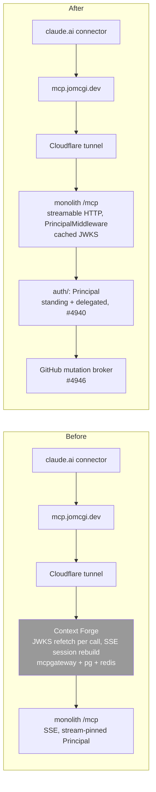

# ADR 059: Authentik Federates MCP Identity; the Monolith Serves MCP Directly

**Author:** jomcgi
**Status:** Draft
**Created:** 2026-08-21
**Supersedes:** [020 - Deprecate Context Forge, Serve MCP Directly from the Monolith](020-deprecate-context-forge-mcp-gateway.md) (Accepted, execution deferred)
**Relates to:** [055 - Tool-Mediated GitHub Access for Agent Principals](055-tool-mediated-github-access.md) (Draft, superseded in part, see Decision 5), [006 - OIDC Auth MCP Gateway](006-oidc-auth-mcp-gateway.md) (Superseded by 011), [034 - Per-Tier Guest MCP ACL](034-per-tier-guest-mcp-acl.md) (Draft, unaffected)

---

## Problem

020 already decided to remove Context Forge and serve MCP from the monolith's own `/mcp` mount, but its reasoning rested on a premise that was true in June and is false now: "auth is at the edge, not in the gateway... Context Forge trusts the Cloudflare-authenticated request and adds no auth of its own." Cloudflare Access is gone from this path (`mcp.jomcgi.dev` now authenticates against authentik directly, per issue #4569's work), and Context Forge runs `MCP_REQUIRE_AUTH=true`, verifying authentik OAuth tokens itself on every call. It is not merely doing auth: it is the only component doing auth, and it does the job badly.

Measured from Context Forge's own `duration_ms` request logs (there are no spans, so distributed tracing reads this path as a false negative): 330 to 780 ms added per MCP call. Three things stack to produce that number. First, the JWKS document is refetched per call rather than cached, and the fetch crosses a Cloudflare hairpin (a round trip through the public edge and back into the cluster it started in) measured at 318 ms, against 44.8 ms for the equivalent in-cluster fetch. Second, the SSE transport rebuilds a session per call rather than reusing one. Third, the plugin chain (auth, ACL, logging) rebuilds alongside it. None of this is a Context Forge design defect worth fixing in place: it is exactly the cost of running a second, independent verifier in front of a first one, on a transport (SSE) that was never built for per-message identity in the first place.

Meanwhile the monolith already has its own verifier. #4955 added `projects/monolith/auth/`: `PrincipalMiddleware` validates RS256 against authentik's JWKS with a genuine TTL cache (`JwksCache`, default `AUTH_JWKS_CACHE_TTL_S`, an ordinary-path TTL and a separate forced-refresh floor for unknown key ids, so a flood of bad `kid`s cannot each force an outbound fetch), and #4940 makes the monolith the standing attenuation point: authentik issues standing identity, the monolith mints delegations, and every resource-owning domain (not `auth/` itself) decides what a `Principal` may do. Two verifiers now sit in series on every call, one of them (Context Forge's) markedly slower and enforcing the coarser of the two policies (tool-granular ACL, never result scoping), and the second one already exists and was purpose-built for this codebase's own delegation model.

055 (Draft) compounds the tension 020 already named rather than resolved: it builds GitHub tool mediation, repo-scoped PATs behind fixed tool URLs, on Context Forge specifically, the component 020 decided to remove. #4946 (the monolith GitHub mutation broker, per-object scope as `#4940`'s first delegation consumer) is the same mediation principle built on the component that is staying.

---

## Decision

**Context Forge is removed as the MCP entry point.** The monolith's `/mcp` mount, made a streamable-HTTP endpoint with a per-message `Principal` rather than SSE's per-stream one, becomes the endpoint directly behind Cloudflare: `claude.ai connector -> mcp.jomcgi.dev -> Cloudflare tunnel -> monolith /mcp`. Delete Context Forge (`mcpgateway`, its Postgres, its Redis), the orphaned `mcp-oauth-proxy` service, and the `mcp` namespace, following the same finalizer-first, cascade-aware discipline used for the agent-platform teardown 020 already references.

**Why 020's argument no longer holds and why its conclusion still does.** 020 reasoned from "the gateway adds no auth of its own" to "removing it changes nothing about auth." That premise is now false: Context Forge verifies tokens itself, badly, on every call. But the conclusion 020 reached, that a gateway with nothing left to federate and no auth value of its own earns its removal, holds for a stronger reason than 020 gave it. The replacement verifier is not hypothetical; it already exists, already validated in production traffic and tests (#4955, 40 auth cases plus `framework_core_test`), and already carries the delegation model (#4940) this codebase is building toward. Removing Context Forge is deleting the component that has the JWKS-refetch, SSE-per-call bug, not patching that bug in place, because no upstream fix exists, no patched image exists, and split-horizon DNS to dodge the Cloudflare hairpin still leaves a second verifier rebuilding a session on every call.

| Aspect | Today (via Context Forge) | Decided (direct) |
| --- | --- | --- |
| Who verifies the caller's token | Context Forge (JWKS refetch per call over the Cloudflare hairpin) and, redundantly, nobody downstream reads the forwarded token for authorization | The monolith's `PrincipalMiddleware` (`AUTH_JWKS_CACHE_TTL_S`-cached JWKS, per #4955) |
| Per-call MCP overhead from the auth path | 330 to 780 ms (`duration_ms` logs; no spans) | one cached JWKS lookup, no session rebuild on streamable HTTP |
| Authorization granularity | tool-granular ACL only (Context Forge decides whether you may call a tool, never what it returns) | attenuation via `Principal` (subject, actor, scope), the seam #4940 and #4569's result scoping both build on |
| Tool names | `monolith-<fn-with-hyphens>` (Context Forge's federation prefix and hyphen mangling) | native FastMCP names, as 020 already specified |
| GitHub mediation (055) | fixed tool URLs behind Context Forge's ACL and a per-group PAT | the monolith's GitHub mutation broker (#4946), per-object scope via delegation, not per-repo scope via a second gateway's ACL |

**What must exist for this to hold**, tracked as issues rather than phases of this ADR:

- **Authentik Dynamic Client Registration**, advertised on the `mcp-friends` provider. Verified live today: the discovery document at `https://auth.jomcgi.dev/application/o/mcp-friends/.well-known/openid-configuration` carries no `registration_endpoint` at all, and `scopes_supported` lists `openid` twice. DCR is core authentik as of the running `2026.8.0-rc7` (`OAuth2DynamicClientRegistration`, no `EnterpriseRequiredMixin` in the path), so turning it on is attaching one blueprint-managed config row to the provider, not a licensing question. Without it, every new connector still needs a hand-pasted client id, the friction 020 already flagged.
- **Role-shaped workload scopes**, #4940's standing-identity leg: agent workloads (BOSUN, the merge-queue reconciler, cron jobs) get authentik service-account identities with role-shaped scopes, not object-shaped ones, so the monolith has something to attenuate from when it mints a delegation.
- **RFC 9728 protected-resource metadata at the monolith**, served at `/.well-known/oauth-protected-resource/mcp`. Nothing in the monolith implements this today (it does not exist in `projects/monolith/auth/` or `core/`); Context Forge's Envoy front door built this via a load-bearing `URLRewrite` plus a `directResponse` filter, specifically to keep the RFC 9728 `resource` field matching the URL the client connected to. `projects/mcp/ARCHITECTURE.md`'s note that scoped routes stay path-transparent for exactly this reason is the same constraint the monolith inherits: whatever serves this document must not rewrite the path the client asked for.
- **Tool renames**, exactly as 020 already specified: `monolith-run-code` becomes `run_code`, and every routine YAML in `projects/monolith/claude_routines/` and the claude.ai connector config move together. This is unchanged by this ADR; it is restated because it is still outstanding work.

Execution: issues #3832 (cut over MCP traffic, closes on an end-to-end routine succeeding through the direct route) and #3833 (decommission Context Forge infrastructure) already exist against 020 and carry this ADR's execution forward unchanged. #4569 (per-caller result scoping and tool-tier machinery) and #4940/#4946 (the auth domain and its GitHub broker) carry the authorization work. None of that checklist lives here.

**Transport.** The SSE-to-streamable-HTTP switch is being done first, as its own PR, independent of whether Context Forge stays or goes: on SSE the `Principal` belongs to the stream that opened it, not the message that arrives inside it (`PrincipalMiddleware`'s own docstring: "the Principal is the stream-opener's and remains pinned for the entire session"), which is a defect on the monolith's own mount regardless of what sits in front of it. Needed either way, sequenced first because it is the smaller, independently testable change.

**055's supersession.** 055 wanted Context Forge as the GitHub mediation point: fixed tool URLs baking in the target repo, gated by Authentik group at the tool-call layer, with a fine-grained PAT behind each group's tools. #4946 puts that same mediation principle, a broker that checks a caller's authority before proxying a GitHub mutation, inside the monolith instead, as #4940's first delegation consumer: per-object scope (`{issue: 4918, verbs: [comment, label]}`) rather than per-repo scope, enforced against a `Principal`'s delegation rather than a group's PAT. This ADR resolves 055's stated tension toward #4946 and marks 055 **Superseded by this ADR**. 055's own alternatives-considered analysis (reject an App-based token minter because the fixed tool surface already bounds capability without one) still applies to #4946's design; nothing in that reasoning depended on which process hosted the tool.

---

## Architecture

---

## Alternatives Considered

- **Keep Context Forge and fix the JWKS caching upstream, or run a patched image.** Rejected: no upstream PR exists for this, and carrying a patched fork of IBM's `mcp-context-forge` indefinitely is a standing maintenance cost this repo does not want, for a component that still has no federation value (one backend) after the fix.
- **Keep Context Forge and put it on split-horizon DNS to remove the Cloudflare hairpin.** Rejected: it removes the 318 ms JWKS-fetch leg but leaves the per-call SSE session rebuild and the redundant second verifier in place, and the monolith still needs its own `PrincipalMiddleware` for anything Context Forge's tool-granular ACL cannot express (result scoping, delegation). Both alternatives keep two verifiers where the codebase now needs one.
- **Leave 055's design on Context Forge until this ADR's execution completes, then migrate it.** Rejected as unnecessary sequencing: #4946 builds the same mediation principle directly against the monolith's own `Principal` model, which exists today, so there is nothing to migrate later.

---

## Security

Baseline `docs/security.md`. This ADR changes which component verifies the caller, not the trust boundary itself.

- **Auth moves from a redundant second verifier to the sole verifier already built for this codebase's delegation model.** Context Forge's tool-granular ACL is replaced by the monolith's own `Principal` (subject, actor, scope), which is a strictly finer-grained primitive: #4940 invariant 1 (delegation only attenuates) and invariant 4 (absent token yields anonymous least-privilege, never a 401) both already hold in the code Context Forge was duplicating in front of.
- **Fail-closed semantics are preserved, not weakened.** #4955's verifier chain 401s on any present-but-invalid token and 503s on infrastructure faults (JWKS unreachable, malformed, unconfigured); removing Context Forge does not touch this, since Context Forge sat in front of, never inside, that logic.
- **DCR must not widen who can register a client beyond what today's manual client-id-pasting implicitly restricts.** Authentik's DCR config object carries `PolicyBindingModel`, so a policy binding, not the config object's mere existence, is what should gate who may self-register; this is an open implementation question (see below), not decided here.
- **RFC 9728 metadata served by the monolith must not rewrite the request path.** Both Envoy's prior implementation and `projects/mcp/ARCHITECTURE.md`'s existing note are explicit that a path rewrite breaks discovery by mismatching the `resource` field against the URL the client actually connected to; whatever replaces Envoy's `directResponse` filter inherits that constraint.

---

## Risks

| Risk | Likelihood | Impact | Mitigation |
| --- | --- | --- | --- |
| The claude.ai connector cannot complete its handshake against the monolith's streamable-HTTP transport, only SSE | Low | High | The transport switch lands first, as its own PR, validated independently of this ADR's execution |
| Routine YAML and connector config break on the tool rename | Medium | Medium | The CF-to-native rename map is deterministic (020's own analysis); apply and validate a routine before deleting Context Forge, per issue #3832's acceptance criterion |
| DCR is turned on without a policy binding, letting an unintended caller self-register a client | Low | Medium | Bind a `PolicyBindingModel` policy to the DCR config object at creation, not after |
| #4946's GitHub broker ships before #4940's delegation minting is wired end to end, leaving it with only standing-identity callers | Medium | Low | #4946 already names the merge-queue reconciler (#4921) as its first standing tenant; delegated callers land when #4940's minting sub-issue does, not blocking this ADR |
| Cutover leaves `mcp.jomcgi.dev` pointing at a missing backend mid-migration | Low | High | Repoint the Cloudflare tunnel and validate a routine against the direct endpoint before deleting Context Forge, exactly as 020 already specified |

---

## Open Questions

1. Whether the monolith serves RFC 9728 protected-resource metadata via a Starlette route added to `core/mcp_app.py` or a lower-level ASGI handler alongside `PrincipalMiddleware`. Not decided here; either satisfies the path-transparency constraint.
2. Whether the DCR policy binding scopes registration to authenticated admins only, or to a broader group; #4940's role-shaped workload scopes may end up being the same policy surface, but that overlap is not resolved here.
3. Whether the `friends-empty` virtual-server test (proving a Claude connector can complete OAuth against authentik with no Zero Trust seat spent) needs a monolith-side equivalent once Context Forge, its host, is gone, or whether the question it answered is now moot.

---

## References

| Resource | Relevance |
| --- | --- |
| [ADR 020 - Deprecate Context Forge, Serve MCP Directly from the Monolith](020-deprecate-context-forge-mcp-gateway.md) | The decision this ADR supersedes; its migration plan and issues #3832/#3833 carry forward unchanged |
| [ADR 055 - Tool-Mediated GitHub Access for Agent Principals](055-tool-mediated-github-access.md) | Superseded in part: its GitHub mediation moves from Context Forge to the monolith's own broker (#4946) |
| `projects/mcp/ARCHITECTURE.md` | Current-state description of Context Forge, the JWKS/hairpin/SSE overhead, and the path-transparency constraint on scoped routes |
| `projects/monolith/auth/jwks.py`, `middleware.py` | The replacement verifier: cached JWKS with a forced-refresh floor, and the stream-pinned-Principal limitation on SSE |
| [Issue #4940](https://github.com/jomcgi/homelab/issues/4940) | The auth domain, Principal model, and delegated workload identity program this ADR relies on |
| [Issue #4946](https://github.com/jomcgi/homelab/issues/4946) | The monolith GitHub mutation broker that resolves 055's tension |
| [Issue #4955](https://github.com/jomcgi/homelab/issues/4955) | Ships `auth/`, `Principal`, and token verification; the reason 020's conclusion now stands on firmer ground |
| [Issue #4569](https://github.com/jomcgi/homelab/issues/4569) | Per-caller result scoping and the tool-tier machinery; the authorization work this ADR does not itself decide |
| [Issues #3832, #3833](https://github.com/jomcgi/homelab/issues/3832) | 020's execution issues, unchanged by this ADR |
| `https://auth.jomcgi.dev/application/o/mcp-friends/.well-known/openid-configuration` | Live-verified: no `registration_endpoint`, duplicate `openid` in `scopes_supported` |
| `docs/security.md` | Security baseline |
