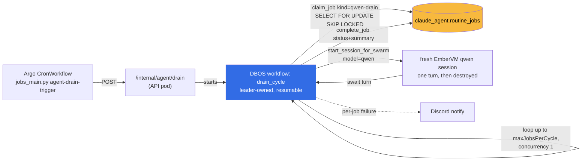

# ADR 061: The Qwen Work-Queue Drainer

**Author:** jomcgi
**Status:** Accepted
**Created:** 2026-08-25
**Builds on:** [038 - Autonomous Work Queue with Capability-Tier Routing and
Reviewer-Verdict Feedback](038-autonomous-work-queue-tiered-gating.md) (named
`claude_agent.work_queue` as the entry point for autonomous dispatch and never
built it); [014 - A Stateless Merge-Queue Reconciler, with Deterministic
Escalation to Sol](../platform/014-stateless-merge-queue-reconciler.md) (the
`jobs_main.py` trigger idiom and the same-tick, exit-clean shape this ADR's
tick borrows); [022 - Firecracker Snapshot/Restore Controller for
AgentWorkflow](022-firecracker-snapshot-restore-controller.md) (the EmberVM
runtime a drained job dispatches into)

---

## Problem

The cluster runs a self-hosted qwen 27B inference lane at zero marginal cost,
reachable from monolith agent sessions through the EmberVM pi-runtime
(`model="qwen"`). Nothing in this stack loops autonomously against it. Cloud
Routines are cron-triggered from claude.ai and their minimum cadence is an
hour; swarm runs are HTTP-triggered one-offs that end when the graph ends;
and ADR 038's `claude_agent.work_queue` table, specified as the entry point
for autonomous dispatch, was never built. There is no mechanism that turns a
standing backlog of small qwen-shaped tasks into continuous progress without
a human or a claude.ai Routine kicking off each one.

A long-lived qwen session is also the wrong unit to build that loop on top
of, independent of whether a queue exists. `maxLifetimeSeconds` caps an
EmberVM session at 21600s (6h) as a version-convergence bound, not a
durability guarantee, so a session that tried to self-schedule forever would
be torn down mid-cycle on every deploy. Qwen's context window is 122880
tokens, which a self-scheduling loop would fill with its own prior turns
long before the task backlog was exhausted, degrading exactly as the backlog
got interesting. And the runtime shares two inference generation lanes with
chat and the `probe_qwen` health synthetic (`ember_public/synthetic_probe.py`),
whose latch feeds the public `/api/health` composite; a session that occupies
a lane indefinitely to poll its own queue is spending shared capacity to sit
idle between tasks. Continuous progress needs an outer loop that owns state
durably outside any one session and hands qwen one fresh session per task.

---

## Decision

The drainer composes three mechanisms this repo already runs, rather than
adding a fourth piece of infrastructure to the agent platform's history of
orchestration reversals (ax, substrate, Temporal).

**1. Tick: an Argo CronWorkflow, not a new trigger.** A `cronWorkflows` entry
runs `jobs_main.py agent-drain-trigger`, POSTing the API pod's
`/internal/agent/drain` endpoint. This is the same idiom `ember-synthetic`
already uses (`chart/values.yaml:785`, `jobs_main.py:40`): the job pod stays
credential-free and only needs HTTP reach, because the work runs inside the
API pod, where the DB connection and EmberVM credentials already live. The
CronWorkflow's own kill switch (`suspend`) is one lever; `concurrencyPolicy:
Forbid` keeps overlapping ticks from racing.

**2. Drive: a leader-owned DBOS workflow, not a loop inside the request.**
The endpoint starts `drain_cycle`, a DBOS workflow, and returns immediately.
DBOS's singleton-by-queue-concurrency pattern (already established for the
platform/014 merge reconciler) makes the workflow leader-owned and
resumable: a pod roll mid-cycle does not orphan a claimed job silently, and
recovery does not require inventing a second bookkeeping mechanism. The
workflow loops up to `maxJobsPerCycle` times, each iteration: claim a job,
run one fresh qwen session against it, await the result, complete the job.
Concurrency is 1. Qwen has exactly two inference generation lanes shared
with chat and `probe_qwen`; a drainer that ran two jobs at once would spend
half the shared serving capacity on background catch-up work at the expense
of both. Serial draining is the whole guarantee: the second lane always
stays free for a live chat turn or a health probe.

**3. Work items: `routine_jobs` rows, not a new table.** ADR 038 assigned
the entry-point role to `claude_agent.work_queue`, specified in the same ADR
and never built. `claude_agent.routine_jobs` already exists, already
implements the claim/complete lease this drainer needs (`SELECT ... FOR
UPDATE SKIP LOCKED`, TTL-bounded locks, in `agent/routine_jobs.py`), and
already has an MCP registration surface
(`monolith_agent_register_routine_job` / `_deregister_routine_job`,
`agent/mcp.py:219,249`) for enqueueing work by hand or from another agent.
Rows carry `routine_kind='qwen-drain'`; the task prompt and any per-job
options ride in the existing `payload` JSONB column, so no migration is
needed to add this consumer. This is one queue mechanism serving two
purposes rather than two queue mechanisms serving one purpose each: the
`work_queue` table ADR 038 asked for is retired as a design, in favor of
reusing what already ships.

That reuse changes `routine_jobs`'s calling convention, and it is worth
naming rather than glossing over. The module's own docstring says these
rows are "only ever read or written by the MCP surface; cloud Routines
claim, run, and complete them." The drainer's `drain_cycle` workflow calls
`claim_job` and `complete_job` directly from in-cluster Python, not through
MCP, because it is the first in-cluster consumer of a table that was built
for an out-of-cluster one. The lease semantics do not care who calls them,
`SELECT FOR UPDATE SKIP LOCKED` is safe under either caller, but a reader of
`routine_jobs.py` should not assume every row's lifecycle runs through MCP
after this ships.

**4. One fresh session per job, destroyed after the turn.** Each queue
iteration starts a session through the existing `start_session_for_swarm`
idempotency-keyed path (`agent_sessions/api.py:103`, already used by swarm's
`implement_then_review`) with `model="qwen"`, waits for the turn, and tears
the session down. This is the direct fix for the wrong-unit problem in the
Problem section: no session accumulates context across jobs, no session
outlives the 6h ceiling by trying to, and idle time between jobs holds zero
inference capacity rather than a parked VM burning a slot.

**5. Guardrails, all in chart values, all overridable without a code
change:**

- `agents.drainer.enabled` (chart-values kill switch, default `false`).
- `agents.drainer.maxJobsPerCycle` bounds how much of a backlog one tick
  drains, so a burst of enqueued rows cannot turn one tick into an unbounded
  run.
- A per-job turn timeout bounds how long a single qwen session is awaited
  before the job is failed and released.
- The existing claim TTL on `routine_jobs` bounds a wedged job: a crashed or
  hung drain cycle releases its claim on TTL expiry rather than parking the
  row forever.
- One Discord notify per failed job, via the existing `agent/notify.py`
  path, so a failing job class is visible without polling a table.

`budget_usd` enforcement (#4784) does not gate this lane, deliberately.
`budget_usd` exists to bound spend against paid inference and paid
implementer tiers (Codex, Claude); qwen inference is self-hosted at $0
marginal cost, so there is no dollar figure for it to enforce against. Swarm's
`implementerModel` stays on `luna`, untouched by this ADR: the drainer is a
new consumer of the qwen lane, not a change to which model swarm's
implementer tier uses.

**6. Rollout is two PRs, per the values-vs-template rule.** The first PR
ships the CronWorkflow, the `/internal/agent/drain` endpoint, the
`drain_cycle` workflow, and the chart values, with `enabled: false`. The
second flips `enabled: true` in `deploy/values.yaml`. Landing the flip in
the same PR as the template it depends on has previously outrun chart
publish timing on this repo; splitting them means the drainer's first live
run is a values-only diff against code that already deployed and was
observable at `enabled: false`.

| Aspect | Today | Decided |
| ------ | ----- | ------- |
| Continuous qwen progress | none; every session is human- or claude.ai-Routine-triggered | Argo tick -> DBOS `drain_cycle` -> one fresh qwen session per job |
| Work queue table | `claude_agent.work_queue`, specified in ADR 038, never built | `claude_agent.routine_jobs`, `routine_kind='qwen-drain'`, task in `payload` |
| Concurrency against the qwen lane | n/a | serial (1), leaving the second generation lane free for chat/probes |
| Session lifetime per job | n/a | one session, destroyed after the turn; no self-scheduling session |
| Kill switch | n/a | `agents.drainer.enabled`, chart value, default false |
| Cost gating | n/a | none from `budget_usd`; qwen is self-hosted at $0 |

---

## Architecture

The second inference generation lane, shared with chat turns and
`probe_qwen`'s health latch, is deliberately never touched by this diagram:
`drain_cycle` only ever holds one lane at a time.

---

## Alternatives Considered

- **A claude.ai cloud Routine as the orchestrator.** Works today with zero
  new code (Routines already claim and complete `routine_jobs` rows) but its
  minimum cadence is an hour, and every tick burns claude.ai quota to babysit
  a queue whose actual work is free qwen inference. Paying the scarce Claude
  weekly budget to schedule the cheap lane is the wrong trade this repo's
  model-routing policy already rejects for exactly this shape of task.
- **Extend swarm's `implement_then_review` with a backlog re-enqueuer.**
  The heaviest option: it means teaching swarm's DBOS graph a new entry
  path, a new re-enqueue policy, and a routing decision about when backlog
  work competes with interactive swarm runs for the same DBOS queues. It
  also sits on `budget_usd` enforcement (#4784) landing first, since swarm's
  cost model assumes paid-implementer accounting the qwen lane does not
  need. Rejected for now as more machinery than the problem needs; nothing
  here forecloses folding the drainer into swarm's graph later if the two
  loops turn out to want the same routing logic.
- **A long-lived, self-scheduling qwen session.** The wrong unit, covered
  in Problem: the 6h session ceiling, the 122880-token context window, and
  the two shared inference generation lanes all argue against a session that
  tries to be its own outer loop rather than being dispatched by one.

---

## Security

Baseline `docs/security.md`. Inherits ADR 038's containment posture: the
drainer widens throughput into the qwen lane, not privilege. A drained job
runs with the same role scoping any qwen agent session already has; nothing
here grants a new credential or a new merge path. The `/internal/agent/drain`
endpoint is internal-only, matching the existing `/internal/ember/*`
synthetic-trigger endpoints: reachable from the job pod's HTTP call inside
the cluster, not exposed externally. The kill switch
(`agents.drainer.enabled`) and the per-cycle job cap
(`maxJobsPerCycle`) are the two levers that bound a misbehaving or
runaway feeder without touching any other agent path.

---

## Risks

| Risk | Likelihood | Impact | Mitigation |
| ---- | ---------- | ------ | ---------- |
| A wedged job holds its claim indefinitely, starving the rest of the backlog | Medium | Low | existing `routine_jobs` claim TTL releases it back to the pool |
| The drainer's serial draining competes with chat/probes for the second lane during a burst | Low | Medium | concurrency stays at 1 by design; `maxJobsPerCycle` bounds one tick's duration |
| A misconfigured job class fails repeatedly and floods Discord | Medium | Low | one notify per failed job, not per retry; failing job classes are visible for manual pause |
| `routine_jobs`'s MCP-only calling convention is assumed elsewhere and breaks under a second, in-cluster caller | Low | Medium | lease semantics (`SELECT FOR UPDATE SKIP LOCKED`, TTL) are caller-agnostic by construction; documented in decision 3 rather than left implicit |
| The values-flip PR lands before the template PR has actually deployed | Low | Medium | two-PR rollout per the values-vs-template rule; flip only after the first PR's chart version has published and rolled |

---

## What Would Make Us Revisit

- **`budget_usd` enforcement (#4784) lands.** If it starts pricing
  self-hosted inference too (compute time, not dollars), the drainer's
  `maxJobsPerCycle` cap could move from a hand-set number to a
  budget-derived one.
- **The drainer's backlog and swarm's backlog turn out to want the same
  routing policy**, at which point folding this loop into swarm's DBOS
  graph (the rejected alternative above) is worth reopening rather than
  running two independent drain loops.
- **The two shared inference generation lanes stop being the binding
  constraint** (a third lane is added, or qwen moves off shared serving),
  which would remove the reason concurrency is pinned at 1.

---

## References

| Resource | Relevance |
| -------- | --------- |
| [#5301](https://github.com/jomcgi/homelab/issues/5301) | The issue this ADR records the decision for |
| [ADR 038](038-autonomous-work-queue-tiered-gating.md) | Named `claude_agent.work_queue` as the queue's entry point; this ADR fulfils that role with `routine_jobs` instead |
| [ADR platform/014](../platform/014-stateless-merge-queue-reconciler.md) | The `jobs_main.py`-triggers-an-internal-endpoint, tick-and-exit shape this ADR's CronWorkflow follows |
| [ADR 022](022-firecracker-snapshot-restore-controller.md) | The EmberVM session runtime, `maxLifetimeSeconds`, each drained job dispatches into |
| `projects/monolith/agent/routine_jobs.py` | `claim_job` / `complete_job`, the SKIP LOCKED lease this drainer reuses |
| `projects/monolith/agent/mcp.py:219,249` | `monolith_agent_register_routine_job` / `_deregister_routine_job`, the existing enqueue surface |
| `projects/monolith/agent_sessions/api.py:103` | `start_session_for_swarm`, the idempotency-keyed session-start path each job calls |
| `projects/monolith/app/jobs_main.py:40` | `ember-synthetic-trigger`, the internal-POST idiom `agent-drain-trigger` follows |
| `#4784` | `budget_usd` enforcement; deliberately not a gate on this lane |
