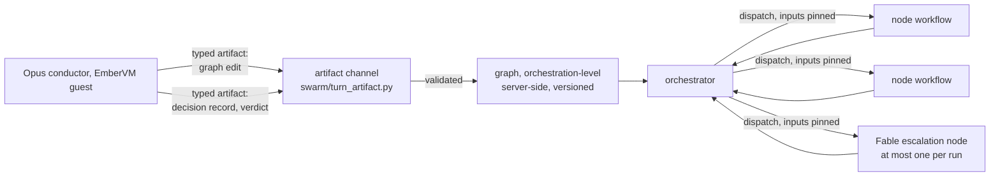

# ADR 062: A Mutable DAG Owned by an Opus Conductor, Executed Per-Node in VMs

**Author:** jomcgi
**Status:** Accepted
**Created:** 2026-08-30
**Amends:** [053 - Swarm Development, Bounded Conductor Orchestration](053-swarm-orchestration-bounded-conductor.md)
(Draft, the anti-correlation-of-privilege-and-exposure argument this ADR
keeps, applied to a different conductor model); [054 - The Run View: Pinned
Plans, Epistemic Registers, and Recorded-Not-Inferred Data](054-run-view-pinned-plans-epistemic-registers.md)
(Accepted, the versioned plan pin whose "current revision" this ADR defines
as an orchestration-level, not workflow-level, read)
**Supersedes in part:** issue #4781 decision 8 (Qwen conducts), reversed by
decision 1 below; decisions 3, 5, 9, 10, and 13 of #4781 stand and are
incorporated by reference in decision 8 below.

---

## Problem

Issue #4781 decided that the swarm console should replace its
session-versus-run front door with one task box driven by a conductor: a
model holding tools that build and reshape a DAG while work executes
underneath it. That issue named the conductor as Qwen, for cost, and left
open how a mutable graph coexists with the durable-workflow model the swarm
engine already runs on.

That coexistence is not a detail, it is the risk the whole design turns on.
The versioned plan pin (`swarm/workflows.py`, `pin_plan`'s step record) exists
because of a prior incident: PR #4633 fixed #4618, where a retry bound was
read from the workflow body during DBOS replay, so recovery could silently
apply a different budget than the run's original execution saw. The fix was
to pin the value into a step record precisely so replay could never see it
move.

A conductor that edits the DAG while nodes run collides with that fix
directly, if the mutable graph lives inside the DBOS workflow whose recovery
that fix was written to protect. Reading "the current plan" during replay
recreates #4618 in a new location: the graph, not a budget field. Reading
"the version pinned when this workflow started" avoids the replay hazard but
throws away the entire premise of decision 3, because a runtime add or
discard could never steer a workflow already committed to its starting
shape. Today's engine cannot express either answer safely, because
`implement_then_review` is one monolithic workflow whose Python control flow
is the DAG (`node_key="implement"` / `"push_gate"` / `"review"`, the same
shape hardcoded again as a literal three-element list with literal `deps` in
`swarm/view.py:487-540`). There is no node registry, no dependency
resolution, and nothing that can add or discard a node at runtime, so the
collision was latent until decision 3 asked for the very thing the engine
cannot yet allow.

This ADR is the design review issue #5419 opened to answer that collision
before any of it is built, plus the decisions that followed from it once the
first slices shipped.

---

## Decision

| Aspect | #4781's design | Decided here |
| ------ | --------------- | ------------ |
| Conductor model | Qwen, for cost (#4781 decision 8) | Opus, an agent session with repo access (decision 1) |
| Where the graph mutates | Unresolved: inside or outside the durable workflow | At the orchestration level, never inside a durable workflow (decision 2) |
| Escalation beyond the conductor | Not addressed | Exactly one Fable node per run, admitted against remaining budget (decision 3) |
| Execution environment | Assumed monolith-adjacent | Conductor and every node are EmberVM guests; nothing plans or executes in the monolith process (decision 4) |
| Under-delivery | Named as an open question in #5419 | A required delivered-versus-asked verdict at run end, backed by computed evidence, no separate judge node (decision 5) |
| Structured conductor output | Verdict parsed by regex over prose | One typed artifact channel for graph edits, decision records, and the verdict (decision 6) |
| Decision rationale | Not addressed | `(decision, because, evidence, commit)` records with staleness computed, never asserted (decision 7) |

### 1. Opus plans

The conductor is an Opus agent session with repo access, not a cheap API
model. This reverses #4781 decision 8 outright; decision 9's insistence that
the tool surface be MCP from the start is what makes the reversal cheap,
since the conductor was already meant to be swappable behind that surface.

The cost objection is understood and accepted rather than argued away: Opus
is on subscription and already runs inside a guest for other work in this
repo, so the marginal cost of planning is not a new line item, it is a
reallocation of quota that already exists. The bet is that the increase in
plan quality, at feature scale, pays for the model tier. This is deliberately
revisited, not asserted permanently: if measured per-task planning cost turns
out worse than expected once decision 7 in #4781 (conductor recording) has
data behind it, that is grounds to revisit this decision, not to have avoided
making it.

### 2. The DAG is mutable at the orchestration level, not inside a durable workflow

The conductor owns and reshapes the graph while work runs. Each node executes
as its own durable unit with its inputs pinned at the moment it is dispatched.
An orchestrator, sitting outside any single node's durable workflow,
reconciles the conductor's current graph against what has actually run.

This is the direct answer to the collision in the Problem section, and it is
the load-bearing decision in this ADR: a durable workflow that reads mutable
state recovers wrongly, on replay, in exactly the way #4618 already proved
once. Pinning the graph inside the workflow instead would remove that hazard
at the cost of decision 3's entire point, since a workflow already committed
to its starting shape cannot be steered by a runtime add or discard. Moving
mutation to the orchestration level dissolves the tension rather than
choosing a side of it: nothing durable ever reads mutable state mid-replay,
because the durable units are per-node with inputs fixed at dispatch, and the
mutable thing (the graph) lives entirely outside any workflow that could
replay it.

The consequence is stated plainly because it changes what the next slice of
work is: `implement_then_review` stops being the engine. It is a rewrite of
that layer, not a refactor. Today's hardcoded `node_key` chain and the
literal node list in `view.py` are both artifacts of a design this ADR
replaces, not code this ADR extends.

### 3. Bounded Fable escalation, and the bound is concrete

At most one Fable escalation node exists per run. It is admitted at the
moment of escalation against the run's remaining budget, and it is recorded
in the graph as its own node kind, not as a fallback state any stuck node can
fall into.

A run that would need a second Fable node has a wrong plan. The remedy is the
conductor reshaping that plan, the same way #4781 decision 5's discard and
add tools already let it correct course, not a second escalation slot. Making
the cap a node kind rather than a counter means the graph itself shows the
escalation happened, at what point, and what it cost, the same recording
discipline #4781 decision 10 already required of every other edit.

### 4. Everything executes in VMs

The conductor and every node it plans are EmberVM guests. No planning and no
execution happens in the monolith process. The monolith's role stays what
#4781 decision 12 already drew: the durable owner and the record-keeper, not
a place where agent reasoning or agent-driven mutation runs in-process.

### 5. Under-delivery is a required verdict backed by computed evidence, not an independent judge

#4781 decision 7 made under-calling the safe failure: a misroute grows the
plan rather than aborting it. That leaves an unaddressed gap #5419 named
explicitly: a run that planned one read node for a task that meant a repo
change completes green, and nothing marks that it did less than asked. This
is the same false-green class this repo has already fought in other guises
(the `Executed N out of M` CI verdict rule exists for the identical reason).

The conductor emits a required delivered-versus-asked verdict at run end, as
part of the decision record decision 6 formalizes. That verdict is validated
server-side through the typed artifact channel like every other declaration
the conductor makes, and it is accompanied by computed evidence: whether any
node in the run recorded a write, and whether a branch moved against its
recorded baseline. These are the same two signals #4781 decision 5's discard
refusal already treats as authoritative over an agent's own claim.

No independent judge node evaluates the verdict. An extra node adds a
per-run cost and a new false-positive surface (a judge that is wrong is a
second source of error, not a check on the first), for a benefit that the
computed evidence already delivers more cheaply: a green-but-shallow run is
visibly self-assessed, with the self-assessment sitting next to the facts
that would contradict it if it lied. This is deliberately provisional. If
self-judgment proves unreliable once there is data to judge it against, that
is grounds to add a judge node later, not evidence the decision was wrong to
make now.

### 6. One typed artifact channel for all structured conductor output

Graph edits, decision records, and the delivered-versus-asked verdict all
travel through the same mechanism: declared `(path, schema)` artifacts,
validated at ingestion (`swarm/turn_artifact.py`). Validation failure is a
retryable turn outcome; escalation to the conductor happens only once
retries are exhausted.

This retires the previous mechanism entirely rather than adding a second
path beside it: verdicts were a regex over the last lines of an agent's
prose (`swarm/policy.py:101`, failing closed to "unparseable" on anything it
could not match), and a declared JSON artifact only reached the server
because the shim happened to sweep untracked files into the turn diff. One
channel means the conductor's graph edits, its rationale, and its verdict on
its own run all clear the same bar, rather than three different levels of
scrutiny for three kinds of claim that are equally load-bearing.

Two prerequisites for this channel shipped as part of the same work: the
guest shim delivers the declared artifact file beside the turn diff rather
than depending on it being swept in incidentally (PR #5437), and a
reduced-diff fallback survives truncation on large work diffs (PR #5426), so
the channel cannot livelock on exactly the runs most worth trusting it for.

### 7. Decision records carry checkable evidence, and staleness is computed, never asserted

Every decision record is `(decision, because, evidence, commit)`, where
`evidence` is checkable paths or facts, never narrative. At hydration, staleness
is computed by diffing those evidence paths between the recorded commit and
the current checkout ref, never asserted by the conductor writing the record.
An agent's own claim that "this may not be stale" is one more unverified
claim, and this repo's `read_branch_head` precedent already settled that
question: check the artifact, do not believe the report.

The cheap first version skips the diff and hands the conductor the raw
commit distance; that already beats prose, and the drift computation slots
in later without changing the record's shape.

Free-text agent memory is explicitly not the primary carrier of this
rationale, for the same reason ADRs in this repo are never cited as current
state: a store of confidently-worded claims decays quietly, and a conductor
planning unattended has no human backstop to catch the decay the way a
reader of an ADR does. Capturing conductor turns into the repo's existing
knowledge machinery (`RawInput` into the `knowledge/gardener.py` distiller)
is a later slice that makes future summons better-informed, scoped only once
there are recorded conductor decisions worth distilling from. It is not a
prerequisite for this ADR's decisions to hold.

### 8. What stands from #4781, and what is reversed

Decisions 3 (the DAG as a mutable artifact) and 5 (eager read-only execution,
including the discard-refusal semantics: refuse when the dispatcher armed the
node, when `read_branch_head` shows the branch moved against its recorded
baseline, or when the node's own recorded activities claim a write, with that
claim only ever able to force a refusal and never permit a discard) stand
unchanged and are incorporated by reference rather than restated. Decision 9
(MCP-first tooling, so the conductor stays swappable) stands, and is what
makes decision 1's reversal of decision 8 (Qwen conducts) cheap rather than a
rewrite. Decision 10 (every conductor decision and outcome recorded) stands
and is the mechanism decision 7 above builds on. Decision 13 (per-node
`max_cost_usd` admitted against the pin at add time) stands as the one spend
control that can work, given that cost is observable only between turns.

Decision 8 of #4781, Qwen as the conductor, is reversed by decision 1 of this
ADR.

---

## Preconditions already shipped

The following landed in the 24 hours before and after this ADR was written
(2026-08-29 to 2026-08-30), and decisions 2, 5, and 6 above assume they hold:

- **#5417 / PR #5420**: DBOS workflow attributes merge instead of replacing
  wholesale. Before this fix, approving a push gate silently destroyed the
  pinned plan on the same attribute write, which would have made versioned
  plan revisions impossible to build on.
- **PR #5422**: the typed, retryable artifact channel itself
  (`swarm/turn_artifact.py`).
- **PR #5437**: the guest shim delivers the declared artifact beside the turn
  diff, rather than relying on it being swept in as an untracked file.
- **PR #5426**: a reduced-diff fallback survives truncation, so the channel
  does not livelock on large work diffs.
- **PR #5438**: the agent registry evicts dead instances once their
  replacement or silence proves them gone, which is what keeps a departed
  conductor's registry entry from stalling the orchestrator's reconciliation
  loop decision 2 depends on.

These are cited as verifiable git history, not as this ADR's own claims of
current state.

---

## Architecture

The graph is server-side state the orchestrator reconciles against, not a
value any node's durable workflow reads mid-replay. Every arrow into the
graph is a validated artifact; every arrow out of it toward a node is a
dispatch with inputs already fixed.

---

## Alternatives Considered

- **Mutable graph read inside the durable workflow.** Rejected: this is the
  #4618 failure class recreated one layer up. A workflow reading "current
  plan" during DBOS replay can observe a different graph than the one it
  started with, exactly the bug PR #4633 was written to prevent for a single
  budget field.
- **Pin the graph at workflow start, inside the workflow.** Rejected as the
  other horn of the same dilemma: this avoids the replay hazard but makes
  decision 3 of #4781 vacuous, since a workflow already committed to its
  starting shape cannot be steered by a runtime add or discard.
- **Qwen as the conductor (#4781 decision 8).** Reversed by decision 1.
  Qwen was chosen for cost when the design was speculative; once the
  mutation-boundary risk was understood well enough to build against, plan
  quality at feature scale was judged worth the model-tier cost, on
  subscription quota already in use elsewhere in this repo.
- **An independent judge node for under-delivery.** Rejected for now: it
  adds a node, hence a cost, per run, and a new surface for the judge itself
  to be wrong, in exchange for a check that the computed evidence (write
  activity, branch movement against baseline) already provides more cheaply
  alongside the conductor's own required verdict. Revisit if self-judgment
  proves unreliable in practice.
- **An external agent-memory platform** (evaluated against
  TencentDB-Agent-Memory, 25.1k stars) for decision 7's rationale storage.
  Rejected: it would add three services plus a proxy sitting on the agent
  prompt and credential path, in Node and Docker against an apko-and-Bazel
  repo, and its layered conversation-to-atom-to-persona model carries no
  commit anchoring and no computed staleness, both of which decision 7
  requires. The repo's existing knowledge domain (`knowledge/gardener.py`,
  `AtomRawProvenance`, S3-backed raws) already runs most of the needed
  machinery; the only new piece is routing a conductor turn into it as a
  `RawInput`, which is additive and not a platform decision.

---

## Security

Baseline `docs/security.md`. Inherits ADR 053's anti-correlation argument
(exposure to untrusted input and privilege move in opposite directions)
applied to a different conductor model: an Opus conductor reading
attacker-influenceable text (task descriptions, node outputs, prior
decisions) is not thereby granted more authority than a cheap conductor
would have had. Decision 6's single validated channel is the mechanism that
holds this: every conductor output, including a graph edit, is a proposal
that fails closed on schema mismatch rather than a write the conductor makes
directly.

Decision 4 (everything in VMs) keeps the monolith process itself out of the
blast radius of a compromised or misled conductor; the conductor's worst case
is a bad graph, not code execution in the durable owner.

---

## Risks

| Risk | Likelihood | Impact | Mitigation |
| ---- | ---------- | ------ | ---------- |
| Opus per-task planning cost exceeds the accepted budget once measured | Medium | Medium | Decision 1 is explicitly revisitable against #4781 decision 10's recording; not a one-way door |
| Orchestrator reconciliation drifts from the conductor's latest graph edit under concurrent summons | Medium | High | Registry dead-instance eviction (PR #5438) keeps a departed conductor from stalling reconciliation; single-flight-per-run concurrency control is separately tracked work, not yet closed by this ADR |
| The delivered-versus-asked verdict is gameable by a conductor that under-plans and then declares success anyway | Low | Medium | The verdict travels beside computed evidence (write activity, branch movement) the conductor cannot alter after the fact, so a false verdict is visibly contradicted rather than merely trusted |
| A run's single Fable escalation is spent on a wrong problem, leaving no further escalation room | Medium | Medium | The cap is deliberate: a run that needs a second Fable node is defined here as having a wrong plan, so the intended remedy is the conductor reshaping the plan, not a bigger cap |
| Decision 7's evidence-diffing adds hydration latency to every conductor summon | Low | Low | The cheap first version (raw commit distance, no diffing) is explicitly allowed to ship first |

---

## Open Questions

1. **Single-flight enforcement per run.** This ADR assumes the orchestrator
   reconciles one conductor's edits at a time, but the concurrency mechanism
   (a per-run lock or a serialized decision queue) is not specified here.
2. **The trigger list for summoning the conductor.** Decision 2 assumes the
   orchestrator knows when to invoke the conductor again after a node
   settles, but which events warrant a summon (a terminal node state, an
   exhausted artifact retry, a human gate answer) is not enumerated in this
   ADR.
3. **Capture of conductor turns into `RawInput`** for decision 7's rationale
   store is named as a later slice, not scoped here.

---

## References

| Resource | Relevance |
| -------- | --------- |
| Issue [#5419](https://github.com/jomcgi/homelab/issues/5419) | The design review this ADR records; primary source for decisions 1 through 4 |
| Issue [#4781](https://github.com/jomcgi/homelab/issues/4781) | The conductor design this ADR amends; decisions 3, 5, 9, 10, 13 stand, decision 8 reversed |
| Issue #4618, PR #4633 | The durable-workflow-reads-mutable-state incident and its fix; the reason decision 2 exists |
| [ADR 053](053-swarm-orchestration-bounded-conductor.md) | The anti-correlation-of-privilege-and-exposure argument this ADR applies to the Opus conductor |
| [ADR 054](054-run-view-pinned-plans-epistemic-registers.md) | The versioned plan pin whose orchestration-level (not workflow-level) read this ADR specifies |
| PR #5420 (issue #5417) | DBOS attribute merge fix; prerequisite for versioned plan revisions surviving a write |
| PR #5422 | The typed, retryable artifact channel (`swarm/turn_artifact.py`) decision 6 formalizes |
| PR #5437 | Guest shim delivers the declared artifact beside the turn diff |
| PR #5426 | Reduced-diff fallback survives truncation |
| PR #5438 | Registry dead-instance eviction, which keeps reconciliation from stalling on a departed conductor |
| Issue #4784 | `budget_usd` enforcement, still not implemented; decision 3's Fable admission check is separate from and does not substitute for it |
