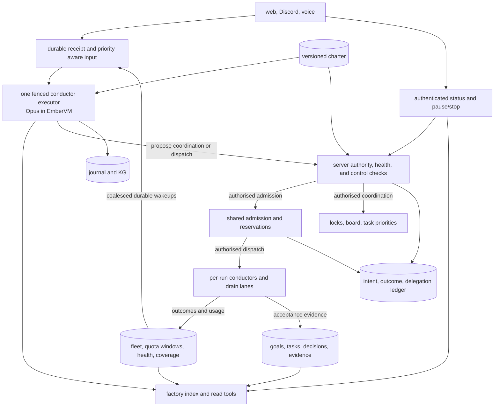

# ADR 064: A Factory Conductor for Product Progress, Shared Capacity, and One Conversation

**Author:** jomcgi
**Status:** Proposed
**Created:** 2026-09-05
**Updated:** 2026-09-06
**Amends:** [062 - A Mutable DAG Owned by an Opus Conductor, Executed Per-Node
in VMs](062-mutable-dag-conductor-opus-per-node-vms.md) (Accepted, adds
coordination above individual runs); [060 - Escalation as a Pause, Not a
Return, With a Decision Row](060-escalation-as-a-pause-with-a-decision-row.md)
(Accepted, resolves delegated decisions within a charter before escalating
to Joe)
**Related:** [049 - Turn-Granular Agent UI](049-turn-granular-poll-shaped-agent-ui.md),
[058 - Voice-Driven Companion Screen](058-voice-driven-companion-screen.md),
[063 - Factory Knowledge Graph](063-factory-knowledge-graph-evidence-lanes.md)

## Problem

Joe coordinates local and cloud Claude sessions, Codex workers, drainer
lanes, and swarm runs by checking several surfaces. A per-run conductor owns
one DAG and cannot select priorities or reconcile overlap across that fleet.
Increasing the number of runs increases the coordination work Joe carries.

Quota observation (#5752) and routing away from an exhausted lane (#5753)
provide useful inputs, but do not decide which product work should occupy
available capacity across lanes. Independent dispatchers can each see the
same apparent headroom. Starting more implementation work can also overload
review, CI, or the platform and leave unfinished work consuming capacity.

A factory needs a connection between agreed product goals and verified
delivery, a shared admission boundary, operational recovery rules, and one
conversation through which Joe can start, inspect, and steer work. Keeping
sessions busy alone does not establish product progress.

## Decision

The objective is to **keep all safely available subscription quota doing
useful work toward agreed product goals, while preserving platform health,
interactive responsiveness, and capacity to finish and verify work**.

| Aspect | Decision |
| ------ | -------- |
| User entry point | One factory conversation across web, Discord, and voice |
| Executor | One logical conductor per operator, with a replaceable fenced EmberVM session |
| Starting model | Opus; evaluate Fable before any later switch |
| Priorities | Platform stability, useful product progress, efficient quota use |
| Work selection | Agreed goals, dependencies, acceptance evidence, and bounded maintenance |
| Capacity | Shared server-enforced admission and reservations across participating lanes |
| State | Durable goal/task/decision records, a materialised index, and journal plus KG |
| Control | Versioned charter, mutation checks, operational health gates, and independent pause/stop |
| Rollout | Read first, coordinate with its controls, act after admission and recovery gates |

### 1. One conversation is the default task entry point

The private agents page integrates issue #4781's existing launcher into the
factory conversation. Starting work, asking for progress, changing priorities,
steering a task, and answering a decision use that entry point. Choosing a
model, session, run, or conductor is not required. Implementation diagnostics
remain available on demand.

Web, Discord, and ADR 058 voice share one logical conductor per operator.
They retain stable message, task/topic, and decision IDs, principal,
context version, source surface, and reply destination. Switching surfaces
or replacing the executor preserves task focus and pending decisions.
Concurrent topics must not silently change the target of "pause that";
ambiguous mutation targets require clarification.

The default view answers what advanced, what is running, what needs Joe,
and why capacity is idle, with evidence available on demand. Replies follow
each surface's access rules. Voice supports the conversation with no
companion screen open, preserving ADR 058's optional-screen contract.

Issue #5788 owns the interface and adapters. Issue #5787 owns durable
context and executor lifecycle.

### 2. Durable receipt, bounded turns, and independent controls keep it responsive

Persist and acknowledge input before model execution. A receipt means the
request is durable, not that its action completed. The interface renders
queued, running, blocked-on-decision, paused, completed, failed, and stopped
states from records, following ADR 049's polling approach.

One durable ordered queue feeds one active executor. Explicit priority rules
place operator input ahead of coalesced background events while preserving
causal dependencies and FIFO within equal-priority streams. A newer scoped
stop or correction invalidates conflicting pending actions. Keep conductor
turns bounded and delegate lengthy work; worker completion produces a durable
event rather than keeping the conductor turn waiting.

Authenticated deterministic pause/stop controls bypass model execution.
Their durable generation/order is rechecked before subsequent mutations,
including commands already queued at a target. Basic status reads directly
from durable records when the model is busy or unavailable, with honest
freshness and coverage. Control-path failure must be visible rather than
reported as a successful stop.

The charter sets measurable receipt/control latency targets and conductor
turn bounds. These values must be chosen and validated before enabling the
associated autonomous controls. Token streaming is not a prerequisite.

### 3. A versioned charter bounds goals, decisions, and operational policy

The charter is a versioned document under projects/monolith, owned by #5785
and changed through reviewed PRs. Its exact file path is an implementation
choice. It defines goals in priority order: platform stability, useful
product progress, then efficient quota use.

It also defines allowed actions, escalation/ask-first rules, reserves and
ceilings, work-in-progress limits, maintenance allocation, health inputs,
freshness/recovery rules, and responsiveness targets. Accepted ADRs and
GitOps/security invariants remain binding.

Every clause has a stable identifier. The loader, read-only charter tool,
session prompt, admission layer, and action ledger expose the same exact
version/hash. Mutations use applicable current policy; replacing a session
or retaining an old prompt cannot preserve revoked authority. Charter
changes specify how active work and pending reservations/actions transition.

The conductor resolves decisions within explicitly granted authority.
Missing or ambiguous authority escalates. The initial ask-first set includes
charter or quota-policy changes, security-relevant changes, decisions
requiring a new/amended ADR, and irreversible or production-impacting
actions outside allowed GitOps operations. This does not authorise otherwise
prohibited cluster writes.

Persist scoped operator decisions so reconnect or executor replacement does
not ask again for an unchanged, already resolved decision. An answer is
bound to its decision ID, target, and version; changed scope or authority
requires revalidation.

### 4. Product goals and acceptance evidence drive work selection

Issue #5786 owns durable records connecting product outcome -> milestone ->
task -> acceptance evidence, with stable identity, ownership, priority,
dependencies, and versioned operator decisions. Reuse existing issue/task
and evidence records where possible.

Distinguish started work, produced artifacts, accepted delivery, and
deployment/health evidence when the goal requires it. A model's completion
claim or session count alone cannot satisfy acceptance. Connect evidence to
the relevant artifact/commit and goal criteria.

Every selected task advances an agreed goal or has a bounded operational
maintenance justification. Routine maintenance has an explicit allocation;
incident exceptions require recorded evidence and recovery conditions.
"Stability first" cannot silently become an unlimited stream of polishing
that starves product work.

The conductor may propose priorities within its charter. Goal/priority
changes are attributable mutations; retrieved issue prose cannot silently
become an authorised priority. Scheduling recommendations explain the goal,
dependency, and evidence they advance.

### 5. A materialised factory index supplies current evidence and coverage

The index joins goal/task records, agent sessions, swarm runs,
drainer/routine jobs, GitHub issues/PRs through tool-mediated access,
decision rows, distress reports, authoritative platform-health observations,
provider quota, and shared reservations. Serve it as MCP tools, including
factory_status, task_status, queue_next, and overlaps. queue_next recommends;
it does not reserve or dispatch.

Stamp observations with source time, provenance, and freshness. Distinguish
covered, stale, unavailable, and unenforced sources. Cloud-session visibility
remains a coverage gap until a durable source exists; missing coverage is not
an empty fleet or a guaranteed interactive reserve.

Keep display headline quota separate from admission inputs. Expose every
applicable active window/reset, observation age, in-flight reservations,
and unknown state. Surface superseding decisions and corrections rather
than treating historical issue text as a current blocker.

Retrieved content remains untrusted data. The index supplies evidence, but
mutations revalidate authoritative target state, ownership, health, and
reservations at execution time. Fresh index rows do not establish that a
resource is still available.

Report provider/window utilisation, accepted product progress, rework,
operator interruptions, platform health, and reasons for idle capacity
separately. Document definitions so retries and session churn cannot inflate
accepted progress.

### 6. Proactive scheduling uses shared reservations and downstream backpressure

Issue #5804 owns goal-based scheduling and shared admission, coordinating
with #3840's existing durable queue, deduplication, and lifecycle work.
Reuse that dispatch boundary rather than creating a competing queue.
Issue #5753 remains the per-lane routing consumer, and #5803 owns quota
observation persistence/recovery.

Reconsider eligible work on completion, new tasks, priority changes, quota
observations/resets, health changes, and bounded scheduled checks. The
conductor proposes work using product priorities and dependencies. The
server enforces admission and accounting.

Admission considers every applicable active provider window/reset,
observation freshness, in-flight work, and model/input eligibility. Unknown
capacity is not confirmed headroom; use bounded probes or defer under the
routing policy. A reset permits a probe, not an assumption of recovery.

Reserve capacity for Joe's interactive work, the conductor, and
review/correction needed to finish admitted work. Use conservative
estimates of remaining work and observed consumption. Provider percentages
do not establish exact token capacity or a hard mid-turn spend bound.

Include VM/host capacity, CI and review throughput, and work-in-progress
limits. When downstream capacity is constrained, favour finishing and
unblocking admitted work. Define deterministic tie-breaking and bounded
priority aging so easy jobs cannot indefinitely displace product goals.

Reservations are atomic and shared across participating lanes and pending
starts. Record task/action, principal, policy version, lane, resource
reservation, and admission reason. Concurrent lanes cannot independently
allocate the same headroom. Expose unobserved or unenforced consumers and
retain conservative headroom rather than claiming a fleet-wide guarantee
where admission coverage is incomplete.

Reconcile consumption and reservations at observable boundaries. Releases
and refunds are idempotent; retry/probe accounting remains bounded.
Replacing a session or re-dispatching work cannot reset its accumulated
accounting. Lease expiry does not prove an old worker stopped, so capacity
cannot be reused solely because a lease expired.

### 7. Journal, action records, and fencing survive executor replacement

The logical conductor uses an EmberVM guest like per-run conductors.
Start with Opus. Evaluate Fable against recorded coordination correctness,
unnecessary escalations, latency, and total cost before changing the default;
this is a starting choice, not a comparative benchmark claim.

Issue #5787 owns creation/replacement, durable wakeups, event deduplication,
coalescing, and one active executor per operator with ownership fencing.
The journal retains recent exchanges and rollups using existing title and
voice_summary machinery. Durable facts use report_knowledge; session
assembly combines journal and KG recall (#5680).

Pending actions, acknowledgements, task focus, operator decisions, and
outcomes are persisted before relying on summarisation or KG extraction.
Recovery must work even when no summary has run.

On replacement, reconcile stable action IDs with #5789's ledger and target
outcomes before retrying. Target-side idempotency/reconciliation prevents
repeating a side effect after a crash before acknowledgement. Reconcile
delegated workers and #5804 reservations before reuse. All wakeups honour
current pause/stop state; a killed conductor stays stopped.

### 8. Mutation authority, health gates, and stop semantics are server-enforced

Issue #5789 owns read, coordinate, act, and escalate as separately gated
tiers. Coordinate changes locks, board state (#5704), and priorities, so
its first release includes authorization, auditing, freshness checks, and
pause/stop enforcement.

Every mutation validates principal, exact target/action, enabled tier,
applicable current charter clause/version, executor ownership, control
generation, and current preconditions. Include delegated calls and
protected charter/security targets. Prompt text, editing hooks, and broad
tool visibility do not grant authority.

Every conductor tool call has an attributable ledger row. Persist mutation
intent before the side effect, then outcome. Include descendant tasks and
sessions in the authority/accounting chain and preserve consumed work across
cancellation, replacement, and re-dispatch.

Operational policy uses authoritative timestamped health/resource inputs
to enforce normal, reduced-concurrency, admission-paused, and recovering
behaviour. Define stale/unknown handling, bounded retry/probe budgets,
recovery evidence, and cooldowns before enabling autonomous operation.
Restrict affected lanes/resources where possible while preserving status,
controls, and eligible unaffected work.

Controls have distinct semantics:

- **Pause admissions:** prevent new work while admitted work finishes under
  its existing bounds.
- **Pause task:** prevent new steps for that task and report active work as
  checkpointing, cancelling, or still running according to its capabilities.
- **Stop factory:** persist the stop state, fence the conductor and its
  factory-owned descendants, cancel queued starts, request bounded
  cancellation of active delegated work, and prevent recreation through
  any surface, wakeup, or restart. Unrelated operator-owned work is outside
  this target scope.

An in-flight effect is not undone by recording stop. Reconcile its outcome;
retain evidence and conservative reservations until cessation is confirmed.
Unreachable workers remain explicitly unconfirmed, and the UI cannot claim
the factory is fully stopped while their activity is unknown. Resume
requires an authorised explicit transition under current policy.

Issue #4784 closed through PR #5713, which enforces per-run budgets at node
boundaries. This is a building block, not factory-wide quota reservation
or a hard cap on an already running turn. Act additionally requires the
conductor's own budget and delegated accounting, #5804 shared reservations
across covered dispatch paths, operational health controls, and an STPA
governance pass.

## Architecture

The monolith owns durable state and deterministic enforcement. Agent
planning and task execution remain in EmberVM guests. The diagram's
separate boxes are responsibilities, not a requirement for new services.

## Delivery and acceptance

| Issue | Ownership |
| ----- | --------- |
| #5785 | Charter, policy values, clause/version contract |
| #5786 | Goal/evidence records, index, coverage, progress reporting |
| #5787 | Journal, task/decision continuity, wakeups, responsiveness, recovery |
| #5788 | Unified entry point and cross-surface experience |
| #5789 | Authority, ledger, budget integration, health and pause/stop |
| #5804 | Proactive scheduling, shared reservations, backpressure |

Rollout priorities are quota routing/recovery (#5753, #5803), then the
narrow message board (#5704), goal/index records and the read-only
conductor, coordinate with its controls, then act after its admission,
accounting, health, and STPA gates. Independent read-only implementation
and scheduling recommendations need not wait for mutation gates.

Acceptance scenarios:

- Given prioritised goals and eligible capacity, useful work advances
  unattended and unused capacity has a recorded reason.
- Joe starts a task on web, continues by voice, and answers its pending
  decision in Discord without selecting a session or repeating context.
- A busy or unavailable model does not block durable receipt, timestamped
  status, or deterministic pause/stop within configured latency targets.
- A quota wall or platform degradation reduces affected work, preserves
  control access, and recovers without retry storms.
- Concurrent dispatch and restart after a side effect neither duplicate
  work nor prematurely reuse active reservations.
- Pause/stop has an observable outcome for queued and delegated work,
  including an unreachable worker.
- Reporting separates utilisation, accepted product progress, rework,
  operator interruptions, health, and idle-capacity reasons.

## Alternatives considered

- **The per-run task box as the entire factory.** It owns one DAG and
  lacks fleet-wide priorities and capacity allocation. Keep its execution
  machinery beneath the shared conversation.
- **A separate chat box beside the existing launcher.** It makes the
  operator choose an execution abstraction before describing work.
- **Independent per-lane quota checks alone.** They cannot atomically
  reserve shared headroom or apply downstream backpressure.
- **A single unbounded FIFO model conversation for all work and controls.**
  Lengthy turns and background events can delay operator corrections.
  Keep one executor with bounded turns and independent control enforcement.
- **Journal rollups as the only recovery state.** Pending actions and
  decisions must survive before summarisation finishes.
- **Destroying only the conductor session as a factory stop.** It leaves
  delegated work and uncertain side effects unaccounted for.

## Security and risks

Baseline docs/security.md applies. The factory uses a distinct agent
principal; it does not borrow a lane's authority. Board, index, issue, and
session content is untrusted. Current server-side target/action checks
enforce the charter across direct and delegated paths. Shared memory does
not widen any surface's access rules, and a human confirmation does not
replace authorization.

| Risk | Required response |
| ---- | ----------------- |
| Utilisation rises while product progress stalls | Goal/evidence links, separate outcome metrics, bounded maintenance and priority aging |
| Concurrent lanes oversubscribe apparent headroom | Atomic reservations, conservative estimates, explicit admission coverage |
| The conductor becomes slow or unavailable | Bounded turns, priority-aware inputs, durable status and independent controls |
| A stale index or policy authorises obsolete work | Current authority, target, health, and reservation checks at execution |
| Restart or stop leaves active descendants | Ownership fencing, target reconciliation, explicit unconfirmed state, conservative release |
| Fault recovery produces a retry storm | Bounded probes/retries, health gates, recovery evidence and cooldowns |

## Implementation decisions still required

The implementing issues must choose and validate reserve values, estimation
margins, freshness/probe intervals, health/recovery thresholds,
work-in-progress limits, and receipt/control latency targets before enabling
their autonomous controls. These are explicit rollout gates, not permission
for the model to invent its own limits.

Reliable cloud-session visibility remains unresolved; expose the coverage
gap until a durable source and admission policy exist. Opus and one shared
logical conductor are the starting decisions. Fable evaluation is required
only before a later model switch.

## References

- [#5784](https://github.com/jomcgi-org/homelab/issues/5784): factory objective and implementation tracker.
- [#4781](https://github.com/jomcgi-org/homelab/issues/4781): one task entry point.
- [#5419](https://github.com/jomcgi-org/homelab/issues/5419): per-run conductor.
- [#3840](https://github.com/jomcgi-org/homelab/issues/3840): autonomous queue and scheduler.
- [#5804](https://github.com/jomcgi-org/homelab/issues/5804): shared admission and product-goal scheduling.
- [#5752](https://github.com/jomcgi-org/homelab/issues/5752): quota observation.
- [#5753](https://github.com/jomcgi-org/homelab/issues/5753): eligible routing and bounded probing.
- [#5803](https://github.com/jomcgi-org/homelab/issues/5803): observation persistence and recovery.
- [#4784](https://github.com/jomcgi-org/homelab/issues/4784), [#5713](https://github.com/jomcgi-org/homelab/pull/5713): shipped node-boundary budget enforcement and its limits.
- [#5680](https://github.com/jomcgi-org/homelab/issues/5680): KG recall for session assembly.
- [#5704](https://github.com/jomcgi-org/homelab/issues/5704): shared message board.
