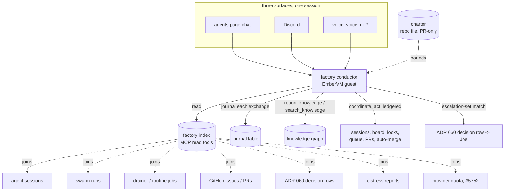

# ADR 064: A Factory Conductor: One Long-Lived Session That Coordinates Conductors Under a Charter

**Author:** jomcgi
**Status:** Proposed
**Created:** 2026-09-05
**Amends:** [062 - A Mutable DAG Owned by an Opus Conductor, Executed Per-Node
in VMs](062-mutable-dag-conductor-opus-per-node-vms.md) (Accepted, adds a
level above the per-run conductor that ADR 062 does not have and cannot see
past its own DAG); [060 - Escalation as a Pause, Not a Return, With a
Decision Row](060-escalation-as-a-pause-with-a-decision-row.md) (Accepted,
narrows which escalations reach Joe rather than changing how one is answered
once it arrives)

---

## Problem

Joe is the integration point between every concurrent lane this repo runs:
local Claude sessions, cloud Claude sessions, Codex dispatch workers, the
qwen drainer (ADR 061), and swarm runs under an ADR 062 conductor. Nothing
between those lanes coordinates them. Two sessions can be bound to the same
issue or editing the same files with neither one aware of the other, and
finding out means Joe reading `ListAgents`, the swarm console, GitHub, and
Discord by hand. "What is in progress", "how is task X going", and "what
should run next" are all questions Joe currently answers by checking several
surfaces himself, because no surface answers them.

An ADR 062 conductor does not fix this: it owns one DAG for one run and has
no visibility into any other run, any Codex dispatch, or any drainer lane.
Scaling per-run conductors scales the number of things nobody is watching
across, not the coordination.

Every escalation reaches Joe today regardless of whether it needs him. ADR
060 gave one kind of escalation (a swarm push gate) a decision row instead of
silent termination, but it did not change who receives it: everything that
pauses still pauses toward Joe. There is no tier between "the system decided
on its own" and "Joe was asked", so triage work that a coordinating agent
could resolve (a lane overlapping another, a queued job that should wait
behind a running one) still lands on him.

The subscription quotas that bound Codex dispatch and Claude sessions
(CLAUDE.md's model routing section) are a shared, finite resource that
nothing currently manages as one. Issue #5752 makes each provider's quota
readable in-cluster off real egress traffic; issue #5753 is the first
consumer, routing one lane (kg-drain) around a wall. Both are per-lane
reactions to a wall already hit. Nothing decides, across every lane at once,
how to spend the quota that is available, so it goes unused when no single
lane happens to need it at that moment, even while another lane is idle for
lack of it.

---

## Decision

| Aspect | Today | Decided |
| ------ | ----- | ------- |
| Coordination across lanes | Joe, by hand, across several surfaces | one long-lived conductor session, reachable from three surfaces |
| Bounds on what it may do | none exist | a versioned charter, changed only by PR |
| How it knows fleet state | nothing aggregates it | a materialised read model (the factory index), not its own context |
| Memory across restarts | would be a hand-maintained file | a journal table plus the knowledge graph |
| What reaches Joe | every escalation | only what the charter's escalation set names |
| Authority to act | undefined | four gated tiers, each audited, act shipped last |

### 1. One long-lived conductor session per operator, an EmberVM guest, three surfaces sharing it

The factory conductor is a session, not a service. It is an EmberVM guest
like every other agent under ADR 062 decision 4, reachable from a chat box on
the private agents page, from Discord, and from voice through the ADR 058
`voice_ui_*` tools, all three bound to the same session rather than each
spawning its own.

Being a session rather than a service means it can be destroyed and
re-created from what decision 4 below persists. There is no state that only
lives in a running process; killing the session and starting a fresh one
recovers the same conductor, modulo whatever the journal and the knowledge
graph have not yet distilled.

### 2. It acts within a charter, and the charter is a versioned document changed only by PR

The charter is a file in this repo. It states goals in priority order
(platform stability first, then maximising use of the Codex and Claude
subscription quotas, then roadmap progress), constraints (cost ceilings,
every accepted ADR is binding, the GitOps invariants in CLAUDE.md), and the
escalation set (decision 5).

Bounds on an agent with this much reach have to be readable and diffable by
a human who is not in the loop of any given session, and they have to sit
outside the conductor's own reasoning. A charter the conductor could revise
by talking to itself is not a bound; a charter that only changes through
review is.

### 3. A factory index is the read model the conductor queries, not the context it holds

A materialised view joins agent sessions, swarm runs, drainer and routine
jobs, GitHub issues and PRs, ADR 060 decision rows, distress reports, and the
provider quota reading from issue #5752, keyed by the issue or task each
belongs to. It is served as MCP tools, not loaded into the conductor's
context wholesale.

"What is in progress", "how is task X", and "what is next" become queries
against the index rather than questions the conductor answers from memory.
Overlap detection is a query too: two live sessions bound to the same issue,
or touching the same paths, are found by joining the index against itself,
not by the conductor noticing.

Context is the budget this repo already routes model tiers against
(CLAUDE.md's model-routing section). A conductor that tried to hold the
entire fleet in its own context would be bounded by the same context window
every other session is, and would go stale between refreshes exactly the way
a cached read does. Querying an index that is itself kept current is cheaper
and does not decay with session age.

### 4. Memory is a journal plus the knowledge graph, never a hand-maintained memory file

A per-conductor journal table keeps the last N exchanges verbatim and their
rollups, reusing the session-title and `voice_summary` machinery that
already exists for other sessions. Durable facts go to the knowledge graph
through `report_knowledge`, the same path every other agent uses. A new
conductor session is assembled from the journal plus the knowledge graph
recall block (issue #5680), the same recall mechanism every other Ember
session gets once `knowledge.recall.enabled` is flipped.

Searching past interactions is `search_knowledge` over session rollups plus
text search on the journal, not a grep over a file only this machine can
read. This repo already drew this line once: CLAUDE.md's knowledge section
treats a hand-maintained local memory as a scratchpad with a short half-life,
never a shared fact store. A conductor whose entire job is cross-session
coordination cannot run on the one memory store every other agent is told
not to trust for anything durable.

### 5. Escalations require Joe by construction: the charter enumerates the set

The charter names an escalation set, and only a decision in that set produces
an ADR 060 decision row addressed to Joe. Everything else the conductor
resolves on its own and records in the journal.

The initial set: any irreversible or production-impacting action outside
GitOps (kubectl writes are already forbidden by CLAUDE.md, so this closes the
same door for the conductor rather than opening a new one), any decision that
would need a new or amended ADR, budget or quota policy changes, any
security-relevant change (`docs/security.md` scope), and anything the charter
itself marks ask-first.

The set lives in the charter, not in the conductor's judgment, so that
"Joe is needed" keeps meaning what it says. A conductor that decided case by
case which of its own decisions were big enough to escalate would be the
same unbounded triage problem this ADR exists to remove, moved one level
down.

### 6. Four action tiers, each gated separately, every action ledgered

Read (the factory index, the knowledge graph), coordinate (post to the
issue #5704 board, take and release monolith agent locks, defer or
re-prioritise a queued job, tell a lane it overlaps another), act (start and
steer sessions, dispatch Codex workers, open PRs, arm auto-merge within the
`pr-workflow` skill's rules), and escalate.

No action happens without a ledger row: every tool call the conductor makes
is written down with the charter clause it acted under, the same invariant
ADR 058 decision 1 already established for the voice companion ("no surface
may appear without a ledger row"), applied here to actions instead of UI
surfaces.

Read and coordinate ship first. Act is enabled per tier by a values flag
once decision 7's budget line exists, so the highest-reach tier does not
go live ahead of the safety envelope meant to bound it.

### 7. Safety envelope: its own budget line, a kill switch, and STPA before act

The conductor gets its own budget line under `budget_usd` enforcement
(issue #4784), so its quota-maximising goal cannot spend against a ceiling
that does not yet exist for anyone. A kill switch is a values flag that
destroys the session and refuses re-creation, not merely pauses it. The STPA
governance lens (the `stpa` skill) runs on the conductor before the act tier
is enabled, not after.

Model choice between Fable and Opus is left open (Open Questions). The
charter is written to be model-independent, the same swappability ADR 062
decision 9 already established for the per-run conductor: nothing in the
charter or the index depends on which model is reading it.

---

## Architecture

---

## Alternatives Considered

- **A Discord thread bound to an ordinary agent session.** Rejected: no
  index behind it, so it answers nothing it was not just told; no memory
  that survives a context expiry; no bounds beyond whatever the session
  happened to be told that day.
- **The swarm console's task box as the front door (ADR 062 as written).**
  Rejected as the whole answer: it is a real conductor, but it owns one DAG
  for one run and cannot see any other run, dispatch, or lane.
- **A scheduled routine that summarises state.** Rejected: read-only by
  construction, so it can report that two lanes overlap but cannot act on
  it, defer a job, or answer a follow-up question.
- **A hand-maintained memory file.** Rejected: unversioned, unreviewed, and
  scoped to one machine, the exact failure mode CLAUDE.md's knowledge
  section already warns against for durable facts.

---

## Security

Baseline `docs/security.md`. The factory conductor is the most privileged
agent principal in this repo, by design: it is the only one meant to
coordinate across every other lane. It runs under the agents-tier identity
model (SPIFFE phase 1, issue #5706) with a distinct principal, not borrowed
from any lane it coordinates.

Its board and index reads are untrusted input, the same rule issue #5704
states for the agent message board: session outputs, issue text, and PR
comments it reads back through the index can carry attacker-influenceable
text. The main threat is prompt injection through what it reads back. The
charter is system-prompt-side, not something the model negotiates with
itself over, and the escalation set is enforced by tool gating on which
calls are even reachable at each tier, not by the model's own judgment about
whether a given case is big enough to escalate.

---

## Risks

| Risk | Likelihood | Impact | Mitigation |
| ---- | ---------- | ------ | ---------- |
| The factory index goes stale or wrong, and the conductor acts on it | Medium | High | Read and coordinate ship before act; act is gated on a values flag and comes only after the budget line and STPA governance lens both land |
| Quota-maximising conflicts with platform stability | Medium | Medium | The charter's priority order puts stability first by construction, not as a tiebreaker the conductor infers |
| The conductor coordinates around a human mid-task | Medium | Medium | It must read locks and the issue #5704 board before steering any session, the same precedence a human coordinator would owe |
| The escalation set is drawn too narrow and Joe stops seeing things he needed to | Low | High | The set is a charter change, reviewed by PR like any other, not a runtime toggle the conductor can widen or narrow itself |

---

## Open Questions

1. **Model.** Fable versus Opus for the conductor session. The charter is
   written to be model-independent either way.
2. **Surface-to-session ratio.** Whether all three surfaces genuinely share
   one session, or whether per-surface sessions fed from the same journal
   and index would serve better once real usage exists.
3. **Cloud session visibility.** Whether cloud Claude sessions can be
   indexed at all; today they are only visible via `ListAgents` on this Mac,
   which is not a durable read the index can join against.

---

## References

| Resource | Relevance |
| -------- | --------- |
| [ADR 053](053-swarm-orchestration-bounded-conductor.md) | The anti-correlation-of-privilege-and-exposure argument this ADR's tiered gating (decision 6) applies to a conductor with far wider reach |
| [ADR 058](058-voice-driven-companion-screen.md) | Source of the ledger-row invariant this ADR applies to actions instead of UI surfaces (decision 6), and the `voice_ui_*` surface the conductor shares with the voice companion |
| [ADR 060](060-escalation-as-a-pause-with-a-decision-row.md) | The decision-row mechanism this ADR narrows the trigger for (decision 5), without changing how a decision is answered once raised |
| [ADR 062](062-mutable-dag-conductor-opus-per-node-vms.md) | The per-run conductor this ADR adds a level above; decision 9's model-swappability precedent this ADR reuses for its own open model question |
| [ADR 063](063-factory-knowledge-graph-evidence-lanes.md) | The knowledge graph lane (`report_knowledge`, `search_knowledge`, `verification_state`) decision 4's memory model writes to and reads from |
| Issue [#4784](https://github.com/jomcgi/homelab/issues/4784) | `budget_usd` enforcement, a prerequisite for the conductor's own budget line in decision 7 |
| Issue [#5419](https://github.com/jomcgi/homelab/issues/5419) | The design review behind ADR 062, whose per-run scope this ADR is the level above |
| Issue [#5680](https://github.com/jomcgi/homelab/issues/5680) | The knowledge graph recall block decision 4 assembles a fresh conductor session from |
| Issue [#5704](https://github.com/jomcgi/homelab/issues/5704) | The agent message board the coordinate tier posts to, and the source of the untrusted-reads rule in Security |
| Issue [#5706](https://github.com/jomcgi/homelab/issues/5706) | SPIFFE phase 1, the identity model the conductor's distinct principal runs under |
| Issue [#5752](https://github.com/jomcgi/homelab/issues/5752) | Makes provider subscription quota readable in-cluster; the factory index's quota join in decision 3 |
| Issue [#5753](https://github.com/jomcgi/homelab/issues/5753) | The first single-lane quota-routing consumer of #5752; this ADR's quota goal is the cross-lane version of the same reading |
