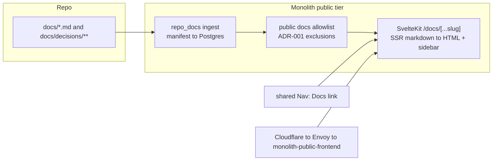

# ADR 002: Retire Standalone Web Frontends, Migrate Docs into the Monolith

**Author:** Joe McGinley
**Status:** Accepted
**Created:** 2026-06-19
**Supersedes:** [001-static-docs-site.md](001-static-docs-site.md)

---

## Problem

The monolith is now the single public web origin, but a parallel
Cloudflare Pages publishing path persists from before that was true. Every
remaining standalone static frontend duplicates something the monolith already
serves:

1. **The apex is already the monolith.** `jomcgi.dev` is served by the
   `monolith-public` SvelteKit tier: the live `monolith-public-public` HTTPRoute
   binds `jomcgi.dev` to `monolith-public-frontend:3000`. The Astro site at
   `projects/websites/jomcgi.dev` no longer fronts the apex, yet CI still builds
   and pushes it to the `jomcgi-dev` Cloudflare Pages project on every main push.
   It is dead weight that quietly shadows the real homepage.

2. **The docs site is a second toolchain for content the monolith already holds.**
   `docs.jomcgi.dev` is a VitePress site (custom `bazel/vitepress` rules, a
   link-rewriter, a CF Pages project, an ADR-sidebar generator, and a
   `config_links_test` CI gate) whose entire input is repo markdown. That same
   markdown is already ingested into Postgres by the monolith's `repo_docs`
   pipeline (`projects/monolith/knowledge/repo_docs.py` +
   `repo_docs_manifest.ndjson`) for public-chat RAG grounding. We maintain a
   parallel Astro + VitePress + `rules_vitepress` + CF Pages + `push_all_pages`
   surface to publish content the monolith frontend can render natively.

3. **The per-app frontends are already monolith routes.** `trips.jomcgi.dev`
   and `hikes.jomcgi.dev` are standalone CF Pages frontends
   (`projects/trips/frontend`, `projects/hikes/frontend`), but both apps are now
   served by the monolith at `jomcgi.dev/app/trips` and `jomcgi.dev/app/hikes`
   (both live, 200). Hikes is fully absorbed: the monolith `hikes` module owns
   the WalkHighlands scrape and met.no forecast refresh as registered scheduled
   jobs, leaving `projects/hikes/scrape_walkhighlands` and
   `projects/hikes/update_forecast` as dead code, the latter still built and
   pushed as a container image (`bazel/images`) that no chart deploys. Ships,
   stars, and dr-jobs never had standalone frontends; trips and hikes are the
   last two.

Once all four CF Pages sites are gone, nothing is left to publish: the
`push_all_pages` aggregator and the entire `rules_wrangler` Pages path retire
rather than needing a new home.

ADR 001 stood up `docs.jomcgi.dev` when the monolith did not serve public web
pages and there was no repo-markdown ingestion. Both of those premises are gone
(see [platform/008](../platform/008-monolith-module-boundaries.md),
[security/004](../security/004-public-read-only-service-isolation.md), and the
`repo_docs` sync). The decision it recorded is no longer the cheapest way to get
navigable public docs.

---

## Decision

Retire every standalone static frontend and the Cloudflare Pages publishing path
entirely. Concretely: delete `projects/websites/` (the orphaned Astro homepage,
the VitePress docs site, the shared CSS), the `projects/trips/frontend` and
`projects/hikes/frontend` CF Pages apps, and the now-dead hikes data tools
(`scrape_walkhighlands`, `update_forecast`). With no Pages sites left, the
`push_all_pages` aggregator, the `bazel/vitepress` rules, and the four CF Pages
projects (`jomcgi-dev`, `docs-jomcgi-dev`, `trips-jomcgi-dev`, `hikes-jomcgi-dev`)
all retire.

Serve documentation instead from the `monolith-public` SvelteKit tier at
`jomcgi.dev/docs/*`, reached from a new **Docs** link in the shared public
navbar. The ADR-sidebar / `config_links_test` tooling is replaced by monolith-side
rendering of the `docs/decisions/` tree.

The documentation source of truth does not move: it stays as the markdown files
in the repo. Only the rendering and hosting path changes, from a separate
build-and-deploy CF Pages pipeline to a route on a service that already exists,
already serves the apex, and already ingests the same files. Likewise the trips
and hikes apps do not move; only their dead standalone frontends are removed.

| Aspect          | Today                                              | Decided                                                      |
| --------------- | -------------------------------------------------- | ------------------------------------------------------------ |
| Public homepage | monolith-public (Astro copy orphaned but deployed) | monolith-public only; Astro site deleted                     |
| Docs hosting    | `docs.jomcgi.dev` VitePress on CF Pages            | `jomcgi.dev/docs/*` SSR route on monolith-public             |
| Docs build      | `bazel/vitepress` + link rewriter + CF Pages       | monolith frontend route over the existing `repo_docs` ingest |
| App frontends   | trips + hikes standalone CF Pages sites            | `jomcgi.dev/app/trips` + `/app/hikes` only; sites deleted    |
| ADR sidebar     | `generate-docs-sidebar.sh` -> VitePress JSON       | derived in the monolith from `docs/decisions/`               |
| Docs discovery  | separate subdomain, VitePress local search         | apex navbar link; reuses monolith knowledge search           |
| Deploy surfaces | 4 CF Pages projects + `push_all_pages` aggregator  | none; CF Pages publishing path retired                       |

---

## Architecture

Documentation is rendered server-side by the public tier from the markdown the
monolith already ingests, behind the same public read-only isolation that fronts
the rest of `jomcgi.dev`.

The route renders markdown to HTML on the server (mermaid and code highlighting
included, capabilities the public engineering page already uses), builds its
sidebar from the published doc tree, and derives the ADR index from
`docs/decisions/`. Asset and image handling stay same-origin under the public
hostname, consistent with the `monolith-public` imgproxy arrangement.

Three couplings have to be unwound as part of the migration. They are noted here
because they constrain the design, not as a task list:

- **`projects/websites/shared:css` is consumed by the monolith frontend**
  (`projects/monolith/frontend/BUILD`), not only by the dead Astro site. The
  shared CSS tokens must be relocated into a surviving home (the monolith
  frontend, or a neutral package), never deleted with `websites/`. This is the
  one piece of `projects/websites/` that survives in a new location.
- **`push_all_pages` retires once its last entry is gone.** It is generated into
  `projects/websites/BUILD` and currently drives the `hikes`, `trips`, `docs`,
  and `jomcgi` Pages deploys. Because all four are removed by this decision, the
  aggregator and its generator (`bazel/images:generate-push-all-pages`) are
  deleted outright rather than rehomed. The `update_forecast` image push, an
  orphan that no chart deploys, is removed from the image aggregator at the same
  time.
- **ADR registration tooling lives inside the site being deleted.**
  `generate-docs-sidebar.sh` and `config_links_test` write to and assert against
  `docs.jomcgi.dev/.vitepress/adr-sidebar.json`. The monolith docs route becomes
  the new home for ADR-tree generation, and the CI gate moves with it.

---

## Alternatives Considered

**Keep `docs.jomcgi.dev` as-is (status quo).** Rejected: it is a second frontend
toolchain, a second CF Pages project, and a second deploy path for content the
monolith already ingests, with no reader-facing benefit over an apex route.

**Keep VitePress, but serve its static output from the monolith pod.** Rejected:
retains `bazel/vitepress` and the VitePress build entirely, trading a CF Pages
deploy for a static-file mount without removing the maintenance surface.

**Static-bake docs into the monolith frontend build.** Rejected: couples the
docs content to the frontend release cadence (every docs edit forces a frontend
chart bump) and duplicates the ingestion the `repo_docs` pipeline already does.

**Delete the Astro site now, defer the docs migration.** Rejected as the standing
plan rather than an alternative: removing the orphaned Astro site is part of this
decision, but leaving `docs.jomcgi.dev` standalone keeps the second toolchain we
are trying to retire. Doing both together is what removes `projects/websites/`.

---

## Security

Reference `docs/security.md` for baseline and
[security/004](../security/004-public-read-only-service-isolation.md) for the
public read-only tier this route lives behind.

The critical control is that **the public `/docs/*` renderer is not the RAG
ingest.** The `repo_docs` pipeline deliberately indexes all repo markdown,
including internal docs, because chat answers are synthesized rather than served
verbatim. A public docs route serves source verbatim, so it must re-apply
ADR 001's explicit exclusion allowlist before anything is rendered:

| Path                        | Reason                                  |
| --------------------------- | --------------------------------------- |
| `.claude/` (AGENTS, skills) | Internal agent capabilities and prompts |
| CV / personal assets        | Personal content, not homelab docs      |
| any non-doc source trees    | Not documentation                       |

Publishing must be opt-in by allowlist, matching the `vitepress_filegroup`
posture it replaces, so that broadening RAG coverage can never silently widen
the public docs surface.

---

## Risks

| Risk                                        | Likelihood | Impact | Mitigation                                                                  |
| ------------------------------------------- | ---------- | ------ | --------------------------------------------------------------------------- |
| Internal doc leaks via the new route        | Low        | High   | Explicit publish allowlist enforced in the route, separate from RAG ingest  |
| Render fidelity gap vs VitePress            | Medium     | Low    | Reuse the engineering page's mermaid/code rendering; spot-check key docs    |
| Loss of VitePress local search              | Medium     | Low    | Monolith already exposes knowledge search; docs are also chat-grounded      |
| Breaking the monolith frontend CSS build    | Medium     | Medium | Relocate `websites/shared:css` before removing `websites/`                  |
| Old subdomain inbound links / SEO break     | Low        | Low    | Redirect `docs`/`trips`/`hikes`.jomcgi.dev to the apex routes, or let lapse |
| Deleting a frontend still feeding live data | Low        | High   | Verified: apps + hikes jobs are monolith-served and live before any delete  |

---

## Open Questions

1. Where do the shared CSS tokens land: inside the monolith frontend, or a
   neutral shared package?
2. Are the old subdomains (`docs`, `trips`, `hikes`.jomcgi.dev) redirected to
   their apex routes at the edge, or left to lapse like `trips.jomcgi.dev`?
3. Does the ADR-tree generation run at monolith build time (committed artifact,
   like the repo_docs manifest) or at request time from the live repo checkout?

---

## References

| Resource                                                              | Relevance                                               |
| --------------------------------------------------------------------- | ------------------------------------------------------- |
| [001-static-docs-site.md](001-static-docs-site.md)                    | The decision this supersedes                            |
| [platform/008](../platform/008-monolith-module-boundaries.md)         | Monolith module boundaries that make a docs route cheap |
| [security/004](../security/004-public-read-only-service-isolation.md) | Public read-only tier the docs route lives behind       |
| [services/005](../services/005-repo-docs-knowledge-sync.md)           | The repo-docs ingestion the docs route reuses           |
| `projects/monolith/knowledge/repo_docs.py`                            | Existing repo-markdown ingest into Postgres             |
| `projects/monolith-public/chart/templates/httproute-public.yaml`      | Public hostname routing into the monolith frontend      |
| `bazel/vitepress/`                                                    | The VitePress rules retired by this decision            |
